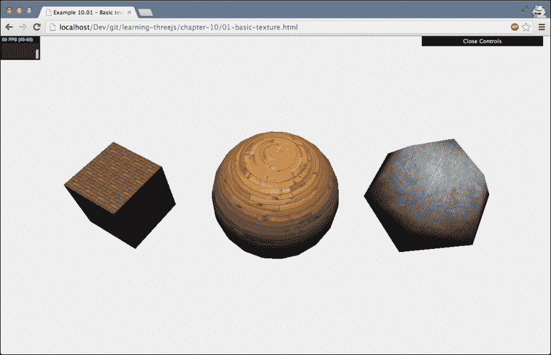
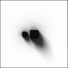
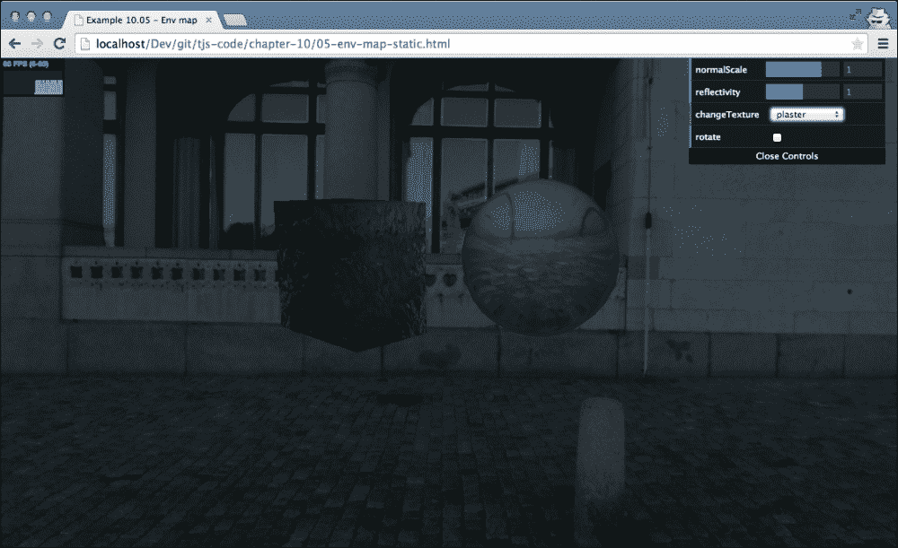
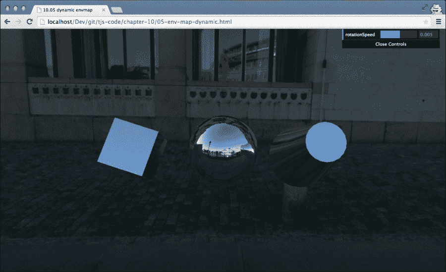
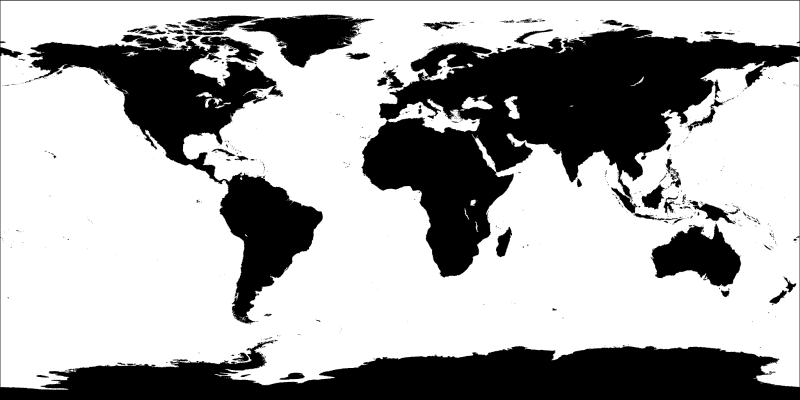
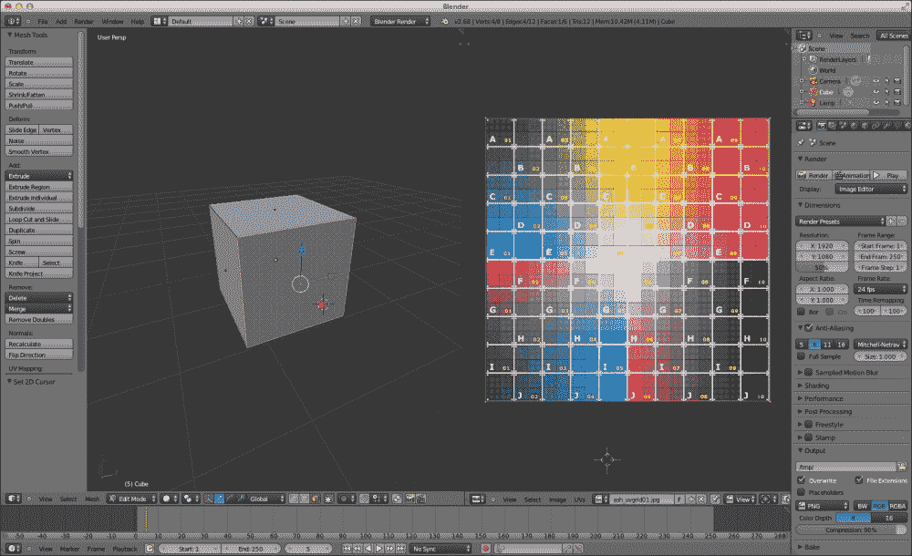
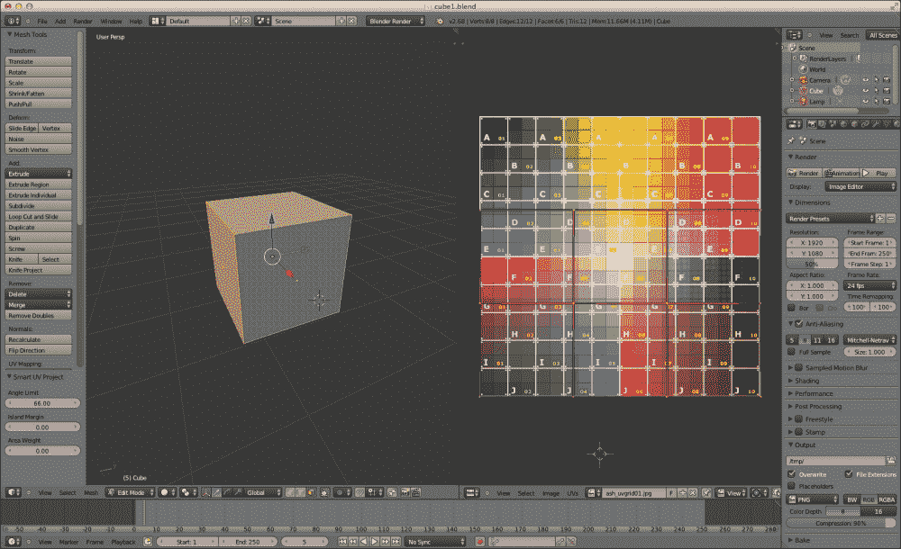
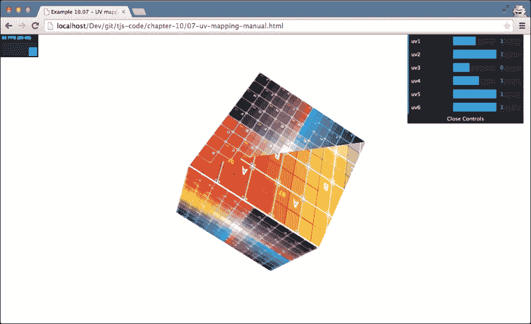

# 十、加载和处理纹理

在[第 4 章](04.html "Chapter 4. Working with Three.js Materials")、*使用 Three.js 材质*中，我们向您介绍了 Three.js 中可用的各种材质，但是在那一章中，我们没有讨论将纹理应用于网格。在这一章中，我们将研究这个主题。更具体地说，在本章中，我们将讨论以下主题:

*   将纹理加载到三维模型中，并将其应用到网格中
*   使用凹凸贴图和法线贴图将深度和细节应用到网格
*   使用灯光贴图创建假阴影
*   使用环境贴图向材质添加详细的反射
*   使用镜面反射贴图设置网格特定部分的*亮度*
*   微调和自定义网格的紫外线贴图
*   使用 HTML5 画布和视频元素作为纹理的输入

让我们从最基本的例子开始，我们向您展示如何加载和应用纹理。

# 在材质中使用纹理

在 Three.js 中有种不同的纹理使用方式，你可以用它们来定义网格的颜色，但是你也可以用它们来定义光泽、凹凸和反射。不过，我们看的第一个例子是最基本的方法，我们使用纹理来定义网格中各个像素的颜色。

## 加载纹理并将其应用于网格

纹理最基本的用法是在材质上设置为贴图。当您使用此材质创建网格时，网格将根据提供的纹理进行着色。

加载纹理并在网格上使用它可以通过以下方式完成:

```js
function createMesh(geom, imageFile) {
  var texture = THREE.ImageUtils.loadTexture("../img/textures/general/" + imageFile)

  var mat = new THREE.MeshPhongMaterial();
  mat.map = texture;

  var mesh = new THREE.Mesh(geom, mat);
  return mesh;
}
```

在此代码示例中，我们使用`THREE.ImageUtils.loadTexture`函数从特定位置加载图像文件。您可以使用 PNG、GIF 或 JPEG 图像作为纹理的输入。请注意，加载纹理是异步完成的。在我们的场景中，这不是问题，因为我们有一个`render`循环，每秒渲染场景大约 60 次。如果要等到加载纹理，可以使用以下方法:

```js
texture = THREE.ImageUtils.loadTexture('texture.png', {}, function() { renderer.render(scene); });
```

在这个例子中，我们为`loadTexture`提供了一个回调函数。加载纹理时会调用此回调。在我们的例子中，我们不使用回调，而是依赖`render`循环来最终显示加载时的纹理。

你可以使用任何你想要的图像作为纹理。然而，最好的结果是当你使用尺寸是 2 的幂的正方形纹理时。因此 256 x 256、512 x 512、1024 x 1024 等尺寸效果最好。下图是方形纹理的示例:


由于纹理的像素(也称为**纹理元素**)通常不会一对一地映射到人脸的像素上，因此纹理需要放大或缩小。为此，WebGL 和 Three.js 提供了几个不同的选项。您可以通过设置`magFilter`属性来指定如何放大纹理，以及如何使用`minFilter`属性来缩小纹理。这些属性可以设置为以下两个基本值:

<colgroup><col style="text-align: left"> <col style="text-align: left"></colgroup> 
| 

名字

 | 

描述

 |
| --- | --- |
| `THREE.NearestFilter` | 这个滤镜使用它能找到的最近的纹理元素的颜色。当用于放大时，这将导致块效应，当用于缩小时，结果将失去很多细节。 |
| `THREE.LinearFilter` | 这个滤镜更高级，使用四个相邻纹理元素的颜色值来确定正确的颜色。缩小时你仍然会丢失很多细节，但放大后会更平滑，不那么块状。 |

除了这些基本值，我们还可以使用 mipmap。一张 **mipmap** 是一组纹理图像，每张的大小是前一张的一半。这些是在加载纹理时创建的，允许更平滑的过滤。因此，当你有一个正方形纹理(2 的幂)时，你可以使用一些额外的方法来获得更好的过滤。可以使用以下值设置属性:

<colgroup><col style="text-align: left"> <col style="text-align: left"></colgroup> 
| 

名字

 | 

描述

 |
| --- | --- |
| `THREE.NearestMipMapNearestFilter` | 该属性选择最能映射所需分辨率的 mipmap，并应用我们在上表中讨论的最近过滤原则。放大仍然是块状的，但缩小看起来更好。 |
| `THREE.NearestMipMapLinearFilter` | 该属性不仅选择单个 mipmap，还选择两个最近的 mipmap 级别。在这两个级别上，应用最近的过滤器来获得两个中间结果。这两个结果通过线性滤波器得到最终结果。 |
| `THREE.LinearMipMapNearestFilter` | 该属性选择最能映射所需分辨率的 mipmap，并应用我们在上表中讨论的线性滤波器原理。 |
| `THREE.LinearMipMapLinearFilter` | 该属性选择的不是单个 mipmap，而是两个最近的 mipmap 级别。在这两个级别上，应用线性滤波器来获得两个中间结果。这两个结果通过线性滤波器得到最终结果。 |

如果没有明确指定`magFilter`和`minFilter`属性，Three.js 将`THREE.LinearFilter`作为`magFilter`属性的默认值，`THREE.LinearMipMapLinearFilter`作为`minFilter`属性的默认值。在我们的例子中，我们将只使用这些默认属性。基本纹理的示例可以在`01-basic-texture.html`中找到。下面的截图显示了这个例子:



在本例中，我们加载了几个纹理(使用您之前看到的代码)，并将它们应用于各种形状。在这个例子中，你可以看到纹理很好地包裹了形状。当您在三个. js 中创建几何图形时，它确保使用的任何纹理都被正确应用。这是通过一种叫做 **UV 贴图** 的东西来完成的(在本章后面会有更多的介绍)。通过紫外线贴图，我们告诉渲染器纹理的哪一部分应该应用到特定的面部。最简单的例子是立方体。其中一个面的 UV 贴图如下所示:

```js
(0,1),(0,0),(1,0),(1,1)
```

这意味着我们对这张脸使用完整的纹理(紫外线值范围从 0 到 1)。

除了我们可以用`THREE.ImageUtils.loadTexture`加载的标准图像格式之外，Three.js 还提供了几个自定义加载器，您可以用它们来加载不同格式的纹理。下表显示了您可以使用的其他加载器:

<colgroup><col style="text-align: left"> <col style="text-align: left"></colgroup> 
| 

名字

 | 

描述

 |
| --- | --- |
| `THREE.DDSLoader` | 使用这个加载器，你可以加载 DirectDraw Surface 格式提供的纹理。这种格式是微软专有的存储压缩纹理的格式。使用这台装载机很容易。首先，将`DDSLoader.js`文件包含在您的 HTML 页面中，然后使用以下内容来使用纹理:

```js
var loader = new THREE.DDSLoader();
var texture = loader.load( '../img/textures/  seafloor.dds' );

var mat = new THREE.MeshPhongMaterial();
mat.map = texture;
```

你可以在`01-basic-texture-dds.html`的本章资源中看到这个加载器的例子。在内部，该装载机使用`THREE.CompressedTextureLoader`。 |
| `THREE.PVRLoader` | Power VR 是另一种存储压缩纹理的专有文件格式。Three.js 支持 Power VR 3.0 文件格式，可以使用这种格式提供的纹理。要使用该加载器，请在您的 HTML 页面中包含`PVRLoader.js`文件，然后使用以下内容来使用纹理:

```js
var loader = new THREE.DDSLoader();
var texture = loader.load( '../img/textures/ seafloor.dds' );

var mat = new THREE.MeshPhongMaterial();
mat.map = texture;
```

你可以在本章的资源中看到这个加载器的例子:`01-basic-texture-pvr.html`。请注意，并非所有的 WebGL 实现都支持这种格式的纹理。所以当你使用这个并且看不到纹理时，检查控制台是否有错误。在内部，该装载机也使用`THREE.CompressedTextureLoader`。 |
| `THREE.TGALoader` | Targa 是一种光栅图形文件格式，目前仍被大量 3D 软件程序使用。对于`THREE.TGALoader`对象，您可以在 3D 模型中使用以这种格式提供的纹理。要使用这些图像文件，您首先必须在您的 HTML 中包含`TGALoader.js`文件，然后您可以使用以下内容加载一个 TGA 纹理:

```js
var loader = new THREE.TGALoader();
var texture = loader.load( '../img/textures/crate_color8.tga' );

var mat = new THREE.MeshPhongMaterial();
mat.map = texture;
```

本章的参考资料中提供了这个加载器的一个示例。您可以通过在浏览器中打开`01-basic-texture-tga.html`来查看此示例。 |

在这些例子中，我们使用纹理来定义网格像素的颜色。我们也可以将纹理用于其他目的。以下两个示例用于定义如何将着色应用于材质。您可以使用它在网格的表面创建凹凸和皱纹。

## 使用凹凸贴图创建皱纹

一张**凹凸贴图** 被用来给材质增加更多的深度。你可以通过打开`02-bump-map.html`的例子看到这一点。请参考下面的截图查看示例:


在这个例子中，你可以看到左边的墙看起来更详细，当你和右边的墙比较时，它看起来更有深度。这是通过在材质上设置一个额外的纹理，即所谓的凹凸贴图来完成的:

```js
function createMesh(geom, imageFile, bump) {
  var texture = THREE.ImageUtils.loadTexture("../img/textures/general/" + imageFile)
  var mat = new THREE.MeshPhongMaterial();
  mat.map = texture;

  var bump = THREE.ImageUtils.loadTexture(
    "../img/textures/general/" + bump)
  mat.bumpMap = bump;
  mat.bumpScale = 0.2;

  var mesh = new THREE.Mesh(geom, mat);
  return mesh;
}
```

在这段代码中可以看到除了设置`map`属性外，我们还将`bumpMap`属性设置为纹理。此外，使用`bumpScale`属性，我们可以设置凸起的高度(或深度，如果设置为负值)。此示例中使用的纹理如下所示:


凹凸贴图是灰度图像，但也可以使用彩色图像。像素的强度定义了凹凸的高度。凹凸贴图只包含像素的相对高度。它没有说明斜坡的方向。因此，使用凹凸贴图可以达到的细节和深度感知水平是有限的。有关更多详细信息，您可以使用普通地图。

## 用普通地图获得更详细的凹凸和皱纹

在法线贴图中，高度(位移)不被存储，但是每个图片的法线方向被存储。在不涉及太多细节的情况下，使用普通地图，您可以创建看起来非常详细的模型，这些模型仍然只使用少量的顶点和面。比如看一下`03-normal-map.html`的例子。下面的截图描述了这个例子:


在这个截图中，你可以看到左边有一个非常详细的石膏立方体。光源在立方体周围移动，你可以看到纹理对光源的自然反应。这提供了一个非常逼真的模型，只需要一个非常简单的模型和几个纹理。下面的代码片段展示了如何在 Three.js 中使用普通映射:

```js
function createMesh(geom, imageFile, normal) {
  var t = THREE.ImageUtils.loadTexture("../img/textures/general/" + imageFile);
  var m = THREE.ImageUtils.loadTexture("../img/textures/general/" + normal);

  var mat2 = new THREE.MeshPhongMaterial();
  mat2.map = t;
  mat2.normalMap = m;

  var mesh = new THREE.Mesh(geom, mat2);
  return mesh;
}
```

这里使用了与凹凸贴图相同的方法。不过这一次，我们将`normalMap`属性设置为正常纹理。我们也可以通过设置`normalScale`属性`mat.normalScale.set(1,1)`来定义凸起的发音。有了这两个属性，您可以沿着 *x* 和 *y* 轴缩放。不过，最好的方法是保持这些值相同，以获得最佳效果。请再次注意，当这些值低于零时，高度相反。下面的截图显示了纹理(左侧)和法线贴图(右侧):


然而，普通地图的问题是它们不太容易创建。你需要使用专门的工具，比如 Blender 或者 Photoshop。他们可以使用高分辨率渲染或纹理作为输入，并从中创建法线贴图。

Three.js 也提供了一种在运行时实现这一点的方法。`THREE.ImageUtils`对象有一个叫做`getNormalMap`的函数，它以一个 JavaScript/DOM `Image`作为输入，并将其转换成一个普通的地图。

## 使用灯光贴图创建假阴影

在之前的例子中，我们使用特定的地图来创建真实的阴影，这些阴影会对房间中的光线做出反应。有一个替代选项可以创建假阴影。在本节中，我们将使用灯光地图。一张 **光影贴图**是一个预渲染的阴影(也叫预烘焙阴影)，你可以用它来创建一个真实阴影的幻象。以下截图来自`04-light-map.html`示例，显示了这种情况:


如果你看一下前面的例子，它显示了两个非常好的阴影，似乎是由两个立方体投射的。然而，这些阴影是基于如下所示的光照贴图纹理:



如您所见，灯光贴图中指定的阴影也显示为地平面上的阴影，从而产生真实阴影的错觉。您可以使用此技术创建高分辨率阴影，而不会导致严重的渲染损失。当然，这仅适用于静态场景。使用灯光贴图与使用其他纹理非常相似，只是有一些小的不同。这就是我们如何使用灯光地图:

```js
var lm = THREE.ImageUtils.loadTexture('../img/textures/lightmap/lm-1.png');
var wood = THREE.ImageUtils.loadTexture('../img/textures/general/floor-wood.jpg');
var groundMaterial = new THREE.MeshBasicMaterial({lightMap: lm, map: wood});
groundGeom.faceVertexUvs[1] = groundGeom.faceVertexUvs[0];
```

要应用光照贴图，我们只需要将材质的`lightMap`属性设置到我们刚刚显示的光照贴图中。然而，需要一个额外的步骤来显示光照图。我们需要明确定义光照贴图的 UV 贴图(纹理的哪一部分显示在一个面上)。这需要这样做，以便您可以独立于其他纹理应用和映射灯光贴图。在我们的例子中，我们只使用基本的紫外线贴图，当我们创建地平面时，它是由 Three.js 自动创建的。更多信息和为什么需要显式紫外线映射的背景可以在[http://stackoverflow . com/questions/15137695/three-js-light map-原因-错误-webglrenderingcontext-GL-error-GL-invalid-op](http://stackoverflow.com/questions/15137695/three-js-lightmap-causes-an-error-webglrenderingcontext-gl-error-gl-invalid-op)中找到。

当阴影贴图被正确定位时，我们需要将立方体放置在正确的位置，这样看起来就像阴影被它们投射一样。

Three.js 提供了另一种纹理，你可以用它来伪造高级的 3D 效果。在下一节中，我们将研究如何使用环境地图进行伪反射。

## 使用环境地图创建假反射

计算环境反射非常耗费 CPU，通常需要光线追踪方法。如果你想在 Three.js 中使用反射，你仍然可以这样做，但是你必须假装它。您可以通过创建对象所处环境的纹理并将其应用于特定对象来实现这一点。首先，我们将向您展示我们的目标结果(参见`05-env-map-static.html`，也显示在下面的截图中):


在这个截图中，可以看到球体和立方体反射出的环境。如果你移动你的鼠标，你也可以看到反射对应于你看到的城市环境的相机角度。为了创建这个示例，我们执行以下步骤:

1.  **创建立方体贴图对象**:我们首先需要做的是创建一个`CubeMap`对象。`CubeMap`是一组六个纹理，可以应用于立方体的每一侧。
2.  **用这个立方体贴图对象**创建一个盒子:带`CubeMap`的盒子是你移动相机时看到的环境。它给人一种错觉，你站在一个可以环顾四周的环境中。实际上，你是在一个立方体里面，里面渲染了纹理，给人一种空间的错觉。
3.  **将立方体贴图对象应用为纹理**:我们用来模拟环境的相同的`CubeMap`对象可以用作网格上的纹理。Three.js 将确保它看起来像是环境的反映。

一旦你有了源材质，创建`CubeMap`就相当容易了。你需要的是六个图像，它们共同组成了一个完整的环境。所以你需要以下图片:向前看(`posz`)、向后看(`negz`)、向上看(`posy`)、向下看(`negy`)、向右看(`posx`)和向左看(`negx`)。Three.js 将把这些修补在一起，创建一个无缝的环境地图。有几个网站可以下载这些图片。本例中使用的来自[http://www.humus.name/index.php?page=Textures](http://www.humus.name/index.php?page=Textures)。

一旦您获得了六张独立的图片，您就可以加载它们，如下面的代码片段所示:

```js
function createCubeMap() {

  var path = "../img/textures/cubemap/parliament/";
  var format = '.jpg';
  var urls = [
    path + 'posx' + format, path + 'negx' + format,
    path + 'posy' + format, path + 'negy' + format,
    path + 'posz' + format, path + 'negz' + format
  ];

  var textureCube = THREE.ImageUtils.loadTextureCube( urls );
  return textureCube;
}
```

我们再次使用`THREE.ImageUtils`JavaScript 对象，但是这一次，我们传入一组纹理，并使用`loadTextureCube`函数创建`CubeMap`对象。如果您已经获得了 360 度全景图像，您也可以将其转换为一组图像，用于创建`CubeMap`。只需到[http://gonchar.me/panorama/](http://gonchar.me/panorama/)转换一个图像，最终得到六个图像，名称分别为`right.png`、`left.png`、`top.png`、`bottom.png`、`front.png`、`back.png`。您可以通过如下方式创建`urls`变量来使用这些:

```js
var urls = [
  'right.png',
  'left.png',
  'top.png',
  'bottom.png',
  'front.png',
  'back.png'
];
```

或者，您也可以让 Three.js 在加载场景时通过创建`textureCube`来处理转换，如下所示:

```js
var textureCube = THREE.ImageUtils.loadTexture("360-degrees.png", new THREE.UVMapping());
```

借助`CubeMap`，我们首先创建一个盒子，可以这样创建:

```js
var textureCube = createCubeMap();
var shader = THREE.ShaderLib[ "cube" ];
shader.uniforms[ "tCube" ].value = textureCube;
var material = new THREE.ShaderMaterial( {
  fragmentShader: shader.fragmentShader,
  vertexShader: shader.vertexShader,
  uniforms: shader.uniforms,
  depthWrite: false,
  side: THREE.BackSide
});
cubeMesh = new THREE.Mesh(new THREE.BoxGeometry(100, 100, 100), material);
```

Three.js 提供了一个特定的着色器，我们可以用它来创建一个基于`CubeMap` ( `var shader = THREE.ShaderLib[ "cube" ];`)的环境。我们用`CubeMap`配置这个着色器，创建一个网格，并将其添加到场景中。如果从内部看，这个网格代表了我们所处的虚假环境。

这个相同的`CubeMap`对象应该应用于我们想要渲染的网格，以创建伪反射:

```js
var sphere1 = createMesh(new THREE.SphereGeometry(10, 15, 15), "plaster.jpg");
sphere1.material.envMap = textureCube;
sphere1.rotation.y = -0.5;
sphere1.position.x = 12;
sphere1.position.y = 5;
scene.add(sphere1);

var cube = createMesh(new THREE.CubeGeometry(10, 15, 15), "plaster.jpg","plaster-normal.jpg");
sphere2.material.envMap = textureCube;
sphere2.rotation.y = 0.5;
sphere2.position.x = -12;
sphere2.position.y = 5;
scene.add(cube);
```

如您所见，我们将材质的`envMap`属性设置为我们创建的`cubeMap`对象。结果是一个场景，看起来我们站在一个宽阔的室外环境中，网格反映了这个环境。如果您使用滑块，您可以设置材质的`reflectivity`属性，顾名思义，这决定了材质反映了多少环境。

除了反射，Three.js 还允许你使用`CubeMap`物体进行折射(类似玻璃的物体)。下面的截图显示了这一点:



为了获得这种效果，我们只需要将纹理的加载改为:

```js
var textureCube = THREE.ImageUtils.loadTextureCube( urls, new THREE.CubeRefractionMapping());
```

您可以使用材质上的`refraction`属性控制`refraction`比率，就像使用`reflection`属性一样。在这个例子中，我们已经为网格使用了静态环境图。换句话说，我们只看到了环境反射，而没有看到这个环境中的其他网格。在下面的截图中(您可以通过在浏览器中打开`05-env-map-dynamic.html`来看到)，我们将向您展示如何创建一个反射，该反射也显示场景中的其他对象:



为了同样显示场景中其他物体的反射，我们需要使用一些其他的三个组件。我们首先需要的是一个名为`THREE.CubeCamera`的附加摄像头:

```js
Var cubeCamera = new THREE.CubeCamera(0.1, 20000, 256);
scene.add(cubeCamera);
```

我们将使用`THREE.CubeCamera`来拍摄渲染了所有对象的场景的快照，并使用它来设置`CubeMap`。您需要确保您将该摄像机定位在您想要显示动态反射的`THREE.Mesh`的准确位置。对于这个例子，我们将只显示中心球体上的反射(正如您在前面的截图中看到的)。这个球体位于位置 0，0，0，所以对于这个例子，我们不需要明确定位`THREE.CubeCamera`。

我们只对球体应用动态反射，所以我们需要两种不同的材质:

```js
var dynamicEnvMaterial = new THREE.MeshBasicMaterial({envMap: cubeCamera.renderTarget });
var envMaterial = new THREE.MeshBasicMaterial({envMap: textureCube });
```

与前面示例的主要区别在于，对于动态反射，我们将`envMap`属性设置为`cubeCamera.renderTarget`，而不是之前创建的`textureCube`。对于这个例子，我们在中心球体上使用`dynamicEnvMaterial`，在另外两个物体上使用`envMaterial`:

```js
sphere = new THREE.Mesh(sphereGeometry, dynamicEnvMaterial);
sphere.name = 'sphere';
scene.add(sphere);

var cylinder = new THREE.Mesh(cylinderGeometry, envMaterial);
cylinder.name = 'cylinder';
scene.add(cylinder);
cylinder.position.set(10, 0, 0);

var cube = new THREE.Mesh(boxGeometry, envMaterial);
cube.name = 'cube';
scene.add(cube);
cube.position.set(-10, 0, 0);
```

剩下要做的就是确保`cubeCamera`渲染场景，这样我们就可以将输出用作中心球体的输入。为此，我们像这样更新`render`循环:

```js
function render() {
  sphere.visible = false;
  cubeCamera.updateCubeMap( renderer, scene );
  sphere.visible = true;
  renderer.render(scene, camera);
  ...
  requestAnimationFrame(render);
}
```

可以看到，我们首先禁用`sphere`的可见性。我们这样做是因为我们只想看到其他两个物体的反射。接下来，我们通过调用`updateCubeMap`函数使用`cubeCamera`渲染场景。之后，我们使`sphere`再次可见，并正常渲染场景。结果是，在球体的反射中，你可以看到立方体和圆柱体的反射。

我们要看的最后一个基本材质是镜面贴图。

## 镜面贴图

使用 **镜面贴图**，您可以指定一个贴图来定义材质的亮度和高光颜色。例如，在下面的截图中，我们使用了一个镜面反射贴图和一个法线贴图来渲染一个球体。如果在浏览器中打开`06-specular-map.html`，就可以看到这个例子。这个结果也显示在下面截图的中:


在这张截图中，你可以看到海洋被突出显示并反射光线。另一方面，大陆非常暗，不反射(太多)光。对于这种效果，我们没有使用任何特定的法线纹理，而只使用法线贴图来显示高度，并使用以下镜面贴图来突出海洋:



基本上，发生的情况是像素值越高(从黑色到白色)，表面就会越亮。镜面反射贴图通常与`specular`属性一起使用，您可以使用它来确定反射的颜色。在这种情况下，它被设置为红色:

```js
var specularTexture=THREE.ImageUtils.loadTexture("../img/textures/planets/EarthSpec.png");
var normalTexture=THREE.ImageUtils.loadTexture("../img/textures/planets/EarthNormal.png");

var planetMaterial = new THREE.MeshPhongMaterial();
planetMaterial.specularMap = specularTexture;
planetMaterial.specular = new THREE.Color( 0xff0000 );
planetMaterial.shininess = 1;

planetMaterial.normalMap = normalTexture;
```

还要注意的是最好的效果通常是在低亮度下实现的，但是根据你使用的光照和镜面贴图，你可能需要实验才能得到想要的效果。

# 纹理的高级用法

在前面的部分，我们看到了一些基本的纹理用法。Three.js 还为更高级的纹理使用提供了选项。在这一节中，我们将看看 Three.js 提供的几个选项。

## 自定义紫外线贴图

我们将从更深入地研究紫外线映射开始。我们之前解释过，使用 UV 贴图，可以指定纹理的哪一部分显示在特定的面上。当您在三个. js 中创建几何图形时，这些映射也会根据您创建的几何图形类型自动创建。在大多数情况下，您并不真的需要更改这个默认的紫外线映射。了解 UV 贴图如何工作的一个好方法是查看 Blender 中的一个示例，如下图所示:



在这个的例子中，你看到了两个窗口。左侧的窗口包含一个立方体几何图形。右边的窗口是紫外线贴图，我们加载了一个示例纹理来展示贴图的效果。在这个例子中，我们为左边的窗口选择了一个面，右边的窗口显示了这个面的紫外线贴图。如您所见，面的每个顶点都位于右侧 UV 贴图的一个角上(小圆圈)。这意味着完整的纹理将用于该面。这个立方体的所有其他面都以相同的方式映射，因此结果将显示一个立方体，其中每个面都显示完整的纹理；参见`07-uv-mapping.html`，也显示在下面的截图中:


这是搅拌机中立方体的默认设置。让我们通过仅选择纹理的三分之二来更改 UV(参见下面截图中的选定区域):



如果我们现在在 Three.js 中显示这个，可以看到纹理的应用是不同的，如下图截图所示:


定制紫外线映射通常是通过程序完成的，比如 Blender，尤其是当模型变得更加复杂的时候。这里要记住的最重要的部分是 UV 映射在两个维度上运行，`u`和`v`，从 0 到 1。要自定义紫外线贴图，您需要为每个面定义纹理应该显示的部分。通过为构成面的每个顶点定义`u`和`v`坐标，可以做到这一点。您可以使用以下代码设置`u`和`v`值:

```js
geom.faceVertexUvs[0][0][0].x = 0.5;
geom.faceVertexUvs[0][0][0].y = 0.7;
geom.faceVertexUvs[0][0][1].x = 0.4;
geom.faceVertexUvs[0][0][1].y = 0.1;
geom.faceVertexUvs[0][0][2].x = 0.4;
geom.faceVertexUvs[0][0][2].y = 0.5;
```

该代码片段将第一个面的`uv`属性设置为指定值。请记住，每个面由三个顶点定义，因此要设置一个面的所有`uv`值，我们需要设置六个属性。如果您打开`07-uv-mapping-manual.html,`示例，您可以看到当您手动更改`uv`映射时会发生什么。下面的截图显示了这个例子:



接下来，我们将看看如何重复纹理，这是通过一些内部的紫外线贴图技巧来完成的。

## 重复包装

当将纹理应用到由 Three.js 创建的几何图形时，Three.js 将尝试尽可能优化地应用纹理。例如，对于立方体，这意味着每一面将显示完整的纹理，而对于球体，完整的纹理包裹在球体周围。但是，在某些情况下，您不希望纹理围绕完整的面或完整的几何图形展开，而是让纹理重复自身。Three.js 提供了允许您控制这一点的详细功能。在`08-repeat-wrapping.html`示例中提供了一个可以使用重复属性的示例。下面的截图显示了这个例子:


在本例中，您可以设置控制纹理如何重复自身的属性。

在此属性具有所需效果之前，您需要确保将纹理的环绕设置为`THREE.RepeatWrapping`，如以下代码片段所示:

```js
cube.material.map.wrapS = THREE.RepeatWrapping;
cube.material.map.wrapT = THREE.RepeatWrapping;
```

`wrapS`属性定义了您希望纹理沿着其 *x* 轴的行为方式，`wrapT`属性定义了纹理沿着其 *y* 轴的行为方式。Three.js 为此提供了两个选项，如下所示:

*   `THREE.RepeatWrapping` 允许纹理重复自身。
*   `THREE.ClampToEdgeWrapping`是的默认设置。用`THREE.ClampToEdgeWrapping,`纹理整体不重复，只重复边缘的像素。

如果禁用**重复播放**菜单选项，将使用`THREE.ClampToEdgeWrapping`选项，如下所示:


如果使用`THREE.RepeatWrapping`，可以设置`repeat`属性，如下面的代码片段所示:

```js
cube.material.map.repeat.set(repeatX, repeatY);
```

`repeatX`变量定义纹理沿其 *x* 轴重复的频率，而`repeatY`变量为 *y* 轴定义相同的频率。如果将这些值设置为`1`，纹理不会重复自身；如果将它们设置为更高的值，您会看到纹理将开始重复。您也可以使用小于 1 的值。在这种情况下，你可以看到你将放大纹理。如果将重复值设置为负值，纹理将被镜像。

当您更改`repeat`属性时，Three.js 将自动更新纹理并使用此新设置进行渲染。如果从`THREE.RepeatWrapping`更改为`THREE.ClampToEdgeWrapping`，需要明确更新纹理:

```js
cube.material.map.needsUpdate = true;
```

到目前为止，我们只对纹理使用静态图像。不过，Three.js 也可以选择使用 HTML5 画布作为纹理。

## 渲染到画布并将其用作纹理

在本节中，我们将看两个不同的例子。首先，我们来看看如何使用画布创建一个简单的纹理并将其应用于网格，然后，我们将更进一步，使用随机生成的图案创建一个可以用作凹凸贴图的画布。

### 使用画布作为纹理

在第一个示例中，我们将使用**字面上的**库(来自[http://literallycanvas.com/](http://literallycanvas.com/))来创建一个可以在上面绘制的交互式画布；请看下面截图的左下角。你可以在`09-canvas-texture`查看这个例子。接下来的截图显示了这个例子:


你在这个画布上画的任何东西都直接作为纹理呈现在立方体上。在 Three.js 中实现这一点非常简单，只需要几个步骤。我们需要做的第一件事是创建一个画布元素，对于这个特定的例子，将其配置为与`Literally`库一起使用，如下所示:

```js
<div class="fs-container">
  <div id="canvas-output" style="float:left">
  </div>
</div>
...
var canvas = document.createElement("canvas");
$('#canvas-output')[0].appendChild(canvas);
$('#canvas-output').literallycanvas(
  {imageURLPrefix: '../libs/literally/img'});
```

我们只是通过 JavaScript 创建一个`canvas`元素，并将其添加到一个特定的`div`元素中。通过`literallycanvas`调用，我们可以创建绘图工具，您可以使用这些工具直接在画布上绘制。接下来，我们需要创建一个使用画布绘图作为输入的纹理:

```js
function createMesh(geom) {

  var canvasMap = new THREE.Texture(canvas);
  var mat = new THREE.MeshPhongMaterial();
  mat.map = canvasMap;
  var mesh = new THREE.Mesh(geom,mat);

  return mesh;
}
```

如代码所示，您唯一需要做的就是在创建新纹理`new THREE.Texture(canvas)`时传入对画布元素的引用。这将创建一个使用画布元素作为材质的纹理。剩下的就是无论何时渲染都要更新材质，以便画布绘图的最新版本显示在立方体上，如下所示:

```js
function render() {
  stats.update();

  cube.rotation.y += 0.01;
  cube.rotation.x += 0.01;

  cube.material.map.needsUpdate = true;
  requestAnimationFrame(render);
  webGLRenderer.render(scene, camera);
}
```

为了通知 Three.js 我们要更新纹理，我们只需将纹理的`needsUpdate`属性设置为`true`。在这个例子中，我们使用画布元素作为最简单纹理的输入。当然，我们可以用同样的想法来制作我们目前所看到的所有不同类型的地图。在下一个例子中，我们将使用它作为凹凸贴图。

### 使用画布作为凹凸贴图

正如我们在本章前面看到的，我们可以用凹凸贴图创建一个简单的褶皱纹理。该图中像素的强度越高，起皱程度就越高。因为凹凸贴图只是一个简单的黑白图像，所以没有什么能阻止我们在画布上创建它，并将该画布用作凹凸贴图的输入。

在下面的示例中，我们使用画布生成随机灰度图像，并将该图像用作应用于立方体的凹凸贴图的输入。参见`09-canvas-texture-bumpmap.html`示例。下面的截图显示了这个例子:


这所需的 JavaScript 代码与我们之前解释的例子没有什么不同。我们需要创建一个画布元素，并用一些随机噪声填充这个画布。对于噪音，我们使用 **柏林噪音**。柏林噪声([http://en.wikipedia.org/wiki/Perlin_noise](http://en.wikipedia.org/wiki/Perlin_noise))生成一个非常自然的随机纹理，正如你在前面的截图中看到的。我们使用来自 https://github.com/wwwtyro/perlin.js 的柏林噪声函数:

```js
var ctx = canvas.getContext("2d");
function fillWithPerlin(perlin, ctx) {

  for (var x = 0; x < 512; x++) {
    for (var y = 0; y < 512; y++) {
      var base = new THREE.Color(0xffffff);
      var value = perlin.noise(x / 10, y / 10, 0);
      base.multiplyScalar(value);
      ctx.fillStyle = "#" + base.getHexString();
      ctx.fillRect(x, y, 1, 1);
    }
  }
}
```

我们使用`perlin.noise`功能根据画布元素的 *x* 和 *y* 坐标创建一个从 0 到 1 的值。该值用于在画布元素上绘制单个像素。对所有像素执行此操作会创建随机地图，您也可以在上一张截图的左下角看到该地图。这张地图可以很容易地用作凹凸贴图。以下是创建随机地图的方法:

```js
var bumpMap = new THREE.Texture(canvas);

var mat = new THREE.MeshPhongMaterial();
mat.color = new THREE.Color(0x77ff77);
mat.bumpMap = bumpMap;
bumpMap.needsUpdate = true;

var mesh = new THREE.Mesh(geom, mat);
return mesh;
```

### 类型

在这个例子中，我们使用了一个 HTML 画布元素来渲染柏林噪声。Three.js 还提供了一种动态创建纹理的替代方法。`THREE.ImageUtils`对象有一个`generateDataTexture`功能，可以用来创建特定大小的`THREE.DataTexture`纹理。这个纹理在`image.data`属性中包含`Uint8Array`，你可以用它来直接设置这个纹理的 RGB 值。

我们用于纹理的最终输入是另一个 HTML 元素:HTML5 视频元素。

## 使用视频的输出作为纹理

如果您已经阅读了上一段关于渲染到画布的内容，您可能会考虑将视频渲染到画布，并将其用作纹理的输入。这是一个选项，但是 Three.js(通过 WebGL)已经直接支持使用 HTML5 视频元素。查看`11-video-texture.html`。请参考下面的截图，获取此示例的静态图像:


使用视频作为纹理的输入，就像使用画布元素一样，非常容易。首先，我们需要一个视频元素来播放视频:

```js
<video  id="video"
  style="display: none;
  position: absolute; left: 15px; top: 75px;"
  src="../img/movies/Big_Buck_Bunny_small.ogv"
  controls="true" autoplay="true">
</video>
```

这只是一个基本的 HTML5 视频元素，我们设置为自动播放。接下来，我们可以配置 Three.js 来使用这个视频作为纹理的输入，如下所示:

```js
var video  = document.getElementById('video');
texture = new THREE.Texture(video);
texture.minFilter = THREE.LinearFilter;
texture.magFilter = THREE.LinearFilter;
texture.generateMipmaps = false;
```

由于我们的视频不是方形的，我们需要确保禁用材质上的 mipmap 生成。我们还设置了一些简单的高性能过滤器，因为材质经常变化。现在剩下要做的就是创建一个网格并设置纹理。在这个例子中，我们将`MeshFaceMaterial`和`MeshBasicMaterial`一起使用:

```js
var materialArray = [];
materialArray.push(new THREE.MeshBasicMaterial({color: 0x0051ba}));
materialArray.push(new THREE.MeshBasicMaterial({color: 0x0051ba}));
materialArray.push(new THREE.MeshBasicMaterial({color: 0x0051ba}));
materialArray.push(new THREE.MeshBasicMaterial({color: 0x0051ba}));
materialArray.push(new THREE.MeshBasicMaterial({map: texture }));
materialArray.push(new THREE.MeshBasicMaterial({color: 0xff51ba}));

var faceMaterial = new THREE.MeshFaceMaterial(materialArray);
var mesh = new THREE.Mesh(geom,faceMaterial);
```

剩下的要做的就是确保在我们的`render`循环中，我们更新纹理，如下所示:

```js
if ( video.readyState === video.HAVE_ENOUGH_DATA ) {
  if (texture) texture.needsUpdate = true;
}
```

在这个例子中，我们只是将视频渲染到立方体的一边，但是由于这是一个正常的纹理，我们可以用它做任何我们想做的事情。例如，我们可以使用自定义的紫外线贴图沿着立方体的边分割它，或者我们甚至可以使用视频输入作为凹凸贴图或法线贴图的输入。

在 Three.js 版本 r69 中，引入了专门用于处理视频的纹理。这个纹理(`THREE.VideoTexture`)包装了您在本节中看到的代码，您可以使用`THREE.VideoTexture`方法作为替代。下面的代码片段展示了如何使用`THREE.VideoTexture`创建纹理(通过查看`11-video-texture.html`示例，您可以看到这一点):

```js
var video = document.getElementById('video');
texture = new THREE.VideoTexture(video);
```

# 总结

所以我们结束了纹理这一章。正如您所看到的，在三个. js 中有许多不同种类的纹理，每种纹理都有不同的用途。您可以使用 PNG、JPG、GIF、TGA、DDS 或 PVR 格式的任何图像作为纹理。加载这些图像是异步完成的，所以记住要么使用渲染循环，要么在加载纹理时添加回调。有了纹理，你可以从低多边形模型中创建好看的对象，甚至可以使用凹凸贴图和法线贴图添加假的详细深度。使用 Three.js，使用 HTML5 画布元素或视频元素创建动态纹理也很容易。只需定义一个纹理，将这些元素作为输入，并在需要更新纹理时将`needsUpdate`属性设置为`true`。

随着本章的结束，我们已经基本涵盖了 Three.js 的所有重要概念。但是，我们还没有看到 Three.js 提供的有趣特性— **后处理**。通过后处理，您可以在渲染场景后为其添加效果。例如，您可以模糊或着色场景，或者使用扫描线添加类似电视的效果。在下一章中，我们将研究后处理以及如何将其应用到场景中。