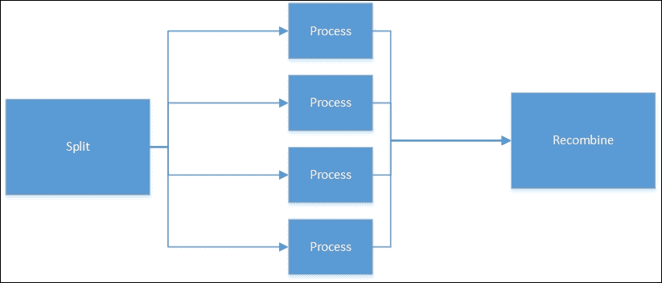
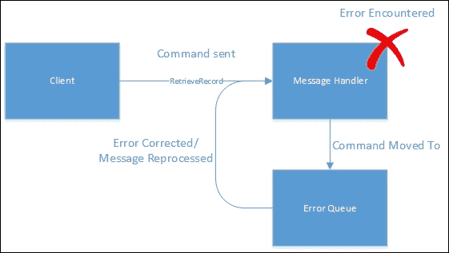

# 消息传递模式

当第一个真正的面向对象编程语言 Smalltalk 首次开发时，类之间的通信被设想为消息。 不知何故，我们已经远离了纯粹的信息概念。 我们讨论了函数式编程如何避免副作用，基于消息的系统也是如此。

消息传递还允许令人印象深刻的可伸缩性，因为消息可以分散到数十台甚至数百台计算机上。 在单个应用程序中，消息传递促进了低耦合并简化了测试。

在本章中，我们将研究一些与消息传递相关的模式。 在本章的最后，你应该知道消息是如何工作的。 当我第一次学习消息传递时，我想用它重写一切。

我们将涵盖以下主题:

*   什么是信息?
    *   命令
    *   事件
*   请求-应答
*   发布-订阅
    *   扇出
*   死信队列
*   消息重放
*   管道和过滤器

# 到底什么是信息?

在最简单的定义中，消息是具有某种意义的相关数据位的集合。 消息的命名方式为其提供了一些额外的含义。 例如，`AddUser`和`RenameUser`消息都可能有以下字段:

*   用户 ID
*   用户名

但是字段存在于命名容器中这一事实赋予了它们不同的含义。

消息通常与应用程序中的某些操作或业务中的某些操作相关。 消息包含了接收者根据动作采取行动所需的所有信息。 对于`RenameUser`消息，该消息包含足够的信息，用于跟踪用户 ID 和用户名之间的关系以更新用户名的值的任何组件。

许多消息传递系统，特别是那些在应用程序边界之间通信的系统，也定义一个**信封**。 信封上有元数据，可以帮助进行消息审计、路由和安全性。 信封上的信息不是业务流程的一部分，而是基础设施的一部分。 因此，在信封上有一个安全注释是很好的，因为安全存在于正常的业务工作流之外，并且由应用程序的不同部分拥有。 信封上的内容如下图所示:


应该对消息进行密封，这样一旦创建了消息，就不能对其进行更改。 这使得审计和重放等某些操作变得更加容易。

消息传递可以用于单个进程内部的通信，也可以用于应用程序之间的通信。 在大多数情况下，在应用程序内发送消息和在应用程序之间发送消息没有什么不同。 其中一个区别是对同步性的处理。 在单个进程中，可以以同步方式处理消息。 这意味着主处理有效地等待消息处理完成后再继续。

在异步场景中，消息的处理可能会在稍后进行。 有时晚的日期是遥远的未来。 当调用外部服务器时，异步肯定是正确的方法——这是由于与网络 I/O 相关的继承延迟造成的。 即使在单个进程中，JavaScript 的单线程特性也鼓励使用异步消息传递。 在使用异步消息传递时，需要注意一些额外的问题，因为同步消息传递的一些假设不再是安全的。 例如，假设消息将按照发送时的顺序回复，这就不再安全了。

消息有两种不同的:命令和事件。 命令指示事情发生，而事件通知已经发生的事情。

## 命令

命令只是从系统的一部分到另一部分的一条指令。 它是一个消息，所以它实际上只是一个简单的数据传输对象。 如果你回想一下在[第 5 章](05.html#page "Chapter 5. Behavioral Patterns")、*行为模式*中介绍的命令模式，你就会发现它使用的正是命令模式。

按照惯例，命令使用命令式命名。 格式通常为`<verb><object>`。 因此，命令可以称为`InvadeCity`。 通常，在命名命令时，您希望避免通用名称，并关注导致该命令的确切原因。

例如，考虑一个更改用户地址的命令。 您可能想简单地调用命令`ChangeAddress`，但这样做不会添加任何额外信息。 更好的做法是深入挖掘，看看地址为什么会改变。 这个人移动了吗?还是原来的地址输入错误了? 意图和实际的数据变化一样重要。 例如，由于错误而更改地址可能会引发与已经搬迁的人不同的行为。 已经移动的用户可以收到移动礼物，而更正地址的用户则不会收到。

消息应该有一个具有业务含义的组件，以增加其效用。 定义信息以及如何在复杂的业务中构建信息本身就是一个完整的研究领域。 感兴趣者可研究**域驱动****设计**(**DDD**)。

命令是针对某个特定组件的指令，为其提供执行任务的指令。

在浏览器的上下文中，您可能会认为命令是对按钮发起的单击。 命令被转换为一个事件，该事件就是传递给事件监听器的事件。

只有一个端点应该接收特定的命令。 这意味着只有一个组件对发生的动作负责。 一旦一个命令被多个端点执行，就会引入任意数量的竞态条件。 如果其中一个端点接受命令，而另一个端点认为无效而拒绝该命令，该怎么办? 即使发出了几个几乎相同的命令，也不应该对它们进行聚合。 例如，从一个国王向他的所有将军发送一个命令，应该向每个将军发送一个命令。

因为一个命令只有一个结束点，所以这个结束点可以验证甚至取消该命令。 取消命令应该不会对应用程序的其余部分产生影响。

当执行命令时，可能会发布一个或多个事件。

## 事件

事件是一种特殊的消息，用来通知某事已经发生。 尝试更改或取消事件是没有用的，因为它只是一个发生事情的通知。 你无法改变过去，除非你拥有德洛里安。

事件的命名惯例是用过去时书写。 您可能会看到命令中单词的顺序颠倒了，因此，一旦`InvadeCity`命令成功，我们可能会以`CityInvaded`结束。

与命令不同，事件可以由任意数量的组件接收。 这种方法并没有给出真正的竞态条件。 由于没有消息处理程序可以更改消息，也不能干扰消息的其他副本的传递，因此每个处理程序都与所有其他处理程序隔离开来。

您可能因为做过用户界面的工作而熟悉事件。 当用户点击按钮时，一个事件就会被“引发”。 实际上，事件被广播给一系列的侦听器。 通过连接到该事件来订阅消息:

```js
document.getElementById("button1").addEventListener("click", doSomething);
```

浏览器中的事件不完全符合我在上一段中给出的事件定义。 这是因为浏览器中的事件处理程序可以取消事件并阻止它们传播到下一个处理程序。 也就是说，当同一消息有一系列事件处理程序时，其中一个可以完全使用该消息，而不将其传递给后续处理程序。 这样的方法当然是有用的，但它确实会带来一些困惑。 幸运的是，对于 UI 消息来说，处理程序的数量通常非常少。

在某些系统中，事件本质上可以是多态的。 也就是说，如果我有一个叫做`IsHiredSalary`的事件，当有人被雇佣到一个受薪的角色时，我就会把它变成信息`IsHired`的后代。 这样做将允许在接收到`IsHiredSalary`事件时触发订阅`IsHiredSalary`和`IsHired`的两个处理程序。 JavaScript 没有真正意义上的多态，所以这类东西不是特别有用。 你可以添加一个消息字段来代替多态性，但看起来有点混乱:

```js
var IsHiredSalary = { __name: "isHiredSalary",
  __alsoCall: ["isHired"],
  employeeId: 77,
  …
}
```

在本例中，我使用了`__`来表示作为信封一部分的字段。 您还可以使用消息和信封的独立字段构造消息，这真的没有多大关系。

让我们来看看一个简单的操作，比如创建一个用户，这样我们就可以看到命令和事件是如何交互的:


在这里，用户在表单中输入数据并提交它。 web 服务器接收输入，验证它，如果它是正确的，就创建一个命令。 命令现在被发送到命令处理程序。 命令处理程序执行一些操作，比如写入数据库，然后发布一个事件，该事件由多个事件监听器使用。 这些事件侦听器可以发送确认电子邮件、通知系统管理员或任何数量的事情。

所有这些看起来都很熟悉，因为系统已经包含命令和事件。 不同之处在于，我们现在是显式地对命令和事件建模。

# 请求-应答

您将看到的最简单的消息传递模式是请求-应答模式。 也称为请求-响应，这是一种检索应用程序另一部分拥有的数据的方法。

在许多情况下，命令的发送是一个异步操作。 命令被触发，应用程序流继续进行。 正因为如此，没有一种简单的方法可以按照 ID 查找记录。 相反，需要发送一个命令来检索一条记录，然后等待相关的事件返回。 正常的工作流程如下图所示:


大多数事件可以被任意数量的侦听器订阅。 虽然可以为一个请求-响应模式使用多个事件侦听器，但这种情况不太可能发生，也可能不建议使用。

我们可以在这里实现一个非常简单的请求-响应模式。 在维斯特洛，及时发送信息是有问题的。 在没有电的情况下，只能通过把微小的信息绑在乌鸦的腿上来实现远距离快速发送信息。 因此，我们有一个乌鸦信息系统。

我们将开始建立，我们将称为**公共汽车**。 总线仅仅是消息的分发机制。 它可以在流程中实现，就像我们在这里所做的，也可以在流程外实现。 如果在进程外实现，有很多选择，从 0mq(轻量级消息队列)到 RabbitMQ(功能更全面的消息传递系统)，再到构建在数据库和云上的各种系统。 在消息可靠性和持久性方面，每个系统都表现出一些不同的行为。 重要的是要对消息分发系统的工作方式进行一些研究，因为它们可能决定应用程序的构造方式。 它们还实现了不同的方法来处理应用程序的底层不可靠性:

```js
class CrowMailBus {
  constructor(requestor) {
    this.requestor = requestor;
    this.responder = new CrowMailResponder(this);
  }
  Send(message) {
    if (message.__from == "requestor") {
      this.responder.processMessage(message);
    }
    else {
      this.requestor.processMessage(message);
    }
  }
}
```

一个潜在的错误是，在客户机上接收到的消息的顺序不一定是它们发送的顺序。 为了处理这个问题，通常需要包含某种相关 ID。 当引发事件时，它包含来自发送方的已知 ID，以便使用正确的事件处理程序。

这个总线是高度 naïve 的一个，因为它有它的路由硬编码。 一个真实的总线可能允许发送方指定发送的端点地址。 或者，接收者可以将自己注册为对特定类型的消息感兴趣。 然后总线将负责执行一些有限的路由来指导消息。 我们的总线甚至是以它处理的消息命名的——当然不是一种可扩展的方法。

接下来我们将实现请求器。 请求者只包含两个方法:一个发送请求，另一个从总线接收响应:

```js
class CrowMailRequestor {
  Request() {
    var message = { __messageDate: new Date(),
    __from: "requestor",
    __corrolationId: Math.random(),
    body: "Hello there. What is the square root of 9?" };
    var bus = new CrowMailBus(this);
    bus.Send(message);
    console.log("message sent!");
  }
  processMessage(message) {
    console.dir(message);
  }
}
```

流程消息函数目前只记录响应，但在实际场景中，它可能会做更多的工作，比如更新 UI 或分派另一条消息。 关联 ID 对于理解应答与哪个发送的消息相关非常有用。

最后，应答者简单地接收消息，并用另一条消息回复它:

```js
class CrowMailResponder {
  constructor(bus) {
    this.bus = bus;
  }
  processMessage(message) {
    var response = { __messageDate: new Date(),
    __from: "responder",
    __corrolationId: message.__corrolationId,
    body: "Okay invaded." };
    this.bus.Send(response);
    console.log("Reply sent");
  }
}
```

我们示例中的所有内容都是同步的，但要使其成为异步的，只需要交换总线。 如果我们在节点中工作，那么我们可以使用`process.nextTick`来完成这一点，它只是通过事件循环将函数推迟到下一次。 如果我们在 web 上下文中，那么 web worker 可能被用来在另一个线程中进行处理。 事实上，当启动一个 web worker 时，与它之间的通信以消息的形式进行:

```js
class CrowMailBus {
  constructor(requestor) {
    this.requestor = requestor;
    this.responder = new CrowMailResponder(this);
  }
  Send(message) {
    if (message.__from == "requestor") {
      process.nextTick(() => this.responder.processMessage(message));
    }
    else {
      process.nextTick(() => this.requestor.processMessage(message));
    }
  }
}
```

这种方法现在允许在处理消息之前运行其他代码。 如果我们在每个总线发送后织入一些打印语句，那么我们得到如下输出:

```js
Request sent!
Reply sent
{ __messageDate: Mon Aug 11 2014 22:43:07 GMT-0600 (MDT),
  __from: 'responder',
  __corrolationId: 0.5604551520664245,
  body: 'Okay, invaded.' }
```

您可以看到 print 语句在消息处理之前执行，因为该处理发生在下一次迭代中。

# 发布-订阅

在本章的其他地方，我已经提到了发布-订阅模式。 发布-订阅是将事件与处理代码分离的强大工具。

该模式的核心是理念，即作为消息发布者，我对消息的责任应该在发送后即结束。 我不应该知道谁在听信息，或者他们将如何处理这些信息。 只要我在履行合同以生成正确格式的消息，其余的就不重要了。

侦听器负责在消息类型中注册它感兴趣的内容。 当然，您会希望注册某种安全性，以禁止注册流氓服务。

我们可以更新服务总线来完成更多的工作，完成路由和发送多个消息的完整工作。 让我们把新方法称为`Publish`而不是`Send`。 我们将保留`Send`来做发送功能:


我们在前一节中使用的乌鸦邮件类比在这里开始瓦解，因为没有办法使用乌鸦广播消息。 乌鸦太小，扛不动大横幅，训练它们在空中写字也很困难。 我不愿意完全放弃乌鸦的想法所以让我们假设存在一种乌鸦广播中心。 在这里发送一条信息，就可以让它分散到许多已经注册了更新的感兴趣的团体。 这个中心或多或少就相当于一辆公共汽车。

我们将编写路由器，使它作为消息名称的函数工作。 可以使用任意属性路由消息。 例如，侦听器可以订阅所有`invoicePaid`字段大于$10000 的消息。 将这种逻辑添加到总线将使其变慢，并使调试变得更加困难。 实际上，这更像是业务流程编排引擎的领域，而不是总线。 我们将继续下去，不再那么复杂。

首先要设置的是订阅已发布消息的功能:

```js
CrowMailBus.prototype.Subscribe = function (messageName, subscriber) {
  this.responders.push({ messageName: messageName, subscriber: subscriber });
};
```

`Subscribe`函数只是添加一个消息处理程序和要使用的消息的名称。 responders 数组就是一组处理程序。

当消息发布时，循环遍历数组并触发每个以该名称注册了消息的处理程序:

```js
Publish(message) {
  for (let i = 0; i < this.responders.length; i++) {
    if (this.responders[i].messageName == message.__messageName) {
      (function (b) {
        process.nextTick(() => b.subscriber.processMessage(message));
      })(this.responders[i]);
    }
  }
}
```

这里的执行被推迟到下一个滴答声。 这是使用闭包来完成的，以确保传递正确的作用域变量。 我们现在可以将`CrowMailResponder`改为新的`Publish`方法，而不是`Send`:

```js
processMessage(message) {
  var response = { __messageDate: new Date(),
  __from: "responder",
  __corrolationId: message.__corrolationId,
  __messageName: "SquareRootFound",
  body: "Pretty sure it is 3." };
  this.bus.Publish(response);
  console.log("Reply published");
}
```

与之前允许`CrowMailRequestor`对象创建自己的总线不同，我们需要修改它以从外部接受`bus`的实例。 我们简单地将它赋值给`CrowMailRequestor`中的一个局部变量。 同样，`CrowMailResponder`也应该包含`bus`。

为了利用这一点，我们只需要创建一个新的总线实例，并将其传递给请求者:

```js
var bus = new CrowMailBus();
bus.Subscribe("KingdomInvaded", new TestResponder1());
bus.Subscribe("KingdomInvaded", new TestResponder2());
var requestor = new CrowMailRequestor(bus);
requestor.Request();
```

在这里，我们还传递了另外两个对`KingdomInvaded`消息感兴趣的响应器。 它们看起来如下:

```js
var TestResponder1 = (function () {
  function TestResponder1() {}
  TestResponder1.prototype.processMessage = function (message) {
    console.log("Test responder 1: got a message");
  };
  return TestResponder1;
})();
```

运行这段代码将得到以下结果:

```js
Message sent!
Reply published
Test responder 1: got a message
Test responder 2: got a message
Crow mail responder: got a message
```

您可以看到消息是使用`Send`发送的。 响应器或处理程序执行其工作并发布消息，将消息传递给每个订阅者。

有一些很棒的 JavaScript 库可以使发布和订阅更加容易。 我最喜欢的一个是 Radio.js。 它没有外部依赖项，它的名称是发布订阅的一个极好的比喻。 我们可以这样重写前面的订阅示例:

```js
radio("KingdomInvalid").subscribe(new TestResponder1().processMessage);
radio("KingdomInvalid").subscribe(new TestResponder2().processMessage);
```

然后使用以下命令发布消息:

```js
radio("KingdomInvalid").broadcast(message);
```

## 呈扇形散开，向内散开

发布订阅模式的一个绝妙用法是允许您将一个问题扇形扩展到许多不同的节点。 摩尔定律一直是关于每平方单位的晶体管数量增加一倍。 如果你一直在关注处理器的时钟速度，你可能已经注意到，在过去的十年里，时钟速度并没有发生任何显著的变化。 事实上，现在的时钟速度比 2005 年要慢。

这并不是说处理器比以前“慢”了。 在每个时钟滴答声中执行的工作增加了。 核的数量也在增加。 现在单核处理器已经不常见了; 甚至在移动电话中，双核处理器也变得越来越普遍。 拥有能够同时做不止一件事的计算机是一种规律，而不是例外。

与此同时，云计算正在起飞。 你直接购买的电脑比从云计算租赁的电脑要快。 云计算的优势在于，您可以轻松地扩展它。 提供 100 台甚至 1000 台计算机来组成一个云提供商是不可能的。

编写可以利用多核的软件是我们这个时代最大的计算问题。 直接处理线程会导致灾难。 锁定和争用对于大多数开发人员来说都是一个非常困难的问题:包括我! 对于某一类问题，可以很容易地将其划分为子问题并进行分布。 有些人把这类问题称为“令人尴尬的并行化”。

消息传递提供了一种机制，用于与问题的输入和输出进行通信。 如果我们遇到这样一个容易并行化的问题，比如搜索，那么我们可以将输入捆绑到一个消息中。 在这种情况下，它将包含我们的搜索条件。 消息还可能包含要搜索的文档集。 如果我们有 10,000 个文档，那么我们可以将搜索空间分成，比如说，4 个集合，包含 2500 个文档。 我们将发布 5 条信息，包括搜索条件和需要搜索的文件范围，如下图所示:



不同的搜索节点将提取消息并执行搜索。 然后，结果将被发送回一个节点，该节点将收集消息并将它们合并为一个消息。 这是将返回给客户端的内容。

当然，这有点过于简单化了。 接收节点本身很可能维护它们负责的文档列表。 这将防止原始发布节点必须知道它正在搜索的文档的任何信息。 搜索结果甚至可以直接返回给进行组装的客户端。

即使是在浏览器中，也可以通过使用 web worker 将计算分布到多个核上。 一个简单的例子便是创造药剂。 一种药剂可能包含多种成分，这些成分可以组合成最终产品。 结合各种成分在计算上是相当复杂的，所以我们想把这个过程外包给一些工人。

我们从一个包含`combine()`方法和`complete()`函数的组合器开始，该组合器在所有分布的成分被组合后被调用:

```js
class Combiner {
  constructor() {
    this.waitingForChunks = 0;
  }
  combine(ingredients) {
    console.log("Starting combination");
    if (ingredients.length > 10) {
      for (let i = 0; i < Math.ceil(ingredients.length / 2); i++) {
        this.waitingForChunks++;
        console.log("Dispatched chunks count at: " + this.waitingForChunks);
        var worker = new Worker("FanOutInWebWorker.js");
        worker.addEventListener('message', (message) => this.complete(message));
        worker.postMessage({ ingredients: ingredients.slice(i, i * 2) });
      }
    }
  }
  complete(message) {
    this.waitingForChunks--;
    console.log("Outstanding chunks count at: " + this.waitingForChunks);
    if (this.waitingForChunks == 0)
      console.log("All chunks received");
  }
};
```

为了跟踪工作人员的数量，我们使用了一个简单的计数器。 因为代码的主要部分是单线程的，所以没有竞争条件的风险。 一旦计数器显示没有剩余的工人，我们可以采取任何必要的步骤。 web worker 看起来如下所示:

```js
self.addEventListener('message', function (e) {
  var data = e.data;
  var ingredients = data.ingredients;
  combinedIngredient = new Westeros.Potion.CombinedIngredient();
  for (let i = 0; i < ingredients.length; i++) {
    combinedIngredient.Add(ingredients[i]);
  }
  console.log("calculating combination");
  setTimeout(combinationComplete, 2000);
}, false);

function combinationComplete() {
  console.log("combination complete");
  (self).postMessage({ event: 'combinationComplete', result: combinedIngredient });
}
```

在本例中，我们只是放入一个超时来模拟组合成分所需的复杂计算。

分配给若干节点的子问题不一定是相同的问题。 然而，它们应该足够复杂，使分派它们所节省的成本不会被发送消息的开销所消耗。

# 死信队列

无论我如何努力，我还没有写任何不包含任何错误的重要代码块。 我也不太擅长预测用户在我的应用程序中会做哪些疯狂的事情。 为什么有人会连续点击 73 次呢? 我永远不会知道。

在消息传递场景中处理失败是非常容易的。 失败策略的核心是接受错误。 我们有异常是有原因的，花费我们所有的时间试图预测和捕获异常是适得其反的。 你总是会花时间去捕捉那些从未发生过的错误，而忽略那些经常发生的错误。

在异步系统中，错误不需要在发生时立即处理。 相反，可以将导致错误的消息放在一边，以便稍后由实际的人检查。 消息存储在死信或错误队列中。 在更正消息或更正处理程序之后，可以很容易地从那里重新处理消息。 理想情况下，将消息处理程序更改为处理显示导致错误的任何属性的消息。 这可以防止将来出现错误，而且比修复生成消息的任何东西更好，因为不能保证具有相同问题的其他消息不会潜伏在系统的其他地方。 通过队列和错误队列的消息工作流可以在这里看到:



随着捕获和修复越来越多的错误，消息处理程序的质量也会提高。 有一个消息错误队列可以确保不遗漏任何重要消息，比如`BuySimonsBook`消息。 这意味着到达一个正确的系统变成了一场马拉松而不是短跑。 在对修复程序进行适当的测试之前，没有必要匆忙将其投入生产。 朝着正确的系统前进是持续而可靠的。

使用死信队列还可以改进对间歇性错误的捕获。 这些错误是由于外部资源不可用或不正确造成的。 想象一个调用外部 web 服务的处理程序。 在传统系统中，web 服务中的失败保证了消息处理程序中的失败。 但是，对于基于消息的系统，可以将命令移回输入队列的末尾，并在它到达队列前面时再次尝试。 在信封上，我们写下消息被出队列(处理)的次数。 一旦这个退出队列计数达到限制(比如 5)，消息才会移动到真正的错误队列中。

这种方法通过平滑小故障并阻止它们变成大故障来提高系统的整体质量。 实际上，队列提供了失败屏障，以防止小错误溢出并变成可能对整个系统产生影响的大错误。

## 消息重放

当开发人员处理一组产生错误的消息时，重新处理消息的能力也很有用。 开发人员可以获取死信队列的快照，并以调试模式一次又一次地重新处理它，直到正确地处理了消息。 消息的快照也可以组成消息处理程序测试的一部分。

即使没有错误，每天发送到服务的消息也代表了用户的正常工作流程。 当这些消息进入系统时，可以将它们镜像到一个审计队列。 审计队列中的数据可用于测试。 如果引入了新特性，那么可以回放一天的正常工作负载，以确保正确的行为或性能没有下降。

当然，如果审计队列包含每个消息的列表，那么理解应用程序如何到达其当前状态就变得很简单了。 通常，人们通过插入大量定制代码或使用触发器和审计表来实现历史记录。 这两种方法在理解哪些数据发生了变化以及为什么发生变化方面都不如消息传递。 再次考虑地址更改场景，如果没有消息传递，我们可能永远不会知道为什么用户的地址与前一天的不同。

维护良好的系统数据更改历史需要大量存储，但通过允许审计人员查看每次更改的方式和原因，这种成本很容易支付。 构造良好的消息还允许历史记录包含用户进行更改的意图。

虽然实现这类消息传递系统是可能的，但在单个进程中很难实现。 确保在发生错误时正确保存消息是很困难的，因为处理消息的整个过程可能会崩溃，并带走内部消息总线。 实际上，如果重放消息听起来是值得研究的事情，那么外部消息总线是解决方案。

## 管道和过滤器

我在前面提到，应该将消息视为不可变的。 这并不是说不能在更改某些属性的情况下重新广播消息，甚至不能作为一种新类型的消息进行广播。 事实上，许多消息处理程序可能会使用一个事件，然后在执行某些任务之后发布一个新事件。

例如，您可以考虑将新用户添加到系统的工作流:


在此例中，使用`CreateUser`命令触发`UserCreated`事件。 该事件由许多不同的服务使用。 其中一项服务将用户信息传递给选定的一些附属机构。 在此服务运行时，它发布自己的事件集，每个接收新用户详细信息的附属机构都有一个事件集。 这些事件可能会被其他服务使用，这些服务可能会触发它们自己的事件。 通过这种方式，更改可以影响整个应用程序。 然而，服务只知道什么启动了它，发布了什么事件。 该系统耦合性很低。 插入新功能是很简单的，甚至删除功能也很容易:肯定比一个单片系统更容易。

使用消息传递和自主组件构建的系统通常被称为使用**面向服务体系结构**(**SOA**)或微服务。 对于 SOA 和微服务之间的差异(如果确实存在差异的话)，仍然存在大量的争论。

信息的更改和重新广播可以被认为是一个管道或过滤器。 服务可以像管道那样将消息代理给其他消费者，也可以像过滤器那样选择性地重新发布消息。

## 版本信息

随着系统的发展，消息中包含的信息也可能发生变化。 在我们的用户创建示例中，我们最初可能要求提供姓名和电子邮件地址。 但是，营销部门希望能够发送电子邮件，收件人是琼斯先生或琼斯夫人，所以我们还需要收集用户的头衔。 这就是消息版本控制派上用场的地方。

现在，我们可以创建扩展前一个消息的新消息。 消息可以包含额外的字段，并且可以使用版本号或日期来命名。 因此，像`CreateUser`这样的信息可能会变成`CreateUserV1`或`CreateUser20140101`。 前面我提到了多态消息。 这是对消息进行版本控制的一种方法。 新消息扩展了旧消息，因此所有旧消息处理程序仍然会被触发。 然而，我们也讨论了 JavaScript 中如何没有真正的多态功能。

另一种选择是使用升级消息处理程序。 这些处理程序将接收新消息的一个版本，并将其修改为旧版本。 显然，新消息中至少需要包含与旧版本一样多的数据，或者有允许将一种消息类型转换为另一种消息类型的数据。

考虑如下所示的 v1 消息:

```js
class CreateUserv1Message implements IMessage{
  __messageName: string
  UserName: string;
  FirstName: string;
  LastName: string;
  EMail: string;
}
```

考虑一个扩展了它的 v2 消息，添加了一个用户标题:

```js
class CreateUserv2Message extends CreateUserv1Message implements IMessage{
  UserTitle: string;
}
```

然后，我们将能够编写一个非常简单的升级程序或降级程序，如下所示:

```js
var CreateUserv2tov1Downgrader = (function () {
  function CreateUserv2tov1Downgrader (bus) {
    this.bus = bus;
  }
  CreateUserv2tov1Downgrader.prototype.processMessage = function (message) {
    message.__messageName = "CreateUserv1Message";
    delete message.UserTitle;
    this.bus.publish(message);
  };
  return CreateUserv2tov1Downgrader;
})();
```

您可以看到，我们只是修改消息并重新广播它。

# 提示和提示

消息在两个不同的系统之间创建一个定义良好的接口。 定义消息应该由两个团队的成员来完成。 建立一种通用的语言可能是很棘手的，特别是在不同的业务单位之间术语过载的情况下。 销售部门对客户的考虑可能与运输部门对客户的考虑完全不同。 领域驱动设计提供了一些关于如何建立边界以避免混合术语的提示。

可用的队列技术具有巨大的优势。 每一种都有一系列不同的性能，包括可靠性、耐久性和速度。 一些队列支持通过 HTTP 读写 JSON:对于那些有兴趣构建 JavaScript 应用程序的人来说非常理想。 哪个队列适合您的应用程序是一些研究的主题。

# 小结

消息传递和相关模式是大型主题。 过于深入研究消息将让你接触**领域驱动设计(DDD**),**命令查询责任分离**(**CQRS**)以及涉及高性能计算解决方案。****

 **关于构建大型系统的最佳方法，目前正在进行大量的研究和讨论。 消息传递是一种可能的解决方案，它可以避免产生难以维护和易更改的大泥球。 消息传递在系统中的组件之间提供了自然的边界，消息本身提供了一致的 API。

不是每个应用程序都能从消息传递中受益。 构建这样一个松散耦合的应用程序有额外的开销。 具有协作性的应用程序，特别是不希望丢失数据的应用程序，以及那些从强大的历史记录中受益的应用程序都是消息传递的良好候选者。 在大多数情况下，一个标准的 CRUD 应用程序就足够了。 了解消息传递模式仍然是值得的，因为它们将提供另一种思维方式。

在本章中，我们介绍了许多不同的消息传递模式，以及如何将它们应用于常见场景。 我们还探讨了命令和事件之间的区别。

在下一章中，我们将讨论一些使测试代码更简单的模式。 测试是非常重要的，所以请继续阅读!**