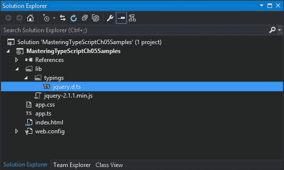
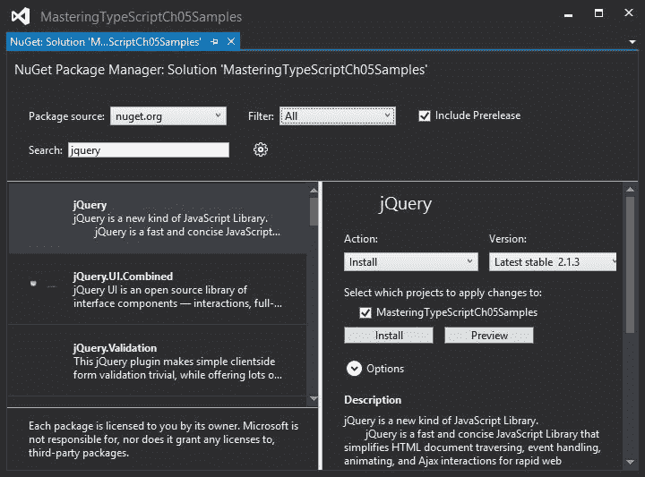
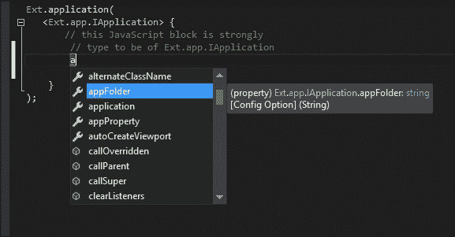

# 第五章。第三方图书馆

如果我们不能重用现有的大量 JavaScript 库、框架和一般的好东西，我们的 TypeScript 开发环境就不会有多大价值。然而，正如我们所看到的，为了使用带有 TypeScript 的特定第三方库，我们首先需要一个匹配的定义文件。

TypeScript 发布后不久，Boris Yankov 建立了一个 github 存储库来存放第三方 JavaScript 库的 TypeScript 定义文件。这个名为 DefinitelyTyped([https://github.com/borisyankov/DefinitelyTyped](https://github.com/borisyankov/DefinitelyTyped))的存储库很快变得非常受欢迎，目前是高质量清晰度文件的去处。DefinitelyTyped 目前有超过 700 个定义文件，这些文件是由来自世界各地的数百个贡献者随着时间的推移而建立的。如果我们要衡量在 JavaScript 社区中 TypeScript 的成功，那么 DefinitelyTyped 存储库将很好地表明 TypeScript 被采用的程度。在您继续尝试编写自己的定义文件之前，请检查 DefinitelyTyped 存储库，看看是否有可用的存储库。

在本章中，我们将更详细地了解如何使用这些定义文件，并涵盖以下主题:

*   下载定义文件
*   在 Visual Studio 中使用 NuGet
*   使用类型脚本定义管理器(TSD)
*   选择一个 JavaScript 框架
*   使用带主干的类型脚本
*   使用带角度的打字稿
*   在 ExtJs 中使用类型脚本

# 下载定义文件

在您的 TypeScript 项目中包含定义文件的最简单的方法是从 DefinitelyTyped 下载匹配的文件。这是一个简单的事情，找到相关的文件，并下载原始内容。让我们假设我们想在我们的项目中开始使用 jQuery。我们已经找到并下载了 jQuery JavaScript 库(v2.1.1)，并将相关文件包含在我们的项目中，位于名为`lib`的目录下。要下载申报文件，只需浏览到定义类型上的`jquery`目录([https://github . com/borisyankov/定义类型/tree/master/jquery](https://github.com/borisyankov/DefinitelyTyped/tree/master/jquery) ，然后点击`jquery.d.ts`文件。这将打开一个带有文件编辑器视图的 GitHub 页面。在该编辑器视图的菜单栏上，点击 **Raw** 按钮。这将下载`jquery.d.ts`文件，并允许您将其保存在您的项目目录结构中。在 **lib** 文件夹下新建一个名为**打字员**的目录，并将 **jquery.d.ts** 文件保存在那里。

您的项目文件应该如下所示:



带有下载的 jquery.d.ts 文件的 Visual Studio 项目结构

我们现在可以修改我们的`index.html`文件以包含`jquery` JavaScript 文件，并开始编写以 jQuery 库为目标的 TypeScript 代码。我们的`index.html`文件需要修改如下:

```js
<!DOCTYPE html>

<html lang="en">
<head>
    <meta charset="utf-8" />
    <title>TypeScript HTML App</title>
    <link rel="stylesheet" href="app.css" type="text/css" />
    <script src="/lib/jquery-2.1.1.min.js"></script>
    <script src="app.js"></script>
</head>
<body>
    <h1>TypeScript HTML App</h1>

    <div id="content"></div>
</body>
</html>
```

这个`index.html`文件的第一个`<script>`标签现在包括一个到`jquery-2.1.1.min.js`的链接，第二个`<script>`标签包括一个到生成的`app.js`的类型脚本的链接。打开`app.ts` TypeScript 文件，删除退出的源码，替换为如下 jQuery 代码:

```js
$(document).ready(() => {
    $("#content").html("<h1>Hello World !</h1>");
});
```

这个片段首先定义一个匿名函数在`document.ready`的 jQuery 事件上执行。`document.ready`函数类似于我们之前使用的`window.onload`函数，一旦 jQuery 初始化，它就会执行。这个片段的第二行只是使用 jQuery 选择器语法获得名为`content`的 DOM 元素的句柄，然后调用`html`函数来设置它的 HTML 值。

我们下载的`jquery.d.ts`文件为我们提供了在 TypeScript 中编译 jQuery 所需的相关模块声明。

# 使用 NuGet

NuGet 是一个流行的包管理平台，它将下载所需的外部库，并自动将它们包含在您的 Visual Studio 或 WebMatrix 项目中。它可以用于打包为动态链接库的外部库，如 StructureMap，也可以用于 JavaScript 库和声明文件。NuGet 也可以作为命令行工具使用。

## 使用扩展管理器

要使用 Visual Studio 中的“获取包管理器”对话框，请选择主工具栏上的**工具**选项，然后选择**获取包管理器**，最后选择管理解决方案的获取包。这将弹出 NuGet 包管理器对话框。在对话框的左侧，点击**在线**。NuGet 对话框将查询 NuGet 网站并显示可用包的列表。屏幕右上方是**搜索**框。点击**内搜索**框，输入`jquery`显示 jQuery NuGet 内所有可用的包，如下图截图所示:



“获取包管理器”对话框，包含 jQuery 上查询的结果

当您在**搜索结果**面板中选择包时，每个包将有一个**安装**按钮高亮显示。当选择一个包时，右侧窗格将显示有关所讨论的 NuGet 包的更多详细信息。请注意，项目详细信息面板还显示了您将要安装的包的版本。点击**安装**按钮将下载相关文件——以及任何依赖项——并将它们自动包含在您的项目中。

### 注

NuGet 用于 JavaScript 文件的安装目录实际上被称为`Scripts`，而不是我们之前创建的`lib`目录。NuGet 使用`Scripts`目录作为的标准，所以任何包含 JavaScript 的包都会将相关的 JavaScript 文件安装到`Scripts`目录中。

## 安装申报文件

您会发现在定义类型的 GitHub 存储库中找到的大多数声明文件都有一个相应的 NuGet 包。这些包裹被命名为`<library>`。`TypeScript.DefinitelyTyped`，作为标准命名约定。如果我们在搜索框中输入`jquery typescript`，我们将看到返回的这些明确输入的包的列表。我们要找的 NuGet 包名为 **jquery。TypeScript.DefinitelyTyped** ，由 **Jason Jarret** 创建，在编写本文时，版本为 1.4.0。

### 注

DefinitelyTyped 包有自己的内部版本号，这些版本号不一定与您正在使用的 JavaScript 库的版本相匹配。例如，jQuery 包的版本是 2.1.1，但是对应的 TypeScript 定义包显示的版本号是 1.4.0。

安装`jQuery.TypeScript.DefinitelyTyped`包会在`Scripts`目录下创建一个`typings`目录，然后包含`jquery.d.ts`定义文件。这个目录命名标准已经被不同的 NuGet 包作者所采用。

## 使用包管理器控制台

Visual Studio 也有一个命令行版本的 NuGet 包管理器作为控制台应用，并且也集成到 Visual Studio 中。点击**工具**，然后 **NuGet 包管理器**，最后点击**包管理器控制台**，会弹出一个新的 Visual Studio 窗口，初始化 NuGet 命令行界面。NuGet 的命令行版本具有许多图形用户界面版本中没有的功能。键入`get-help NuGet`查看可用的顶级命令行参数列表。

### 安装包装

要从控制台命令行安装一个 NuGet 包，只需键入`install-package <packageName>`。例如，要安装`jquery.TypeScript.DefinitelyTyped`包，只需键入:

```js
Install-Package jquery.TypeScript.DefinitelyTyped

```

该命令将连接到 NuGet 服务器，并将包下载并安装到您的项目中。

### 注

在**包管理器控制台**窗口的工具栏上有两个下拉列表，**包源**和**默认项目**。如果您的 Visual Studio 解决方案有多个项目，您需要从**默认项目**下拉列表中为 NuGet 选择正确的项目来安装软件包。

### 搜索包名

从命令行搜索包名是通过`Get-Package –ListAvailable`命令完成的。该命令采用`–Filter`参数作为搜索标准。例如，要查找包含`definitelytyped`搜索字符串的可用包，请运行以下命令:

```js
Get-Package –ListAvailable –Filter definitelytyped

```

### 安装特定版本

有些 JavaScript 库与 jQuery 2 . x 版本不兼容，需要 1.x 范围内的 jQuery 版本。要安装 NuGet 包的特定版本，我们需要从命令行指定`-Version`参数。以安装`jquery v1.11.1`包为例，从命令行运行以下命令:

```js
Install-Package jQuery –Version 1.11.1

```

### 注

如果 NuGet 发现您的项目中已经安装了另一个版本，它将升级或降级您正在安装的软件包版本。在前面的例子中，我们已经在我们的项目中安装了最新版本的 jQuery (2.1.1)，所以在安装`jQuery 1.11.1`之前，NuGet 将首先移除`jQuery 2.1.1`。

# 使用类型脚本定义管理器

如果您使用节点作为您的类型脚本开发环境，那么您可以考虑使用**类型脚本定义管理器**进行定义类型化( **TSD** 在[http://definitelytyped.org/tsd/](http://definitelytyped.org/tsd/))。TSD 提供了与 NuGet 包管理器类似的功能，但是是专门针对类型脚本定义的，这些定义是定义类型的 GitHub 存储库的一部分。

要安装 TSD，请按如下方式使用`npm`:

```js
npm install tsd@next –g

```

这将安装`tsd prerelease v0.6.x`。

### 注

在编写本文时，您将需要 v0.6.x 及更高版本，以便从命令行使用 install 关键字。如果你简单地输入`npm install tsd –g`，那么 npm 将会是`install v0.5.x`，其中不包括`install`关键字。

## 查询包

TSD 允许使用`query`关键字查询包存储库。要在中搜索`jquery`定义文件，请键入以下内容:

```js
tsd query jquery

```

前面的命令将在`DefinitelyTyped`存储库中搜索任何名为`jquery.d.ts`的定义文件。由于只有一个，搜索返回的结果将是:

```js
Jquery / jquery

```

## 使用通配符

TSD 还允许使用星号`*`作为通配符。要在中搜索以`jquery`开头的`DefinitelyTyped`申报文件，请键入以下内容:

```js
tsd query jquery.*

```

这个`tsd`命令将搜索整个存储库，并返回以 jQuery 开头的声明文件的结果。

## 安装定义文件

要安装定义文件，使用`install`关键字作为，如下所示:

```js
tsd install jquery

```

该命令将把`jquery.d.ts`文件下载到以下目录:

```js
\typings\jquery\jquery.d.ts

```

### 注

tsd 将基于运行 TSD 的当前目录创建`\typings`目录，所以无论何时从命令行使用 TSD，都要确保导航到项目中的相同基础目录。

# 使用第三方库

在本章的这一节中，我们将开始探索一些更流行的第三方 JavaScript 库、它们的声明文件，以及如何为这些框架编写兼容的 TypeScript。我们将比较主干网、Angular 和 ExtJs，它们都是构建富客户端 JavaScript 应用的框架。在我们的讨论中，我们将看到一些框架与 TypeScript 语言及其特性高度兼容，一些框架部分兼容，一些框架的兼容性非常低。

## 选择一个 JavaScript 框架

选择一个 JavaScript 框架或库来开发单页应用是一项困难且有时令人生畏的任务。似乎每隔一个月就会出现一个新的框架，承诺用越来越少的代码实现越来越多的功能。

为了帮助开发人员比较这些框架，并做出明智的选择，Addy Osmani 写了一篇优秀的文章，名为*穿越 JavaScript MVC 丛林之旅*。([http://www . smashingmagazine . com/2012/07/27/travel-through-JavaScript-MVC-丛林/](http://www.smashingmagazine.com/2012/07/27/journey-through-the-javascript-mvc-jungle/) )。

本质上，他的建议很简单——这是个人选择——所以尝试一些框架，看看什么最适合你的需求、你的编程思维和你现有的技能组合。Addy 启动的 **TodoMVC** 项目([http://todomvc.com](http://todomvc.com))在许多 MV* JavaScript 框架中实现相同的应用方面做得非常好。这真的是一个参考站点，用于深入研究一个完全正常工作的应用，并自己比较不同框架的编码技术和风格。

同样，根据您在类型脚本中使用的 JavaScript 库，您可能需要以特定的方式编写类型脚本代码。选择框架时请记住这一点——如果很难与 TypeScript 一起使用，那么您最好考虑另一个集成更好的框架。如果在 TypeScript 中使用框架简单自然，那么你的生产力和整体开发体验会好很多。

在这一节中，我们将看看一些流行的 JavaScript 库，以及它们的声明文件，并看看如何编写兼容的 TypeScript。需要记住的关键一点是，TypeScript 会生成 JavaScript——因此，如果您正在努力使用第三方库，那么打开生成的 JavaScript，看看 TypeScript 发出的 JavaScript 代码是什么样子的。如果生成的 JavaScript 与库文档中的 JavaScript 代码示例相匹配，那么您就走对了。如果没有，那么您可能需要修改您的 TypeScript，直到编译后的 JavaScript 开始与示例匹配。

当试图为第三方 JavaScript 框架编写 TypeScript 代码时——尤其是当您正在处理 JavaScript 文档时——您最初的尝试可能只是一次试错。在这个过程中，您可能会发现您需要以特定的方式编写您的 TypeScript，以便与这个特定的第三方库相匹配。本章的其余部分展示了三个不同的库如何需要不同的方式来编写 TypeScript。

# 骨干

主干是一个流行的 JavaScript 库，它通过提供模型、集合和视图等为网络应用提供结构。自 2010 年以来，主干网一直存在，并获得了非常多的追随者，大量商业网站使用该框架。根据[Infoworld.com](http://Infoworld.com)的说法，主干网在 GitHub 上有超过 1600 个与主干网相关的项目，评分超过 3 星——这意味着它有一个庞大的扩展和相关库的生态系统。

让我们快速了解一下用 TypeScript 编写的主干。

### 注

为了在您自己的项目中遵循代码，您需要安装以下 NuGet 包:`backbone.js`(当前版本为 1.1.2)和`backbone.TypeScript.DefinitelyTyped`(当前版本为 1.2.3)。

## 利用骨干遗传

从主干文档中，我们找到了一个在 JavaScript 中创建`Backbone.Model`的例子，如下所示:

```js
var Note = Backbone.Model.extend(
    {
        initialize: function() {
            alert("Note Model JavaScript initialize");
        },
        author: function () { },
        coordinates: function () { },
        allowedToEdit: function(account) {
            return true;
        }
    }
);
```

这段代码展示了主干在 JavaScript 中的典型用法。我们从创建一个名为`Note`的变量开始，该变量扩展(或派生自)`Backbone.Model`。这可以从`Backbone.Model.extend`语法中看出。主干`extend`函数使用 JavaScript 对象符号在外部大括号`{ … }`中定义一个对象。在前面的代码中，这个对象有四个功能:`initialize`、`author`、`coordinates`和`allowedToEdit`。

根据主干文档，`initialize`函数将在这个类的新实例创建后被调用。在我们前面的示例中，`initialize`函数只是创建了一个**警报**来指示该函数已被调用。`author`和`coordinates`功能在这个阶段是空白的，只有`allowedToEdit`功能实际上在做一些事情:`return true`。

如果我们简单地将上面的 JavaScript 复制并粘贴到一个 TypeScript 文件中，我们将生成以下编译错误:

```js
Build: 'Backbone.Model.extend' is inaccessible.

```

当使用第三方库和来自 DefinitelyTyped 的定义文件时，我们的第一个调用端口应该是查看定义文件是否有错误。毕竟 JavaScript 文档说我们应该可以使用如图所示的`extend`方法，那么为什么这个定义文件会导致错误呢？如果我们打开`backbone.d.ts`文件，然后搜索找到类`Model`的定义，我们会发现编译错误的原因:

```js
class Model extends ModelBase {

    /**
    * Do not use, prefer TypeScript's extend functionality.
    **/
    private static extend(
        properties: any, classProperties?: any): any;
```

这个声明文件片段显示了主干`Model`类的一些定义。在这里，我们可以看到`extend`函数被定义为`private static`，因此，它在模型类本身之外将不可用。然而，这似乎与我们在文档中看到的 JavaScript 示例相矛盾。在前面对`extend`函数定义的评论中，我们找到了在类型脚本中使用主干的关键:更喜欢类型脚本的扩展功能。

该注释表明主干的声明文件是围绕 TypeScript 的`extends`关键字构建的，从而允许我们使用自然的 TypeScript 继承语法来创建主干对象。因此，相当于该代码的 TypeScript 必须使用`extends` TypeScript 关键字从基类`Backbone.Model`派生一个类，如下所示:

```js
class Note extends Backbone.Model {
    initialize() {
        alert("Note model Typescript initialize");
    }
    author() { }
    coordinates() { }
    allowedToEdit(account) {
        return true;
    }
}
```

我们现在正在创建一个名为`Note``extends``Backbone.Model`基类的类定义。这个类然后有功能`initialize`、`author`、`coordinates`和`allowedToEdit`，类似于以前的 JavaScript 版本。我们的主干示例现在将正确编译和运行。

无论是哪一个版本，我们都可以通过在一个 HTML 页面中包含以下脚本来创建`Note`对象的实例:

```js
<script type="text/javascript">
    $(document).ready( function () {
        var note = new Note();
    });
</script>
```

这个 JavaScript 示例只是等待激发 jQuery `document.ready`事件，然后创建一个`Note`类的实例。如前所述，`initialize`函数将在构造类的实例时被调用，因此当我们在浏览器中运行它时，我们会看到一个警告框。

主干网的所有核心对象都是在继承的基础上设计的。这意味着创建新的主干集合、视图和路由器将在 TypeScript 中使用相同的`extends`语法。因此，主干非常适合 TypeScript，因为我们可以使用继承的自然 TypeScript 语法来创建新的主干对象。

## 使用接口

由于主干允许我们使用类型脚本继承来创建对象，我们也可以轻松地对我们的任何主干对象使用类型脚本接口。为上面的`Note`类提取一个接口如下:

```js
interface INoteInterface {
    initialize();
    author();
    coordinates();
    allowedToEdit(account: string);
}
```

我们现在可以更新我们的`Note`类定义来实现这个接口，如下所示:

```js
class Note extends Backbone.Model implements INoteInterface {
    // existing code
}
```

我们的类定义现在实现了`INoteInterface`类型脚本接口。这个简单的改变保护了我们的代码不被不经意地修改，同时也打开了在标准的面向对象设计模式中使用核心主干对象的能力。如果需要的话，我们可以应用[第 3 章](3.html#page "Chapter 3. Interfaces, Classes and Generics")、*接口、类和泛型*中描述的工厂模式来返回特定类型的主干模型——或者任何其他主干对象。

## 使用泛型语法

主干的声明文件也为一些类定义添加了通用语法。当为主干编写类型脚本代码时，这给带来了更强的类型优势。主干集合(惊奇，惊奇)包含主干模型的集合，允许我们在 TypeScript 中定义集合，如下所示:

```js
class NoteCollection extends Backbone.Collection<Note> {
    model = Note;
    //model: Note; // generates compile error
    //model: { new (): Note }; // ok
}
```

这里，我们有一个从派生的`NoteCollection`，或者`extends`一个`Backbone.Collection`，但是也使用泛型语法来约束集合只处理类型为`Note`的对象。这意味着任何标准的收集功能，如`at()`或`pluck()`将被强类型化以返回`Note`模型，进一步增强我们的类型安全性和智能感知。

请注意第二行中用于为集合类的内部`model`属性分配类型的语法。我们不能使用标准的 TypeScript 语法`model: Note`，因为这会导致编译时错误。我们需要将`model`属性分配给类定义，如`model=Note`语法所示，或者我们可以使用`{ new(): Note }`语法，如最后一行所示。

## 使用 ECMAScript 5

主干还允许我们使用 ECMAScript 5 功能来定义`Backbone.Model`类的获取器和设置器，如下所示:

```js
interface ISimpleModel {
    Name: string;
    Id: number;
}
class SimpleModel extends Backbone.Model implements ISimpleModel {
    get Name() {
        return this.get('Name');
    }
    set Name(value: string) {
        this.set('Name', value);
    }
    get Id() {
        return this.get('Id');
    }
    set Id(value: number) {
        this.set('Id', value);
    }
}
```

在这个片段中，我们定义了一个具有两个属性的接口，命名为`ISimpleModel`。然后我们定义了一个从`Backbone.Model`派生的`SimpleModel`类，并且还实现了`ISimpleModel`接口。然后我们有 ES 5 吸气剂和设置剂用于我们的`Name`和`Id`属性。主干使用类属性来存储模型值，所以我们的 getters 和 setters 只是调用`Backbone.Model`的底层`get`和`set`方法。

## 主干类型脚本兼容性

正如我们所看到的，主干允许我们在代码中使用所有的 TypeScript 语言特性。我们可以使用类、接口、继承、泛型甚至 ECMAScript 5 属性。我们所有的类也是从基础主干对象派生的。这使得主干网成为用 TypeScript 构建网络应用的高度兼容的库。我们将在后面的章节中探讨更多的主干框架。

# 棱角分明

AngularJs(或者仅仅是 Angular)也是一个非常流行的 JavaScript 框架，由 Google 维护。Angular 采用了一种完全不同的方法来构建 JavaScript SPA，引入了一种运行中的 Angular 应用能够理解的 HTML 语法。这为应用提供了双向数据绑定功能，可以自动同步模型、视图和 HTML 页面。Angular 还提供了**依赖注入** ( **DI** 的机制，使用服务为你的视图和模型提供数据。

让我们看一下第 2 步中发现的角度教程中的一个示例，在这里我们开始构建一个名为`PhoneListCtrl`的控制器。教程中提供的示例显示了以下 JavaScript:

```js
var phonecatApp = angular.module('phonecatApp', []);
phonecatApp.controller('PhoneListCtrl', function ($scope) 
{
  $scope.phones = [
    {'name': 'Nexus S',
     'snippet': 'Fast just got faster with Nexus S.'},
    {'name': 'Motorola XOOM™ with Wi-Fi',
     'snippet': 'The Next, Next Generation tablet.'},
    {'name': 'MOTOROLA XOOM™',
     'snippet': 'The Next, Next Generation tablet.'}
  ];
});
```

这段代码片段是典型的 Angular JavaScript 语法。我们首先创建一个名为`phonecatApp`的变量，并通过调用`angular`全局实例上的`module`函数将其注册为角度模块。`module`函数的第一个参数是 Angular 模块的全局名称，空数组是通过 Angular 的依赖注入例程注入的其他模块的占位符。

然后我们用两个参数对新创建的`phonecatApp`变量调用`controller`函数。第一个参数是控制器的全局名，第二个参数是接受名为`$scope`的特殊命名的 Angular 变量的函数。在这个函数中，代码将`$scope`变量的`phones`对象设置为一个 JSON 对象数组，每个对象都有一个`name`和`snippet`属性。

如果我们继续通读教程，我们会发现一个单元测试显示了`PhoneListCtrl`控制器是如何使用的:

```js
describe('PhoneListCtrl', function(){
    it('should create "phones" model with 3 phones', function() {
      var scope = {},
          ctrl = new PhoneListCtrl(scope);

      expect(scope.phones.length).toBe(3);
  });

});
```

这段代码片段的前两行使用了一个名为`describe`的全局函数，在这个函数中还有一个名为`it`的函数。这两个函数是名为 Jasmine 的单元测试框架的一部分。我们将在下一章中讨论单元测试，但是现在，让我们关注代码的其余部分。

我们将一个名为`scope`的变量声明为一个空的 JavaScript 对象，然后将一个名为`ctrl`的变量使用`new`关键字创建我们的`PhoneListCtrl`类的一个实例。`new PhoneListCtrl(scope)`语法显示 Angular 正在使用控制器的定义，就像我们在 TypeScript 中使用普通类一样。

在 TypeScript 中构建相同的对象将允许我们使用 TypeScript 类，如下所示:

```js
var phonecatApp = angular.module('phonecatApp', []);

class PhoneListCtrl  {
    constructor($scope) {
        $scope.phones = [
            { 'name': 'Nexus S',
              'snippet': 'Fast just got faster' },
            { 'name': 'Motorola',
              'snippet': 'Next generation tablet' },
            { 'name': 'Motorola Xoom',
              'snippet': 'Next, next generation tablet' }
        ];
    }
};
```

我们的第一行是与我们之前的 JavaScript 示例相同。然而，我们随后使用 TypeScript 类语法创建了一个名为`PhoneListCtrl`的类。通过创建一个 TypeScript 类，我们现在可以使用这个类，如我们的 Jasmine 测试代码所示:`ctrl = new PhoneListCtrl(scope)`。我们的`PhoneListCtrl`类的`constructor`函数现在充当了原始 JavaScript 示例中的匿名函数:

```js
phonecatApp.controller('PhoneListCtrl', function ($scope) {
    // this function is replaced by the constructor
}
```

## 角度等级和$范围

让我们将我们的课程再扩展一点，让看看完成后会是什么样子:

```js
class PhoneListCtrl  {
    myScope: IScope;
    constructor($scope, $http: ng.IHttpService, Phone) {
        this.myScope = $scope;
        this.myScope.phones = Phone.query();
        $scope.orderProp = 'age';
         _.bindAll(this, 'GetPhonesSuccess');
    }
    GetPhonesSuccess(data: any) {
        this.myScope.phones = data;
    }
};
```

在这个类中首先要注意的是，我们定义了一个名为的变量，并将通过构造函数传入的`$scope`参数存储到这个内部变量中。这也是因为 JavaScript 的词法范围规则。注意构造函数末尾对`_.bindAll`的调用。这个下划线实用函数将确保每当调用`GetPhonesSuccess`函数时，它将在类实例的上下文中使用变量`this`，而不是在调用代码的上下文中。我们将在后面的章节中详细讨论`_.bindAll`的用法。

`GetPhonesSuccess`函数在其实现中使用`this.myScope`变量。这就是为什么我们需要将最初的`$scope`参数存储在内部变量中。

我们从这段代码中注意到的另一件事是`myScope`变量被输入到一个名为`IScope`的接口中，这个接口需要被定义如下:

```js
interface IScope {
    phones: IPhone[];
}
interface IPhone {
    age: number;
    id: string;
    imageUrl: string;
    name: string;
    snippet: string;
};
```

这个`IScope`界面只包含一组类型为`IPhone`的对象(请原谅这个界面的不幸名称——它也可以容纳安卓手机)。

这意味着我们在处理`$scope`对象时没有标准的接口或者 TypeScript 类型可以使用。就其本质而言，`$scope`参数将根据 Angular 运行时调用它的时间和位置而改变其类型，因此我们需要定义一个`IScope`接口，并将`myScope`变量强有力地键入该接口。

关于`PhoneListCtrl`类的构造函数，另一个有趣的注意事项是`$http`参数的类型。它被设定为类型`ng.IHttpService`。这个`IHttpService`界面可以在 Angular 的申报文件中找到。为了将 TypeScript 用于角度变量，如`$scope`或`$http`，我们需要在我们的声明文件中找到匹配的接口，然后才能使用这些变量上可用的任何角度函数。

在这个构造器代码中最后要注意的一点是最后一个参数，名为`Phone`。它没有分配类型脚本类型，因此自动成为类型`any`。让我们快速了解一下这项`Phone`服务的实施情况，如下所示:

```js
var phonecatServices = angular.module('phonecatServices', ['ngResource']);

phonecatServices.factory('Phone',
    [
        '$resource', ($resource) => {
            return $resource('phones/:phoneId.json', {}, {
                query: {
                    method: 'GET',
                    params: {
                        phoneId: 'phones'
                    },
                    isArray: true
                }
            });
        }
    ]
);
```

这段代码片段的第一行再次使用`angular.module`全局函数创建了一个名为`phonecatServices`的全局变量。然后我们调用`phonecatServices`变量上可用的`factory`函数，以定义我们的`Phone`资源。这个`factory`函数使用名为`'Phone'`的字符串定义`Phone`资源，然后使用 Angular 的依赖注入语法注入一个`$resource`对象。查看通过这段代码，我们可以看到，我们无法轻松创建标准的 TypeScript 类供 Angular 在这里使用。我们也不能在这个 Angular 服务上使用标准的 TypeScript 接口或继承。

## 角型脚本兼容性

当用 TypeScript 编写 Angular 代码时，我们能够在某些情况下使用类，但是在其他情况下必须依赖底层 Angular 函数，如`module`和`factory`来定义我们的对象。另外，当使用标准的 Angular 服务时，例如`$http`或`$resource`，我们需要指定匹配的声明文件接口，以便使用这些服务。因此，我们可以将 Angular 库描述为与 TypeScript 具有中等兼容性。

# 遗传——棱角分明还是骨气分明

继承是面向对象编程非常强大的特性，也是使用 JavaScript 框架时的一个基本概念。在每个框架内使用主干控制器或角度控制器依赖于某些特性或可用功能。然而，我们已经看到，每个框架都以不同的方式实现继承。

由于 JavaScript 没有继承的概念，每个框架都需要找到实现它的方法，这样框架就可以允许我们扩展基类及其功能。在主干中，这种继承实现是通过每个主干对象的`extend`函数实现的。正如我们所看到的，TypeScript `extends`关键字遵循与主干相似的实现，允许框架和语言相互吻合。

另一方面，Angular 使用自己的继承实现，并在 angular 全局命名空间上定义函数来创建类(即`angular.module`)。我们有时也可以使用应用的实例(即`<appName>.controller`)来创建模块或控制器。然而，我们发现 Angular 使用控制器的方式与 TypeScript 类非常相似，因此我们可以简单地创建标准的 TypeScript 类，这些类将在 Angular 应用中工作。

到目前为止，我们只浏览了角型脚本语法和骨干型脚本语法的表面。本练习的目的是尝试理解如何在这两个第三方框架中使用 TypeScript。

一定要访问[http://todomvc.com](http://todomvc.com)，看看用 TypeScript 为 Angular 和 Backbone 编写的 Todo 应用的完整源代码。它们可以在示例部分的**编译到 JS** 标签中找到。当尝试使用外部第三方库(如 Angular 或 Backbone)编写 TypeScript 语法时，这些运行中的代码示例以及每个站点上的文档将被证明是一种无价的资源。

## 角度 2.0°

微软 TypeScript 团队和谷歌 Angular 团队刚刚完成了长达数月的合作，并宣布即将发布的 Angular，名为 Angular 2.0，将使用 TypeScript 构建。最初，Angular 2.0 打算为 Angular 开发使用一种名为 AtScript 的新语言。然而，在微软和谷歌团队的合作过程中，开发 Angular 2.0 所需的 AtScript 功能现在已经在 TypeScript 中实现了。这意味着，一旦 Angular 2.0 库和 1.5 版的 TypeScript 编译器可用，Angular 2.0 库将被归类为与 TypeScript 高度兼容。

# ExtJs

ExtJs 是一个流行的 JavaScript 库，它有各种各样的小部件、网格、绘图组件、布局组件等等。在 4.0 版本中，ExtJs 将模型、视图、控制器风格的应用架构整合到了他们的库中。尽管它对开源开发是免费的，但 ExtJs 需要商业使用许可证。它很受开发团队的欢迎，开发团队正在构建支持网络的桌面替代产品，因为它的外观和感觉与普通桌面应用相当。默认情况下，ExtJs 确保每个应用或组件的外观和感觉完全相同，无论它运行在哪个浏览器中，并且它几乎不需要或根本不需要 CSS 或 HTML。

然而，尽管社区压力很大，ExtJs 团队还没有发布 ExtJs 的官方 TypeScript 声明文件。谢天谢地，从迈克·奥布里开始，更广泛的 JavaScript 社区已经出手相助。他编写了一个小实用程序，从 ExtJs 文档([https://github.com/zz9pa/extjsTypescript](https://github.com/zz9pa/extjsTypescript))中生成声明文件。

这项工作是否影响了 DefinitelyTyped 上 ExtJs 定义的当前版本，还有待观察，但是来自 Mike Aubury 的原始定义和来自 DefinitelyTyped 上 brian428 的当前版本非常相似。

## 在 ExtJs 中创建类

ExtJs 是一个用自己的方式做事的 JavaScript 库。如果我们要对主干、角度和 ExtJs 进行分类，我们可能会说主干是一个高度兼容的类型脚本库。换句话说，TypeScript 中的类和继承的语言特性与主干高度兼容。

在这种情况下，Angular 是一个部分兼容的库，Angular 对象的一些元素符合 TypeScript 语言的特性。另一方面，ExtJs 将是一个最低限度兼容的库，很少或没有适用于该库的 TypeScript 语言特性。

让我们看一下用 TypeScript 编写的一个示例 ExtJs 4.0 应用。考虑以下代码:

```js
Ext.application(
    {
        name: 'SampleApp',
        appFolder: '/code/sample',
        controllers: ['SampleController'],
        launch: () => {

            Ext.create('Ext.container.Viewport', {
                layout: 'fit',
                items: [{
                    xtype: 'panel',
                    title: 'Sample App',
                    html: 'This is a Sample Viewport'
                }]
            });

        }

    }
);
```

我们首先通过调用`Ext`全局实例上的`application`函数来创建一个 ExtJs 应用。`application`函数然后使用一个 JavaScript 对象，包含在第一个和最后一个花括号`{ }`中来定义属性和函数。该 ExtJs 应用将`name`属性设置为`SampleApp`，将`appFolder`属性设置为`/code/sample`，将`controllers`属性设置为具有单个条目的数组:`'SampleController'`。

然后我们定义一个`launch`属性，这是一个匿名函数。这个`launch`函数然后使用全局`Ext`实例上的`create`函数来创建一个类。`create`函数使用`"Ext.container.Viewport"`名称创建`Ext.container.Viewport`类的实例，该类具有属性`layout`和`items`。`layout`属性只能包含一组特定值中的一个，例如`'fit'`、`'auto'`或`'table'`。`items`数组包含更多特定于 ExtJs 的对象，这些对象是根据它们的`xtype`属性创建的。

ExtJs 是那些不直观的库之一。作为一名程序员，您需要始终打开一个带有库文档的浏览器窗口，并使用它来弄清楚每个属性对于每种类型的可用类意味着什么。它还有很多神奇的字符串——在前面的例子中，`Ext.create`函数将会失败，如果我们没有输入`'Ext.container.Viewport'`字符串，或者只是忘记在正确的地方大写它。对于 ExtJs，`'viewport'`不同于`'ViewPort'`。请记住，我们解决 TypeScript 中神奇字符串的方法之一是使用枚举。不幸的是，ExtJs 声明文件的当前版本没有这些类类型的一组枚举。

## 采用型铸造

然而，我们可以使用类型转换的 TypeScript 语言特性来帮助编写 ExtJs 代码。如果我们知道我们试图创建什么类型的 ExtJs 对象，我们可以将 JavaScript 对象转换为这种类型，然后使用 TypeScript 检查我们正在使用的属性对于这种类型的 ExtJs 对象是否正确。为了帮助理解这个概念，让我们考虑一下`Ext.application`的外部定义。除去内部代码，对`Ext`全局对象上的`application`函数的调用将简化为:

```js
Ext.application(
    {
        // properties of an Ext.application
        // are set within this JavaScript
        // object block
    }
);
```

使用 TypeScript 声明文件、类型转换和大量的 ExtJs 文档，我们知道内部 JavaScript 对象应该是类型`Ext.app.IApplication`，因此我们可以如下转换这个对象:

```js
Ext.application(
   <Ext.app.IApplication> {
       // this JavaScript block is strongly
       // type to be of Ext.app.IApplication
    }
);
```

这段代码片段的第二行现在使用 TypeScript 类型转换语法，将花括号`{ }`之间的 JavaScript 对象转换为`Ext.app.IApplication`类型。这为提供了强大的类型检查和智能感知，如下面的截图所示:



用于 ExtJs 配置块的 Visual Studio 智能感知

以类似的方式，这些显式类型转换可以用在任何用来创建 ExtJs 类的 JavaScript 对象上。目前在 DefinitelyTyped 上的 ExtJs 的声明文件使用了与 ExtJs 文档使用的相同的对象定义名称，因此找到正确的类型应该相当简单。

前面使用显式类型转换的技术几乎是我们可以与 ExtJs 库一起使用的 TypeScript 的唯一语言特性，但这仍然突出了对象的强类型化可以在我们的开发体验中帮助我们，使我们的代码更加健壮和抗错误。

## ExtJs 特定类型脚本编译器

如果你经常使用 ExtJs，那么你可能想看看加雷斯·史密斯、法比奥·帕拉·多斯·桑多斯和他们在[https://github.com/fabioparra/TypeScript](https://github.com/fabioparra/TypeScript)的团队所做的工作。这个项目是 TypeScript 编译器的一个分支，它将从标准的 TypeScript 类中发出 ExtJs 类。使用这个版本的编译器可以在正常的 ExtJs 开发中打开局面，允许自然的 TypeScript 类语法，通过`extends`关键字使用继承，以及自然的模块命名，而不需要神奇的字符串。这个团队所做的工作表明，因为 TypeScript 编译器是开源的，所以可以对其进行扩展和修改以特定的方式发出 JavaScript，或者针对特定的库。向加雷斯、法比奥和他们的团队致敬，感谢他们在这一领域的开创性工作。

# 总结

在本章中，我们已经了解了第三方 JavaScript 库，以及如何在 TypeScript 应用中使用它们。我们首先研究了在我们的项目中包含社区发布版本的 TypeScript 声明文件的各种方法，从下载原始文件，到使用像 NuGet 和 TSD 这样的包管理器。然后，我们研究了三种类型的第三方库，并讨论了如何将这些库与 TypeScript 集成。我们探索了主干，它可以归类为高度兼容的第三方库，Angular，它是部分兼容的库，ExtJs，它是最低兼容的库。我们看到了 TypeScript 语言的各种特性如何与这些库共存，并展示了在每种情况下 TypeScript 等价代码的样子。在下一章中，我们将研究测试驱动开发，并探索一些可用于单元测试、集成测试和自动化验收测试的库。