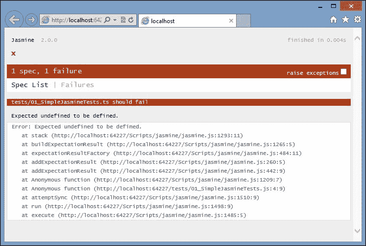
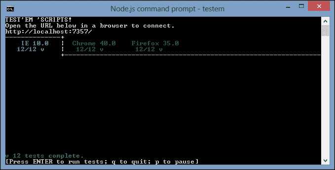
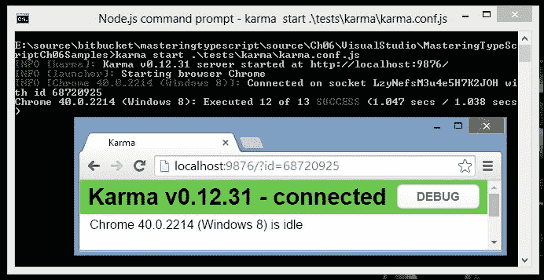
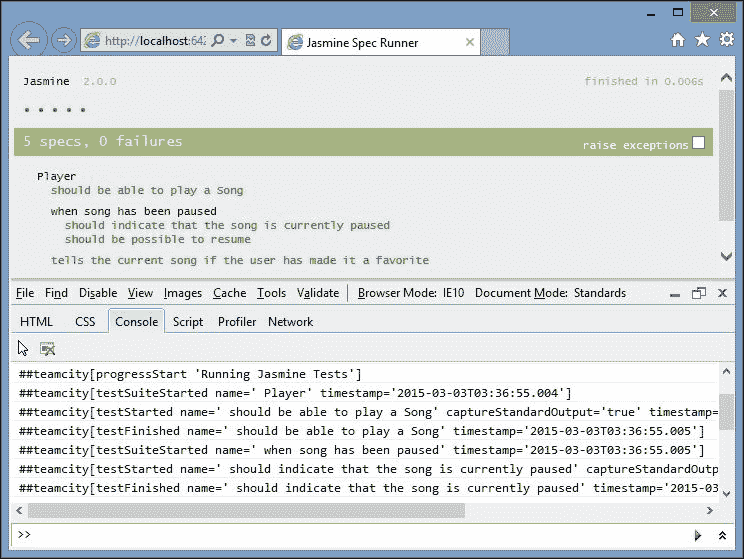
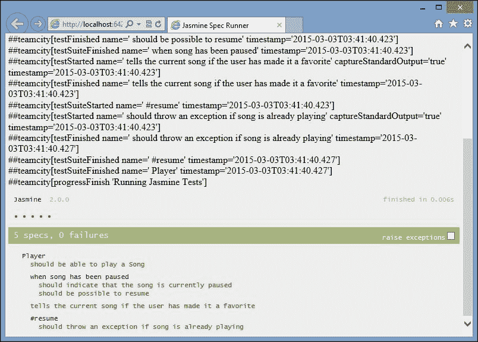
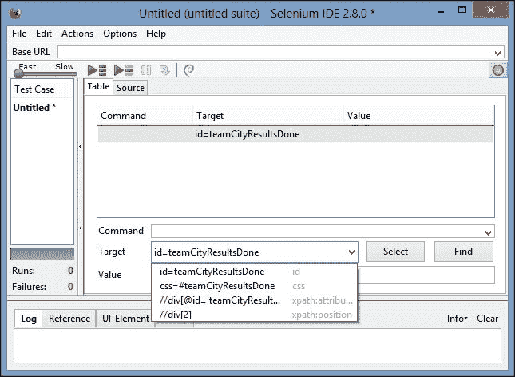
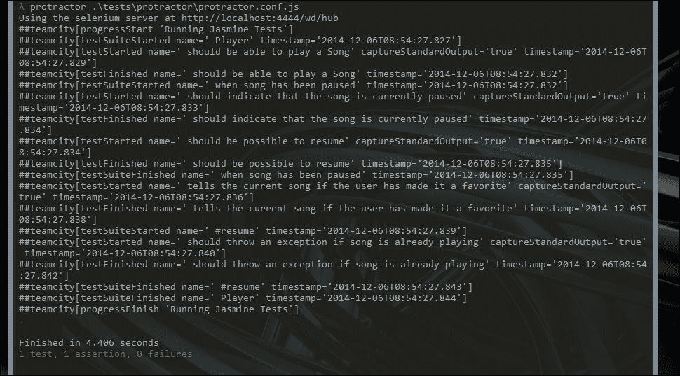

# 第六章。测试驱动开发

在过去的几年里，**模型视图控制器** ( **MVC** )、**模型视图演示者** ( **MVP** )和 **模型视图模型** ( **MVVM** )模式的流行催生了一系列第三方 JavaScript 库，每个库都实现了自己版本的这些模式。例如，主干可以被描述为一个 MVP 实现，其中视图充当演示者。ExtJS 4 在他们的框架中引入了 MVC 模式，Angular 可以被描述为更像一个 MVVM 框架。当一起讨论这组模式时，它们被一些人描述为 **模型视图无论** ( **MVW** )或 **模型视图某物** ( **MV*** )。

这种 MV*风格编写应用的一些好处包括模块化和关注点分离。这种 MV*风格的构建应用也带来了巨大的优势——能够编写可测试的 JavaScript。使用 MV*可以让我们对几乎所有手工制作的精美 JavaScript 进行单元测试、集成测试和功能测试。这意味着我们可以测试我们的渲染函数，以确保 DOM 元素在页面上正确显示。我们还可以模拟按钮点击、下拉选择和动画。我们还可以将这些测试扩展到页面转换，包括登录页面和主页。通过为我们的应用构建一大组测试，我们将获得对我们的代码如预期那样工作的信心，并且它将允许我们随时重构我们的代码。

在本章中，我们将研究与类型脚本相关的测试驱动开发。我们将讨论一些更流行的测试框架，编写一些单元测试，然后讨论测试运行器和持续集成技术。

# 测试驱动开发

**测试驱动开发** ( **TDD** )是一个开发过程，或者说是一个开发范式，它从测试开始，通过这些测试推动一段生产代码的动力。测试驱动开发意味着问一个问题“我如何知道我已经解决了这个问题？”而不仅仅是“我如何解决问题？”

测试驱动方法的基本步骤如下:

*   写一个失败的测试
*   运行测试以确保失败
*   编写代码使测试通过
*   运行测试以确保它通过
*   运行所有测试，确保新代码不会破坏任何其他代码
*   重复这个过程

使用测试驱动开发实践实际上是一种思维方式。一些开发人员遵循这种方法，先编写测试，而其他人先编写代码，然后再编写测试。还有一些根本不写测试。如果你属于最后一类，那么希望你在这一章学到的技术能帮助你朝着正确的方向开始。

不写单元测试有很多借口。一些典型的借口包括“测试框架不在我们的原始报价中”，或者“它会增加 20%的开发时间”，或者“测试已经过时，所以我们不再运行它们”。然而，事实是，在这个时代，我们不能不写测试。应用的规模和复杂性不断增长，需求也随着时间而变化。拥有一套好的测试的应用可以被修改得更快，并且比没有测试的应用更能适应未来的需求变化。这就是单元测试真正节约成本的时候。通过为您的应用编写单元测试，您可以对它进行未来验证，并确保对代码库的任何更改都不会破坏现有的功能。

JavaScript 空间中的 TDD 为我们的代码覆盖增加了另一层。通常，开发团队会编写只针对应用服务器端逻辑的测试。例如，在 Visual Studio 空间中，这些测试通常只针对控制器、视图和底层业务逻辑的 MVC 框架。测试应用的客户端逻辑总是相当困难的——换句话说，实际呈现的 HTML 和基于用户的交互。

JavaScript 测试框架为我们提供了填补这一空白的工具。我们现在可以开始单元测试我们渲染的 HTML，以及模拟用户交互，比如填写表单和点击按钮。这一额外的测试层与服务器端测试相结合，意味着我们有办法对应用的每一层进行单元测试——从服务器端业务逻辑，到服务器端页面呈现，一直到呈现和用户交互。单元测试前端用户交互的能力是任何 JavaScript MV*框架的最大优势之一。事实上，它甚至会影响您在选择技术堆栈时做出的架构决策。

# 单元、集成和验收测试

自动化测试可以分为三个一般领域，或者测试类型——单元测试、集成测试和验收测试。我们也可以将这些测试描述为黑盒测试或白盒测试。白盒测试是测试者知道被测代码的内部逻辑或结构的测试。另一方面，黑盒测试是测试人员不知道内部设计和或逻辑的测试。

## 单元测试

单元测试通常是白盒测试，其中代码块的所有外部接口都被模仿或剔除。例如，如果我们正在测试一些执行异步调用来加载一个 JSON 块的代码，那么单元测试这些代码将需要模仿返回的 JSON。这种技术确保被测对象总是给定一组已知的数据。当新的需求出现时，这些已知的数据当然会增长和扩展。被测试的对象应该被设计成与接口交互，这样那些接口就可以在单元测试场景中很容易地被模仿或剔除。

## 整合测试

集成测试是白盒测试的另一种形式，它允许被测对象在接近真实代码的环境中运行。在我们前面的例子中，当一些代码进行异步调用来加载一个 JSON 块时，集成测试将需要实际调用生成 JSON 的**表示状态转移** ( **REST** )服务。如果这个 REST 服务依赖于来自数据库的数据，那么集成测试将需要数据库中与集成测试场景相匹配的数据。如果我们将一个单元测试描述为在被测试的对象周围有一个边界，那么集成测试只是这个边界的一个扩展，包括依赖的对象或服务。

为应用构建自动化集成测试将极大地提高应用的质量。考虑我们一直在使用的场景中的情况——一段代码为一些 JSON 数据调用一个 REST 服务。有人可以很容易地改变 REST 服务返回的 JSON 数据的结构。我们的单元测试仍然会通过，因为它们实际上并没有调用 REST 服务器端代码，但是我们的应用将会崩溃，因为返回的 JSON 并不是我们所期望的。

如果没有集成测试，这些类型的错误只会在手动测试的后期阶段出现。考虑集成测试，为集成测试实现特定的数据集，并将它们构建到您的测试套件中，将会尽早消除这些错误。

## 验收测试

验收测试是黑盒测试，通常基于场景。为了通过，它们可以包含多个用户屏幕或用户交互。这些测试通常也由测试团队执行，因为它可能需要登录应用，搜索特定的数据集，更新数据，等等。通过一些计划，我们还可以将这些验收测试的一部分自动化到一个集成套件中，因为我们能够在 JavaScript 中找到并点击按钮，将数据插入必填字段，或者选择下拉项目。一个项目的验收测试越多，它就越健壮。

### 注

在测试驱动开发方法中，手工测试团队发现的每个错误都必须导致新单元、集成或验收测试的创建。这种方法将有助于确保一旦发现并修复了错误，它就不会再出现。

# 使用连续积分

当为任何应用编写单元测试时，设置一个构建服务器并作为每个源代码管理签入的一部分运行测试很快变得很重要。当您的开发团队发展到超过单一开发人员时，使用**持续集成** ( **CI** )构建服务器变得势在必行。该构建服务器将确保提交给源代码管理服务器的任何代码都通过所有已知的单元测试、集成测试和自动化验收测试。构建服务器还负责标记一个构建，并生成部署期间需要使用的任何部署工件。

构建服务器的基本步骤如下:

*   查看源代码的最新版本，并增加内部版本号
*   在构建服务器上编译应用
*   运行任何服务器端单元测试
*   打包应用进行部署
*   将包部署到构建环境中
*   运行任何服务器端集成测试
*   运行任何 JavaScript 单元、集成和验收测试
*   将变更集和内部版本号标记为通过或失败
*   如果构建失败，通知那些负责破坏它的人

### 注

如果前面的任何一个步骤失败，生成服务器应该会失败。

## 持续整合的好处

使用构建服务器来运行前面的步骤会给任何开发团队带来巨大的好处。首先，应用是在构建服务器上编译的，这意味着使用的任何工具或外部库都需要安装在构建服务器上。这为您的开发团队提供了机会，准确记录需要在新机器上安装什么软件来编译或运行您的应用。

其次，在尝试打包步骤之前，可以运行一组标准的服务器端单元测试。在 Visual Studio 项目中，这些将是用任何流行的。NET 测试框架，如 MSTest、NUnit 或 xUnit。

接下来，运行整个应用的打包步骤。让我们假设一个开发人员在项目中包含了一个新的 JavaScript 库，但是忘记将其添加到 Visual Studio 解决方案中。在这种情况下，所有的测试都将在它们的本地计算机上运行，但是会因为缺少库文件而中断构建。如果我们在这个阶段部署站点，运行应用将导致 404 错误-找不到文件。通过运行打包步骤，可以快速找到这些类型的错误。

一旦成功完成打包步骤，构建服务器应该将站点部署到特别标记的构建环境中。此构建环境仅用于配置项构建，因此必须有自己的数据库实例、web 服务引用等，专门为配置项构建而设置。同样，实际部署到目标环境测试了部署工件和部署过程。通过为自动化包部署设置构建环境，您的团队再次能够记录部署的需求和过程。

在这个阶段，我们有一个完整的网站实例，在一个隔离的构建环境中运行。然后，我们可以轻松地将目标指向将运行我们的 JavaScript 测试的特定网页，并且还可以直接在网站的完整版本上运行集成或自动化验收测试。这样，我们可以编写针对真实网站 REST 服务的测试，而不必模拟这些集成点。实际上，我们正在从头开始测试应用。显然，我们可能需要确保我们的构建环境有一组可以用于集成测试的特定数据，或者有一种生成集成测试所需的数据集的方法。

## 选择构建服务器

有许多连续的集成构建服务器，包括团队城市、詹金斯和**团队基础服务器** ( **TFS** )。

### 团队基础服务器

TFS 需要在其“T0”构建代理上进行特定的配置，以便能够运行网络浏览器的实例。对于更大的项目，在特定的浏览器中实际运行 JavaScript 测试是有意义的，并且很快成为必需的步骤。您可能需要支持多个浏览器，并且希望在火狐、Chrome、IE、Safari 或其他浏览器中运行您的测试。TFS 还使用**Windows Workflow Foundation**(**WF**)来配置构建步骤，这需要相当多的经验和知识来修改。

### 詹金斯

Jenkins 是一个开源的、免费使用的 CI 构建服务器。它有广泛的社区使用，和许多插件。Jenkins 的安装和配置相当简单，Jenkins 将允许进程运行浏览器实例，使其与基于浏览器的 JavaScript 单元测试兼容。Jenkins 构建步骤是基于命令行的，有时需要一点常识才能正确配置构建步骤。

### 4 T0+T 团队城

一个非常流行的，非常强大的，可以自由设置的构建服务器是团队城市。如果你有少量的开发者(< 20)和少量的项目(< 20)，TeamCity 允许免费安装。一个完整的商业许可证大约只需 1500 美元，这使得它对大多数组织来说都是负担得起的。在 TeamCity 中配置构建步骤比在 Jenkins 或 TFS 要容易得多，因为它使用向导式的配置，具体取决于您正在创建的构建步骤的类型。TeamCity 还拥有一套丰富的单元测试功能，能够显示每个单元测试的图形，因此被认为是构建服务器的最佳选择。

# 单元测试框架

有很多 JavaScript 单元测试框架可用，也有一些是用 TypeScript 编写的。最流行的两个 JavaScript 框架是Jasmine([http://jasmine.github.io/](http://jasmine.github.io/))和QUnit([http://qunitjs.com/](http://qunitjs.com/))。如果您正在编写 Node TypeScript 代码，那么您可能想看一看摩卡([https://github.com/mochajs/mocha/wiki](https://github.com/mochajs/mocha/wiki))。

两个基于 TypeScript 的测试框架是MaxUnit([https://github.com/KnowledgeLakegithub/MaxUnit](https://github.com/KnowledgeLakegithub/MaxUnit))和tsuit([https://github.com/Steve-Fenton/tsUnit](https://github.com/Steve-Fenton/tsUnit))。不幸的是，MaxUnit 和 tsUnit 都是这个领域的新手，因此可能不具备旧的、更流行的框架所固有的特性。例如，MaxUnit 在编写本文时没有任何文档，并且 tsUnit 没有与 CI 构建服务器兼容的测试报告框架。随着时间的推移，这些 TypeScript 框架可能会增长，但是看到使用第三方库和使用 DefinitelyTyped 声明文件是多么容易，为 QUnit 或 Jasmine 编写单元测试就变成了一个非常简单的过程。

在本章的剩余部分，我们将使用 Jasmine 2.0 作为我们的测试框架。

# 茉莉

对于章节的这一部分，我们将创建一个新的基于 MVC 框架项目类型的 Visual Studio 项目。目前，我们可以只使用空的 MVC 模板。

Jasmine 可以通过以下两个 NuGet 包安装到我们新的 TypeScript 项目中:

```js
Install-Package JasmineTest

Install-Package jasmine.TypeScript.DefinitelyTyped

```

有了这两个包，我们就有了开始编写 Jasmine 测试所需的 JavaScript 库和 TypeScript 定义文件。

### 注

从 NuGet 到`JasmineTest`的默认安装使用 ASP.NET MVC 框架，并在`Controllers`目录中创建一个`JasmineController`。如果您没有使用 MVC 框架，或者正在节点环境中安装这个包，那么这个`JasmineController`应该被删除，因为它会导致编译错误。在本章的后面，我们将展示如何针对这个`JasmineController`运行集成测试，所以最好暂时保留它。

## 一个简单的茉莉测试

Jasmine 使用简单的格式来编写测试。考虑以下类型脚本代码:

```js
describe("tests/01_SimpleJasmineTests.ts ", () => {
    it("should fail", () => {
        var undefinedValue;
        expect(undefinedValue).toBeDefined();
    });
});
```

这个片段从一个名为`describe`的 Jasmine 函数开始，该函数接受两个参数。第一个参数是测试套件的名称，第二个参数是包含我们的测试套件的匿名函数。下一行使用名为`it`的 Jasmine 函数，该函数也接受两个参数。第一个参数是测试名称，第二个参数是包含我们测试的匿名函数；换句话说，`it`匿名函数中的任何东西都是我们的实际测试。这个测试从定义一个名为`undefinedValue`的变量开始，但实际上并没有设置它的值。接下来，我们使用茉莉功能`expect`。仅仅通过阅读这个`expect`语句的代码，我们就可以快速理解单元测试在做什么。期望定义`undefinedValue`变量的值，即不是`undefined`。

`expect`函数接受一个参数，并返回一个 Jasmine 匹配器。然后，我们可以调用任意一个 Jasmine 匹配器函数，根据匹配器函数评估传递到`expect`中的值。`expect`关键字类似于其他测试库中的`Assert`关键字。`expect`声明的格式是人类可读的，使得茉莉期望相对简单易懂。

## Jasmine SpecRunner.html 文件

为了运行这个测试，我们将需要一个包含所有相关 Jasmine 第三方库的 HTML 页面，以及我们的测试 JavaScript 文件。我们可以创建一个`SpecRunner.html`文件，其中包含以下 HTML:

```js
<!DOCTYPE html>
<html >
    <head>
        <title>Jasmine Spec Runner</title>
        <link rel="shortcut icon" type="img/png" href="/Content/jasmine/jasmine_favicon.png">
        <link rel="stylesheet" type="text/css" href="/Content/jasmine/jasmine.css">
        <script type="text/javascript" src="/Scripts/jasmine/jasmine.js"></script>
        <script type="text/javascript" src="/Scripts/jasmine/jasmine-html.js"></script>
        <script type="text/javascript" src="/Scripts/jasmine/boot.js"></script>
        <script type="text/javascript" src="/tests/01_SimpleJasmineTests.js"></script>

    </head>
<body>

</body>
</html>
```

这个 HTML 页面只是包含了所需的 Jasmine 文件、`jasmine.css`、`jasmine.js`、`jasmine-html.js`和`boot.js`。最后一行包括我们的 TypeScript 测试文件中编译的 JavaScript 文件。

如果我们在 Visual Studio 中将这个页面设置为我们的启动页面并运行它，我们应该会看到一个失败的单元测试:



显示茉莉输出的 SpecRunner.html 页面

太棒了！我们遵循测试驱动的开发过程，首先创建一个失败的单元测试。结果正是我们所期望的。我们的变量`undefinedVariable`还没有赋值，因此将是`undefined`。如果我们遵循TDD 过程的下一步，我们应该编写使测试通过的代码。如下更新我们的测试将确保测试通过:

```js
describe("tests/01_SimpleJasmineTests.ts ", () => {
    it("value that has been assigned should be defined", () => {
        var undefinedValue = "test";
        expect(undefinedValue).toBeDefined();
    });
});
```

注意，我们已经更新了我们的测试名称来描述测试试图完成的内容。为了通过测试，我们只需将值`"test"`赋给我们的`undefinedValue`变量。现在运行`SpecRunner.html`页面将显示通过测试。

## 参赛者

Jasmine 有各种各样的匹配器可以在测试中使用，也允许我们编写和包含定制的匹配器。Jasmine matchers 的语法非常简单明了，从下面的 TypeScript 代码中可以看出:

```js
    var undefValue;
    expect(undefValue).not.toBeDefined();
```

这里，我们使用`.not.`匹配器语法来检查变量`undefValue`是否确实是`undefined`。

```js
    var definedValue = 2;
    expect(definedValue).not.toBe(null);
```

这个`expect`语句使用`not.toBe`匹配器来确保`definedValue`变量不是`null`。

```js
    expect(definedValue).toBe(2);
```

这里，我们使用`.toBe`匹配器来检查`definedValue`实际上是一个值为 2 的数字。

```js
    expect(definedValue.toString()).toEqual("2");
```

这个`expect`语句是使用`toEqual`匹配器来确保`toString`函数将返回`"2"`的字符串值。

```js
    var trueValue = true;
    expect(trueValue).toBeTruthy();
    expect(trueValue).not.toBeFalsy();
```

这里，我们使用`toBeTruthy`和`toBeFalsy`匹配器测试`boolean`值。

```js
    var stringValue = "this is a string";
    expect(stringValue).toContain("is");
    expect(stringValue).not.toContain("test");
```

最后，我们还可以使用`toContain`匹配器解析一个字符串，并测试它是否包含另一个字符串——或者使用带有`toContain`的`.not.`匹配器进行反向测试。

一定要去 Jasmine 网站获取匹配器的完整列表，以及关于编写自己的定制匹配器的详细信息。

## 测试启动和拆卸

与其他测试框架一样，Jasmine 提供了一种机制来定义将在每次测试之前和之后运行的函数，或者作为测试启动和拆卸机制。在 Jasmine 中，`beforeEach`和`afterEach`函数充当测试启动和拆卸函数，从下面的 TypeScript 代码可以看出:

```js
describe("beforeEach and afterEach tests", () => {
    var myString;

    beforeEach(() => {
        myString = "this is a test string";
    });
    afterEach(() => {
        expect(myString).toBeUndefined();
    });

    it("should find then clear the myString variable", () => {
        expect(myString).toEqual("this is a test string");
        myString = undefined;
    });

});
```

在这个测试中，我们在匿名函数的开始定义了一个名为`myString`的变量。正如我们从 JavaScript 词法范围规则中所知道的，这个`myString`变量可以在下面的每个`beforeEach`、`afterEach`和`it`函数中使用。在`beforeEach`函数中，该变量被设置为字符串值。在`afterEach`功能中，对变量进行测试，看其是否已重置为`undefined`。我们在测试检查中的期望是该变量已经通过`beforeEach`功能进行了设置。在测试结束时，我们将变量重置为`undefined`。请注意，`afterEach`函数也在调用一个`expect`—在这种情况下是为了确保测试已经将变量重置回`undefined`。

### 注

Jasmine 2.1 版本引入了第二个版本的设置和拆卸，称为`beforeAll`和`afterAll`。然而，在撰写本书时，NuGet 提供的`jasmine.js`和`jasmine.d.ts`文件的版本还没有更新到 2.1 版。

## 数据驱动测试

为了展示 Jasmine 测试库的可扩展性，JP Castro 编写了一个非常简短但功能强大的实用程序，在 Jasmine 中提供数据驱动的测试。他关于这个话题的博客可以在这里找到([http://blog . jphpsf . com/2012/08/30/drying-up-your-JavaScript-jasmine-tests/](http://blog.jphpsf.com/2012/08/30/drying-up-your-javascript-jasmine-tests/))，GitHub 资源库可以在这里找到([https://github.com/jphpsf/jasmine-data-provider](https://github.com/jphpsf/jasmine-data-provider))。这个简单的扩展允许我们编写直观的 Jasmine 测试，将一个参数作为每个测试的一部分，如下所示:

```js
describe("data driven tests", () => {
    using<string>("valid values", [
        "first string",
        "second string",
        "third string"
    ], (value) => {
        it("should contain string (" + value + ")", () => {
            expect(value).toContain("string");
        });
    });
});
```

这里，我们将我们的`it`测试函数包装在另一个名为`using`的函数中。这个`using`函数接受三个参数:值集的字符串描述、值数组和函数定义。最后一个函数定义使用变量`value`，并将使用该值调用我们的测试。请注意，在调用我们的测试时，我们正在动态更改测试名称，以包括传入的`value`参数。这在中是必要的，以便每个测试具有唯一的测试名称。

前面的解决方案只需要 JP Castro 的 Jasmine 扩展，如下面的 JavaScript 代码所示:

```js
function using(name, values, func) {
    for (var i = 0, count = values.length; i < count; i++) {
        if (Object.prototype.toString.call(values[i]) !== '[object Array]') 
        {
            values[i] = [values[i]];
        }
        func.apply(this, values[i]);
    }
}
```

这是一个非常简单的名为`using`的函数，取我们前面提到的三个参数。该函数对数组值进行简单的循环，并将每个数组值传递给我们的测试。

我们需要的最后一项是前面`using`函数的一个 TypeScript 定义文件。这是一个非常简单的函数声明，如下所示:

```js
declare function using<T>(
    name: string,
    values : T [],
    func : (T) => void
);
```

这个 TypeScript 声明使用泛型语法`<T>`来确保第二个和第三个参数使用相同的类型。有了这个声明和 JavaScript `using`函数，我们的代码将正确编译，测试将针对数据数组中的每个值运行一次:

```js
data driven tests

should contain string (first string)

should contain string (second string)

should contain string (third string)

```

## 利用间谍

Jasmine 还有一个非常强大的特性，允许您的测试查看是否调用了某个特定的函数，以及用什么参数调用的。它也可以用来创建模拟和存根。所有这些功能都被贾斯敏称为间谍。

考虑以下测试:

```js
class MySpiedClass {
    testFunction(arg1: string) {
        console.log(arg1);
    }
}
describe("simple spy", () => {
    it("should register a function call", () => {
        var classInstance = new MySpiedClass();
        spyOn(classInstance, 'testFunction');

        classInstance.testFunction("test");

        expect(classInstance.testFunction).toHaveBeenCalled();
    });
});
```

我们从一个名为`MySpiedClass`的简单类开始，它有一个单一的函数`testFunction`。该函数接受一个参数，并将该参数记录到控制台。

我们的测试从创建`MySpiedClass`的新实例开始，并将其分配给名为`classIntance`的变量。然后我们创建一个 Jasmine 来监视`classInstance`变量的函数`testFunction`。一旦我们创建了一个间谍，我们就可以调用这个函数。然后，我们的期望检查该函数是否被调用。这就是间谍的本质。茉莉会“观察”一下`MySpiedClass`实例的`testFunction`功能，看看它是否被调用过。

### 注

默认情况下，Jasmine 间谍会阻止对底层函数的调用。换句话说，它们用一个 Jasmine 委托替换您试图调用的函数。如果您需要监视一个函数，但仍然需要该函数的主体来执行，则必须使用`.and.callThrough()`流畅的语法来指定该行为。

虽然这是一个非常微不足道的例子，但间谍在许多不同的测试场景中变得非常强大。例如，接受回调参数的类或函数需要一个间谍来确保回调函数被调用。

让我们看看如何测试回调函数是否被正确调用。考虑以下类型脚本代码:

```js
class CallbackClass {
    doCallBack(id: number, callback: (result: string) => void ) {
        var callbackValue = "id:" + id.toString();
        callback(callbackValue);
    }
}

class DoCallBack {
    logValue(value: string) {
        console.log(value);
    }
}
```

在这段代码中，我们定义了一个名为`CallbackClass`的类，它有一个函数`doCallback`。这个`doCallback`函数接受一个`number`类型的`id`参数，还有一个`callback`函数。`callback`函数以一个`string`为自变量，返回`void`。

我们定义的第二类有一个名为`logValue`的函数。该函数签名与`doCallback`函数所需的回调函数签名相匹配。使用茉莉间谍，我们可以测试`doCallBack`功能的逻辑。这个逻辑基于传入的`id`参数创建一个字符串，然后用这个字符串调用`callback`函数。我们的测试需要确保该字符串的格式正确。因此，我们的茉莉测试可以写成如下:

```js
describe("using callback spies", () => {
    it("should execute callback with the correct string value", () => {
        var doCallback = new DoCallBack();
        var classUnderTest = new CallbackClass();

        spyOn(doCallback, 'logValue');
        classUnderTest.doCallBack(1, doCallback.logValue);

        expect(callbackSpy.logValue).toHaveBeenCalled();
        expect(callbackSpy.logValue).toHaveBeenCalledWith("id:1");

    });
});
```

这个测试代码首先创建类`CallbackClass`的一个实例，以及类`DoCallBack`的一个实例。然后我们创建一个`DoCallBack`类的`logValue`功能的间谍。然后我们调用`doCallback`函数，传入一个值`1`作为第一个参数，`logValue`函数作为第二个参数。我们最后两行的`expect`语句检查回调函数`logValue`是否被实际调用，以及它是用什么参数调用的。

## 用间谍当假货

茉莉间谍的另一个好处是可以充当假货。换句话说，不是调用真正的函数，而是将调用委托给 Jasmine 间谍。Jasmine 还允许间谍返回值——这在生成小的嘲讽框架时非常有用。考虑以下测试:

```js
Class ClassToFake {
    getValue(): number {
        return 2;
    }
}
describe("using fakes", () => {
    it("calls fake instead of real function", () => {
        var classToFake = new ClassToFake();
        spyOn(classToFake, 'getValue')
            .and.callFake( () => { return 5; }
            );
        expect(classToFake.getValue()).toBe(5);
    });
});
```

我们从一个名为`ClassToFake`的类开始，它有一个返回`2`的函数`getValue`。然后，我们的测试创建了这个类的一个实例。然后我们调用 Jasmine `spyOn`函数创建一个对`getValue`函数的窥探，然后使用`.and.callFake`语法附加一个匿名函数作为假函数。这个假功能将返回`5`而不是原来返回`2`的`getValue`功能。然后测试检查当我们在`ClassToFake`实例上调用`getValue`函数时，Jasmine 会用我们新的假函数代替原来的`getValue`函数，并返回`5`而不是`2`。

Jasmine 伪造语法有许多变体，包括抛出错误或返回值的方法——同样，请参考 Jasmine 文档以获得其伪造能力的完整列表。

## 异步测试

JavaScript 的异步特性——由 AJAX 和 jQuery 流行起来——一直是该语言的特色之一，也是基于节点的应用背后的主要架构。让我们快速看一下异步类，然后描述我们应该如何测试它。考虑以下类型脚本代码:

```js
class MockAsyncClass {
    executeSlowFunction(success: (value: string) => void) {
        setTimeout(() => {
            success("success");
        }, 1000);
    }
}
```

`MockAsyncClass`有一个名为`executeSlowFunction`的函数，它接受一个名为`success`的函数回调。在`executeSlowFunction`代码中，我们使用`setTimeout`函数模拟异步调用，并且只在`1000`毫秒(1 秒)后调用成功回调。这个行为模拟了一个标准的 AJAX 调用(使用`success`和`error`回调)，这可能需要几秒钟才能返回——这取决于后端服务器的速度或数据包的大小。

我们对此`executeSlowFunction`的测试可能如下:

```js
describe("asynchronous tests", () => {
    it("failing test", () => {

        var mockAsync = new MockAsyncClass();
        var returnedValue;
        mockAsync.executeSlowFunction((value: string) => {
            returnedValue = value;
        });
        expect(returnedValue).toEqual("success");
    });

});
```

首先，我们实例化`MockAsyncClass`的一个实例，并定义一个名为`returnedValue`的变量。然后我们用一个匿名函数为`success`回调函数调用`executeSlowFunction`。这个匿名函数将`returnedValue`的值设置为从`MockAsyncClass`传入的任何值。我们的期望是`returnedValue`应该等于`"success"`。但是，如果我们现在运行此测试，我们的测试将失败，并显示以下错误消息:

```js
Expected undefined to equal 'success'.

```

这里发生的事情，是因为`executeSlowFunction`是异步的，JavaScript 不会等到回调函数被调用，才执行下一行代码。这意味着期望在`executeSlowFunction`有机会调用我们的匿名回调函数(设置`returnedValue`的值)之前被调用。如果在`expect(returnValue).toEqual("success")`行放一个断点，在`returnedValue = value`行放另一个断点，会看到 expect 行先被调用，`returnedValue`行只在一秒钟后被调用。这个时间问题是导致测试失败的原因。我们需要以某种方式让我们的测试等待`executeSlowFunction`调用回调，然后再执行我们的期望。

## 使用 done()函数

Jasmine 版本引入了一种新的语法来帮助我们进行这些类异步测试。在任何`beforeEach`、`afterEach`或`it`函数中，我们传递一个名为`done`的参数，它是一个函数，然后在异步代码的末尾调用它。考虑以下测试:

```js
describe("asynch tests with done", () => {
    var returnedValue;

    beforeEach((done) => {
        returnedValue = "no_return_value";
        var mockAsync = new MockAsyncClass();
        mockAsync.executeSlowFunction((value: string) => {
            returnedValue = value;
            done();
        });
    });

    it("should return success after 1 second", (done) => {
        expect(returnedValue).toEqual("success");
        done();
    });
});
```

首先，我们将`returnedValue`变量移到了测试之外，并在实际测试之前包含了一个`beforeEach`函数。该`beforeEach`功能首先重置`returnValue`的值，然后设置`MockAsyncClass`实例。最后它在这个实例上调用`executeSlowFunction`。

注意`beforeEach`函数如何取一个名为`done`的参数，然后在`returnedValue = value`行被调用后调用这个`done`函数。还要注意的是，`it`函数的第二个参数现在也采用了一个`done`参数，并在测试完成时调用这个`done`函数。

### 注

从 Jasmine 文档来看:在调用`beforeEach`时调用`done`函数之前，规范不会开始，在调用`done`函数之前，规范不会完成。默认情况下，茉莉会等待 5 秒钟，然后导致超时失败。这可以使用`jasmine.DEFAULT_TIMEOUT_INTERVAL`变量来覆盖。

## 茉莉灯具

很多时候，我们的代码要么负责读入，要么在大多数情况下负责操纵 JavaScript 中的 DOM 元素。这意味着，如果底层 HTML 不包含正确的元素或元素组，任何依赖于 DOM 元素的运行代码都可能失败。另一个名为`jasmine-jquery`的 Jasmine 扩展库允许我们在测试执行之前将 HTML 元素注入到 DOM 中，并且在测试运行之后将它们从 DOM 中移除。

在写这本书的时候，这个库在 NuGet 上是没有的，所以我们需要用传统的方式下载`jasmine-jquery.js`文件，并将其包含在我们的项目中。但是，TypeScript 定义文件可在 NuGet 上获得:

```js
Install-package Jasmine-jquery.TypeScript.DefinitelyTyped

```

### 注

我们还需要更新`.html`文件，以便在头文件部分包含`jquery.js`和`jasmine-jquery.js`文件。

我们来看一个使用`jasmine-jquery`库注入 DOM 元素的测试。首先，一个操纵特定 DOM 元素的类:

```js
Class ModifyDomElement {
    setHtml() {
        var elem = $("#my_div");
        elem.html("<p>Hello world</p>");
    }
}
```

这个`ModifyDomElement`类有一个名为`setHtml`的函数，它使用 jQuery 来查找一个 id 为`my_div`的 DOM 元素。然后这个 div 的 HTML 被设置为一个简单的`"Hello world"`段落。现在进行茉莉测试:

```js
describe("fixture tests", () => {
    it("modifies dom element", () => {
        setFixtures("<div id='my_div'></div>");
        var modifyDom = new ModifyDomElement();
        modifyDom.setHtml();
        var modifiedElement = $("#my_div");
        expect(modifiedElement.length).toBeGreaterThan(0);
        expect(modifiedElement.html()).toContain("Hello");
    });
});
```

测试从调用`jasmine-jquery`功能`setFixtures`开始。这个函数将把作为第一个字符串参数提供的 HTML 直接注入到 DOM 中。然后我们创建一个`ModifyDomElement`类的实例，并调用`setHtml`函数来修改`my_div`元素。然后我们将变量`modifiedElement`设置为 DOM 中的 jQuery 搜索结果。如果 jQuery 已经找到了元素，那么它的`length`属性将是`> 0`，然后我们可以检查一下，看看实际上是否修改了 HTML。

### 注

`jasmine-jquery`提供的夹具方法也允许从磁盘加载原始的 HTML 文件，而不必写出冗长的 HTML 字符串表示。如果您的 MV*框架使用 HTML 文件片段，这也特别有用。`jasmine-jquery`库也有从磁盘加载 JSON 的实用程序，以及与 jQuery 一起工作的专用构建匹配器。请务必查看位于([https://github.com/velesin/jasmine-jquery](https://github.com/velesin/jasmine-jquery)的文档。

## DOM 事件

图书馆还增加了一些茉莉间谍来帮助处理 DOM 事件。如果我们正在创建一个按钮，无论是在 TypeScript 代码中还是在 HTML 中，我们都可以确保我们的代码正确响应 DOM 事件，比如`click`。考虑以下代码和测试:

```js
Function handle_my_click_div_clicked() {
    // do nothing at this time
}
describe("click event tests", () => {
    it("spies on click event element", () => {
        setFixtures("<div id='my_click_div' "+"onclick='handle_my_click_div_clicked'>Click Here</div>");

        var clickEventSpy = spyOnEvent("#my_click_div", "click");

        $('#my_click_div').click();
        expect(clickEventSpy).toHaveBeenTriggered();
    });
});
```

首先，我们定义了一个名为`handle_my_click_div_clicked`的虚拟函数，它在夹具 HTML 中使用。仔细查看一下`setFixtures`函数调用中使用的 HTML，我们正在创建一个 id 为`my_click_div`的按钮和一个`onclick` DOM 事件，它将调用我们的虚拟函数。然后我们为`my_click_div` div 创建一个点击事件的间谍，并在下一行实际调用点击事件。我们的期望是使用`jasmine-jquery`匹配器`toHaveBeenTriggered`来测试是否调用了`onclick`处理程序。

### 注

jQuery 和 DOM 操作为我们提供了一种填写表单的方式，点击**提交**、**取消**、**确定**按钮，一般模拟用户与我们的应用交互。使用这些技术，我们可以很容易地在 Jasmine 中编写完全验收或用户验收测试——进一步巩固我们的应用，防止错误和变更。

# 茉莉跑者

有很多方法可以在实际的网页之外运行 Jasmine 测试，就像我们一直在做的那样直到这个点。但是，请记住，除了使用 Internet Explorer 直接运行网页之外，Visual Studio 不支持调试 TypeScript。在这些情况下，您需要恢复到目标浏览器中可用的现有开发工具。

大多数测试运行人员依赖一个简单的静态 HTML 页面来包含所有测试，并且会启动一个 web 服务器的小实例，以便将这个 HTML 页面提供给测试运行人员。有些测试运行人员为此使用配置文件，构建一个完全不需要 HTML 的测试环境。这对于单元测试来说可能是非常好的，在单元测试中，代码的集成点会被嘲笑或剔除，但是这种方法对于集成或验收测试来说效果并不好。

例如，许多现实世界的网络应用通过一些服务器端业务逻辑来为每个网络请求生成 HTML。例如，身份验证逻辑可以将用户重定向到登录页面，然后在后续页面请求或 RESTful 数据请求中使用基于表单的身份验证 cookie。在这种情况下，在实际的 web 应用之外运行一个简单的 HTML 页面是行不通的。您需要在一个页面中运行您的测试，该页面实际上是与 web 应用的其余部分一起托管的。此外，如果您试图向现有的 web 项目添加一个 JavaScript 测试套件，这个逻辑可能不容易被搁置。

由于这些原因，我们一直专注于在我们的网络应用中使用标准的 HTML 页面来运行我们的测试。例如，在一个 MVC 应用中，我们将设置一个 Jasmine 控制器，带有一个返回`SpecRunner.cshtml`视图页面的`Run`函数。事实上，NuGet 软件包`JasmineTest`的默认安装会在安装时将这些控制器和视图设置为标准模板。

## 测试

Testem 是一个基于 Node 的命令行实用程序，当它检测到 JavaScript 文件被修改时，它将针对连接的浏览器持续运行测试套件。Testem 对于许多浏览器的快速反馈非常有用，并且还有一个连续的集成标志，可以在构建服务器上使用。Testem 适用于单元测试。更多信息可以在 GitHub 资源库([https://github.com/airportyh/testem](https://github.com/airportyh/testem))找到。

可以使用以下命令通过节点安装测试:

```js
Npm install –g testem

```

要运行`testem`，只需在命令行窗口中导航到您的测试套件的根文件夹，然后键入`testem`。Testem 将启动，启动一个网络服务器，并邀请您通过浏览器连接到它。在下面的截图中，Testem 正在`http://localhost:7357`运行。您可以将许多不同的浏览器连接到这个网址，Testem 将针对每个浏览器运行它找到的规范。默认情况下，Testem 将在当前目录中搜索包含测试的 JavaScript 文件，构建一个包含这些测试的 HTML 页面并执行它们。如果您已经有一个包含您的测试的 HTML 页面，那么这个页面可以通过`testem.yml`配置文件指定给 Testem，如下所示:

```js
{
    "test_page":"tests/01_SpecRunner.html"
}
```

这个 HTML 页面还需要包含 testem.js 文件，以便能够与 testem 服务器进行通信。



Testem 输出显示三个连接的浏览器

Testem 有许多强大的配置选项，可以在配置文件中指定。请务必前往 GitHub 存储库了解更多信息。

请注意，Testem 不能与 ASP.NET MVC 控制器路由一起工作，这使得它不适合在 ASP.NET MVC 站点上进行集成测试。如果您使用 MVC 控制器和视图来生成您的测试套件，例如，您运行的测试页面的网址是`/Jasmine/Run`—Testem 将不起作用。

## 因果报应

Karma 是由 Angular 团队构建的一个测试运行程序，在 Angular 教程中有大量的功能。它只是一个单元测试框架，Angular 团队建议通过量角器构建和运行端到端或集成测试。Karma 和 Testem 一样，为了提供测试套件所需的页面和工件，运行自己的网络服务器实例，并且有大量的配置选项。它也可以用于不以 Angular 为目标的单元测试。要安装 Karma 与 Jasmine 2.0 配合使用，我们需要使用`npm`安装几个包:

```js
Npm install karma-jasmine@2_0 –save-dev

Npm install jasmine-core –save-dev

Npm install karma-chrome-launcher

Npm install karma-jasmine-jquery

```

要运行因果报应，我们首先需要一个配置文件。按照惯例，这一般称为`karma.conf.js`。配置文件示例如下:

```js
module.exports = function (config) {
    config.set({
        basePath: '../../',
        files: [
          'Scripts/underscore.js',
          'Scripts/jquery-1.8.0.js',
          'Scripts/jasmine-jquery/jasmine-jquery.js',
          'Scripts/jasmine-data-provider/SpecHelper.js',
          'tests/*.js'
        ],
        autoWatch: true,
        frameworks: ['jasmine'],
        browsers: ['Chrome'],
        plugins: [
                'karma-chrome-launcher',
                'karma-jasmine'
        ],

        junitReporter: {
            outputFile: 'test_out/unit.xml',
            suite: 'unit'
        }
    });
};
```

所有对因果报应的配置都必须通过`module.exports`和`config.set`约定传递，如前两行所示。`basePath`参数指定了 web 项目的根路径，并且与`karma.config.js`文件所在的目录相关。`files`数组包含要包含在生成的 HTML 文件中的文件列表，并且可以使用`\**\*.js`匹配算法加载 JavaScript 文件的整个目录和子目录。`autoWatch`参数保持 karma 在后台运行，观察文件的变化，方式类似于 Testem。Karma 也允许指定多种浏览器——每种浏览器都有自己的启动器插件。最后，`junitReporter`在这个例子中被用来向詹金斯竞争情报服务器报告测试。一旦配置文件到位，只需按如下方式运行 karma start:

```js
karma start <path to karma.config.js>.

```



一个简单测试的因果报应输出

## 量角器

量角器是一个基于节点的测试运行器，处理端到端的测试。它最初是为 Angular 应用设计的，但可以用于任何网站。与 Testem 和 Karma 不同的是，量角器能够浏览到一个特定的页面，然后从 JavaScript 中与该页面进行交互——这使得它适合于进行集成测试。它可以检查页面标题等元数据属性，或者填写表单并点击按钮，并允许后端服务器重定向到不同的页面。量角器文件可以在这里找到([https://github.com/angular/protractor](https://github.com/angular/protractor))，可以用`npm`安装:

```js
Npm install –g protractor

```

稍后我们将开始运行量角器，但是首先，让我们讨论量角器用来自动化网页的引擎。

### 使用硒

硒是网络浏览器的驱动力。它允许对网络浏览器进行编程式远程控制，并可用于在 Java、C#、Python、Ruby、PHP、Perl 甚至 JavaScript 中创建自动化测试。量角器在外壳下使用硒来控制网络浏览器实例。要安装与量角器一起使用的硒服务器，请运行以下命令:

```js
Webdriver-manager update

```

要启动硒服务器，请运行以下命令:

```js
Webdriver-manager start

```

如果一切顺利，Selenium 将报告服务器已经启动，并将详细说明 Selenium 服务器的地址。检查您的输出中是否有类似于以下内容的行:

```js
RemoteWebDriver instances should connect to: http://127.0.0.1:4444/wd/hub

```

### 注

您将需要在您的机器上安装 Java 来运行硒服务器，因为网络驱动程序管理器脚本使用 Java 来启动硒服务器。

一旦服务器运行，我们将需要一个包含一些设置的量角器(命名为`protractor.conf.js`)的配置文件。在这个阶段，我们所需要的是以下内容:

```js
exports.config = {
    seleniumAddress: 'http://localhost:4444/wd/hub',
    specs: ['*.js']
}
```

如前所述，这些量角器设置只是将`seleniumAddress`设置为硒服务器的地址。我们还有一个`specs`属性，它被设置为在与`protractor.conf.js`相同的目录中查找任何`.js`文件，并将它们视为测试规格。

现在进行最简单的测试:

```js
describe("simple protractor test", () => {
    it("should navigate to a page and find a title", () => {
        browser.driver.get('http://localhost:64227/Jasmine/Run');
        expect(browser.driver.getTitle()).toContain("Jasmine");
    });
});
```

我们的测试从`/Jasmine/Run`打开页面开始。请注意，这是一个使用默认 Jasmine 控制器的 ASP.NET MVC 路径，并返回`Views/Jasmine/SpecRunner.cshtml`。这个控制器和视图包含在我们之前安装的 Jasmine NuGet 包中。在尝试执行量角器测试之前，请确保您可以在浏览器中导航到该页面。

使用配置文件运行量角器现在将执行我们之前的测试:

```js
protractor .\tests\protractor\protractor.conf.js

```

并将产生预期的结果:

```js
Using the selenium server at http://localhost:4444/wd/hub.

Finished in 1.606 seconds

1 test, 1 assertion, 0 failures

```

### 注

为了让这个测试工作，这里必须运行两个东西:

Selenium 服务器必须在命令提示符下运行，这样`localhost:4444/wd/hub`才是有效地址，不会返回 404 错误

开发人员 ASP.NET 网站必须启动并运行，以便`localhost:64277/Jasmine/Run`击中我们的视觉工作室茉莉控制器，并呈现一个网页

# 整合测试

让我们假设我们正在使用 ASP.NET MVC 路线呈现的测试页面中进行集成测试。我们希望使用标准的 MVC 控制器、动作、视图方法来生成一个 HTML 页面，因为我们可能需要在集成测试开始之前执行一些服务器端逻辑来设置先决条件。

请注意，在现实世界的应用中，经常需要运行服务器端逻辑或使用服务器端 HTML 呈现进行集成测试。例如，在允许通过 JavaScript 调用 REST 服务之前，大多数应用都需要某种身份验证。实现 RESTful API 控制器的[授权]属性是合乎逻辑的解决方案。不幸的是，从正常的 HTML 页面调用这些 REST 控制器中的任何一个都会返回 401(未授权)错误。解决这个问题的一种方法是使用一个 MVC 控制器来服务于测试 HTML 页面，然后在服务器端代码中设置一个虚拟表单身份验证票。一旦设置好了，从这个页面对 RESTful 服务的任何调用都已经通过了虚拟用户配置文件的验证。这种技术也可以用于运行集成测试，其中用户根据其身份验证凭据具有不同的角色和不同的权限。

## 模拟集成测试

为了模拟这种集成测试页面，让我们重用用 Jasmine NuGet 包安装的`JasmineController`。如前所述，集成测试将需要触及后端服务器端逻辑(在本例中是 Jasmine MVC 控制器)，然后向浏览器呈现服务器端生成的 HTML 页面(在本例中是`SpecRunner.cshtml`视图)。这个模拟意味着我们依靠服务器端的 MVC 框架来解析`/Jasmine/Run`的 URL，动态生成一个 HTML 页面，并将这个生成的 HTML 页面返回给浏览器。

这个`SpecRunner.cshtml`文件(生成 HTML 的 MVC 模板)非常简单:

```js
{
  Layout = null;
}
<!DOCTYPE HTML PUBLIC "-//W3C//DTD HTML 4.01 Transitional//EN" "http://www.w3.org/TR/html4/loose.dtd">
<html>
<head>
  <title>Jasmine Spec Runner</title>

  <link rel="shortcut icon" type="img/png" href="/Content/jasmine/jasmine_favicon.png">
  <link rel="stylesheet" type="text/css" href="/Content/jasmine/jasmine.css">
  <script type="text/javascript" src="/Scripts/jasmine/jasmine.js"></script>
  <script type="text/javascript" src="/Scripts/jasmine/jasmine-html.js"></script>
  <script type="text/javascript" src="/Scripts/jasmine/boot.js"></script>

  <!—include source files here... -->
  <script type="text/javascript" src="/Scripts/jasmine-samples/SpecHelper.js"></script>
  <script type="text/javascript"
          src="/Scripts/jasmine-samples/PlayerSpec.js"></script>

  <!—include spec files here... -->
  <script type="text/javascript" src="/Scripts/jasmine-samples/Player.js"></script>
  <script type="text/javascript" src="/Scripts/jasmine-samples/Song.js"></script>
</head>

<body>
</body>
</html>
```

这个 ASP.NET MVC 视图页面使用的是 Razor 语法，而不是基于母版页——因为文件顶部的参数设置为`null`。该页面在`head`元素中包含许多链接，包括`jasmine.css`、`jasmine.js`、`jasmine-html.js`和`boot.js`。这些是我们以前见过的必需的 Jasmine 文件。在此之后，我们刚刚从`jasmine-samples`目录中包含了`SpecHelper.js`、`PlayerSpec.js`、`Player.js`和`Song.js`文件。通过导航到`/Jasmine/Run`网址运行此页面将运行 Jasmine 附带的示例测试:


默认/茉莉/运行网页的输出

在这个示例中，我们的模拟集成测试页面只运行了几个标准的 Jasmine 测试。如果需要，使用服务器端生成的 HTML 页面现在允许我们使用虚拟身份验证。有了虚拟身份验证，我们可以开始编写 Jasmine 测试来定位安全的 RESTful 数据服务。

在我们的下一章中，我们将看一看构建和测试一些主干模型和集合，并将通过进一步的集成测试示例来工作，这些集成测试实际上向服务器请求数据。不过，目前我们有一个在服务器端生成的示例页面，它可以作为进一步集成测试的基础。

### 注

像这样的测试页面永远不应该打包在 **【用户验收测试】**(**【UAT】**)或发布配置中。在 ASP.NET，我们可以简单地在我们的控制器类周围使用一个编译器指令，比如`#if DEBUG … #endif`，将它们从任何其他构建配置中排除。

## 详细的测试结果

所以我们现在有了集成测试页面的开始，它向我们展示了我们的 Jasmine 测试运行的结果。这个 HTML 页面有利于快速浏览，但是我们现在想要一些关于每个测试的更详细的信息，以便我们可以向我们的构建服务器报告；每次测试需要多长时间，以及它的`success` / `fail`状态。

出于这些报告目的，Jasmine 包括使用自定义测试报告程序的能力，超出了标准的`HtmlReporter`即 Jasmine 默认值。GitHub 项目 jasmine-reporters([https://github.com/larrymyers/jasmine-reporters](https://github.com/larrymyers/jasmine-reporters))有许多预构建的测试报告程序，它们迎合了最流行的构建服务器。不幸的是，这个项目没有相应的 NuGet 包，所以我们需要在我们的项目中手动安装`.js`文件。

### 注

管理 JavaScript 库的另一种方法是 **Bower** 包管理器。Bower 是一个基于 Node 的命令行实用程序，类似于 NuGet，但只处理 JavaScript 库和框架。

现在让我们修改我们的网页，以包括团队城市记者。首先，修改`SpecRunner.cshtml`文件，为`teamcity_reporter.js`文件添加一个`script`标签，如下所示:

```js
<script type="text/javascript" src="/Scripts/jasmine-reporters/teamcity_reporter.js">
</script>
```

接下来，我们需要在`body`标签内创建一个简单的脚本，以便向 Jasmine 注册该记者:

```js
<script type="application/javascript">
    window.tcapi = new jasmineReporters.TeamCityReporter({});
    jasmine.getEnv().addReporter(window.tcapi);
</script>
```

这个脚本只是创建一个`TeamCityReporter`类的实例，并将其分配给`window`对象上一个名为`tcapi`的变量。这个脚本的第二行将这个记者添加到 Jasmine 环境中。现在运行我们的页面将产生 TeamCity 结果，并记录到控制台:



Jasmine 输出，团队城市消息记录到控制台

## 测井测试结果

我们现在需要访问这个输出，并找到一种方法将其报告回量角器实例。不幸的是，通过 Selenium 访问控制台的日志只会报告关键错误，因此前面的 TeamCity reporter 输出将不可用。快速浏览一下`teamcity_reporter.js`代码就会发现所有`console.log`输出消息都是使用`tclog`函数构建一个字符串，然后用这个字符串调用`console.log`。由于我们有一个可用的`TeamCityReporter`实例，我们可以轻松地将这些记录的消息存储到一个数组中，然后在测试套件运行完毕后通读它们。对 JavaScript 文件`teamcity_reporter.js`的一些快速修改如下。

就在`TeamCityReporter`类的构造函数下面，创建一个数组:

```js
exportObject.TeamCityReporter = function (args) {

    self.logItems = new Array();
}
```

现在我们可以修改`tclog`函数来返回它正在构建的字符串:

```js
Function tclog(message, attrs) {

    log(str); // call to console.log
    return str; // return the string to the calling function
}
```

然后，对`tclog`的每次调用都可以将返回的字符串推送到这个数组:

```js
self.jasmineStarted = function (summary) {

    self.logItems.push(
       tclog("progressStart 'Running Jasmine Tests'"));
};
```

既然`TeamCityReporter`有了`logItems`数组，我们就需要一些方法来找出测试套件什么时候完成，然后我们可以循环遍历`logItems`的数组，并将它们附加到 DOM 中。一旦它在 DOM 中，我们的量角器实例就可以使用 Selenium 来读取这些值并向命令行报告。

让我们构建一个名为`JasmineApiListener`的小类，它接受一个`TeamCityReporter`类的实例来为我们完成所有这些工作:

```js
class JasmineApiListener {
    private _outputComplete: boolean;
    private _tcReporter: jasmine.ITeamCityReporter;

    constructor(tcreporter: jasmine.ITeamCityReporter) {
        this._outputComplete = false;

        this._tcReporter = tcreporter;
        var self = this;

        window.setInterval(() => {

            if (self._tcReporter.finished && !self._outputComplete) {
                var logItems = self._tcReporter.logItems;
                var resultNode = document.getElementById( 'teamCityReporterLog');
                resultNode.setAttribute('class', 'teamCityReporterLog');
                for (var I = 0; I < logItems.length; i++) {
                    var resultItemNode = document.createElement('div');
                    resultItemNode.setAttribute('class', 'logentry');
                    var textNode = document.createTextNode(logItems[i]);
                    resultItemNode.appendChild(textNode);
                    resultNode.appendChild(resultItemNode);

                }
                self._outputComplete = true;

                var doneFlag = document.getElementById( 'teamCityResultsDone');
                var doneText = document.createTextNode("done");
                doneFlag.appendChild(doneText);
            }

        }, 3000);
    }

}
```

我们的`JasmineApiListener`类有两个私有变量。`_outputComplete`变量是一个布尔标志，表示测试套件已经完成，结果已经写入 DOM。`_tcReporter`变量保存了一个`TeamCityReporter`类的实例，该实例在`constructor`中传递。`constructor`只需将标志`_outputComplete`设置为`false`，创建一个名为`self`的变量，并以三秒为间隔设置一个简单计时器。

### 注

`self`变量是一个必要的作用域步骤，以便访问传递给`setInterval`的匿名函数中`this`的正确实例。

我们匿名功能的主体是所有美好发生的地方。首先，我们检查`TeamCityReporter`实例上的`_tcReporter.finished`属性，以判断套件是否已经完成。如果有，并且我们还没有将我们的结果附加到 DOM `(!self._outputComplete)`中，那么我们可以访问`logItems`数组并为每个条目创建 DOM 元素。这些元素作为`<div class="logentry">…</div>`元素附加，作为父`<div id="teamCityReporterLog">`元素的子元素。

请注意，前面的代码使用原生的`document.getElementById`和`appendChild`语法进行 DOM 操作，而不是 jQuery 风格的语法，以避免依赖 jQuery。

我们现在可以在`SpecRunner.cshtml`视图中修改脚本，如下所示:

```js
<script type="application/javascript">
    window.tcapi = new jasmineReporters.TeamCityReporter({});
    jasmine.getEnv().addReporter(window.tcapi);
    var jasmineApiListener = new JasmineApiListener(window.tcapi);
</script>

<div id="teamCityResultsDone"></div>
<div id="teamCityReporterLog"></div>
```

第一个脚本是我们之前使用的更新版本，它现在创建了我们的`JasmineApiListener`类的一个实例，并在构造函数中传递`TeamCityReporter`类的实例。我们还添加了两个`<div>`标签。第一个`teamCityResultsDone`是一个标志，表示我们已经完成了将团队城市结果写入 DOM，第二个`teamCityReporterLog`是父`div`来保存所有子`logentry`元素。

如果我们现在启动这个页面，我们应该会看到我们的测试已经运行完毕，然后三秒钟后，DOM 将被更新为我们从`TeamCityReporter`数组中读取的结果，如下图所示:



茉莉输出被记录到 DOM 中

现在我们已经有了一种将测试结果记录到 DOM 中的方法，我们可以更新基于量角器的 Selenium 测试，将这些结果与我们的构建服务器相关联。

## 查找页面元素

如前所述，量角器可以用来运行集成测试，以及自动化验收测试。量角器测试可以浏览到登录页面，找到登录用户名文本框，向该文本框发送值，如“`testuser1"`，然后重复该过程以获得密码。然后可以使用相同的测试代码点击**登录**按钮，该按钮将表单提交给我们的服务器登录控制器。然后，我们的测试可以确保服务器响应正确的重定向到我们的主页。此主页可能包含多个按钮、网格、图像、侧面板和导航元素。理想情况下，我们希望为每个页面元素编写验收测试。

量角器使用定位器在我们的 DOM 中找到这些元素。这些元素可以通过它们的 CSS 选择器`id`找到，或者，如果使用 Angular，通过模型或绑定找到。为这些选择器构建正确的字符串有时会很困难。

Selenium 为我们编写基于 Selenium 的测试提供了一个有用的 Firefox 扩展——Selenium IDE([http://docs.seleniumhq.org/projects/ide/](http://docs.seleniumhq.org/projects/ide/))。在火狐中安装了这个扩展，我们可以使用集成开发环境来帮助找到页面上的元素。

作为如何使用这个扩展的一个例子，让我们继续我们正在编写的 Jasmine reporter 的工作，并找到我们一直用来标记一个已完成的测试套件的`teamCityResultsDone` DOM 元素。我们用来找到这个 DOM 元素的代码和过程与我们用来在登录页面上找到其他页面元素的代码和过程是一样的，例如，或者我们通过 Selenium 驱动的任何其他页面。

如果我们使用火狐启动我们的`/Jasmine/Run`页面，我们现在可以点击浏览器右上角的硒 IDE 按钮来启动硒 IDE。该集成开发环境使用命令来记录与网页的交互，并在主窗口中显示命令列表。右键点击命令窗口，选择**插入新命令**。在命令名称文本框中，给新命令起一个名字——类似于`find done element`。一旦一个命令有了名字，目标输入框旁边的两个按钮就会被启用，我们可以点击**选择**。然后我们可以将鼠标拖动到网页上，点击页面顶部的文本 **done** 。请注意该命令如何自动将填充到硒集成开发环境中的**目标**元素中。**目标**输入框现在变成了下拉列表，我们可以用这个列表来展示我们的`teamCityResultsDone` `div`的 Selenium 选择器语法，如下图截图所示:



火狐硒 IDE

## 在 Jasmine 中处理页面元素

现在我们知道了如何使用 Selenium IDE 找到一个 HTML 页面元素，我们可以开始编写 Selenium 命令来查询我们的 Jasmine 测试的页面元素。请记住，我们需要找到两个元素。

首先需要找到`teamCityResultsDone` `div`，等待这个元素的文本更新。这个 div 只有在我们的 Jasmine 测试套件完成时才会更新，我们的测试结果已经包含在 DOM 中。一旦我们的测试套件被标记为完成，我们就需要遍历`logentry` `divs`中的每一个，它们是`teamCityReporterLog` `div`的子元素。这些`logentry` `divs`将包含我们每个测试的详细结果。

量角器测试中需要的变化如下:

```js
describe("team city reporter suite", () => {
    it("should find test results", () => {
        browser.driver.get('http://localhost:64227/Jasmine/Run');

        expect(browser.driver.getTitle()).toContain("Jasmine");

        var element = browser.driver.findElement(
            { id: "teamCityResultsDone" });

        browser.driver.wait(() => {
            return element.getText().then((value) => {
                return value.length > 0;
            });
        }, 60000, "failed to complete in 60 s");
    });

    afterEach(() => {
        browser.driver.findElements(
                by.css("#teamCityReporterLog > div.logentry")
            ).then((elements) => {
            for (var i = 0; i < elements.length; i++) {
                elements[i].getText().then((textValue) => {
                    console.log(textValue);
                });
            }
        });
    });
});
```

我们的测试从浏览`/Jasmine/Run`页面开始，并期望这个页面标题包含`"Jasmine"`，正如我们之前看到的。然后我们使用硒元素的`findElement`功能在页面上找到一个元素。这个函数被传递给一个设置为`teamCityResultsDone`的 JavaScript 对象，并使用我们之前在 Selenium IDE 中看到的选择语法。

然后我们调用`wait`函数等待`teamCityResultsDone`元素的文本更新(即它的`length`是`> 0`，并为这个`wait`函数设置 60 秒的超时。请记住，当我们更新完 DOM 后，我们的`JasmineApiListener`代码会将该 div 的文本值设置为`"done"`，这将有效地触发`wait`功能。

然后我们使用`afterEach`功能循环通过`logentry` `divs`。我们现在使用`findElements` Selenium 函数在页面上查找多个元素，而不是查找父元素。

请注意我们用于这些`divs` : `by.css("#teamCityReporterLog > div.logentry")`的 Selenium 选择器语法。这个`by.css`函数使用 CSS 选择器语法来查找我们的元素，输入字符串对应于 Selenium IDE 显示的 CSS 选择器。因此，我们可以使用硒集成开发环境来帮助我们找到正确的 CSS 选择器语法。

Selenium 对其大多数 API 函数使用流畅的语法。因此，对`findElements`的调用之后是一个`.then`函数，它将把在数组中找到的元素传递给匿名函数。我们使用这个匿名函数和`.then( (elements) => { .. })`语法。在这个函数中，我们循环遍历元素数组的每个元素，并调用`.getText` Selenium 函数。同样，这个`getText`函数提供了一个流畅的语法，允许我们编写另一个匿名函数来使用返回的文本值，如`elements[i].getText().then( (textValue ) => { … });`行所示。该功能只是将`textValue`记录到量角器控制台上。

运行我们的量角器测试现在将我们的测试结果报告给命令行，如下所示:



量角器将测试结果记录到控制台

任务完成。我们现在使用量角器浏览到一个服务器生成的 HTML 页面，该页面运行一组 Jasmine 测试。然后我们使用 Selenium 在页面上查找元素，等待 DOM 更新，然后循环遍历元素数组，以便将我们的 Jasmine 测试结果记录到量角器控制台。

这些 Selenium 函数，如`browser.driver.get`、`findElements`和`wait`都是 Selenium 为 DOM 元素提供的丰富功能的一部分。请务必查看 Selenium 文档了解更多信息。

我们现在有了一个机制来启动一个集成测试页面，运行一个 Jasmine 测试套件，将这些测试结果报告给 DOM，然后读取这些结果并记录到量角器控制台。然后，在团队城市构建服务器中设置一个构建步骤来执行量角器，并在构建过程中记录这些测试结果，这是一件简单的事情。

# 总结

在本章中，我们从头开始探索了测试驱动开发。我们已经讨论了 TDD 的理论，探索了单元测试、集成测试和验收测试之间的差异，并了解了配置项构建服务器过程的样子。然后我们探索了 Jasmine 作为一个测试框架，学习了如何编写测试，使用期望和匹配器，还探索了 Jasmine 扩展来帮助数据驱动的测试和通过夹具进行 DOM 操作。最后，我们看了一下测试运行器，并构建了一个基于量角器的测试框架，通过 Selenium 驱动网页，并将结果报告给构建服务器。在下一章中，我们将探讨 TypeScript 模块语法，以便同时使用 CommonJS 和 AMD JavaScript 模块。