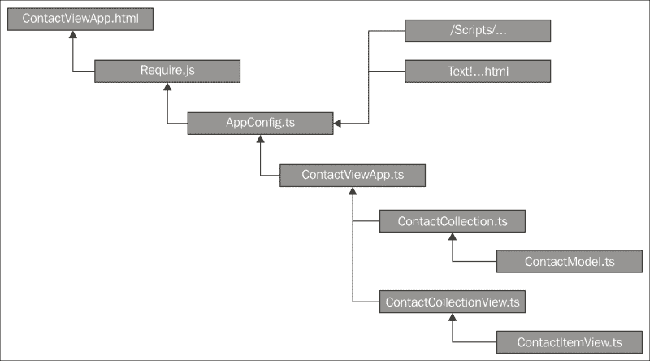
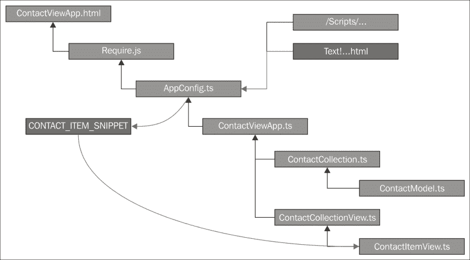
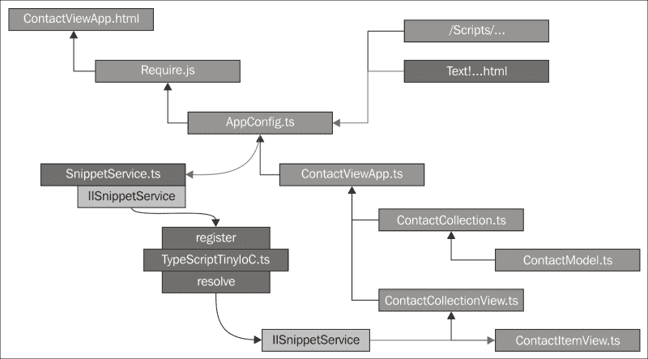
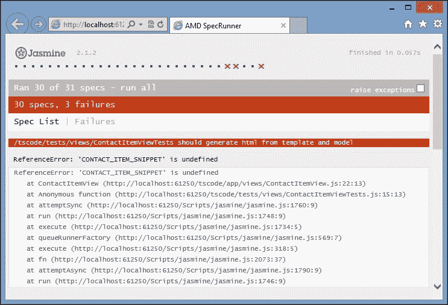
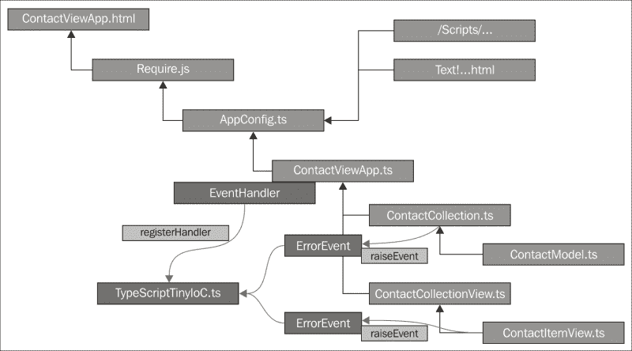
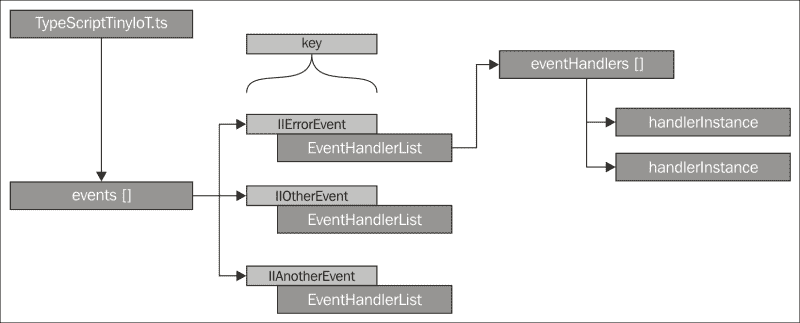
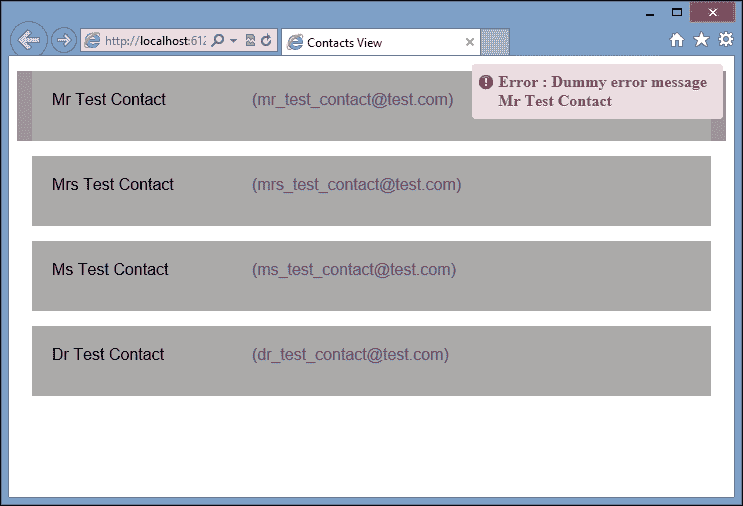

# 八、TypeScript面向对象编程

1995 年，**四人帮** ( **GoF** )出版了一本名为*设计模式:可重用面向对象软件的元素*的书。其中，作者埃里希·伽马、理查德·赫尔姆、拉尔夫·约翰逊和约翰·弗利西德斯描述了许多经典的软件设计模式。这些模式为常见的软件问题提供了简单而优雅的解决方案。如果您从未听说过设计模式，如工厂模式、复合模式、观察者模式或单例模式，那么强烈建议您通读这本书。

GoF 提供的设计模式已经在许多不同的编程语言中重现，包括 Java 和 C#。马克·托洛克甚至将这些模式移植到了 TypeScript，他的 GitHub 存储库可以在[https://github.com/torokmark/design_patterns_in_typescript](https://github.com/torokmark/design_patterns_in_typescript)找到。我们已经在[第 3 章](3.html#page "Chapter 3. Interfaces, Classes and Generics")、*接口、类和泛型*中探索了其中一种模式，工厂设计模式，马克的工作提供了 TypeScript 中所有 GoF 模式的快速简单的参考实现。

Simon Timms 还出版了一本名为*掌握 JavaScript 设计模式*、*Packt Publishing*([https://www . packtpub . com/application-development/Mastering-JavaScript-Design-Patterns](https://www.packtpub.com/application-development/mastering-javascript-design-patterns))的书，该书引导读者了解这些模式中的每一种、何时使用以及如何使用。

在本章中，我们将不涉及标准的 GoF 设计模式，而是看一看其他两种流行的设计模式，以及它们如何在 TypeScript 中实现。我们将讨论使用服务定位器模式的依赖注入，然后看看如何使用这些技术来构建域事件模式实现。

# 编程到一个界面

GoF 坚持的主要概念之一是程序员应该“编程到一个接口，而不是一个实现”。这意味着程序是使用接口作为对象之间定义的交互来构建的。通过对接口进行编程，客户端对象不知道其依赖对象的内部逻辑，并且更能适应变化。

TypeScript 语言带来了`interface`关键字，允许我们用比标准 JavaScript 更简单的方式针对接口编写面向对象的代码。但是请记住，接口只是一个TypeScript的概念，并且在生成的 JavaScript 中被编译掉。

请注意，许多其他语言都有这样的概念，即能够询问对象以查看它们实现了哪些接口，这是一个名为**反射**的过程。

# 坚实的原则

“程序到界面”原则的延伸，是基于罗伯特·马丁的思想创造的固体设计原则。这是五种不同编程原则的首字母缩略词，每当讨论面向对象编程时，都值得一提。单词 SOLID 中的每个字母都与面向对象的原则相关，如下所示:

*   学生:单一责任
*   o:打开关闭
*   l:利斯科夫换人
*   一:界面隔离
*   依赖倒置

## 单一责任

单一责任原则背后的思想是，一个对象应该只有单一的责任，或者说只有单一的原因才能存在。换句话说，做一件事，把它做好。在前面的章节中，在我们与主干网的合作中，我们已经看到了这个原则的例子。主干模型类用于表示单个模型。主干集合类用于表示这些模型的集合，主干视图类用于呈现模型或集合。

## 打开关闭

Open Closed 原则背后的思想是，一个对象应该对扩展开放，但对修改关闭。换句话说，一旦为一个类设计了一个接口，这个接口随时间发生的变化应该通过继承来实现，而不是直接修改接口。

请注意，如果您正在编写由第三方通过 API 使用的库，那么这个原则是必不可少的。对应用编程接口的更改只能通过新的版本化版本进行，并且不应该破坏现有的应用编程接口或接口。

## 利斯科夫换人

利斯科夫替换原则指出，如果一个对象从另一个对象派生而来，那么这些对象可以相互替换，而不会破坏功能。虽然这个原则看起来很容易实现，但在处理与更复杂类型相关的子类型规则时，它可能会变得非常棘手，例如对象列表或对象上的操作，这些在使用泛型的代码中最常见。在这些情况下，引入了方差的概念，对象可以是协变的、逆变的或不变的。我们不会在这里讨论差异的细节，但是在使用泛型编写库或代码时，请记住这个原则。

## 界面偏析

接口隔离原则背后的思想是很多接口比一个通用接口好。如果我们将这一原则与单一责任原则联系起来，我们将开始把我们的接口看作拼图中的小块，这些小块将被放在一起以创建更广泛的应用功能。

## 依存关系倒置

依赖倒置原则指出我们应该依赖抽象(或接口)，而不是具体对象的实例。同样，这是与“编程到接口，而不是实现”相同的原则。

# 构建服务定位器

服务位置模式的理念是应用的某些区域可以分解成服务。每个服务都应该遵守我们的固体设计原则，并提供一个小的外部接口作为服务应用编程接口。然后，应用使用的每个服务都向服务定位器注册。当应用需要特定的信息或功能时，它可以基于服务接口查询该服务定位器以找到正确的服务。

## 问题空间

在的前一章中，我们探讨了主干，其中我们的应用被分解成模型、集合和视图。除了这些元素之外，我们还有一个应用类来协调通过集合加载数据，以及使用视图呈现这个集合。一旦我们的应用类被构建，最后一块拼图就是把`require.config`对象放在一起，以便协调我们的 AMD 模块、我们的应用中需要的任何 HTML 以及我们的 jQuery 插件的加载。

如果我们看一下应用的哪个方面加载了哪些文件的可视化表示，我们会得出如下结果:



应用对象依赖树

我们从顶部开始一个名为`ContactViewApp.html`的 HTML 页面，这是我们应用的主要入口页面，它将被提供给网络浏览器。这个网页然后加载需求库，该库又加载包含`require.config`部分的`AppConfig.ts`文件。这个`require.config`部分然后指示要求从`/Scripts/`目录加载各种脚本，以及通过文本插件加载一个 HTML 片段。一旦所有文件都被“要求”加载，那么`AppConfig.ts`文件的最后一部分将加载`ContactViewApp.ts`，这又将加载我们的`ContactCollection.ts`和`ContactCollectionView.ts`文件。然后，这最后两个文件指示要求分别加载名为`ContactModel.ts`和`ContactItemView.ts`的模块文件。

如果我们仔细看看这个层次结构，很容易想象在一个大型应用中，我们会有大量的集合、模型、视图和项目视图。可能是我们正在加载集合的集合，以及包含子视图的视图，这些子视图包含更多的子视图。为了使用我们的模板机制，这些视图中的每一个都需要通过文本插件加载一些 HTML。

让我们仔细看看我们在前面的例子中是如何加载和使用一个 HTML 片段的:



使用全局变量的依赖树

在这个图中，我们可以看到我们通过文本插件在`AppConfig.ts`文件中加载了一个 HTML 片段，然后将其存储到名为`CONTACT_ITEM_SNIPPET`的全局变量中。唯一使用这个全局变量的代码是`ContactItemView`类本身。

使用全局变量打破了我们的依赖反转原则，因为我们编程的是一个全局变量的具体实例，而不是一个接口。这个全局变量也可能被任何正在运行的代码无意中更改，这可能会导致我们的视图停止运行。我们在运行测试套件时面临的另一个问题是，更改原始的 HTML 模板破坏了我们的一些单元测试。当我们能够稍微修改测试以便通过时，这个失败的测试强调了我们已经打破了开放关闭原则。

## 创建服务

我们将分两部分解决使用全局变量存储 HTML 片段的问题。

首先，让我们定义一个服务来替换我们的全局变量——一个`SnippetService`。这个服务将有一个非常简单的接口，并且只负责两件事:存储一个 HTML 片段和检索一个 HTML 片段。

其次，我们需要一个机制来获得这个`SnippetService`，在我们存储代码片段的地方(在`AppConfig.ts)`中)，也在我们使用代码片段的地方(在`ContactItemView.ts)`中)。稍后我们将在这两个接触点使用服务定位器，但是现在，让我们为我们的代码片段服务充实一个设计。

引入一个`SnippetService`将我们的依赖关系图更改如下:


使用服务存储 HTML 片段的依赖关系树

我们可以看到，我们现在已经抽象出了全局变量的使用。我们仍然有一个全局区域来存储这些 HTML 片段，即片段存储区域，但是我们现在是针对一个接口进行编程的，这个接口是`SnippetService`提供的，而不是针对的具体实现。我们的应用现在可以防止对这些 HTML 片段的内部存储进行任何更改。例如，我们可能会决定将我们的实现从使用 HTML 文件改为在数据库中存储 HTML 片段。在这种情况下，只需要修改`SnippetService`的内部，我们的代码就可以继续运行，而不需要修改。

显然，我们需要某种密钥来允许我们存储多个片段，但是`SnippetService`是否应该负责定义这个密钥？思考单一责任。`SnippetService`真的负责管理与片段相关的密钥吗？换句话说，它需要添加或删除这些键吗？不完全是。在这里，一个更小的枚举类将被证明是非常有用的，并且比起一个通用接口，它更喜欢许多更小的接口——想想接口隔离。

考虑到这些，我们可以为我们的`SnippetService`定义如下界面:

```js
enum SnippetKey {
    CONTACT_ITEM_SNIPPET,
    OTHER_SNIPPET,
}

interface ISnippetService {
    storeSnippet(key: SnippetKey, value: string): void;
    retrieveSnippet(key: SnippetKey): string;
}
```

首先，我们定义一个名为`SnippetKey`的`enum`来存储`SnippetService`要使用的所有密钥。其次，我们为实际的`SnippetService`定义了接口，命名为`ISnippetService`，它有两个功能。第一个函数将是一个存储代码片段的方法，名为`storeSnippet`。这个函数有两个参数，第一个是`SnippetKey`枚举值，第二个参数当然是 HTML 片段本身。类似地，第二个名为`retrieveSnippet`的函数使用单个`SnippetKey`参数来检索 HTML 片段。

现在我们已经定义了一个接口，我们可以创建我们的`SnippetService`类的结构:

```js
class SnippetService implements ISnippetService {
    public storeSnippet(key: SnippetKey, value: string) {
    }
    public retrieveSnippet(key: SnippetKey) {
        return "";
    }
}
```

这里，我们有一个名为`SnippetService`的类，它实现了我们的`ISnippetService`接口。我们已经创建了接口中定义的两个方法，但是还没有提供实现。我们将利用这个机会遵循 TDD 原则，在编写通过测试的代码之前编写一个失败的单元测试。我们的单元测试如下:

```js
describe("/tscode/tests/services/SnippetServiceTests.ts", () => {
    it("should store a snippet", () => {
        var snippetService = new SnippetService();
        snippetService.storeSnippet(
            SnippetKey.CONTACT_ITEM_SNIPPET, "contact_snippet");
        expect(
            snippetService.retrieveSnippet(
                SnippetKey.CONTACT_ITEM_SNIPPET)
        ).toBe("contact_snippet");
    });
});
```

在这个测试中，我们简单地创建一个`SnippetService`的实例，用`SnippetKey.CONTACT_ITEM_SNIPPET`的键存储一个片段，然后用相同的键调用`retrieveSnippet`，验证返回的字符串值。请记住，这是一个模拟测试，在实际应用中，`storeSnippet`调用将在应用初始化期间发生，`retrieveSnippet`调用将在稍后阶段发生。

现在让我们充实`SnippetService`以便测试通过:

```js
class SnippetService implements ISnippetService {
    private snippetArray: string[] = new Array();
    public storeSnippet(key: SnippetKey, value: string) {
        this.snippetArray[key] = value;
    }
    public retrieveSnippet(key: SnippetKey) {
        if (!this.snippetArray[key]) {
            throw new Error(
                "SnippetService no snippet with key :" + key);
        }
        return this.snippetArray[key];
    }
}
```

我们的`SnippetService`类现在有一个名为`snippetArray`的内部字符串数组，标记为`private`，它将保存我们的 HTML 片段值。我们的`storeSnippet`和`retrieveSnippet`函数现在只是从这个数组中存储或检索值。有了这些代码，我们的测试将会通过，简单的`SnippetService`也就完成了。

# 依赖关系解决

到目前为止，我们已经重构了代码，使其依赖于一个接口，而不是一个具体的对象。这一切都很好，但回避了一个问题:“我们如何获得一个接口？”–或者更准确地说–“我们如何获得当前实现该接口的具体类？”。这是依赖注入者试图回答的基本问题。

一个类可以通过多种不同的方式获得另一个实现接口的类。

## 服务位置

如果类本身基于一个接口请求一个具体的对象，那么这个过程称为“**服务位置**”。换句话说，类正在使用注册表或助手来定位它所需要的服务。您也可以将这种技术描述为“依赖请求”。一个中央注册中心保存一个查找表，所有注册的类都有各自的接口。当请求接口时，服务定位器只需在表中查找接口存储了什么类实例，并从注册表中返回对象。

## 依赖注入

如果创建类实例的行为可以交给某种框架，那么这个框架可以计算出一个类需要什么接口，并在类实例化过程中“注入”这些依赖关系。这种注入的依赖也叫做 **组装**。在这种情况下，汇编程序类或框架需要能够查询一个对象，以找出它所依赖的接口。不幸的是，我们在 JavaScript 或 TypeScript 中没有这种能力，因为所有的接口都被编译掉了。因此，我们不能单独使用 TypeScript 接口来实现依赖注入。如果我们要在 TypeScript 或 JavaScript 中实现依赖注入，我们将需要某种命名约定来向汇编器框架标记我们需要一个具体的对象来替换接口。

依赖注入也被称为控制反转——因为我们正在将类创建的控制和它们依赖关系的解决移交给第三方。当我们收到类的一个实例时，所有的服务或依赖项都被“神奇地”填充了。

## 服务位置与依赖注入

围绕服务位置模式的想法最早是由马丁·福勒在 2004 年左右在一个名为*的博客中提出的，该博客的标题是【控制容器的倒置】和依赖注入模式*([http://martinfowler.com/articles/injection.html](http://martinfowler.com/articles/injection.html))。然而，在他的书中，*依赖注入在。NET* ，Mark Seeman 认为服务位置模式实际上是一种反模式。

马克对马丁最初想法的理解是，当使用服务位置时，很容易引入运行时错误，或者误解特定类的用法。这是因为弄清楚一个类使用什么服务，意味着通读整个类。他认为使用依赖注入的一个更好的方法是在类的构造函数中列出所有依赖，并让服务定位器在类构造过程中解析每个依赖。马克的大多数例子似乎都是围绕着构建和使用 API 展开的，在这些例子中，特定类的内部不能简单地从代码中读取，并且在不知道它依赖于什么服务的情况下使用一个类，很容易导致运行时错误。

虽然他的想法确实成立，但这个问题的解决方案都与。NET 语言——它有一个在 JavaScript 中不可用的关键语言特性——叫做反射。反射是程序在运行时询问对象自身信息的能力，例如它有什么属性，它实现或期望什么接口。尽管 TypeScript 提供了接口关键字，并对这些接口进行了编译时检查，但所有接口都在生成的 JavaScript 中被编译掉了。

这给我们带来了一个严重的问题。如果一个类依赖于一个接口，我们就不能在运行时使用这个接口来查找接口的具体实现——因为在运行时，这个接口根本不存在。

Angular 使用命名约定(一个`$`前缀)来提供依赖注入能力。这已经相当成功了，尽管在使用缩小例程时有一些警告和一些解决方法。Angular 2.0 还通过提供自定义语法来表示需要注入依赖关系的地方，从而解决了这个问题。其他的 JavaScript 框架——比如 ExtJs——提供了一种通过使用全局创建例程来创建对象的机制，然后允许框架注入依赖关系。不幸的是，这种 ExtJs 技术与 TypeScript 语言语法不太兼容(参见[第 5 章](5.html#page "Chapter 5. Third Party Libraries")、*第三方库*，我们在这里讨论 ExtJs)。

此外，如果我们没有使用 Angular、Angular 2.0、ExtJs 或任何其他框架，那么依赖注入在标准 JavaScript 中就有点遥不可及了。另一方面，服务定位是可以实现的，并且与 TypeScript 接口相结合，可以为我们带来依赖项解析的所有好处，从而实现模块化编程。

我们也可以做出妥协，以纳入马克建议的想法，并将我们的服务位置限制为对象构造器。当编写使用服务位置的库时，我们需要清楚地记录特定类有哪些依赖项，以及它们需要如何注册。甚至很受欢迎。像 StructureMap 这样的 NET 依赖注入框架仍然允许服务定位技术——尽管它们已经被否决了。

因此，出于本书的目的，让我们探索如何编写一个简单的服务定位器，并在我们的代码中使用它来构建一个更模块化的应用，并将关于模式与反模式的争论留给那些具有自然实现依赖注入功能的语言。

# 服务定位器

让我们回到问题的关键:给定一个接口，我们如何获得一个当前正在实现它的类的具体实现？

在[第三章](3.html#page "Chapter 3. Interfaces, Classes and Generics")、*接口、类和泛型*中，我们编写了一个名为`InterfaceChecker`的泛型类，它对一个类进行运行时评估，以检查它是否实现了一组特定的方法和属性。这个`InterfaceChecker`背后的基本思想是，如果我们提供了一个列出接口的预期属性和方法的元数据类，那么我们就可以在运行时根据这个元数据来查询一个类。如果该类具有所有必需的属性和方法，那么就说它实现了接口。

因此，我们现在有了一种机制——在运行时——来确保一个类实现一个接口:请注意，不是一个 TypeScript 接口，而是一个元数据定义的接口。如果我们扩展这个想法，并给我们的每个元数据接口一个唯一的名称，我们就有了“命名接口”的概念。只要这些接口名称在我们的应用中是唯一的，我们现在就有一种机制可以在运行时查询一个类，并查看它是否实现了一个命名接口。

如果一个类实现了一个命名接口，那么我们可以使用一个注册表来存储这个类的一个实例。任何其他需要实现这个命名接口的类实例的代码，只需查询注册表，提供接口名称，注册表就能返回类实例。

只要我们确保我们的 TypeScript 接口与命名接口定义相匹配，我们就都可以开始了。

## 命名接口

回到[第 3 章](3.html#page "Chapter 3. Interfaces, Classes and Generics")、*接口、类和泛型*，我们编写了一个名为`IInterfaceChecker`的接口，可以用作元数据的标准模板。让我们更新这个接口，并给它一个必需的`className`属性——这样我们就可以将其用作命名接口:

```js
interface IInterfaceChecker {
    methodNames?: string[];
    propertyNames?: string[];
    className: string;
}
```

我们仍然有可选的`methodNames`和`propertyNames`数组，但是现在每个实现这个接口的类都需要一个`className`属性。

因此，给定以下TypeScript接口:

```js
interface IHasIdProperty {
    id: number;
}
```

我们命名的接口元数据类与这个 TypeScript 接口匹配，如下所示:

```js
class IIHasIdProperty implements IInterfaceChecker {
    propertyNames: string[] = ["id"];
    className: string = "IIHasIdProperty";
}
```

该`IHasIdProperty`界面有一个名为`id`的属性，类型为`number`。然后我们创建一个名为`IIHasIdProperty`的类，作为一个命名的接口定义。这个类实现了我们更新的`IInterfaceChecker`接口，因此必须提供一个`className`属性。`propertyNames`属性有一个名为`id`的数组条目，我们的`InterfaceChecker`类将使用它来匹配我们的 TypeScript 接口的`id`属性。

注意这个类的命名约定——它和接口同名，但是增加了一个额外的`I`。这个双`I`约定将帮助我们将名为`IHasIdProperty`的 TypeScript 接口与其名为接口类的`IIHasIdProperty`元数据联系起来。

我们现在可以创建一个普通的TypeScript类，实现`IHasIdProperty`TypeScript接口，如下所示:

```js
class PropertyOne implements IHasIdProperty  {
    id = 1;
}
```

我们现在已经具备了开始构建服务定位器的所有条件:

*   一个名为`IHasIdProperty`的排版界面。这将针对实现此接口的类提供编译时类型检查。
*   名为`IIHasIdProperty`的命名接口或元数据类。这将提供针对类的运行时类型检查，并且它还有一个唯一的名称。
*   实现TypeScript接口`IHasIdProperty`的类。这个类将通过运行时类型检查，并且这个类的一个实例可以在我们的服务定位器中注册。

## 根据命名接口注册类

有了这些元数据类，我们现在可以创建一个中央存储库来充当服务定位器。此类具有用于注册类以及解析接口的静态函数:

```js
class TypeScriptTinyIoC {
    static registeredClasses: any[] = new Array();
    public static register(
        targetObject: any,
        targetInterface: { new (): IInterfaceChecker; }): void {
    }

    public static resolve(
        targetInterface: { new (): IInterfaceChecker; }): any {
    }
    public static clearAll() {}
}
```

这个名为`TypeScriptTinyIoC`的类有一个名为`registeredClasses`的静态属性，它是一个类型为`any`的数组。这个数组本质上是我们的注册表。因为我们不知道我们要在这个数组中存储什么类型的类，所以在这个例子中使用`any`类型是正确的。

这个类然后提供两个主要的静态函数，命名为`register`和`resolve`。`register`函数以一个`targetObject`作为它的第一个参数，然后是一个命名接口的类定义——即一个从`IInterfaceChecker`派生的类。注意`targetInterface`参数的语法——它与我们在[第 3 章](3.html#page "Chapter 3. Interfaces, Classes and Generics")、*接口、类和泛型*中用来表示类定义的泛型语法相同。

如果我们看一下这些函数签名的用法示例，实际上更容易理解，所以让我们编写一个快速测试:

```js
it("should resolve instance of IIProperty to PropertyOne", () => {
    var propertyInstance = new PropertyOne();
    TypeScriptTinyIoC.register(propertyInstance, IIHasIdProperty);

    var iProperty: IHasIdProperty = 
        TypeScriptTinyIoC.resolve(IIHasIdProperty);
    expect(iProperty.id).toBe(1);
});
```

这个测试首先创建一个`PropertyOne`类的实例，实现`IHasIdProperty`接口。这个班是我们想注册的。然后测试用两个参数调用`TypeScriptTinyIoC`的寄存器函数。第一个参数是类实例本身，第二个参数是关联命名接口的类定义— `IIHasIdProperty`。我们以前见过这种类型的语法，当时我们讨论了使用泛型创建类的实例，但是它的签名在非泛型函数上也可用。

在不使用`targetInterface: { new (): IInterfaceChecker; }`签名的情况下，我们必须按如下方式调用该函数:

```js
TypeScriptTinyIoC.register(propertyOneInstance,
    new IIHasIdProperty());
```

但是有了这个签名，我们可以将`IIHasIdProperty`命名接口类的创建推迟到注册函数，并删除如下新语法:

```js
TypeScriptTinyIoC.register(propertyOneInstance, IIHasIdProperty);
```

然后，我们的测试调用`TypeScriptTinyIoC`上的`resolve`函数，并再次将命名接口的类定义作为查找键传递。最后，我们检查返回的类是否实际上是我们最初注册的`PropertyOne`类的实例。

在这个阶段，我们的测试将会戏剧性地失败，所以让我们充实`TypeScriptTinyIoC`类，从`register`函数开始:

```js
public static register(
    targetObject: any,
    targetInterface: { new (): IInterfaceChecker; })
{
    var interfaceChecker = new InterfaceChecker();
    var targetClassName = new targetInterface();
    if (interfaceChecker.implementsInterface(
        targetObject, targetInterface)) {
        this.registeredClasses[targetObject.className]
            = targetObject;
    } else {
        throw new Error(
            "TypeScriptTinyIoC cannot register instance of "
            + targetClassName.className);
    }
}
```

这个`register`函数首先创建一个`InterfaceChecker`类的实例，然后通过`targetInterface`参数创建一个传入的类定义的实例。这个`targetInterface`就是命名接口或者元数据类。然后调用`interfaceChecker`的`implementsInterface`功能，保证`targetObject`实现`targetInterface`描述的界面。如果它通过了这个检查，我们就把它添加到名为`registeredClasses`的内部数组中，使用`className`属性作为关键字。

再次，使用我们的`InterfaceChecker`给我们提供了运行时类型检查——这样我们可以确定我们注册的任何类实际上都实现了正确的命名接口。

现在我们可以将`resolve`功能具体化如下:

```js
public static resolve(
    targetInterface: { new (): IInterfaceChecker; })
{
    var targetClassName = new targetInterface();
    if (this.registeredClasses[targetClassName.className]) {
        return this.registeredClasses[targetClassName.className];
    } else {
        throw new Error(
            "TypeScriptTinyIoC cannot find instance of "
            + targetClassName.className);
    }
}
```

这个`resolve`函数只有一个参数——我们命名接口的定义。同样，我们使用的是`new`-我们以前见过的可语法。这个函数只是创建一个`targetInterface`类的实例，然后使用`className`属性作为进入`registeredClasses`数组的键。如果找到一个条目，我们只需返回它；否则，我们会抛出一个错误。

我们的`TypeScriptTinyIoC`类上的最后一个函数是`clearAll`函数，它主要用于测试来清除我们注册的类数组:

```js
public static clearAll() {
    this.registeredClasses = new Array();
}
```

我们的服务定位器现已完成。

## 使用服务定位器

现在让我们更新我们的依赖关系树，看看`TypeScriptTinyIoC`服务定位器将如何使用:



带有服务定位器模式的依赖关系图

我们的`AppConfig.ts`代码现在将创建一个`SnippetService`的实例，并使用一个命名接口— `IISnippetService`向`TypeScriptTinyIoC`注册它。然后我们的`ContactItemView`构造函数将被更新，以从注册表中解析一个`IISnippetService`命名接口的实例。通过这种方式，我们现在正在编程一个接口——即`IISnippetService`接口。当我们向服务定位器注册服务时，以及稍后解析服务时，我们都使用这个命名接口。那么，我们的`ContactItemView`正在请求服务定位器给我们当前正在实现`IISnippetService`接口的对象。

为了实现这个改变，我们首先需要一个命名接口来匹配`ISnippetService`TypeScript接口。作为复习，我们的`ISnippetService`定义如下:

```js
interface ISnippetService {
    storeSnippet(key: SnippetKey, value: string): void;
    retrieveSnippet(key: SnippetKey): string;
}
```

使用我们的命名规则，我们的命名接口定义将被称为`IISnippetService`，如下所示:

```js
class IISnippetService implements IInterfaceChecker {
    methodNames: string[] = ["storeSnippet", "retrieveSnippet"];
    className: string = "IISnippetService";
}
```

注意`methodNames`数组包含两个匹配我们的 TypeScript 接口的条目。按照惯例，我们还指定了一个`className`属性，这样我们就可以使用这个类作为命名接口。使用类的名称(`IISnippetService`)作为`className`属性也将确保唯一的名称，因为 TypeScript 不允许多个类定义具有相同的名称。

现在让我们关注我们的测试套件。请记住，我们的`TestConfig.ts`文件几乎与我们的`AppConfig.ts`文件相同，但是启动了 Jasmine 测试套件，而不是运行我们的应用。我们将修改此`TestConfig.ts`文件以包括我们的`SnippetService`和`TypeScriptTinyIoC`，如下所示。

```js
require.config(
    {
        // existing code 
        paths: {
            // existing code
            'tinyioc': '/tscode/app/TypeScriptTinyIoC',
            'snippetservice': '/tscode/app/services/SnippetService'
        },
        shim: {
          // existing code
        }
    }
);

require(
    ['jasmine-boot', 'tinyioc', 'snippetservice',
    'text!/tscode/app/views/ContactItemView.html'],
     (jb, tinyioc, snippetservice, contactItemSnippet) => {
        var snippetService = new SnippetService();
        snippetService.storeSnippet( SnippetKey.CONTACT_ITEM_SNIPPET, contactItemSnippet);
        TypeScriptTinyIoC.register(snippetService, IISnippetService);
        require(specs, () => {
             (<any>window).onload();
        });
    }
);
```

首先，我们在 paths 属性中包含了`tinyioc`和`snippetservice`的条目，以确保【Require 将从指定的目录加载我们的文件。然后，我们更新对 require 函数的调用，将`tinyioc`和`snippetservice`都包含在两个参数中。然后，我们的匿名函数创建一个新的`SnippetService`实例，并使用`CONTACT_ITEM_SNIPPET`键存储由文本加载的片段。然后，我们使用命名接口`IISnippetService`向`TypeScriptTinyIoC`注册这个`SnippetService`的实例。如果我们现在运行我们的测试套件，我们应该会得到一些失败的测试:



单元测试失败

这个失败是造成的，因为`ContactItemView`仍然引用`CONTACT_ITEM_SNIPPET`全局变量。现在让我们修改这个视图的构造函数如下:

```js
constructor(options?: any) {
    var snippetService: ISnippetService =
        TypeScriptTinyIoC.resolve(IISnippetService);
    var contactItemSnippet = snippetService.retrieveSnippet(
        SnippetKey.CONTACT_ITEM_SNIPPET);

    this.className = "contact-item-view";
    this.events = <any>{ 'click': this.onClicked };
    this.template = _.template(contactItemSnippet);

    super(options);
}
```

构造函数的第一行用命名接口`IISnippetService`的定义调用`TypeScriptTinyIoC.resolve`函数。该调用的结果存储在`snippetService`变量中，该变量被强类型化到`ISnippetService`接口。这是服务定位器模式的本质:我们正在编程一个接口(`ISnippetService`)，并且还通过我们的服务定位器定位这个接口。一旦我们有了提供接口的类的实例，我们就可以简单地用所需的键调用`retrieveSnippet`来加载我们的模板。

现在我们已经更新并修复了我们的测试，我们只需要修改我们的`AppConfig.ts`文件，就像修改`TestConfig.ts`文件一样。

## 可测性

现在我们正在针对一个定义好的接口进行编程，我们可以开始以不同的方式测试我们的代码。在测试中，我们现在可以用实际的`SnippetService`替换另一个在调用`retrieveSnippet`时抛出错误的服务。对于这个测试，让我们创建一个名为`SnippetServiceRetrieveThrows`的类，如下所示:

```js
class SnippetServiceRetrieveThrows implements ISnippetService {
    storeSnippet(key: SnippetKey, value: string) {}

    retrieveSnippet(key: SnippetKey) {
        throw new Error("Error in retrieveSnippet");
    }
}
```

这个类可以针对`IISnippetService`命名接口注册，因为它正确地实现了TypeScript接口`ISnippetService`。然而，`retrieveSnippet`函数只是抛出了一个错误。

因此，我们的测试可以很容易地注册这个版本的服务，然后创建一个`ContactItemView`类实例，以便在对`retrieveSnippet`函数的调用失败时查看发生了什么。请注意，我们没有以任何方式修改我们的`ContactItemView`类——我们只是针对`IISnippetService`命名接口注册了一个不同的类。在这种情况下，我们的测试如下:

```js
beforeAll(() => {
    var errorService = new SnippetServiceRetrieveThrows();
    TypeScriptTinyIoC.register(errorService, IISnippetService);
});

it("should handle an error on constructor", () => {
    var contactModel = new cm.ContactModel(
      { Name: 'testName', EmailAddress: 'testEmailAddress' });

    var contactItemView = new ccv.ContactItemView(
      { model: contactModel });
    var html = contactItemView.render().$el.html();
    expect(html).toContain('error');

});
```

在这个测试中，我们在`beforeAll`函数中注册了`SnippetService`的投掷版本，然后测试`ContactItemView`的渲染能力。运行该测试会导致`ContactItemView`调用`retrieveSnippet`时出现错误。为了使这个测试通过，我们需要更新`ContactItemView`来优雅地处理一个错误:

```js
var contactItemSnippet = "";
var snippetService: ISnippetService =
    TypeScriptTinyIoC.resolve(IISnippetService);
try {
    contactItemSnippet = snippetService.retrieveSnippet(
        SnippetKey.CONTACT_ITEM_SNIPPET);
} catch (err) {
    contactItemSnippet = 
     "There was an error loading CONTACT_ITEM_SNIPPET";
}
```

在这里，我们已经简单地用一个`try` `catch`块包围了呼叫`retrieveSnippet`。如果出现错误，那么我们就将代码片段修改为标准的错误消息。通过进行这样的测试，我们进一步巩固了我们的代码，以便能够处理各种错误。

那么，到目前为止，我们取得了哪些成就？我们已经构建了一个服务来提供 HTML 片段，并且我们已经构建了一个服务定位器，它可以注册这个服务的一个实例，以便在我们的代码中使用。通过在测试期间注册该服务的不同变体，我们还可以通过模拟常见错误来进一步防止代码的错误，并在这些情况下测试我们的组件。

# 领域事件模式

大多数 JavaScript 框架都有事件总线的概念。事件总线只是将事件发布到全局总线的一种方法，这样订阅这些事件的应用的其他部分将会收到一条消息，并且能够对它们做出反应。使用基于事件的体系结构有助于分离我们的应用，使它们能够适应变化，并且更容易测试。

领域事件是特定于我们的应用领域发生的事件。类似于“发生错误时，将其记录到控制台”或“单击菜单按钮时，更改子菜单面板以反映此选项”。域事件可以在代码中的任何地方引发。任何类都可以针对此事件注册事件处理程序，然后在引发此事件时得到通知。一个域事件可以有多个事件处理程序。

马丁·福勒于 2005 年在 http://martinfowler.com/eaaDev/DomainEvent.html 的一个博客中首次发表了关于领域事件概念的博客。Udi 达汗随后在位于[http://www.udidahan.com/2009/06/14/domain-events-salvation/](http://www.udidahan.com/2009/06/14/domain-events-salvation/)的另一篇博客中展示了如何用 C#实现一个简单的域事件模式。Mike Hadlow 也发了关于关注与领域事件分离的博客，这个博客可以在[http://mikehadlow . blogspot . com . au/2010/09/关注与领域分离. html](http://mikehadlow.blogspot.com.au/2010/09/separation-of-concerns-with-domain.html) 找到。

Mike 认为，引发事件的一段代码不应该关心之后会发生什么——我们应该有单独的处理程序来处理这些事件——这些处理程序与实际引发事件的任何东西都没有关联。

虽然有许多处理事件的 JavaScript 库——例如邮政——但这些库中的大多数都以消息包的形式发送字符串或简单的 JavaScript 对象。无法确保消息的发送者填写消息处理程序期望的所有属性。换句话说，这些消息不是强类型的——并且很容易导致运行时错误——通过尝试将一个“方形钉”消息装入一个“圆孔”事件处理程序。

在本节中，我们将构建一个强类型的域事件消息总线，并展示双方(事件发起者和事件处理程序)如何确保引发的事件具有事件处理程序中预期的所有属性。我们还将展示如何确保事件处理程序被正确编写和注册，以便以强类型的方式交付事件。

## 问题空间

假设我们有以下业务需求:“如果发生错误，在弹出的通知中向用户显示错误消息。该弹出窗口应显示两秒钟，然后逐渐消失，允许用户继续工作。”

在我们当前的应用中，有许多地方可能会出现错误——例如，当通过`ContactCollection`加载 JSON 时，或者当渲染`ContactItemView`时。这些错误可能会在我们的类层次结构中发生。为了达到我们规定的要求，我们需要在`ContactViewApp`级别处理这些错误。请考虑下图:



具有域事件处理程序和事件引发器的依赖树。

我们的`ContactViewApp`将向`TypeScriptTinyIoC`注册一个事件处理程序，指定它感兴趣的事件类型。当我们的任何一个模块引发这种类型的事件时，我们的消息总线会将消息导向正确的处理程序或处理程序组。在上图中，`ContactCollection`和`ContactItemView`班显示通过`TypeScriptTinyIoC`提升一个`ErrorEvent`。

## 消息和处理器接口

在中，我们需要两个关键的信息集来注册和发出强类型的消息。首先是描述消息本身的接口，与其命名接口配对。第二个是描述消息处理函数的接口，同样与它的命名接口配对。我们的 TypeScript 接口为我们提供了消息和处理程序的编译时检查，我们的命名接口(实现`IInterfaceChecker`)为我们提供了消息和处理程序的运行时类型检查。

首先，我们消息的接口如下:

```js
interface IErrorEvent {
    Message: string;
    Description: string;
}

export class IIErrorEvent implements IInterfaceChecker {
    propertyNames: string [] = ["Message", "Description"];
    className: string = "IIErrorEvent";
}
```

我们从 TypeScript 界面`IErrorEvent`开始。这个界面有两个属性，`Message`和`Description`，都是字符串。然后我们创建我们的`IIErrorEvent`类，它是我们命名接口的一个实例，同样是，它的`propertyNames`数组与我们的 TypeScript 接口属性名相匹配。`className`属性是也设置为类名，`IIErrorEvent`，保证唯一性。

事件处理程序的接口如下:

```js
interface IErrorEvent_Handler {
    handle_ErrorEvent(event: IErrorEvent);
}

export class IIErrorEvent_Handler implements IInterfaceChecker {
    methodNames: string[] = ["handle_ErrorEvent"];
    className: string = "IIErrorEvent_Handler";
}
```

TypeScript 界面`IErrorEvent_Handler`包含一个单一的方法，命名为`handle_ErrorEvent`。这个处理程序方法有一个参数，`event`，它再次被强类型化为我们的事件接口，`IErrorEvent`。然后我们构造一个名为`IIErrorEvent_Handler`的命名接口，并通过`methodNames`数组匹配 TypeScript 接口。同样，我们为这个命名接口提供了唯一的`className`属性。

有了这两个接口和命名接口，我们现在可以如下创建实际的`ErrorEvent`类:

```js
export class ErrorEvent implements IErrorEvent {
    Message: string;
    Description: string;
    constructor(message: string, description: string) {
        this.Message = message;
        this.Description = description;
    }
}
```

`ErrorEvent`的类定义实现了`IErrorEvent`接口，从而使其与我们的事件处理程序兼容。注意本班的`constructor`。我们强制这个类的用户在构造函数中提供一个`message`和`description`参数，从而使用 TypeScript 编译时检查来确保我们正确地构造这个类，无论它在哪里使用。

然后我们可以创建一个实现`IErrorEvent_Handler`接口的类，它将接收事件本身。举个简单的例子，考虑一下下面的课:

```js
class EventHandlerTests_ErrorHandler
    implements IErrorEvent_Handler {
    handle_ErrorEvent(event: IErrorEvent) {
    }
}
```

这个类实现了`IErrorEvent_Handler` TypeScript 接口，因此编译器会强制这个类定义一个带有正确签名的`handle_ErrorEvent`函数，以便接收消息。

## 多个事件处理程序

为了能够注册多个事件，并且每个事件有多个事件处理程序，我们将需要一个事件数组，每个事件又包含一个处理程序数组，如下所示:



用于为每个事件注册多个事件处理程序的类结构。

我们的`TypeScriptTinyIoC`类将有一个名为`events`的数组，它使用事件的名称作为它的键。这个名字将取自我们为该事件命名的接口——同样是因为TypeScript接口是在之外编译的。为了帮助管理每个事件的多个事件处理程序，我们将创建一个名为`EventHandlerList`的新类，它将促进多个事件处理程序的注册。这个`EventHandlerList`类的一个实例将存储在我们注册的每个命名事件的`events`数组中。

让我们从这个事件处理程序列表开始，实现我们的`EventHandlerList`类。在这个阶段，我们只需要一个内部数组来存储处理程序，名为`eventHandlers`，以及一个如下的`registerHandler`函数:

```js
class EventHandlerList {
    eventHandlers: any[] = new Array();
    registerHandler(handler: any,
        interfaceType: { new (): IInterfaceChecker }) {
    }
}
```

`registerHandler`函数再次使用`interfaceType`参数的`{ new(): IInterfaceChecker }`语法，从而允许我们为这个函数调用使用类型名。快速单元测试如下:

```js
import iee = require("../app/events/ErrorEvent");

class EventHandlerTests_ErrorHandler
    implements iee.IErrorEvent_Handler {
    handle_ErrorEvent(event: iee.IErrorEvent) {
    }
}

describe("/tests//EventHandlerTests.ts", () => {

    var testHandler: EventHandlerTests_ErrorHandler;
    beforeEach(() => {
        testHandler = new EventHandlerTests_ErrorHandler();
    });

    it("should register an event Handler", () => {
        var eventHandlerList = new EventHandlerList();
        eventHandlerList.registerHandler(testHandler,
            iee.IIErrorEvent_Handler);

        expect(eventHandlerList.eventHandlers.length).toBe(1);
    });
});
```

我们从事件类的`import`语句开始这个测试，然后是一个名为`EventHandlerTests_ErrorHandler`的类。这个类将被用作这个测试套件的注册事件处理程序。该类实现了`iee.IErrorEvent_Handler`，因此，如果我们没有接受`IErrorEvent`作为唯一参数的`handle_ErrorEvent`函数，将会产生编译错误。仅仅通过使用 TypeScript 接口，我们就已经确保了这个类有正确的函数名和函数签名来接受`ErrorEvent`消息。

然后，我们的测试开始于声明一个名为`testHandler`的变量来存储我们的`EventHandlerTests_ErrorHandler`类的实例。`beforeEach`函数将创建这个实例，并将其分配给我们的`testHandler`变量。然后测试本身创建一个`EventHandlerList`类的实例，调用`registerHandler`，然后期望内部`eventHandlers`属性的`length`值为 1。

再次注意调用`registerHandler`的语法。我们传入我们的`testHandler`实例作为第一个参数，然后指定命名接口`IIErrorEvent_Handler`类类型。正如我们在服务定位器模式中所看到的，我们再次对命名接口使用相同的类名语法，而不是必须调用`new()`。

现在让我们填写代码来通过测试:

```js
class EventHandlerList {
    eventHandlers: any[] = new Array();
    registerHandler(handler: any,
        interfaceType: { new (): IInterfaceChecker }) {

        var interfaceChecker = new InterfaceChecker();
        if (interfaceChecker.implementsInterface(
            handler, interfaceType)) {
            this.eventHandlers.push(handler);
        } else {
            var interfaceExpected = new interfaceType();
            throw new Error(
                "EventHandlerList cannot register handler of "
                + interfaceExpected.className);
        }
    }
}
```

我们的`registerHandler`函数首先创建一个`InterfaceChecker`类的实例，然后调用`implementsInterface`，以确保在运行时，传入的处理程序对象确实具有由我们的命名接口定义的所有方法名。如果`implementsInterface`函数返回`true`，我们可以简单地将这个处理程序推到我们的内部数组上。

如果处理程序没有实现命名接口，我们将抛出一个错误。为了完整性，这个错误包含了命名接口的`className`属性，所以我们首先要新建一个这个命名接口类的实例，然后才能提取`className`属性。

现在让我们创建一个测试，它将故意使我们的`implementsInterface`检查失败，并确保实际上抛出了一个错误:

```js
class No_ErrorHandler {
}

it("should throw an error with the correct className", () => {
    var eventHandlerList = new EventHandlerList();
    expect(() => {
        eventHandlerList.registerHandler(new No_ErrorHandler(),
            iee.IIErrorEvent_Handler);
    }).toThrow(new Error(
        "EventHandlerList cannot register handler of IIErrorEvent_Handler"
        ));
});
```

我们从`No_ErrorHandler`类的类定义开始，它显然没有实现我们的命名接口。然后，我们的测试使用`No_ErrorHandler`类的新实例和我们的`IIErrorEvent_Handler`命名接口来设置`EventHandlerList`类，并调用`registerHandler`函数。然后，我们期待一个特定的错误消息，其中应该包括我们命名接口的名称`IIErrorEvent_Handler`。

## 触发事件

我们现在可以将注意力转向提出一个事件。为此，我们将需要知道事件处理程序的实际函数名是什么。我们将对我们的`EventHandlerList`稍作修改，并将事件名称传递给构造函数，如下所示:

```js
class EventHandlerList {
    handleEventMethod: string;
    constructor(handleEventMethodName: string) {
        this.handleEventMethod = handleEventMethodName;
    }

    raiseEvent(event: any) {
    }
}
```

我们的构造函数现在需要一个`handleEventMethodName`作为必需的参数，我们将它存储在一个名为`handleEventMethod`的属性中。请记住，向该类的实例注册的所有处理程序都响应相同的事件，因此都具有相同的方法名，由 TypeScript 编译器强制执行。我们还定义了一个`raiseEvent`函数，由于我们不知道这个类将处理什么事件，因此该事件属于`any`类型。

现在，我们可以创建一个失败的单元测试，因为`raiseEvent`函数实际上还没有做任何事情。在我们这样做之前，让我们更新我们的测试处理程序类，`EventHandlerTests_ErrorHandler,`来存储最后一个在属性中触发的事件，我们可以稍后访问该属性:

```js
class EventHandlerTests_ErrorHandler
    implements iee.IErrorEvent_Handler {
    LastEventFired: iee.IErrorEvent;
    handle_ErrorEvent(event: iee.IErrorEvent) {
        this.LastEventFired = event;
    }
}
```

我们已经用名为`LastEventFired`的属性更新了这个类定义，并且在`handle_ErrorEvent`函数中设置了这个属性。有了这个变化，当一个事件被触发时，我们可以询问`LastEventFired`属性，看看最后触发的是什么事件。现在让我们编写一个调用`raiseEvent`方法的测试:

```js
it("should fire an event", () => {
    var eventHandlerList = new
        EventHandlerList('handle_ErrorEvent');
    eventHandlerList.registerHandler(testHandler,
        iee.IIErrorEvent_Handler);
    eventHandlerList.raiseEvent(
        new iee.ErrorEvent("test", "test"));
    expect(testHandler.LastEventFired.Message).toBe("test");
});
```

我们从一个名为`eventHandlerList`的变量开始，该变量保存了我们的`EventHandlerList`类的一个实例，并通过构造函数传入要调用的函数的名称。然后我们用这个`testHandler`实例来称呼`registerHandler`。现在，我们可以调用`raiseEvent`函数，传入一个`new ErrorEvent`。由于我们的`ErrorEvent`类的构造函数需要两个参数，我们刚刚为每个参数传入了`"test"`。最后，我们期望我们的事件处理程序的`LastEventFired`属性被正确设置。在这个阶段运行我们的测试会失败，所以让我们在我们的`EventHandlerList`类上实现`raiseEvent`方法如下:

```js
raiseEvent(event: any) {
    var i, len = 0;
    for (i = 0, len = this.eventHandlers.length; i < len; i++) {
        var handler = this.eventHandlers[i];
        handler[this.handleEventMethod](event);
    }
}
```

这个`raiseEvent`功能的实现比较简单。我们只需遍历我们的`eventHandlers`数组，然后使用索引获取对每个事件处理程序的引用。这里需要注意的一行是我们如何执行处理函数:`handler[this.handleEventMethod](event)`。这利用了 JavaScript 使用与函数名称匹配的字符串值调用函数的能力。在我们的测试中，这相当于`handler['handle_ErrorEvent'](event)`，在 JavaScript 中相当于`handler.handle_ErrorEvent(event)`——对处理函数的实际调用。有了这个 JavaScript 魔法，我们的事件被激发，我们的单元测试正确运行。

## 注册事件的事件处理程序

现在我们有了一个工作的、经过测试的类来管理多个响应特定事件的事件处理程序，我们可以将注意力转移回`TypeScriptTinyIoC`类。

正如我们对服务定位器模式所做的那样，我们需要注册一个对象的实例来处理一个特定的事件。注册事件处理程序的方法签名如下所示:

```js
public static registerHandler(
    handler: any,
    handlerInterface: { new (): IInterfaceChecker },
    eventInterface: { new (): IInterfaceChecker }) {
}
```

这个`registerHandler`函数接受三个参数。第一个是实现处理程序的对象的实例。第二个参数是我们的处理程序的命名接口类——这样我们就可以在运行时检查这个类，以确保它实现了处理程序接口。第三个参数是事件本身的命名接口。这个`register`函数也是将一个事件绑定到其处理程序的函数。

在我们进行单元测试之前，我们需要另一个静态函数来引发一个事件:

```js
static raiseEvent(event: any,
    eventInterface: { new (): IInterfaceChecker }) {
}
```

对于该事件，`TypeScriptTinyIoC`类上的这个`raiseEvent`函数将调用`EventHandlerList`类实例上的`raiseEvent`函数。我们还将在这里进行`interfaceChecker`测试，以确保所引发的事件与我们为该事件命名的接口类相匹配——在我们实际引发该事件之前。

现在进行单元测试:

```js
it("should register an event handler with
TypeScriptTinyIoC and fire an event", () => {
    TypeScriptTinyIoC.registerHandler(testHandler,
        iee.IIErrorEvent_Handler, iee.IIErrorEvent);
    TypeScriptTinyIoC.raiseEvent(
        new iee.ErrorEvent("test", "test"),
        iee.IIErrorEvent);
    expect(testHandler.LastEventFired.Message).toBe("test");
});
```

这个测试与我们为`EventHandlerList`类编写的测试非常相似，除了我们在`TypeScriptTinyIoC`类上调用`registerHandler`和`raiseEvent`方法，而不是一个特定的`EventHandlerList`。有了这个失败的测试，我们现在可以填写`registerHandler`和`raiseEvent`功能如下:

```js
static events: EventHandlerList[] = new Array<EventHandlerList>();
public static registerHandler(
    handler: any,
    handlerInterface: { new (): IInterfaceChecker },
    eventInterface: { new (): IInterfaceChecker }) {

    var eventInterfaceInstance = new eventInterface();
    var handlerInterfaceInstance = new handlerInterface();

    var handlerList = 
        this.events[eventInterfaceInstance.className];
    if (handlerList) {
        handlerList.registerHandler(handler, handlerInterface);
    } else {
        handlerList = new EventHandlerList(
            handlerInterfaceInstance.methodNames[0]);
        handlerList.registerHandler(handler, handlerInterface);
        this.events[eventInterfaceInstance.className] =
            handlerList;
    }
}
```

首先，我们增加了一个静态属性`events`，它是实例的数组。我们将使用我们的命名事件接口的`className`作为关键字添加到这个数组中。我们的`registerHandler`函数首先创建通过`handlerInterface`和`eventInterface`参数传入的两个命名接口类的实例。然后我们检查我们的内部数组是否已经有了这个事件的`EventHandlerList`实例，这个实例是通过我们的命名事件接口的`className`属性键入的。如果我们已经有一个条目，我们可以简单地在现有的`EventHandlerList`实例上调用`registerHandler`函数。如果这个事件还没有注册，我们只需创建一个`EventHandlerList`类的新实例，调用`registerHandler`，然后将这个条目添加到我们的内部数组中。

注意我们是如何计算出事件处理函数调用的实际名称的。我们只是使用在方法名数组中找到的第一个方法名:`handlerInterfaceInstance.methodNames[0]`，它将返回一个字符串。在我们的示例中，这将返回`'handle_ErrorEvent'`字符串，这是调用事件的处理函数时需要调用的方法名。

接下来，我们可以关注`raiseEvent`功能:

```js
static raiseEvent(event: any,
    eventInterface: { new (): IInterfaceChecker }) {

    var eventChecker = new InterfaceChecker();
    if (eventChecker.implementsInterface(event, eventInterface)) {
        var eventInterfaceInstance = new eventInterface();
        var handlerList = 
            this.events[eventInterfaceInstance.className];
        if (handlerList) {
            handlerList.raiseEvent(event);
        }
    }

}
```

这个函数首先创建一个`InterfaceChecker`类的实例，然后确保正在引发的事件符合我们作为第二个参数提供的命名的接口。同样，这是一个运行时类型检查，以确保我们试图引发的事件实际上是正确的类型。如果事件有效，我们获取为该事件注册的`EventHandlerList`类的实例，然后调用其`raiseEvent`函数。

我们的强类型域事件机制现在已经完成。我们以两种方式使用编译时TypeScript接口检查和运行时类型检查。首先，当注册一个处理程序时，我们做一个接口检查，然后当我们触发一个事件时，我们做另一个接口检查。这意味着事件的两个方面——注册和触发——都是强类型的，在编译时和运行时都是如此。

## 显示错误通知

现在我们已经有了`TypeScriptTinyIoC`事件机制，我们可以专注于解决当错误发生时显示错误通知的业务问题。Notify 是一个非常适合我们需求的 jQuery 插件([http://notifyjs.com/](http://notifyjs.com/))。我们可以从 NuGet 安装 JavaScript 库(安装`jQuery.notify`包)，但是这个包的默认版本依赖于另一个名为 Bootstrap 的包。然而，Notify 也在他们的网站上提供了一个选项，可以下载一个定制的 notify.js 脚本，该脚本将所有这些样式内置到库中。我们将使用这个定制版本，因为我们的项目不使用引导包。

通知的定义文件可以从 DefinitelyTyped([https://github . com/borisyankov/DefinitelyTyped/tree/master/Notify](https://github.com/borisyankov/DefinitelyTyped/tree/master/notify)下载。然而，在撰写本文时，似乎有两个版本的 Notify 库，一个名为 Notify，另一个名为 Notify.js。使用 Notify 版本，因为它看起来是最新的。

为了模拟一个错误，让我们标记`ContactItemView onClicked`函数，在这里我们当前正在执行一个翻转，并且每当有人点击我们的一个联系链接时就产生一个伪错误:

```js
onClicked() {
    this.$el.flip({
        direction: 'tb',
        speed : 200
    });
    var errorEvent = new iee.ErrorEvent(
        "Dummy error message", this.model.Name);
    TypeScriptTinyIoC.raiseEvent(errorEvent, iee.IIErrorEvent);
}
```

在我们调用 flip 之后，我们简单地创建了一个`ErrorEvent`类的实例，它有两个必需的参数。然后我们用这个`errorEvent`实例调用`TypeScriptTinyIoC`上的`raiseEvent`函数，以及我们正在引发的事件类型的命名接口。就这么简单。

现在，我们可以将我们的`ContactViewApp`修改为为该事件注册一个处理程序，如下所示:

```js
import iee = require("tscode/app/events/ErrorEvent");

export class ContactViewApp implements iee.IErrorEvent_Handler {
    constructor() {
        TypeScriptTinyIoC.registerHandler(this,
            iee.IIErrorEvent_Handler, iee.IIErrorEvent);
    }
    run() {

    }

    contactCollectionLoaded(model, response, options) {

    }
    contactCollectionError(model, response, options) {

    }
    handle_ErrorEvent(event: iee.IErrorEvent) {
        $.notify("Error : " + event.Message
            + "\n" + event.Description);
    }
}
```

在这里，我们对`ContactViewApp`类做了一些修改。首先，我们实现了`IErrorEvent_Handler`TypeScript接口，这将迫使我们在类中包含`handle_ErrorEvent`函数。我们还定义了一个`constructor`，在这个里面，我们使用我们的两个命名接口:`IIErrorEvent_Handler`和`IIErrorEvent`将类实例注册为处理程序。

在`handle_ErrorEvent`函数中，我们调用`$.notify`——通知 jQuery 插件。注意传递到`handle_ErrorEvent`函数的`event`参数的类型是`IErrorEvent`类型。这意味着我们可以在我们的事件处理函数中安全地使用`IErrorEvent`接口的任何属性或方法，因为我们已经在事件引发期间确保了这个事件正确地实现了接口。

我们对通知的调用只是使用从我们的`ErrorEvent`建立的消息。以下屏幕截图显示了此通知呼叫的结果:



显示错误通知的应用截图

### 注

这个服务定位器模式的实现和我们在本章中处理过的强类型域事件模式可以在 GitHub 项目*TypeScript-tiny-IOC*([https://github.com/blorkfish/typescript-tiny-ioc](https://github.com/blorkfish/typescript-tiny-ioc)上找到。这个项目有更多的代码示例，以及一整套针对 AMD 和普通 JavaScript 使用的单元测试。

# 总结

在这一章中，我们看了面向对象编程，从 SOLID Design 原则开始。然后，我们回顾了我们在[第 7 章](7.html#ch07 "Chapter 7. Modularization")、*模块化*中根据这些原则构建的应用。我们讨论了依赖注入的各种方法，然后从[第 3 章](3.html#page "Chapter 3. Interfaces, Classes and Generics")、*接口、类和泛型*构建了一个基于我们的`InterfaceChecker`的机制，以获得一个命名接口的实例。我们使用这个原则来构建服务定位器，然后扩展这个原则来为域事件模式构建强类型事件总线。最后，我们将 Notify 合并到我们的应用中，用于响应这些错误事件的简单通知。在下一章，也是最后一章，我们将把到目前为止学到的所有原则付诸实践，从头开始构建一个应用。