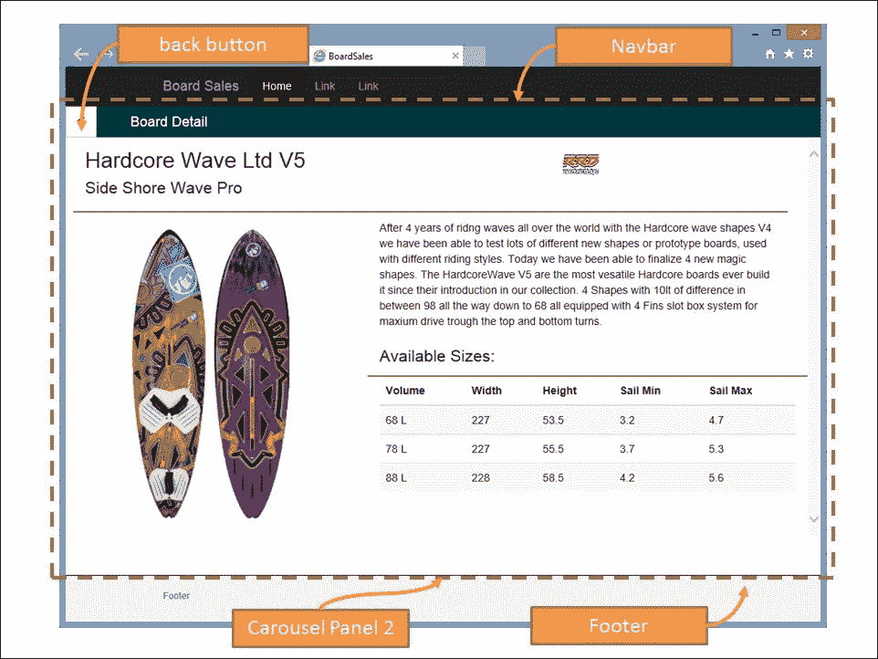
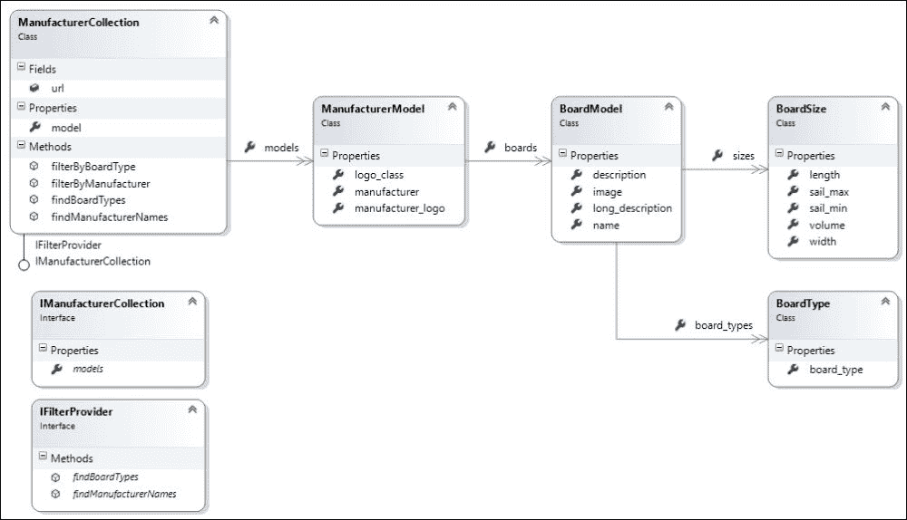
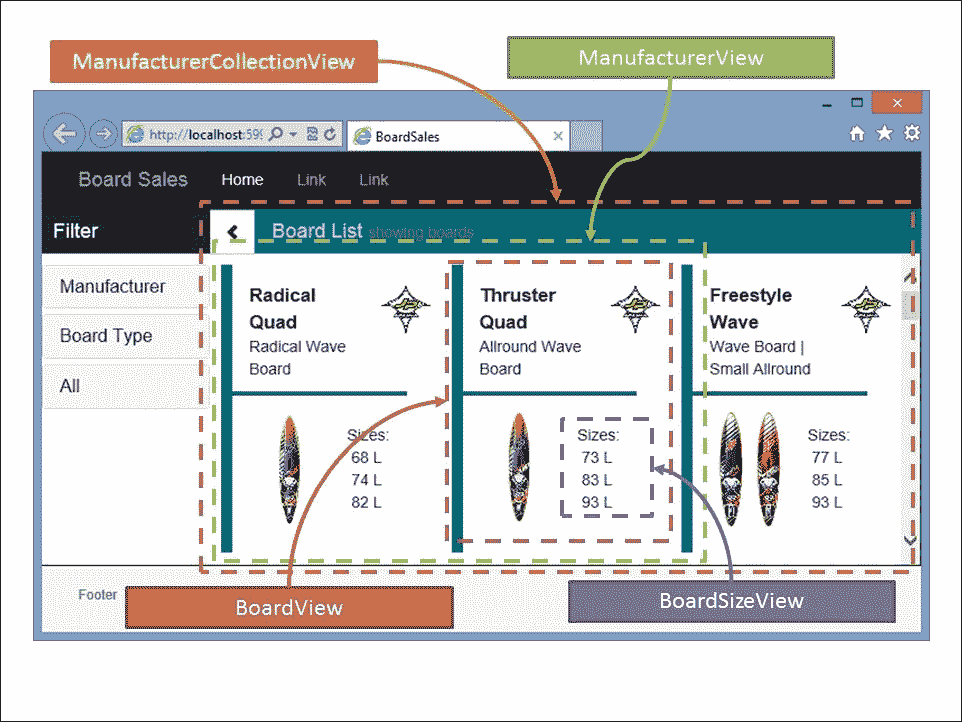
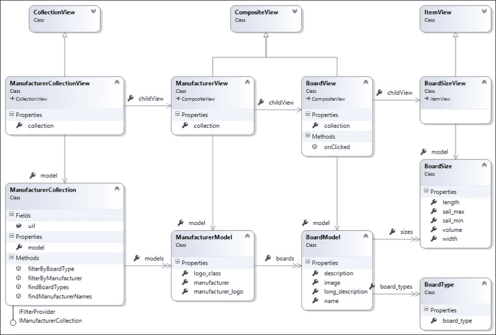
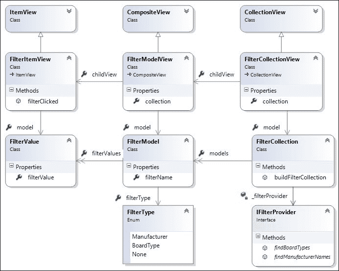
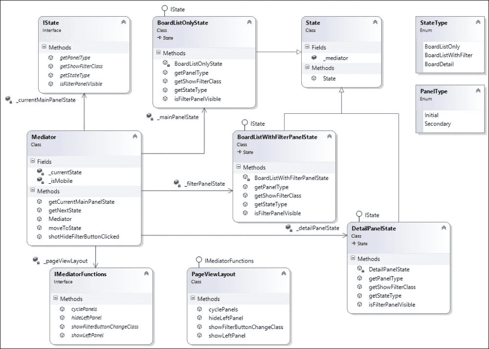

# 第九章。让我们把手弄脏

在本章中，我们将从头开始构建一个 TypeScript 单页 web 应用程序。我们将首先讨论网站应该是什么样子，我们希望我们的页面转换如何流动，然后继续阐述 Bootstrap 框架的功能，并讨论我们网站的纯 HTML 版本。然后，我们的重点将转向应用程序所需的数据结构，以及我们需要什么样的主干模型和集合来表示这些数据。在此过程中，我们将为这些模型和集合编写一组单元和集成测试。

一旦我们有了要处理的数据，我们将使用**提线木偶**框架来构建视图，以便将我们的应用程序呈现给 DOM。然后，我们将展示如何将网站的纯 HTML 版本分解成更小的 HTML 片段，然后将这些片段与我们的提线木偶视图集成在一起。最后，我们将使用事件将应用程序绑定在一起，并探索**状态**和**中介**设计模式，以帮助我们管理复杂的页面转换和 DOM 元素。

# 提线木偶

提线木偶是主干库的扩展，并对框架进行了大量增强，以减少样板主干代码，并使处理 DOM 元素和 HTML 片段变得更加容易。提线木偶还引入了布局和区域的概念，以帮助管理大型网页中的 HTML 逻辑部分。提线木偶布局是一种管理几个区域的控制器，提线木偶区域是管理我们页面的特定 HTML 部分的对象。例如，我们可以有一个页眉区域，一个侧栏区域，另一个页脚区域。这允许我们将应用程序分成逻辑区域，然后通过消息传递将它们联系在一起。

# 自举

我们还将使用 Bootstrap 来帮助我们的页面布局。Bootstrap 是一个流行的移动优先框架，用于跨多个不同平台呈现 HTML 元素。Bootstrap 样式和定制对于它自己的书来说是一个足够大的主题，所以我们不会探究各种 Bootstrap 选项的来龙去脉。如果你热衷于学习更多的东西，那么一定要阅读大卫·科克伦和伊恩·惠特利的优秀书籍《bootstrap 网站蓝图》，*Packt Publishing*([https://www . Packtpub . com/web-development/bootstrap-Site-蓝图](https://www.packtpub.com/web-development/bootstrap-site-blueprints))。

# 主板销售

我们的应用程序将是一个相当简单的应用程序，称为冲浪板销售，并将使用摘要视图或冲浪板列表视图在主页面上列出一系列帆板。单击这些板中的任何一个将切换页面以显示所选板的详细信息。在屏幕的左侧，将有一个简单的面板，允许用户通过制造商或板类型过滤主板列表。

现代帆板有各种尺寸，是以体积来衡量的。较小体积的板通常用于波浪航行，较大体积的板用于比赛或障碍赛。介于两者之间的板可以归类为自由式板，用于在平坦的水面上表演杂技。任何板的另一个重要因素是该板设计的帆的范围。在非常强的风中，使用较小的帆来允许风帆冲浪运动员控制风产生的动力，而在较轻的风中，使用较大的帆来产生更多的动力。我们的摘要视图将包括每个板的体积测量值的快速参考，我们的详细视图将显示所有不同的板测量值和兼容的航程列表。

# 页面布局

有了这个应用，我们将利用 JavaScript 的强大功能，提供从左到右的面板式页面布局。我们将使用一些 Bootstrap 过渡从左侧或右侧滑入面板，以便为用户提供略有不同的浏览体验。让我们从概念上看一下这是什么样子:


董事会销售页面过渡的概念视图

**查看面板**将是我们的主页面，有**页眉面板**、**板列表面板**和 **页脚面板**。左侧隐藏的是**滤镜面板**，主面板左上角有一个按钮显示或隐藏该滤镜面板。当需要时，过滤面板会从左侧滑入，隐藏时会滑回左侧。同样的， **板明细** **面板**点击一块板会从右侧滑入，点击后退按钮会滑回右侧，露出板列表面板。

当在桌面设备上查看网站时，默认情况下会显示左侧的过滤面板，但是当在平板设备(屏幕较小)上查看网站时，默认情况下会隐藏过滤面板，以节省屏幕空间。

## 安装引导程序

Bootstrap 是 CSS 样式和 JavaScript 函数的集合，有助于简单轻松地构建响应性网站。Boostrap 的响应特性意味着页面将自动调整元素大小，以允许在手机的较小屏幕尺寸以及平板电脑和台式机上使用的较大屏幕上呈现。通过使用 Bootstrap，我们获得了额外的好处，能够以移动用户和桌面用户为目标，而对我们的 HTML 或 CSS 样式表几乎没有改变。

引导程序可以与 NuGet 包以及相应的类型脚本定义一起安装，如下所示:

```js
Install-package bootstrap

Install-package bootstrap.TypeScript.DefinitelyTyped

```

一旦安装了 Bootstrap，我们就可以开始构建一个使用 Bootstrap 纯 HTML 编写的示例网页。以这种方式构建演示页面有助于我们弄清楚我们将使用什么样的 Bootstrap 元素，并允许我们在开始构建应用程序之前修改我们的 CSS 样式和正确的 HTML 结构。这就是括号编辑器真正发挥作用的地方。通过使用编辑器的实时预览功能，我们可以在一个 IDE 中编辑我们的 HTML 和 CSS，并且在预览窗格中有即时的视觉反馈。以这种方式处理示例 HTML 是一种既有益又有趣的体验，更不用说节省大量时间了。

## 使用引导

我们的页面将对主页面区域使用几个引导元素，如下所示:

1.  渲染标题面板的**导航栏** 组件。
2.  用于渲染页脚面板的**页脚**组件。
3.  一个**转盘**组件从电路板列表视图滑动到电路板详细视图。
4.  一个**折叠**组件，用于在左侧面板中渲染过滤选项。
5.  **行**和**列**组件，用于在我们的板列表视图以及板详细视图中控制板的 HTML 布局。
6.  用于呈现表格的表格 CSS 元素。

在本章中，我们不会详细讨论如何使用 Bootstrap 构建 HTML 页面。相反，我们将从您可以在目录/ `tscode/tests/brackets/TestBootstrap.html`下的示例代码中找到的工作版本开始。

我们的引导元素如下:


在的顶部，我们的页面是 navbar 元素，它被赋予了一个`navbar-inverse`样式来渲染黑色背景的。 **转盘面板 1** 元素是第一个转盘面板，包含左侧过滤面板，以及板列表和 **显示/隐藏面板**按钮。左侧面板上的**过滤器**选项使用了 Bootstrap 手风琴组件。最后，我们的页脚被设计成“粘性页脚”，这意味着它将一直显示在页面上。

当我们点击板列表中的任何一个板时，我们的转盘组件将把转盘面板滑到左边，并从右边滑入板细节视图。

我们的板细节面板如下:



同样，我们有标准的页眉和页脚区域，但这一次，我们正在查看**转盘面板 2** 。这个面板在左上角有一个后退按钮，显示所选板上的详细信息。

当你运行这个测试页面时，你会注意到页脚区域有四个链接，分别是 **next** 、 **prev** 、 **show** 和 **hide** 。这些按钮用于测试转盘面板的循环，以及左侧面板的显示/隐藏功能。

Bootstrap 非常适合构建站点工作版本的快速模型。这个版本可以很容易地带到客户那里，或者带到项目会议上进行演示。向客户展示一个网站的演示模型会给你关于整个网站流程和设计的宝贵反馈。理想情况下，这种工作应该由一个资深的网页设计师来完成，或者由一个有同样技能的人来完成——他擅长 CSS 样式。

稍后当我们开始构建提线木偶视图时，我们将重用和返工这个 HTML。然而，将这些演示 HTML 页面保留在您的项目中是一个好主意，这样您就可以在不同的浏览器和设备上测试它们的外观，同时调整您的 HTML 布局和 CSS 样式。

# 数据结构

在现实世界的应用程序中，网站的数据会从某种数据库中存储和检索。为了使用 JavaScript 网页中的数据，这些数据结构将被序列化为 JSON 格式。提线木偶使用标准主干模型和集合来加载和序列化数据结构。对于这个示例应用程序，我们的数据结构如下所示:



制造集合和相关主干模型的类图

我们的数据来源是`ManufacturerCollection`，它将有一个`url`属性来从我们的站点加载数据。这个`ManufacturerCollection`收藏了`ManufacturerModels`，可以通过`models`房产获得。`ManufacturerCollection`还实现了两个接口:`IManufacturerCollection`和`IFilterProvider`。我们将在后面讨论这两个接口。

`ManufacturerModel`的属性将用于向 DOM 呈现单个制造商的名称和徽标。每个`ManufacturerModel`也有一个名为`boards`的数组，它包含一个`BoardModels`数组。

每个`BoardModel`都有渲染所必需的属性，以及一个名为`board_types`的数组，该数组包含一个`BoardType`类的数组。一个`BoardType`是一个简单的字符串，它将保存一个“波浪”、“自由式”或“回转”的值。

每个`BoardModel`也将有一个`sizes`数组，持有一个`BoardSize`类，包含可用大小的详细信息。

例如，用于序列化前面对象结构的 JSON 数据结构如下:

```js
{
"manufacturer": "JP Australia",
"manufacturer_logo": "jp_australia_logo.png",
"logo_class" : "",
"boards": [
    {
        "name": "Radical Quad",
        "board_types": [ { "board_type": "Wave" } ],

        "description": "Radical Wave Board",
        "image": "jp_windsurf_radicalquad_ov.png",
        "long_description": "long desc goes here",
        "sizes": [
            { "volume": 68, "length": 227, 
              "width": 53, "sail_min": "< 5.0", "sail_max": "< 5.2" }
        ]
    }]
}
```

在我们的示例应用程序中，可以在`/tscode/tests/boards.json`找到完整的 JSON 数据集。

## 数据接口

为了在 TypeScript 中使用这个 JSON 数据结构，我们需要定义一组接口来描述上面的数据结构，如下所示:

```js
export interface IBoardType {
    board_type: string;
}
export interface IBoardSize {
    volume: number;
    length: number;
    width: number;
    sail_min: string;
    sail_max: string;
}
export interface IBoardModel {
    name: string;
    board_types: IBoardType[];
    description: string;
    image: string;
    long_description: string;
    sizes: IBoardSize[];
}
export interface IManufacturerModel {
    manufacturer: string;
    manufacturer_logo: string;
    logo_class: string;
    boards: IBoardModel[];
}
```

这些接口只是匹配上图中的模型属性，然后我们就可以构建相应的`Backbone.Model`类来实现这些接口。请注意，为了简洁起见，我们没有在这里列出每个模型的每个单独属性，因此请务必参考随附的源代码以获得完整的列表。我们的主干模型如下:

```js
export class BoardType extends Backbone.Model
    implements IBoardType {
    get board_type() { return this.get('board_type'); }
    set board_type(val: string) { this.set('board_type', val); }
}
export class BoardSize extends Backbone.Model 
    implements IBoardSize {
    get volume() { return this.get('volume');}
    set volume(val: number) { this.set('volume', val); }
    // more properties
}
export class BoardModel extends Backbone.Model implements IBoardModel {
    get name() { return this.get('name'); }
    set name(val: string) { this.set('name', val); }
    // more properties
    get sizes() { return this.get('sizes'); }
    set sizes(val: IBoardSize[]) { this.set('sizes', val); }
}
export class ManufacturerModel extends Backbone.Model implements IManufacturerModel {
    get manufacturer() { return this.get('manufacturer'); }
    set manufacturer(val: string) { this.set('manufacturer', val); }
    // more properties
    get boards() { return this.get('boards'); }
    set boards(val: IBoardModel[]) { this.set('boards', val); }
}
```

每个类都扩展了`Backbone.Model`，并实现了我们前面定义的一个接口。除了为每个属性定义一个`get`和`set`方法，并使用正确的属性类型之外，这些类没有太多内容。

在这个阶段，我们的模型已经就位，我们可以编写一些单元测试，只是为了确保我们可以正确地创建我们的模型:

```js
it("should build a BoardType", () => {
    var boardType = new bm.BoardType(
        { board_type: "testBoardType" });
    expect(boardType.board_type).toBe("testBoardType");
});
```

我们从一个创建`BoardType`模型的简单测试开始，然后测试`board_type`属性是否设置正确。同样，我们可以为`BoardSize`模型创建一个测试:

```js
describe("BoardSize tests", () => {
    var boardSize: bm.IBoardSize;
    beforeAll(() => {
        boardSize = new bm.BoardSize(
          { "volume": 74, "length": 227,
            "width": 55, "sail_min": "4.0", "sail_max": "5.2" });
    });
    it("should build a board size object",() => {
        expect(boardSize.volume).toBe(74);
    });
});
```

这个测试也只是创建一个`BoardSize`模型的实例，但是它使用的是`beforeAll` Jasmine 方法。为了简洁起见，我们只展示了一个测试，它检查`volume`属性，但是在一个真实的应用程序中，我们将测试每个`BoardSize`属性。最后，我们可以对`BoardModel`写一个测试如下:

```js
describe("BoardModel tests",() => {
    var board: bm.IBoardModel;
    beforeAll(() => {
        board = new bm.BoardModel({
            "name": "Thruster Quad",
            "board_types": [{ "board_type": "Wave" }],
            "description": "Allround Wave Board",
            "image": "windsurf_thrusterquad_ov.png",
            "long_description": 
                "Shaper Werner Gnigler and pro riders Robby Swift",
            "sizes": [
                { "volume": 73, "length": 228, "width": 55.5,
                     "sail_min": "4.0", "sail_max": "5.2" }
            ]
        });
    });

    it("should find name property",() => {
        expect(board.name).toBe("Thruster Quad");
    });
    it("should find sizes[0].volume property",() => {
        expect(board.sizes[0].volume).toBe(73);
    });
    it("should find sizes[0].sail_max property",() => {
        expect(board.sizes[0].sail_max).toBe("5.2");
    });
    it("should find board_types[0].sail_max property",() => {
        expect(board.board_types[0].board_type).toBe("Wave");
    });
});
```

同样，我们正在我们的`beforeAll`函数中创建一个`BoardModel`实例，然后测试属性是否设置正确。请注意这段代码片段底部附近的测试:我们正在检查`sizes`属性和`board_types`属性是否已经正确构建，并且它们实际上是可以用`[]`数组符号引用的数组。

在附带的源代码中，您将找到对这些模型的进一步测试，以及对`ManufacturerModel`的测试。

### 注

请注意每个模型是如何用原始 JSON 示例的简单剪切和粘贴部分构建的。当主干模型通过 RESTful 服务进行水合时，这些服务只是返回 JSON——因此，我们的测试与主干本身要做的事情相匹配。

## 整合测试

在这个阶段，你可能想知道为什么我们要编写这类测试，因为它们可能看起来微不足道，并且只是检查某些属性是否被正确构造。在现实世界的应用程序中，模型变化非常频繁，尤其是在项目的开始阶段。有一个开发人员或团队的一部分负责后端数据库和服务器端代码，将 JSON 交付给前端，这是很常见的。另一个团队可能负责处理前端的 JavaScript 代码。通过编写这样的测试，您清楚地定义了您的数据结构应该是什么样子，以及您期望在模型中有什么属性。如果在服务器端进行了修改数据结构的更改，您的团队将能够快速识别问题的原因。

编写基于属性的测试的另一个原因是主干、提线木偶和几乎任何其他 JavaScript 库都将使用这些属性名向前端呈现 HTML。如果您有一个模板需要一个名为`manufacturer_logo`的属性，并且您将这个属性名称更改为`logo_image`，那么您的渲染代码将会中断。这些错误在运行时通常很难追踪。遵循“尽早失败，大声失败”的测试驱动开发口头禅，我们的模型属性测试将迅速突出这些潜在的错误，如果它们发生的话。

一旦一系列基于属性的测试就绪，我们现在就可以专注于实际调用服务器端代码的集成测试。这将确保我们的 RESTful 服务正常工作，并且我们的站点正在生成的 JSON 数据结构与我们的主干模型所期望的 JSON 数据结构相匹配。同样，如果两个独立的团队负责客户端和服务器端代码，这种集成测试将确保数据交换的一致性。

我们将通过`Backbone.Collection`类为这个应用程序加载数据，这个集合需要加载多个制造商。为此，我们现在可以构建如下的`ManufacturerCollection`类:

```js
export class ManufacturerCollection 
    extends Backbone.Collection<ManufacturerModel>
{
    model = ManufacturerModel;
    url = "/tscode/boards.json";
}
```

这是一个非常简单的`Backbone.Collection`类，只是将`model`属性设置为我们的`ManufacturerModel`，将`url`属性设置为`/tscode/boards.json`。由于我们的示例应用程序没有后端数据库或 REST 服务，因此在这个阶段我们将只从磁盘加载我们的 JSON。请注意，即使我们在这个测试中使用了一个静态 JSON 文件，主干仍然会向我们的服务器发出一个 HTTP 请求来加载这个文件，这意味着这个`ManufacturerCollection`的任何测试实际上都是一个集成测试。我们现在可以编写一些集成测试，以确保可以从`url`属性正确加载这个模型，如下所示:

```js
describe("ManufacturerCollection tests", () => {
    var manufacturers: bm.ManufacturerCollection;

    beforeAll(() => {
        manufacturers = new bm.ManufacturerCollection();
        manufacturers.fetch({ async: false });
    });

    it("should load 3 manufacturers", () => {
        expect(manufacturers.length).toBe(3);
    });

    it("should find manufacturers.at(2)",() => {
        expect(manufacturers.at(2).manufacturer)
           .toBe("Starboard");
    });
}
```

我们再次使用 Jasmine `beforeAll`语法来设置我们的`ManufacturerCollection`实例，然后调用`fetch({ async: false })`来等待集合被加载。然后我们有两个测试，一个检查我们正在将三个制造商加载到我们的集合中，另一个检查索引`2`处的`Manufacturer`模型。

## 遍历集合

现在我们已经加载了一个完整的`ManufacturerCollection`，我们可以将注意力转向处理它包含的数据。我们需要搜索这个集合来找到两件事:一个制造商的列表，和一个板类型的列表。这两个列表将由我们左侧面板上的过滤面板使用。在现实世界的应用程序中，这两个列表可能由服务器端代码提供，返回简单的 JSON 数据结构来表示这两个列表。然而，在我们的示例应用程序中，我们将展示如何遍历我们已经加载的主制造商主干集合。过滤数据结构如下:


带有相关主干模型的 FilterCollection 类图

与其列出上图所示的主干模型的完整实现，不如我们来看看 TypeScript 接口。我们针对这些过滤模型的界面如下:

```js
export enum FilterType {
    Manufacturer,
    BoardType,
    None
}
export interface IFilterValue {
    filterValue: string;
}
export interface IFilterModel {
    filterType: FilterType;
    filterName: string;
    filterValues: IFilterValue[];
}
```

我们从一个`FilterType`枚举开始，我们将使用它来定义我们可用的每种类型的过滤器。我们可以按制造商名称、电路板类型过滤电路板列表，或者使用`None`过滤器类型清除所有过滤器。

`IFilterValue`界面只是保存一个字符串值，用于过滤。当我们按板类型过滤时，该字符串值将是“Wave”、“自由式”或“Slalom”之一，当我们按制造商过滤时，该字符串值将是制造商的名称。

`IFilterModel`界面将保存`FilterType`，过滤器的名称，`filterValues`数组。

我们将为这些接口中的每一个创建一个主干模型，这意味着我们将得到两个主干模型，命名为`FilterValue`(实现`IFilterValue`接口)和`FilterModel`(实现`IFilterModel`接口)。为了容纳`FilterModel`实例的集合，我们还将创建一个名为`FilterCollection`的主干集合。该集合有一个名为`buildFilterCollection`的方法，它将使用一个`IFilterProvider`接口来构建其内部的`FilterModels`数组。该`IFilterProvider`界面如下:

```js
export interface IFilterProvider {
    findManufacturerNames(): bm.IManufacturerName[];
    findBoardTypes(): string[]
}
```

我们的`IFilterProvider`界面有两个功能。`findManufacturerNames`函数将返回制造商名称(及其相关标识)列表，`findBoardTypes`函数将返回所有电路板类型的字符串列表。这些信息是构建我们`FilterCollection`内部数据结构所需要的全部信息。

填充这个`FilterCollection`所需的所有值将来自已经包含在我们的`ManufacturerCollection`中的数据。因此，`ManufacturerCollection`将需要实现这个`IFilterProvider`接口。

### 查找制造商名称

让我们继续在我们的测试套件中使用来充实`ManufacturerCollection`需要实现的`findManufacturerNames`功能，作为`IFilterProvider`界面的一部分。该函数返回类型为`IManufacturerName`的数组，定义如下:

```js
export interface IManufacturerName {
    manufacturer: string;
    manufacturer_logo: string;
}
```

我们现在可以使用这个接口构建一个测试:

```js
it("should return manufacturer names ",() => {
    var results: bm.IManufacturerName[] = 
        manufacturers.findManufacturerNames();
    expect(results.length).toBe(3);
    expect(results[0].manufacturer).toBe("JP Australia");
});
```

这个测试重用了我们在之前的测试套件中设置的`manufacturers`变量。然后它调用`findManufacturerNames`函数，并期望结果是三个制造商名称的数组，即`"JP Australia"`、`"RRD",`和`"Starboard"`。

现在，我们可以更新实际的`ManufacturerCollection`类，以便提供一个`findManufacturerNames`函数的实现:

```js
public findManufacturerNames(): IManufacturerName[] {
    var items = _(this.models).map((iterator) => {
        return {
            'manufacturer': iterator.manufacturer,
            'manufacturer_logo': iterator.manufacturer_logo
        };
    });
    return items;
}
```

在这个函数中，我们使用名为`map`的下划线实用函数来循环遍历我们的集合。每个主干集合类都有一个名为`models`的内部数组。`map`函数将遍历这个`models`属性，并为集合中的每个项目调用匿名函数，通过`iterator`参数将当前模型传递给我们的匿名函数。然后，我们的代码用`IManufacturer`接口所需的属性构建一个 JSON 对象。

### 注

如果返回的对象不符合`IManufacturer`名称接口，TypeScript 编译器会产生错误。

### 查找板卡类型

我们现在可以将集中在`IFilterProvider`界面的第二个功能上，命名为`findBoardTypes`，这是`ManufacturerCollection`需要实现的。下面是单元测试:

```js
it("should find board types ",() => {
    var results: string[] = manufacturers.findBoardTypes();
    expect(results.length).toBe(3);
    expect(results).toContain("Wave");
    expect(results).toContain("Freestyle");
    expect(results).toContain("Slalom");
});
```

该测试调用`findBoardTypes`函数，该函数将返回一个字符串数组。我们期望返回的数组包含三个字符串:`"Wave"`、`"Freestyle"`和`"Slalom"`。

然后，我们的`ManufacturerCollection`类中的相应函数实现如下:

```js
public findBoardTypes(): string[] {
    var boardTypes = new Array<string>();
    _(this.models).each((manufacturer) => {
        _(manufacturer.boards).each((board) => {
            _(board.board_types).each((boardType) => {
                if (! _.contains(
                    boardTypes, boardType.board_type)) {
                        boardTypes.push(boardType.board_type);
                }
            });
        });
    });
    return boardTypes;
}
```

`findBoardTypes`函数的实现从创建一个名为`boardTypes`的新字符串数组开始，它将保存我们的结果。然后，我们使用下划线`each`功能在每个制造商之间循环。下划线`each`函数类似于`map`函数，将遍历我们集合中的每一项。然后，我们遍历制造商库中的每个板，并遍历每个板列出的每个板类型。最后，我们使用下划线`_.contains`函数来测试纸板类型集合是否已经包含一个项目。如果它在数组中还没有板类型，我们将`board_type`字符串推入我们的`boardTypes`数组。

### 注

下划线库有许多实用函数可用于搜索、操作和修改数组和集合，所以一定要查阅文档，找到适合在代码中使用的函数。这些函数不仅限于主干集合，还可以用于任何类型的数组。

这就完成了我们在`IFilterProvider`接口上的工作，以及它在`ManufacturerCollection`类中的实现。

## 过滤集合

当用户点击左侧面板上的过滤器选项时，我们需要将所选过滤器应用于制造商集合中包含的数据。为此，我们需要在`ManufacturerCollection`类中实现两个名为`filterByManufacturer`和`filterByBoardType`的函数。让我们从一个测试开始，按制造商名称过滤我们的集合:

```js
it("should filter by manufacturer name ",() => {
    var results = manufacturers.filterByManufacturer("RRD");
    expect(results.length).toBe(1);
});
```

该测试调用`filterByManufacturer`函数，期望只返回一个制造商。有了这个测试，我们可以在`ManufacturerCollection`上创建真正的`filterByManufacturer`功能，如下所示:

```js
public filterByManufacturer(manufacturer_name: string) {
    return _(this.models).filter((item) => {
        return item.manufacturer === manufacturer_name;
    });
}
```

这里，我们使用名为`filter`的下划线函数对我们的集合应用一个过滤器。

第二个过滤功能是按板型的，稍微复杂一点。我们需要遍历集合中的每个制造商，然后遍历每个电路板，然后遍历每个电路板类型。如果我们找到匹配的纸板类型，我们将标记该纸板以包含在结果集中。在我们处理`filterByBoardType`函数之前，让我们写一个测试:

```js
it("should only return Slalom boards ",() => {
    var results = manufacturers.filterByBoardType("Slalom");
    expect(results.length).toBe(2);
    _(results).each((manufacturer) => {
        _(manufacturer.boards).each((board) => {
            expect(_(board.board_types).some((boardType) => {
                return boardType.board_type == 'Slalom';
            })).toBeTruthy(); 

        });
    });
});
```

我们的测试调用`filterByBoardType`函数，使用字符串`"Slalom"`作为过滤器。请记住，该函数将返回顶层的`ManufacturerModel`对象的集合，其中每个对象内的`boards`数组按板类型过滤。然后，我们的测试循环遍历每个制造商和结果集中的每个板，然后使用名为`some`的下划线函数来测试`board_types`数组是否具有正确的板类型。

我们在`ManufacturerCollection`上实现这个功能的代码也有点棘手，如下所示:

```js
public filterByBoardType(board_type: string) {
    var manufWithBoard = new Array();
    _(this.models).each((manuf) => { 
        var hasBoardtype = false;
        var boardMatches = new Array();
        _(manuf.boards).each((board) => {
            var match = _(board.board_types).some((item) => {
                return item.board_type == board_type;
            });
            if (match) {
                boardMatches.push(new BoardModel(board));
                hasBoardtype = true;
            }
        });

        if (hasBoardtype) {
            var manufFiltered = new ManufacturerModel(manuf);
            manufFiltered.set('boards', boardMatches);
            manufWithBoard.push(manufFiltered);
        }
    });
    return manufWithBoard;
}
```

我们的`ManufacturerCollection`类实例保存了从站点通过 JSON 文件加载的整个集合。为了保留这些数据用于重复的过滤器，我们需要构造一个新的`ManufacturerModel`数组来从这个函数返回——这样我们就不需要修改底层的“全局”数据。一旦我们构建了这个新阵列，我们就可以遍历每个制造商。如果我们找到一个匹配所需过滤器的板，我们将设置一个名为`hasBoardType`的标志为真，以指示该制造商必须添加到我们的过滤阵列中。

该过滤阵列中的每个制造商还需要仅列出符合我们过滤标准的电路板类型，因此我们需要另一个称为`boardMatches`的阵列来容纳这些匹配的电路板。然后，我们的代码将循环遍历每个板，并检查它是否具有所需的`board_type`。如果是，我们会将其添加到`boardMatches`阵中，并将`hasBoardType`旗设置为`true`。

一旦我们为制造商遍历了每个板，我们就可以检查`hasBoardType`标志。如果我们的制造商有这种板类型，我们将构建一个新的`ManufacturerModel`，然后将该模型上的`boards`属性设置为匹配板的内存数组。

我们对底层主干集合和模型的工作现在已经完成。我们还编写了一组单元和集成测试，以确保我们可以从站点加载我们的集合，从这个集合构建我们的过滤列表，然后对这个数据应用特定的过滤器。

# 提线木偶应用、区域和布局

我们现在可以将注意力集中在构建应用程序本身上。在提线木偶中，这是通过创建一个从`Marionette.Application`派生出的类来实现的，如下所示:

```js
export class BoardSalesApp extends Marionette.Application {
    viewLayout: pvl.PageViewLayout;
    constructor(options?: any) {
        if (!options)
            options = {};
        super();
        this.viewLayout = new pvl.PageViewLayout();
    }
    onStart() {
        this.viewLayout.render();
    }
}
```

在这里，我们已经定义了一个名为`BoardSalesApp`的类，它从`Marionette.Application`类派生而来，并将作为我们应用程序的起点。我们的构造函数相当简单，并且创建了一个新的`PageViewLayout`类的实例，我们将很快讨论它。我们应用程序中唯一的其他功能是`onStart`功能，它将我们的`PageViewLayout`渲染到屏幕上。该`onStart`功能将在应用启动时由提线木偶触发。

我们的`PageLayoutView`课如下:

```js
export class PageViewLayout extends Marionette.LayoutView<Backbone.Model> {
    constructor(options?: any) {
        if (!options)
            options = {};
        options.el = '#page_wrapper';
        var snippetService: ISnippetService = 
            TypeScriptTinyIoC.resolve(IISnippetService);
        options.template = snippetService.retrieveSnippet(
            SnippetKey.PAGE_VIEW_LAYOUT_SNIPPET);
        super(options);
    }
}
```

这个类从`Marionette.LayoutView`开始延伸，做了两件重要的事情。首先，它在`options`对象上设置一些属性，然后通过`super`函数调用基类构造函数，传入这个`options`对象。这个`options`对象的属性之一被命名为`el`，并且包含这个视图将要渲染到的 DOM 元素的名称。在这个代码片段中，这个`el`属性被设置为 DOM 元素`'#page_wrapper'`。如果没有这个`el`属性集，当我们试图将视图渲染到 DOM 时，我们只会得到一个空白屏幕。

我们的构造函数的第二个重要步骤是从`SnippetService`加载一个片段。这个片段然后被用来设置`options`对象的`template`属性。类似于主干，提线木偶加载一个模板，然后将底层模型属性与视图模板相结合，以便生成将呈现给 DOM 的 HTML。

在这个阶段，为了运行我们的`BoardSalesApp`，并让它将`PageViewLayout`渲染到 DOM 中，我们需要两件事。第一个是我们的`index.html`页面中带有`id="page_wrapper"`的 DOM 元素，以匹配我们的`options.el`属性，第二个是我们的`PAGE_VIEW_LAYOUT_SNIPPET`。

我们的`index.html`页面如下:

```js
<!DOCTYPE html>
<html >
<head>
    <title>BoardSales</title>
    <link rel="stylesheet" href="/Content/bootstrap.css" />
    <link rel="stylesheet" type="text/css"
          href="/Content/app.css">
    <script type="text/javascript"
            src="/Scripts/head-1.0.3.js"></script>
    <script data-main="/tscode/app/AppConfig"
            type="text/javascript"
            src="/Scripts/require.js"></script>
</head>
<body>
    <div id="page_wrapper">

    </div>
    <footer class="footer footer_style">
        <div class="container">
            <p class="text-muted"><small>Footer</small></p>
        </div>

    </footer>
</body>
</html>
```

该页面包括`bootstrap.css`和`app.css`样式表，以及对需求的调用，其中 `data-main`属性被设置为名为`/tscode/app/AppConfig`的需求配置文件。`index.html`页面的主体只包括带有`id="page_wrapper"`的 DOM 元素和一个页脚。这是我们之前构建的演示 HTML 页面的一个非常精简的版本。

### 注

我们还包含了一个名为`head-1.0.3.js`的脚本，可以通过 NuGet 包`HeadJS`进行安装。这个脚本会询问我们的浏览器，看它是运行在移动设备上还是桌面设备上，我们使用的是什么浏览器，甚至当前的屏幕大小是多少。我们将在以后的应用中使用`head.js`的输出。

我们现在需要为`PageViewLayout`创建一个 HTML 片段。这个文件叫做`PageViewLayout.html`，位于`/tscode/app/views`目录下，所以我们在使用`PageViewLayout.ts`文件的时候很容易找到。看看这个 HTML 文件的完整列表的示例代码，它包括以下相关部分:

```js
<div id="page_wrapper">
    <div id="main_panel_div">
            <div class="carousel-inner" >
                <div id="carousel_panel_1" >
                    <div id="content_panel_left" >
                            <!--filter panel goes here-->
                    </div>
                    <div id="content_panel_main">
                      <div id="manufacturer_collection">
                            <!--board list goes here-->
                        </div>
                    </div>
                </div>
                <div id="carousel_panel_2">
                        <!--board detail panel goes here-->
                </div>
            </div>
    </div>
</div>
```

我们的`PageViewSnippet.html`文件包含了我们页面的主要元素。我们有`main_panel_div`作为我们应用程序的中间面板，有一个`carousel-inner` div，包含我们的两个转盘面板 div，命名为`carousel_panel_1`和`carousel_panel_2`。在这些转盘面板中，我们将呈现过滤器面板、电路板列表面板和电路板细节面板。

我们现在需要将我们的需要加载的`AppConfig.ts`文件放在一起，并设置`SnippetService`来加载`PageViewLayout.html`片段。为了简洁起见，我们没有在此列出完整的`require.config`，并且排除了`paths`和`shims`部分。我们将重点关注对需求的调用，如下所示:

```js
require([
    'BoardSalesApp', 'tinyioc', 'snippetservice'
    ,'text!/tscode/app/views/PageViewLayout.html' ],
    (app, tinyioc, snippetservice, pageViewLayoutSnippet) => {

     var snippetService = new SnippetService();
     snippetService.storeSnippet(
          SnippetKey.PAGE_VIEW_LAYOUT_SNIPPET,
          pageViewLayoutSnippet);
     TypeScriptTinyIoC.register(snippetService, IISnippetService);

     var boardSalesApp = new app.BoardSalesApp();
     boardSalesApp.start();

    });
```

这里，我们包括了`BoardSalesApp`、`tinyioc`和`snippetservice`，以及我们的`PageViewLayout.html`代码片段。然后我们设置`SnippetService`，对照正确的钥匙存储`pageViewLayoutSnippet`，并使用我们的服务定位器注册`SnippetService`。为了启动我们的提线木偶应用程序，我们创建一个新的`BoardSalesApp`实例，并调用`start`。一旦`start`方法被调用，我们的`BoardSalesApp.onStart`方法将被提线木偶激发，然后提线木偶将渲染`PageViewLayout`类。

## 加载主集合

在这个应用程序中，我们将只加载我们的`ManufacturerCollection`一次，然后重用这个“全局”集合进行过滤。现在让我们更新我们的`BoardSalesApp`以包含这个“全局”集合，并在应用程序启动时加载它。同样，请参考完整列表的示例代码:

```js
export class BoardSalesApp extends Marionette.Application {
    viewLayout: pvl.PageViewLayout;
    _manufCollection: bm.ManufacturerCollection;

    constructor(options?: any) {
        if (!options)
            options = {};
        super();
        _.bindAll(this, 'CollectionLoaded');
        _.bindAll(this, 'CollectionLoadError');
        this.viewLayout = new pvl.PageViewLayout();
    }

    onStart() {
        this.viewLayout.render();
        this._manufCollection = new bm.ManufacturerCollection();
        TypeScriptTinyIoC.register(this._manufCollection, 
            bm.IIManufacturerCollection);
        this._manufCollection.fetch({ 
            success: this.CollectionLoaded, 
            error: this.CollectionLoadError });
    }

    CollectionLoaded() {
        TypeScriptTinyIoC.raiseEvent(
            new ev.NotifyEvent(
                ev.EventType.ManufacturerDataLoaded), ev.IINotifyEvent);
    }

    CollectionLoadError(err) {
        TypeScriptTinyIoC.raiseEvent(
           new ev.ErrorEvent(err), ev.IIErrorEvent);
    }
}
```

我们已经更新了我们的`BoardSalesApp`，在名为`_manufCollection`的私有变量中存储了一个`ManufacturerCollection`类的实例。在调用`viewLayout.render`后，我们的`onStart`函数已被更新以实例化该集合。请注意下一个对`TypeScriptTinyIoC`的调用。我们正在将`this._manufCollection`注册为将实现`IIManufacturerCollection`命名接口的服务。然后，我们在集合上调用主干`fetch`函数，带有`success`和`error`回调。`success`回调和`error`回调都只是引发一个事件。

通过针对命名接口`IIManufacturerCollection`注册我们的`ManufacturerCollection`类的实例，我们任何需要访问主集合的类都可以简单地从我们的服务定位器请求这个类的实例。这些命名接口如下:

```js
export interface IManufacturerCollection {
    models: ManufacturerModel[];
}
export class IIManufacturerCollection implements IInterfaceChecker {
    propertyNames = ['models'];
    className = 'IIManufacturerCollection';
}
```

我们还需要修改我们的`ManufacturerCollection`类来实现`IManufacturerCollection`接口，如下所示:

```js
export class ManufacturerCollection extends Backbone.Collection<ManufacturerModel>
    implements IManufacturerCollection
{
    // existing code
}
```

现在让我们看看将从我们的`success`和`error`回调中触发的事件。在`success`函数回调中，我们正在引发一个类型为`INotifyEvent`的事件。注意我们只是在这里列出接口定义——对应的`IInterfaceChecker`类和事件类，请参考附带的源代码:

```js
export enum EventType {
    ManufacturerDataLoaded,
    ErrorEvent
}
export interface INotifyEvent {
    eventType: EventType;
}
export interface INotifyEvent_Handler {
    handle_NotifyEvent(event: INotifyEvent): void;
}
```

这里，我们定义了一个`EventType`枚举来保存一个事件类型，然后定义了一个`INotifyEvent`接口来保存一个名为`eventType`的属性。我们还定义了任何处理程序都需要实现的相应`INotifyEvent_Handler`接口。

我们的错误事件将使用继承从这些接口派生，如下所示:

```js
export interface IErrorEvent extends INotifyEvent {
    errorMessage: string;
}
export interface IErrorEvent_Handler {
    handle_ErrorEvent(event: IErrorEvent);
}
```

在这里，我们从`INotifyEvent`派生`IErrorEvent`接口，从而重用来自基础接口的`EventType`枚举和属性。

我们现在可以在`PageViewLayout`课上对这些事件做出回应:

```js
export class PageViewLayout extends Marionette.LayoutView<Backbone.Model>
    implements ev.INotifyEvent_Handler
{

    private _manufacturerView: mv.ManufacturerCollectionView;

    constructor(options?: any) {
        // exising code
        _.bindAll(this, 'handle_NotifyEvent');
        TypeScriptTinyIoC.registerHandler(
            this, ev.IINotifyEvent_Handler, ev.IINotifyEvent);
    }
    handle_NotifyEvent(event: ev.INotifyEvent) {
        if (event.eventType == ev.EventType.ManufacturerDataLoaded) 
        {
            this._manufacturerView =
                new mv.ManufacturerCollectionView();
            this._manufacturerView.render();
        }
    }
}
```

我们已经实现了`INotifyEvent_Handler`接口，并为`IINotifyEvent`注册了`TypeScriptTinyIoC`。我们的`handle_NotifyEvent`类将检查事件类型是否是`ManufacturerDataLoaded`事件，然后创建一个`ManufacturerCollectionView`类的实例并将其渲染到 DOM 中。

## 提线木偶视图

基于我们需要渲染到 DOM 的对象类型，提线木偶为我们提供了许多不同的视图类。任何需要渲染`Backbone.Collection`的类都可以使用`CollectionView`，任何需要渲染集合中单个项目的类都可以使用`ItemView`。提线木偶还提供了这两种观点的混合，称为`CompositeView`。如果我们看一下我们的演示应用程序，我们将能够将屏幕分成多个逻辑视图，如下所示:



带提线木偶视图覆盖的棋盘列表视图

我们需要构建哪些视图的识别与我们主干集合和模型的数据结构密切相关。当我们将前面的视图叠加到我们的`ManufacturerCollection`类图的顶部时，可以清楚地看到这种关系:



带有相应提线木偶视图的模型类图

### 制造集合视图类

我们从 `ManufacturerCollectionView`开始，这是一个渲染整个`ManufacturerCollection`的视图。我们还需要一个`ManufacturerView`来渲染一个特定的`ManufacturerModel`，然后一个`BoardView`来渲染一个制造商的军火库中的每个板子。每个板都有一个内部的`BoardSize`对象数组，所以我们将创建一个`BoardSizeView`来渲染这些项目。

让我们从`ManufacturerCollectionView`开始构建这些视图:

```js
export class ManufacturerCollectionView
    extends Marionette.CollectionView<bm.ManufacturerModel> {
    constructor(options?: any) {
        if (!options)
            options = {};
        options.el = '#manufacturer_collection';
        options.className = "row board_row";

        super(options);
        this.childView = ManufacturerView;

        var manufColl: bm.IManufacturerCollection = 
           TypeScriptTinyIoC.resolve(bm.IIManufacturerCollection);
        if (!options.collection) {
            this.collection = <Backbone.Collection<bm.ManufacturerModel>> manufColl;
        } else {
            this.collection = options.collection;
        }
    }
}
```

这个类从`Marionette.CollectionView`开始扩展，并指定我们的`ManufacturerModel`作为该类的泛型类型。我们的`constructor`将`options`对象的`el`属性设置为`"#manufacturer_collection"`。正如我们在`PageLayoutView`中看到的，提线木偶将使用这个属性将整个集合渲染到 DOM 中。我们还在我们的`options`中设置了`className`属性。提线木偶将使用`className`属性向外部 DOM 元素追加一个`class="…"`属性。这将把`row`和`board_row`的 CSS 样式应用到渲染的 HTML 中的`manufacturer_collection`元素。一旦我们正确地构造了`options`，我们就调用`super(options)`将这些选项传递给基类构造器。

`CollectionView`的`childView`属性指示提线木偶为它在集合中找到的每个元素创建一个我们指定的类的实例。我们已经将这个`childView`属性设置为`ManfuacturerView`，因此提线木偶将为集合中的每个元素构建一个新的`ManufacturerView`。

最后，在我们的构造函数中，我们使用我们的服务定位器模式来查找我们的`ManufacturerCollection`服务的实例，然后我们将内部`this.collection`属性设置为返回的对象。一旦我们定义了一个`childView`类名，并设置了`this.collection`属性，提线木偶将自动创建我们的子视图的实例，并将它们渲染到 DOM 中。

请注意，我们不需要`CollectionView`的 HTML 模板或片段。这是因为我们将单个项目的渲染推迟到`childView`类。

### 制造商视图类

我们的`childView` 班，`ManufacturerView`，如下:

```js
export class ManufacturerView
    extends Marionette.CompositeView<Backbone.Model> {
    constructor(options?: any) {
        if (!options)
            options = {};
        options.template = _.template('<div></div>');
        super(options);
        this.collection = new Backbone.Collection(
            this.model.get('boards')
        );
        this.childView = BoardView;
        this.childViewOptions = { 
            parentIcon: this.model.get('manufacturer_logo')
        };
    }
}
```

在这种情况下，我们从`Marionette.CompositeView`导出我们的视图，并使用标准的`Backbone.Model`作为泛型类型。因为我们的主板列表视图中有多个制造商，所以我们不需要为每个制造商呈现任何特定的内容。因此，我们的模板是一个简单的`<div></div>`。

这个视图的重要部分是为我们的`boards`数组设置一个新的`Backbone.Collection`，然后设置一个`childView`类来渲染集合中的每个`board`。我们的`childView`属性设置为`BoardView`，我们还设置了一个`childViewOptions`属性，该属性将被发送到每个`BoardView`实例。请记住，每个`BoardView`都显示制造商标志，但该标志图像是在制造商级别持有的。因此，我们需要将这些信息传递给每个创建的`BoardView`。提线木偶允许我们使用`childViewOptions`属性将任何额外的属性传递给子视图。这里，我们定义了一个`parentIcon`属性作为这个`childViewOptions`对象的一部分，以便将制造商标志传递给子`BoardView`类的每个实例。该`parentIcon`属性将通过`options`参数提供给子视图。

### 木板视图类

我们的`BoardView`班是也是`CompositeView`如下:

```js
export class BoardView
    extends Marionette.CompositeView<bm.BoardModel> {
    constructor(options?: any) {
        if (!options)
            options = {};
            var snippetService: ISnippetService =
               TypeScriptTinyIoC.resolve(IISnippetService);
            options.template = _.template(
               snippetService.retrieveSnippet(
                  SnippetKey.BOARD_VIEW_SNIPPET)
            );
        super(options);

        this.model.set('parentIcon', options.parentIcon);

         this.collection =
            <any>(new Backbone.Collection(
                this.model.get('sizes')));
        this.childView = BoardSizeView;
        this.childViewContainer = 'tbody';

        var snippetService: ISnippetService = 
             TypeScriptTinyIoC.resolve(IISnippetService);
        this.childViewOptions = { 
             template: _.template(
                  snippetService.retrieveSnippet(
                      SnippetKey.BOARD_SIZE_MINI_VIEW_SNIPPET)
                )
        };

    }

}
```

这个`BoardView`构造器做了几件事。首先，它检索名为`BOARD_VIEW_SNIPPET`的片段作为自己的`template`。然后，它设置一个名为`parentIcon`的内部模型属性来存储从父视图通过`options`参数传入的`parentIcon`属性。然后我们为`sizes`数组创建一个新的`Backbone.Collection`，并将属性设置为`BoardSizeView`。`childViewContainer`属性告诉提线木偶，在我们的代码片段中有一个`<tbody></tbody>` HTML div，它应该用来将任何`childView`渲染到其中。最后，我们检索另一个名为`BOARD_SIZE_MINI_VIEW_SNIPPET`的片段，并将该片段作为`template`属性传递给`childView`。

不是每个`BoardSizeView`类解析自己的 HTML 片段，我们已经将类层次结构中使用哪个片段的控制权转移到了`BoardSizeView`的父类。这允许我们在这个概要视图中重用`BoardSizeView`类，以及在`BoardDetailView`中，我们将在后面讨论。由于汇总大小视图和详细大小视图的内部数据模型是相同的，因此需要更改的只是我们的 HTML 模板。因此，我们使用`childViewOption`属性将这个模板传递给`BoardSizeView`，正如我们之前看到的。

### BoardSizeView 类

我们的`BoardSizeView`类再简单不过了，如下:

```js
export class BoardSizeView
    extends Marionette.ItemView<bm.BoardSize> {
    constructor(options?: any) {
        if (!options)
            options = {};
        super(options);
    }
}
```

这个类只是一个`ItemView`，它使用`BoardSize`模型作为泛型。我们在这个类中没有任何自定义代码，但是我们只是在前面的`BoardView`类中将它用作一个名为`childView`的类。

现在让我们来看看这些视图中的每一个所需的 HTML 片段。首先是我们的`BoardViewSnippet.html`。同样，您可以在附带的源代码中找到完整的片段。`BoardViewSnippet.html`的总体结构如下:

```js
<div class="col-sm-4 board_panel">
    <div class="board_inner_panel">
         <div class="row board_title_row">
         <!- -some divs just for styling here -->
            <%= name %>
         <!- -some divs just for styling here -->
            <%= description %>
            " />
         </div>
         <div class="row board_details_row">
            <a >
                " />
            </a>
         <!- -some divs just for styling here -->
             Sizes:
             <table>
                <tbody></tbody>
             </table>
         </div>
    </div>
</div>
```

在这个片段中，我们包含了`<%= name %>`、`<%= description %>`、`<%= parentIcon %>`和`<%= image %>`语法作为模型属性的占位符。在片段的底部，我们创建了一个带有空的`<tbody></tbody>`标签的表格。这个标签对应于我们在`BoardView`类中使用的`childViewContainer`属性，提线木偶会将每个`BoardSizeView`项目渲染到这个`<tbody>`标签中。

我们的`BoardSizeMiniViewSnippet.html`如下:

```js
<tr>
    <td>&nbsp;</td>
    <td><%= volume %> L</td>
</tr>
```

这里，我们只对`BoardSize`模型的`<%= volume %>`属性感兴趣。有了这些视图类和两个片段，我们的板列表视图就完成了。我们所需要做的就是将这些片段加载到我们的`require.config`块中，并将适当的片段存储在我们的`SnippetService`实例中:

```js
require([
    'BoardSalesApp', 'tinyioc', 'snippetservice'
    , 'text!/tscode/app/views/PageViewLayout.html'
    , 'text!/tscode/app/views/BoardViewSnippet.html'
    , 'text!/tscode/app/views/BoardSizeMiniViewSnippet.html'
    ],(app, tinyioc, snippetservice, pageViewLayoutSnippet
      , boardViewSnippet, bsMiniViewSnippet) => {

        var snippetService = new SnippetService();
        snippetService.storeSnippet(
            SnippetKey.PAGE_VIEW_LAYOUT_SNIPPET,
                pageViewLayoutSnippet);
        snippetService.storeSnippet(
            SnippetKey.BOARD_VIEW_SNIPPET, boardViewSnippet);
        snippetService.storeSnippet(
            SnippetKey.BOARD_SIZE_MINI_VIEW_SNIPPET,
                bsMiniViewSnippet);

        var boardSalesApp = new app.BoardSalesApp();
        boardSalesApp.start();

    });
```

### 使用 IFilterProvider 接口进行过滤

当我们将放在一起`ManufacturerCollection`类时，我们编写了两个函数来查询数据结构，并返回制造商和电路板类型的列表。这两个函数分别被称为`findManufacturerNames`和`findBoardTypes`。我们新的`FilterCollection`类将需要调用这些方法来从我们的“全局”数据集检索过滤器值。

我们可以通过两种方式实现这个功能。一种方法是通过名为`IIManufacturerCollection`的接口获取对全局`ManufacturerCollection`实例的引用。然而，这个选项意味着`FilterCollection`的代码需要理解`ManufacturerCollection`的代码。实现这一功能的更好方法是获取对`IFilterProvider`接口的引用。这个接口将只公开我们构建过滤器列表所需的两种方法。让我们采用第二种方法，定义一个命名接口，如下所示:

```js
export interface IFilterProvider {
    findManufacturerNames(): bm.IManufacturerName[];
    findBoardTypes(): string[]
}
export class IIFilterProvider implements IInterfaceChecker {
    methodNames = ['findManufacturerNames', 'findBoardTypes'];
    className = 'IIFilterProvider';
}
```

然后我们可以简单地修改现有的`ManufacturerCollection`来实现这个接口(它已经实现了):

```js
export class ManufacturerCollection extends Backbone.Collection<ManufacturerModel>
    implements IManufacturerCollection, fm.IFilterProvider
{
    // existing code
}
```

我们现在可以用`BoardSalesApp.onStart`方法将`ManufacturerCollection`和`TypeScriptTinyIoC`注册到`IIFilterProvider`命名界面，如下所示:

```js
onStart() {
        this.viewLayout.render();
        this._manufCollection = new bm.ManufacturerCollection();
        TypeScriptTinyIoC.register(this._manufCollection, bm.IIManufacturerCollection);
        TypeScriptTinyIoC.register(this._manufCollection,
            fm.IIFilterProvider);
        this._manufCollection.fetch({ 
            success: this.CollectionLoaded, error: this.CollectionLoadError });
}
```

我们的`ManufacturerCollection`现在是注册提供`IIManfacturerCollection`命名接口，以及`IIFilterProvider`命名接口。

### filter collection 类

我们的`FilterCollection`可以在其构造函数中解析`IIFilterProvider`接口，如下所示:

```js
export class FilterCollection extends Backbone.Collection<FilterModel> {
    model = FilterModel;

    private _filterProvider: IFilterProvider;
    constructor(options?: any) {
        super(options);
        try {
            this._filterProvider = 
            TypeScriptTinyIoC.resolve(IIFilterProvider);
        } catch (err) {
            console.log(err);
        }
    }
}
```

这里，我们将调用`TypeScriptTinyIoC`返回的类存储在名为`_filterProvider`的私有变量中。通过为`FilterProvider`定义这些接口，我们现在可以用模拟的`FilterProvider`对我们的`FilterCollection`进行单元测试，如下所示:

```js
class MockFilterProvider implements fm.IFilterProvider {
    findManufacturerNames(): bm.IManufacturerName[] {
        return [ 
        { manufacturer: 'testManuf1',
          manufacturer_logo: 'testLogo1'}, { manufacturer: 'testManuf2',
          manufacturer_logo: 'testLogo2' }
        ];
    }
    findBoardTypes(): string[] {
        return ['boardType1', 'boardType2', 'boardType3'];
    }
}
describe('/tscode/tests/models/FilterModelTests',() => {
    beforeAll(() => {
        var mockFilterProvider = new MockFilterProvider();
        TypeScriptTinyIoC.register(
            mockFilterProvider, fm.IIFilterProvider);
    });
});
```

在我们测试的设置中，我们正在创建一个`MockFilterProvider`来实现我们的`IFilterProvider` 接口，并且我们已经为了我们测试的目的注册了它。通过使用模拟提供者，我们也确切地知道在我们的测试中期望什么数据。我们的实际测试如下:

```js
describe("FilterCollection tests",() => {
    var filterCollection: fm.FilterCollection;
    beforeAll(() => {
        filterCollection = new fm.FilterCollection();
        filterCollection.buildFilterCollection();
    });

    it("should have two manufacturers", () => {
        var manufFilter = filterCollection.at(0);
        expect(manufFilter.filterType)
           .toBe(fm.FilterType.Manufacturer);
        expect(manufFilter.filterValues[0].filterValue)
           .toContain('testManuf1');
    });

    it("should have two board types",() => {
        var manufFilter = filterCollection.at(1);
        expect(manufFilter.filterType)
           .toBe(fm.FilterType.BoardType);
        expect(manufFilter.filterValues[0].filterValue)
           .toContain('boardType1');
    });
});
```

这些测试从创建`FilterCollectionClass`的实例开始，然后调用`buildFilterCollection`函数。然后，我们测试该集合在索引`0`处有一个`FilterType.Manufacturer`，以及期望值。有了这些失败的测试，我们可以充实`buildFilterCollection`功能:

```js
buildFilterCollection() {
    // build Manufacturer filter.
    var manufFilter = new FilterModel({
        filterType: FilterType.Manufacturer,
        filterName: "Manufacturer"
    });
    var manufArray = new Array<FilterValue>();
    if (this._filterProvider) {
        _(this._filterProvider.findManufacturerNames())
            .each((manuf) => {
                manufArray.push(new FilterValue(
                    { filterValue: manuf.manufacturer }));
        });
        manufFilter.filterValues = manufArray;
    }
    this.push(manufFilter);
    // build Board filter.
    var boardFilter = new FilterModel({
        filterType: FilterType.BoardType,
        filterName: "Board Type"
    });
        var boardTypeArray = new Array<FilterValue>();
    if (this._filterProvider) {
        _(this._filterProvider.findBoardTypes()).each((boardType) =>
        {
            boardTypeArray.push(new FilterValue(
                { filterValue: boardType }));
        });
        boardFilter.filterValues = boardTypeArray;
    }
    this.push(boardFilter);
    // build All filter to clear filters.
    var noFilter = new FilterModel({
        filterType: FilterType.None,
        filterName: "All"
    });
    var noTypeArray = new Array<FilterValue>();
    noTypeArray.push(new FilterValue({ filterValue: "Show All" }));
    noFilter.filterValues = noTypeArray;
    this.push(noFilter);
}
```

我们的`buildFilterCollection`功能正在创建一个`FilterModel`的三个实例。名为`manufFilter`的第一个实例将其`filterType`设置为`FilterType.Manufacturer`，并使用`_filterProvider.findManufacterNames`功能建立该`FilterModel`的值。然后通过调用`this.push(manufFilter)`将`manufFilter`实例添加到内部`collection`中。第二个和第三个`FilterModel`实例的`filterType`分别设置为`FilterType.BoardType`和`FilterType.None`。

## 过滤视图

同样，当我们将视图叠加在主干模型之上时，我们需要实现的提线木偶视图与底层主干集合和模型之间的关系很容易可视化，如下所示:



显示相关提线木偶视图的过滤类图

第一个视图名为`FilterCollectionView`，将从`CollectionView`衍生而来，并绑定到我们的顶级`FilterCollection`。第二个视图名为`FilterModelView`将是一个`CompositeView`，并将每个`FilterType`渲染到它自己的手风琴式头部。第三个也是最后一个视图将是每个过滤器选项的`ItemView`，并被命名为过滤器项目视图。

构建这些提线木偶视图的过程与我们对以前的制造商视图和电路板视图所做的非常相似。出于这个原因，我们在这里不详细讨论每个视图的实现。请务必参考本章中包含的示例代码，以获得这些视图及其相关 HTML 片段的完整列表。

现在我们已经在左侧面板上渲染了过滤器，我们将需要能够响应`FilterItemView`上的点击事件，并触发实际的过滤代码。

## 提线木偶中的 DOM 事件

提线木偶为捕捉 DOM 事件提供了一个简单的语法。任何视图都有一个名为`events`的内部属性，它会将 DOM 事件绑定到我们的提线木偶视图。然后，我们的`FilterItemView`可以更新以响应 DOM 事件，如下所示:

```js
export class FilterItemView
    extends Marionette.ItemView<fm.FilterValue> {
    private _filterType: number;
    constructor(options?: any) {
        if (!options)
            options = {};
        options.tagName = "li";
        options.template = 
            _.template('<a><%= filterValue %></a>');

        options.events = { click: 'filterClicked' };
        this._filterType = options.filterType;
        super(options);
        _.bindAll(this, 'filterClicked');

    }
    filterClicked() {
        TypeScriptTinyIoC.raiseEvent(
            new bae.FilterEvent(
                this.model.get('filterValue'),
                    this._filterType),
            bae.IIFilterEvent);
    }
}
```

我们已经为我们的`options`对象添加了一个`events`属性，并为`click` DOM 事件注册了一个处理函数。每当有人点击`FilterItemView`，提线木偶就会调用`filterClicked`功能。我们还为此事件添加了对`_.bindAll`的调用，以确保每当调用`filterClicked`函数时，`this`变量的作用域都是类实例。

请记住，这个`FilterItemView`的每个实例都有一个通过内部`model`属性可用的相应`FilterValue`模型。因此，在我们的`filterClicked`函数中，我们只是使用内部`model`变量的属性来提升一个新的`FilterEvent`。

我们的事件定义界面如下——同样，匹配的`IInterfaceChecker`定义请参考样例代码:

```js
export interface IFilterEvent {
    filterType: fm.FilterType;
    filterName: string;
}
export interface IFilterEvent_Handler {
    handle_FilterEvent(event: IFilterEvent);
}
```

我们现在可以在代码的其他地方注册这些过滤器事件的处理程序。放置这个事件处理程序的逻辑位置是在`PageViewLayout`本身，因为这个类负责渲染板列表。我们将在`PageViewLayout`上定义我们的`handle_FilterEvent`功能如下:

```js
handle_FilterEvent(event: ev.IFilterEvent) {

    var mainCollection: bm.ManufacturerCollection =
        TypeScriptTinyIoC.resolve(bm.IIManufacturerCollection);
    var filteredCollection;
    if (event.filterType == fm.FilterType.BoardType)
        filteredCollection = new bm.ManufacturerCollection(
            mainCollection.filterByBoardType(event.filterName));
    else if (event.filterType == fm.FilterType.Manufacturer)
        filteredCollection = new bm.ManufacturerCollection(
            mainCollection.filterByManufacturer(event.filterName));
    else if (event.filterType == fm.FilterType.None)
        filteredCollection = mainCollection;

    this._manufacturerView.collection = filteredCollection;
    this._manufacturerView.render();
}
```

该功能从获取对我们“全球”注册的`ManufacturerCollection`的引用开始。然后我们定义一个名为`filteredCollection`的变量来保存我们的主`ManufacturerCollection`的过滤版本。基于事件本身的`FilterType`，我们称之为`filterByBoardType`或`filterByManufacturer`。如果事件类型为`FilterType.None`，我们只需将`filteredCollection`设置为`mainCollection`，有效清除所有过滤器。

这个函数的最后一部分将我们主视图(`this._manufacturerView`)的内部`collection`属性设置为结果`filteredCollection`，然后调用`render`。

我们的应用程序现在正在响应`FilterItemView`上的点击事件，引发一个事件，并重新渲染`ManufacturerView`，以便将所选过滤器应用于我们的数据进行渲染。

### 触发详细视图事件

然而，我们还有另一个点击事件需要响应。当用户点击一个特定的板时，我们需要触发一个事件，将面板滑过，并显示板细节视图。

在我们进入棋盘细节视图以及它是如何呈现的之前，让我们首先在`BoardView`类上连接一个点击事件。为此，我们只需要在`BoardView`类的`options.events`参数上指定一个点击事件处理程序，类似于我们之前的点击事件处理程序。我们还需要创建`onClicked`功能，如下所示:

```js
export class BoardView
    extends Marionette.CompositeView<bm.BoardModel> {
    constructor(options?: any) {
        // existing code
        options.events = {
            "click": this.onClicked,
        };

        super(options);

        // existing code
        _.bindAll(this, 'onClicked');
    }

    onClicked() {
        this.$el.find('.board_inner_panel').flip({
            direction: 'lr',
            speed: 100,
            onEnd: () => {
            TypeScriptTinyIoC.raiseEvent(
                new bae.BoardSelectedEvent(this.model),
                    bae.IIBoardSelectedEvent);
            }
        });
    }
}
```

对这个类的更改相当少，我们只需在我们的`options`上正确设置`events`属性，向`_.bindAll`发出调用，就像我们在`FilterItem`代码中所做的那样，然后编写一个`onClicked`函数。这个`onClicked`函数发出对`flip`的调用，就像我们在[第 7 章](7.html#ch07 "Chapter 7. Modularization")、*模块化*中看到的一样，然后引发一个新的`BoardSelectedEvent`。我们的`BoardSelectedEvent`接口和处理器接口如下——同样，匹配的`IInterfaceChecker`定义请参考示例代码:

```js
export interface IBoardSelectEvent {
    selectedBoard: bm.BoardModel;
}
export interface IBoardSelectedEvent_Handler {
    handle_BoardSelectedEvent(event: IBoardSelectEvent);
}
```

`BoardSelectedEvent`仅仅包含整个`BoardModel`本身，在`selectedBoard`属性中。有了这些事件接口和声明，我们现在可以在代码的任何地方注册`BoardSelectedEvent`。

### 渲染电路板详细视图

在本应用程序中，处理该`BoardSelectedEvent`的逻辑位置将在`PageViewLayout`中，因为它负责循环转盘面板，并渲染`BoardDetailView`。让我们如下更新这个类:

```js
export class PageViewLayout extends Marionette.LayoutView<Backbone.Model>
    implements ev.INotifyEvent_Handler,
    ev.IBoardSelectedEvent_Handler,
    ev.IFilterEvent_Handler
{
    // existing code
    constructor(options?: any) {
        // existing code
        _.bindAll(this, 'handle_NotifyEvent');
        _.bindAll(this, 'handle_BoardSelectedEvent');
        TypeScriptTinyIoC.registerHandler(this, ev.IINotifyEvent_Handler, ev.IINotifyEvent);
        TypeScriptTinyIoC.registerHandler(this,
            ev.IIBoardSelectedEvent_Handler,
            ev.IIBoardSelectedEvent);
    }
    handle_BoardSelectedEvent(event: ev.IBoardSelectEvent) {
        var boardDetailView = new bdv.BoardDetailView(
            { model: event.selectedBoard });
        boardDetailView.render();
    }
}
```

在这里，我们已经升级了我们的`PageViewLayout`类来实现`IBoardSelectedEvent_Hander`接口，并注册到了`TypeScriptTinyIoC`。我们正在响应`BoardSelectedEvent`创建一个新的`BoardDetailView`类，使用事件中包含的完整`BoardModel`，然后调用`render`。我们的`BoardDetailView`课如下:

```js
export class BoardDetailView
    extends Marionette.CompositeView<bm.BoardSize> {
    constructor(options?: any) {
        if (!options)
            options = {};

        options.el = "#board_detail_view";
        var snippetService: ISnippetService = 
            TypeScriptTinyIoC.resolve(IISnippetService);
        options.template = _.template(
            snippetService.retrieveSnippet(
                SnippetKey.BOARD_DETAIL_VIEW_SNIPPET));

        super(options);

        this.collection = <any>(
            new Backbone.Collection(this.model.get('sizes')));
        this.childView = mv.BoardSizeView;
        this.childViewContainer = 'tbody';

        var snippetService: ISnippetService = 
            TypeScriptTinyIoC.resolve(IISnippetService);
        this.childViewOptions = { 
               template: _.template(
                  snippetService.retrieveSnippet(
                    SnippetKey.BOARD_SIZE_VIEW_SNIPPET)), tagName: 'tr'
        };
    }

}
```

`BoardDetailView`类与我们的`BoardView`非常相似，但是它使用`"#board_detail_view"`元素作为`options.el`属性，这是我们相应的 DOM 元素。我们的片段有`BOARD_DETAIL_VIEW_SNIPPET`键。然后我们从`sizes`属性中创建一个`Backbone.Collection`，并将`childView`设置为`BoardSize`视图类模板，就像我们之前对`BoardView`所做的一样。

然而，我们的`childViewContainer`现在以`<tbody></tbody>`标签为目标来渲染孩子。我们也正在将`BOARD_SIZE_VIEW_SNIPPET`的模板传递给子`BoardSize`视图，并将`tagName`设置为`'tr'`。还记得我们是如何在`BoardView`中将子`BoardSize`视图的配置上移一级的吗？嗯，我们在做同样的事情。

有关`BoardDetailViewSnippet.html`和`BoardSizeViewSnippet.html`的完整列表，请参考示例代码。

# 国家设计模式

这个应用程序的最后一个任务是在用户与我们的应用程序交互时控制各种屏幕元素。当用户导航应用程序时，我们需要从转盘面板 1 移动到转盘面板 2，并更新屏幕元素，例如显示和隐藏左侧过滤器面板。在一个大型的网络应用程序中，可能有许多屏幕元素，许多不同的过渡，以及诸如弹出窗口或遮罩之类的东西，这些东西在我们的应用程序从后端服务获取数据时会说**“正在加载……”**。跟踪所有这些元素成为一项困难且耗时的任务，通常会在代码的许多不同区域留下大量 if-else 或 switch 语句，从而导致大量直接的 DOM 操作。

State Design Pattern 是一种可以简化我们的应用程序代码的设计模式，这样操作这些不同 DOM 元素的代码就可以驻留在一个地方。状态设计模式定义了应用程序可能处于的一组状态，并提供了在这些状态之间转换、控制可视屏幕元素和处理动画的简单机制。

## 问题空间

作为我们试图实现的目标的一个例子，请考虑以下业务规则:

*   当用户第一次登录桌面上的 BoardSales 应用程序时，左侧的过滤面板应该是可见的。
*   如果用户正在使用移动设备，当用户第一次登录时，左侧的过滤面板应该不可见。这样做是为了节省屏幕空间。
*   如果过滤器面板可见，则展开图标应切换到左侧箭头(
*   如果过滤器面板不可见，则展开图标应为右箭头(>)，以允许用户显示它。
*   如果用户展开过滤器面板，然后切换到电路板详细视图并再次返回，则过滤器面板应保持展开状态。
*   如果用户隐藏了过滤面板，然后切换到电路板细节视图并再次返回，则过滤面板应该保持隐藏。

除了这些业务规则之外，我们还有一个在 Firefox 浏览器上为用户报告的突出错误(您可以使用演示 HTML 页面测试此行为):

当单击板列表视图中的板时，过滤器面板打开，转盘面板不能正常工作。转盘首先循环到电路板详细视图，然后关闭过滤器面板。这种转换与其他浏览器不一致，在其他浏览器中，过滤器面板与板列表同时循环。

因此，这个 bug 给我们的列表增加了另一个业务需求:

*   对于使用火狐浏览器的用户，请先隐藏过滤面板，然后再将转盘转到面板细节视图。

状态设计模式使用一组非常相似的类，每个类代表一个特定的应用程序状态。这些状态类都是从同一个基类派生的。当我们希望我们的应用程序改变到不同的状态时，我们只需切换到表示我们感兴趣的状态的对象。

例如，我们的应用程序实际上只有三种状态。我们有一个状态，板列表和过滤面板都是可见的。我们有另一个状态，其中只有板列表可见，我们的第三个状态是板细节面板可见。根据我们所处的状态，我们应该要么在`carousel_panel_1`上，要么在`carousel_panel_2`上。此外，与过滤面板结合使用的图标需要根据应用状态从左侧的人字形`<`切换到右侧的人字形`>`。

状态设计模式也有一个中介类的概念，它将跟踪当前状态，并包含如何在这些状态之间切换的逻辑。

## 状态类图

考虑以下状态和中介设计模式的类图:



状态和中介模式类图

我们从一个名为`StateType`的枚举开始，它列出了我们的三个应用程序状态，第二个名为`PanelType`的枚举表示这些状态都在哪个转盘面板上。然后我们定义一个名为`IState`的接口，每个状态都必须实现它。为了保存每个状态共有的属性，我们还定义了一个基础`State`类，所有状态都将从该类中派生出来。我们对这些枚举、`IState`接口和基础`State`类的实现如下:

```js
export enum StateType {
    BoardListOnly,
    BoardListWithFilter,
    BoardDetail,
}
export enum PanelType { Initial, Secondary }
export interface IState {
    getPanelType(): PanelType;
    getStateType(): StateType;
    getShowFilterClass(): string;
    isFilterPanelVisible(): boolean;
}
export class State {
    private _mediator: sm.Mediator;
    constructor(mediator: sm.Mediator) {
        this._mediator = mediator;
    }
}
```

我们的`StateType`枚举已经定义了我们将要使用的每个状态。因此，我们的应用程序要么处于`BoardListOnly`状态，`BoardListWithFilter`状态，要么处于`BoardDetail`状态。我们的第二个枚举名为`PanelType`，用于指示我们当前在哪个转盘面板上，要么是`Initial`面板(转盘 _ 面板 _1)，要么是`Secondary`面板(转盘 _ 面板 _2)。

然后我们定义一个所有状态对象都必须实现的`IState`接口。这个界面允许我们查询每个状态，并确定四条重要信息。`getPanelType`函数告诉我们当前应该查看哪个面板，`getStateType`函数返回`StateType`枚举值。`getShowFilterClass`函数将返回一个字符串，该字符串用于将 CSS 类应用于显示/隐藏过滤器按钮，而`isFilterPanelVisible`函数将返回一个布尔值，以指示过滤器面板是否可见。

每个状态都需要一个对`Mediator`类的引用，所以我们创建了一个带有`constructor`函数的基础`State`类，我们的每个状态对象都可以从中派生出来。

### 具体状态类别

现在让我们为每个状态创建具体的类。我们的应用程序可以处于的第一种状态是，当我们查看板列表时，过滤器面板是隐藏的:

```js
export class BoardListOnlyState
    extends ss.State
    implements ss.IState {
    constructor(mediator: sm.Mediator) {
        super(mediator);
    }
    getPanelType(): ss.PanelType {
        return ss.PanelType.Initial;
    }
    getShowFilterClass() {
        return "glyphicon-chevron-right";
    }
    isFilterPanelVisible(): boolean {
        return false;
    }
    getStateType(): ss.StateType {
        return ss.StateType.BoardListOnly;
    }
}
```

我们的`BoardListOnlyState`类扩展了我们之前定义的`State`类，并实现了`IState`接口。在这种`BoardListOnly`状态下，我们应该在`Initial`转盘面板上，用于显示/隐藏过滤面板按钮的类别应该是`glyphicon-chevron-right` [ `>` ]，左侧过滤面板应该不可见。

我们的应用程序可能处于的下一个状态是，当显示板列表时，我们也可以看到过滤器面板:

```js
export class BoardListWithFilterPanelState
    extends ss.State 
    implements ss.IState {
    constructor(mediator: sm.Mediator) {
        super(mediator);
    }
    getPanelType(): ss.PanelType {
        return ss.PanelType.Initial;
    }
    getShowFilterClass() {
        return "glyphicon-chevron-left";
    }
    isFilterPanelVisible(): boolean {
        return true;
    }
    getStateType(): ss.StateType {
        return ss.StateType.BoardListWithFilter;
    }
}
```

在`BoardListWithFilterPanel`状态下，我们的转盘面板还是`Initial`面板，但是我们的显示/隐藏滤镜面板按钮类现在是`glyphicon-chevron-left` ( `<`)。我们的过滤面板也是可见的。

我们需要为我们的应用程序定义的最后一个状态是当我们已经循环到`carousel_panel_2`并且正在查看板细节屏幕时:

```js
export class DetailPanelState
    extends ss.State
    implements ss.IState {
    constructor(mediator: sm.Mediator) {
        super(mediator);
    }
    getPanelType(): ss.PanelType {
        return ss.PanelType.Secondary;
    }
    getShowFilterClass() {
        return "";
    }
    isFilterPanelVisible(): boolean {
        return false;
    }
    getStateType(): ss.StateType {
        return ss.StateType.BoardDetail;
    }
}
```

在`DetailPanel`状态下，我们在`Secondary`转盘面板上，我们不需要显示/隐藏过滤面板按钮的类(因为面板已经移出屏幕)，过滤面板本身不可见。

请注意，在示例应用程序源代码中，您会发现一系列单元测试将测试这些属性中的每个。为了简洁起见，我们在此不一一列举。

## 调解人类

在面向对象模式中，中介器用于封装一组对象如何交互的逻辑。在我们的例子中，我们有一组定义应该显示哪些视觉元素的状态。还有需要定义这些各种元素如何根据这些状态之间的运动进行转换。

因此，我们将定义一个`Mediator`类来封装所有这些转换逻辑，并基于状态之间的移动来协调我们视觉元素的变化。为了让我们的`Mediator`类与用户界面交互，我们将定义一组四个函数，任何使用这个`Mediator`的类都必须实现这些函数:

```js
export interface IMediatorFunctions {
    showLeftPanel();
    hideLeftPanel();
    cyclePanels(forwardOrNext: string);
    showFilterButtonChangeClass(
        fromClass: string, toClass: string
    );
}
```

我们的`IMediatorFunctions`界面有四个功能。`showLeftPanel`功能将显示我们的过滤面板。`hideLeftPanel`功能将隐藏过滤面板。将使用`'prev'`字符串或`'next'`字符串调用`cyclePanels`功能，以将转盘面板从`carousel_panel_1`循环至`carousel_panel_2`。将使用两个参数调用`showFilterButtonChangeClass`-一个是 CSS 类的`fromClass`字符串，一个是另一个 CSS 类的`toClass`字符串。这个函数只是将`fromClass` CSS 类从 DOM 元素中移除，然后将`toClass` CSS 类添加到 DOM 元素中。这样，我们可以将用于显示/隐藏过滤器按钮的图标从人字形右(`>`)更改为人字形左(`<`)。

我们现在可以看看`Mediator`类本身的内部逻辑，从一组私有变量和构造函数开始:

```js
export class Mediator {
    private _currentState: ss.IState;
    private _currentMainPanelState: ss.IState;
    private _pageViewLayout: IMediatorFunctions;
    private _isMobile: boolean;

    private _mainPanelState: as.BoardListOnlyState;
    private _detailPanelState: as.DetailPanelState;
    private _filterPanelState: as.BoardListWithFilterPanelState;

    constructor(pageViewLayout: IMediatorFunctions,
        isMobile: boolean) {
        this._pageViewLayout = pageViewLayout;
        this._isMobile = isMobile;

        this._mainPanelState = new as.BoardListOnlyState(this);
        this._detailPanelState = new as.DetailPanelState(this);
        this._filterPanelState = new as.BoardListWithFilterPanelState(this);

        if (this._isMobile)
            this._currentState = this._mainPanelState;
        else
            this._currentState = this._filterPanelState;
        this._currentMainPanelState = this._currentState;
    }
}
```

我们的`Mediator`类有许多私有变量。`_currentState`变量用于保存我们的一个`State`类的实例，并表示用户界面的当前状态。这个`_currentState`变量可以保存我们三个状态中的任何一个。`_currentMainPanelState`变量再次保存了我们的一个`State`类，但是代表了主面板的当前状态。这个`_currentMainPanelState`只能装一个`BoardListOnlyState`，或者一个`BoardListWithFilterPanelState`。

`_pageViewLayout`变量将保存实现我们的`IMediatorFunctions`接口的类的一个实例，我们将通过这个变量将状态变化应用到 UI。对于熟悉 MVP 模式的人来说，`Mediator`类充当演示者，`_pageViewLayout`变量充当视图。

`_isMobile`变量只是保存一个布尔值，指示我们是否在移动设备上。稍后我们将设置这个变量。

然后我们有三个私有变量来保存我们三个状态的实例——`BoardListOnlyState`、`DetailPanelState`和`BoardListWithFilterPanelState`。

我们的构造函数只是设置这些私有变量，然后实例化我们每个状态类的一个实例，将它们分配给正确的内部变量。

请注意构造函数底部附近的代码。这是我们业务规则之一的实施。如果正在移动设备上查看应用程序，则默认情况下，过滤面板不应该可见。因此，我们根据我们的`isMobile`标志将`_currentState`变量的值设置为初始状态之一。为了完善我们的构造函数，我们还将`_currentMainPanelState`变量的初始值设置为`_currentState`。

我们的下一个`Mediator`函数`getNextState`简单地返回一个私有的`State`变量，使用一个`StateType`枚举作为输入:

```js
private getNextState(stateType: ss.StateType): ss.IState {
    var nextState: ss.IState;
    switch (stateType) {
       case ss.StateType.BoardDetail:
            nextState = this._detailPanelState;
            break;
        case ss.StateType.BoardListOnly:
            nextState = this._mainPanelState;
            break;
        case ss.StateType.BoardListWithFilter:
            nextState = this._filterPanelState;
    }
    return nextState;
}
```

这本质上是一个迷你工厂方法，将基于`StateType`参数的值返回正确的内部`State`对象。

### 进入一个新的状态

基于状态之间的移动，控制用户界面需要如何更新的逻辑主体在`moveToState`功能中实现，如下所示:

```js
public moveToState(stateType: ss.StateType) {
    var previousState = this._currentState;
    var nextState = this.getNextState(stateType);

    if (previousState.getPanelType() == ss.PanelType.Initial &&
        nextState.getPanelType() == ss.PanelType.Secondary) {
        this._pageViewLayout.hideLeftPanel();
        this._pageViewLayout.cyclePanels('next');
    }

    if (previousState.getPanelType() == ss.PanelType.Secondary &&
        nextState.getPanelType() == ss.PanelType.Initial) {
        this._pageViewLayout.cyclePanels('prev');
    }

    this._pageViewLayout.showFilterButtonChangeClass(
        previousState.getShowFilterClass(),
        nextState.getShowFilterClass()
    );

    if (nextState.isFilterPanelVisible())
        this._pageViewLayout.showLeftPanel();
    else
        this._pageViewLayout.hideLeftPanel();

    this._currentState = nextState;
    if (this._currentState.getStateType() == ss.StateType.BoardListOnly 
       || this._currentState.getStateType() == ss.StateType.BoardListWithFilter)
        this._currentMainPanelState = this._currentState;
}
```

每当我们想从一种状态转移到另一种状态时，都会调用这个函数。这个函数做的第一件事，就是设置两个变量:`previousState`和`nextState`。`previousState`变量实际上是我们当前的状态对象，`nextState`变量是我们正在移动到的状态的`State`对象。

我们现在可以比较`previousState`变量和`nextState`变量并做出一些决定。

我们第一个 if 语句的逻辑是这样的:如果我们从一个`Initial`面板类型移动到一个`Secondary`面板，那么调用 UI 上的相关函数隐藏左侧面板，并启动一个到`'next'`的旋转木马循环。这个逻辑将修复我们之前被告知的火狐错误。

我们第二个 if 语句的逻辑与第一个相反:如果我们从`Secondary`面板移动到`Initial`面板，那么用`'prev'`启动一个转盘循环。

我们逻辑中的下一步将显示/隐藏过滤器按钮的类应用于用户界面，方法是调用用户界面上的`showFilterButtonChangeClass`函数，从`previousState`传入 CSS 类名，从`nextState`传入 CSS 类名作为参数。请记住，这将从`previousState`中删除 CSS 类，然后将`nextState`中的 CSS 类添加到显示/隐藏过滤器按钮 CSS 中。

我们的下一个逻辑步骤是检查过滤面板应该显示还是隐藏，并在我们的`_pageViewLayout`上调用相应的功能。

因为我们现在已经完成了状态改变逻辑，并且可以设置`_currentState`变量的值来保持我们的`nextState`。

最后一条逻辑只是检查我们当前是处于`BoardListOnly`还是`BoardListWithFilter`状态，如果是，则将当前状态存储在`_currentMainPanelState`变量中。这种逻辑将构成我们已经被赋予的业务规则的一部分，以确保当我们从我们的主面板切换到我们的细节面板并再次返回时，过滤器面板的状态被正确维护。

我们`Mediator`课还有两个函数要讨论，如下:

```js
public showHideFilterButtonClicked() {
    switch (this._currentState.getStateType()) {
        case ss.StateType.BoardListWithFilter:
            this.moveToState(ss.StateType.BoardListOnly);
            break;
        case ss.StateType.BoardListOnly:
            this.moveToState(ss.StateType.BoardListWithFilter);
            break;
    }
}

public getCurrentMainPanelState(): ss.IState {
    return this._currentMainPanelState;
}
```

第一个函数名为`showHideFilterButtonClicked`，实际上是当我们点击应用程序中的显示/隐藏过滤器按钮时需要调用的函数。根据过滤面板是打开还是关闭，该按钮的行为会略有不同。唯一知道该做什么的对象是`Mediator`类本身，这取决于应用程序处于什么状态。因此，我们将按钮被点击时做什么的决策推迟到`Mediator`课。

`showHideFilterButtonClicked`函数的实现只是检查我们当前的状态是什么，然后调用一个以正确的`nextState`为参数的`moveToState`。

### 注

当您构建大规模应用程序时，可能会有许多不同的按钮或屏幕元素，它们会根据应用程序的状态而略有变化。将决策逻辑推迟到 Mediator 类提供了一种管理所有屏幕元素的简单而优雅的方式。这种业务逻辑在一个地方被捕获，也可以被彻底测试。请务必检查示例代码，了解围绕 Mediator 类的一整套测试。

我们的最终函数`getCurrentMainPanelState`简单地返回我们主面板的最后一个已知状态，并将用于实现记住过滤器面板是打开还是关闭的业务逻辑。

## 实现 IMediatorFunctions 接口

当`Mediator`类需要触发改变 UI 时，它会调用`IMediatorFunctions`界面上的函数，正如我们之前看到的。因此，我们的应用程序必须在某个地方实现这个`IMediatorFunctions`接口。由于`PageViewLayout`类包含对我们需要更改的每个用户界面元素的引用，实现该接口的逻辑位置在`PageViewLayout`类本身，如下所示:

```js
export class PageViewLayout extends
    Marionette.LayoutView<Backbone.Model>
    implements ev.INotifyEvent_Handler,
    ev.IBoardSelectedEvent_Handler,
    ev.IFilterEvent_Handler,
    sm.IMediatorFunctions
{
    private _mediator: sm.Mediator;
    constructor(options?: any) {
        // existing code
        options.events = {
             "click #show_filter_button": 
             this.showHideFilterButtonClicked
           };
        // existing code
        var isMobile = $('html').hasClass('mobile');
        this._mediator = new sm.Mediator(this, isMobile);
        // existing code
    }
    // existing functions
    showLeftPanel() {
        $('#content_panel_left')
            .removeClass('sidebar_panel_push_to_left');
        $('#content_panel_main')
            .removeClass('main_panel_push_to_left');
    }
    hideLeftPanel() {
        $('#content_panel_left')
            .addClass('sidebar_panel_push_to_left');
        $('#content_panel_main')
            .addClass('main_panel_push_to_left');
    }
    cyclePanels(forwardOrNext: string) {
      $('#carousel-main-container').carousel(forwardOrNext);
    }
    showFilterButtonChangeClass(
       fromClass: string, toClass: string) {
           $('#show_filter_button')
            .removeClass(fromClass).addClass(toClass);
    }
    showHideFilterButtonClicked() {
      this._mediator.showHideFilterButtonClicked();
    }
    // existing functions
}
```

我们已经更新了我们的`PageViewLayout`类来实现`IMediatorFunctions`界面中的所有功能。我们还包含了一个名为`_mediator`的私有变量来保存`Mediator`类的一个实例，并在我们的构造函数中设置它。

和其他需要响应点击事件的视图一样，我们已经设置了一个`options.events`对象，将`#show_filter_button` DOM 元素(这是我们的显示/隐藏按钮)上的一个 DOM `click`事件绑定到`showHideFilterButtonClicked`函数。

### 注

我们正在使用 jQuery 检查我们页面中的主 HTML 元素是否有一个名为`mobile`的类。这个类将由我们在本章开头的`index.html`页面中包含的`head.js`实用程序脚本设置。这样，我们就能够确定我们的应用程序是在移动设备上使用还是在桌面设备上使用。

`showLeftPanel`和`hideLeftPanel`函数只包含 jQuery 片段来应用或移除相关类，以便将过滤器面板滑入或滑出。

`cyclePanels`函数使用`'next'`或`'prev'`参数调用我们的引导转盘函数，就像我们在演示 HTML 页面中所做的那样。

`showFilterButtonChangeClass`只是从我们的`show_filter_button` DOM 元素中移除`fromClass` CSS 样式，然后添加新的`toClass` CSS 样式。移除和添加这些 CSS 类会将显示的按钮从左人字(`<`)切换到右人字(`>`)，或者反之亦然。

当用户点击`#show_filter_button` DOM 元素上的时，我们的`showHideFilterButtonClicked`方法将被调用。如前所述，我们将这个调用转发给`Mediator`实例，以便`Mediator`逻辑可以决定点击按钮时要做什么。

## 触发状态变化

为了结束我们的状态和中介器设计模式，我们现在只需要在正确的地方调用`Mediator`函数，以便触发逻辑移动到不同的状态。

我们调用`moveToState`函数的第一个地方是在我们的`handle_NotifyEvent`中，当我们的`ManufacturerDataLoaded`事件被触发时。这个事件在我们的应用程序中只发生过一次，那就是在`ManufacturerCollection`成功加载之后。在我们的`PageViewLayout`类中，我们已经有了一个事件处理程序，所以让我们如下更新这个函数:

```js
handle_NotifyEvent(event: ev.INotifyEvent) {
    if (event.eventType == ev.EventType.ManufacturerDataLoaded) {
        // existing code
        this._manufacturerView =
            new mv.ManufacturerCollectionView();
        this._manufacturerView.render();

        this._mediator.moveToState(
            this._mediator
                .getCurrentMainPanelState().getStateType()
              );
    }
    if (event.eventType == ev.EventType.BoardDetailBackClicked) {
        this._mediator.moveToState(
            this._mediator.getCurrentMainPanelState()
               .getStateType()
            );
    }
}
```

我们的第一个`if`语句检查`ManufacturerDataLoaded`事件类型，然后创建一个新的`ManufacturerCollectionView`并调用其`render`函数，正如我们之前看到的。然后我们调用`moveToState`函数，传入调解器的`currentMainPanelState`作为参数。还记得我们是如何根据浏览器是否在移动设备上，在 Mediator 的构造函数中设置初始主面板状态的吗？对`moveToState`的调用将使用该初始状态作为参数，本质上是在正确的状态下启动应用程序。

我们的第二个`if`语句将在用户进入`BoardDetail`屏幕时触发`moveToState`，并点击标题面板上的后退按钮。根据我们的业务规则，该逻辑再次使用`currentMainPanelState`将我们的板列表恢复到正确的状态。

`PageLayoutView`中的另一个函数将触发对`moveToState`的调用，它是我们对一个`BoardSelectedEvent`的处理程序:

```js
handle_BoardSelectedEvent(event: ev.IBoardSelectEvent) {
    var boardDetailView = new bdv.BoardDetailView(
       { model: event.selectedBoard });
    boardDetailView.render();

    this._mediator.moveToState(ss.StateType.BoardDetail);
}
```

每当用户点击棋盘列表中的一个棋盘，就会触发一个`BoardSelectedEvent`，我们渲染`BoardDetailView`。然而，这个`BoardDetailView`在第二个转盘面板上，所以我们需要移动到`BoardDetail`状态，作为这个事件处理程序的一部分。

最后，我们需要在用户处于`BoardDetailView`时触发`moveToState`功能，并点击后退按钮。为了实现这一点，我们需要从我们的`BoardDetailView`中提出一个`NotifyEvent`，将`eventType`设置为`BoardDetailBackClicked`，如下所示:

```js
export class BoardDetailView
    extends Marionette.CompositeView<bm.BoardSize> {
    constructor(options?: any) {
        // existing code
        options.events = {
            "click #prev_button": this.onPrev
           };
        super(options);
        // existing code
    }

    onPrev() {
        TypeScriptTinyIoC.raiseEvent(
            new bae.NotifyEvent(bae.EventType.BoardDetailBackClicked),
            bae.IINotifyEvent);
    }
}
```

在这里，我们将`onPrev`函数与`#prev_button`元素上的 DOM `click`事件联系起来。一旦点击被触发，我们只需要升起一个新的`NotifyEvent`，将`eventType`设置为`BoardDetailBackClicked`，以触发`moveToState`功能调用。

有了我们的状态和中介设计模式类，我们的示例应用程序现在已经完成。

# 总结

在本章中，我们从头开始构建了一个完整的 TypeScript 单页应用程序。我们开始时对如何设计应用程序有一个初步的想法，以及我们希望页面如何过渡。然后，我们使用现成的 Bootstrap 元素构建了一个纯 HTML 演示页面，并撒了一点 JavaScript 魔法来创建一个完整的演示页面。我们对 HTML 应用了各种风格，在括号中预览了它，并调整了外观和感觉，直到我们满意为止。

我们的下一个主要步骤是理解并使用我们在应用程序中需要的数据结构。我们编写了 Jasmine 单元测试和集成测试来巩固我们的主干模型和集合，并编写了我们需要的过滤函数。

然后，我们构建了一组提线木偶视图，并将我们的演示 HTML 分成片段，供这些视图中的每一个使用。我们将视图绑定到集合和模型，并使用接口与数据提供者一起工作。然后，我们的应用程序开始通过处理真实的服务器端数据而结合在一起。

最后，我们讨论了页面转换策略，并实现了一个状态和中介设计模式来实现我们所需的业务逻辑。

希望您已经享受了从头开始构建应用程序的旅程——从概念到可视化，然后是实现和测试。我们终于达成了一个产业实力雄厚、企业准备充分、打字稿单页的提线木偶应用。