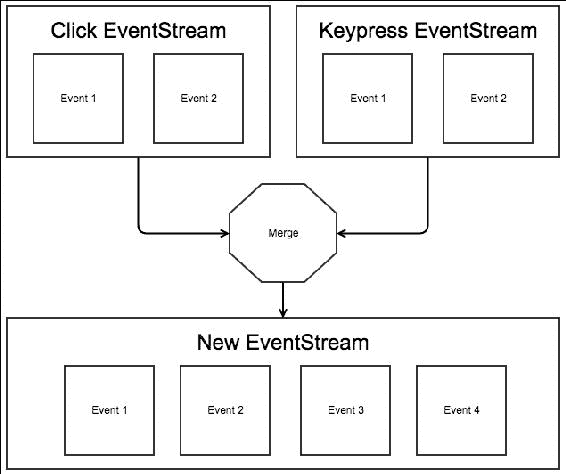

# 第七章。功能反应式编程

如果您是一名前端或后端 JavaScript 开发人员，处理大型复杂的 JavaScript 应用程序，并处理大量响应异步数据更新、用户活动和系统活动的代码，那么这可能是探索**功能反应式编程** ( **FRP** )的最佳时机，因为这是一种节省时间、防止错误、易于阅读和模块化的代码编写风格。你不需要懂任何函数式编程语言，也不需要做一个铁杆函数式语言程序员；相反，你只需要知道函数式编程的基础。在本章中，我们将学习如何使用`Bacon.js`来使用玻璃钢，这是一个用于前端和后端 JavaScript 的玻璃钢库。

我们将涵盖以下内容:

*   简单地说，反应式编程
*   用 JavaScript 编写反应代码的问题
*   函数式编程导论
*   玻璃钢是什么
*   玻璃钢的建筑材料
*   玻璃钢的优点
*   培根. js 提供的所有 API

# 反应式编程介绍

在我们进入玻璃钢之前，我们需要了解它是什么。我将解释关于 JavaScript 的反应式编程。反应式编程的概念在每种编程语言中都是一样的。

**反应式编程**正在编写代码来寻找异步数据更新、用户活动和系统活动，并将更改传播到应用程序的相关部分。反应式编程并不是什么新鲜事；信不信由你，你已经在没有意识到的情况下做了反应式编程。例如，你写给的处理按钮点击事件的代码是反应代码。反应式编程有多种方法，例如事件驱动、回调、承诺模式和 FRP。

我们编写的异步代码片段并不都是反应代码。例如，在页面加载后异步上传分析数据到服务器不是反应性代码。但是将文件异步上传到服务器并在上传完成后向用户显示消息是反应性代码，因为我们是对文件上传完成作出反应。

反应式编程的一个更复杂的例子是在 MVC 架构中，其中反应式编程是对模型中的变化做出反应并相应地更新视图，反之亦然。

## 编写反应代码的问题

基本上有三种由 JavaScript 原生支持的用于编写反应代码的模式:**事件驱动**、**回调**、和**承诺**。

任何懂一点 JavaScript 的人都熟悉事件驱动和回调模式。虽然这两种模式是最流行的编写反应代码的方式，但它们很难捕捉异常，并导致嵌套的函数调用，这使得代码更难阅读和调试。

由于事件驱动和回调模式带来的问题，ES6([https://www . packtpub . com/web-development/learning-ecmascript-6](https://www.packtpub.com/web-development/learning-ecmascript-6))引入了 promise 模式。promise 模式使代码看起来更像同步代码，因此易于阅读和调试。该模式还使异常处理更加容易。承诺表示异步操作。

但是承诺模式有一个问题，就是一个承诺只能解决一次。承诺模式只能响应异步操作的单个活动或数据更新。例如，如果我们使用承诺模式发出一个 AJAX 请求，那么我们只能处理*请求成功*和*失败*活动，而不能处理请求和响应周期的状态，例如已经建立的天气服务器连接和收到的响应头。类似地，如果我们使用承诺模式处理用户点击活动，那么我们只能处理第一次点击，而不能处理其后发生的点击，因为承诺会在第一次点击中得到解决。

您可能熟悉也可能不熟悉承诺模式，所以让我们看一些承诺模式的示例代码:

```js
$http("http://example.com/data.json").then(function(){
  //do something
}).then(function(){
  //do something more here
}).then(function(){
  //do something more here
}).catch(function(){
  //handle error
})
```

这里`$http()`方法异步发出一个 HTTP 请求并返回一个承诺。如果请求成功，则承诺得到解决，调用传递给第一个`then()`方法的回调，即承诺得到解决。如果请求失败，则回调被传递给`catch()`方法，该方法被调用，承诺被拒绝。`then()`方法总是返回一个承诺，使得一个接一个地运行多个异步操作成为可能。在代码中，您可以看到异步操作是如何被链接的。这里重要的是`then()`方法只被调用一次，也就是说`$http()`方法返回的承诺只能被解析一次，多次尝试解析一个承诺会被忽略。因此，当我们必须处理异步操作的多个活动或数据更新时，我们不能使用承诺模式来编写反应代码。

### 注

一些开发人员为每一项活动和数据更新创造了新的希望。这种技术看起来很好，因为您能够使用承诺模式编写涉及多个活动和数据更新的反应性代码，但是这是一种反模式。

由于事件驱动、回调和承诺模式的问题，需要另一种模式，功能反应式编程拯救了它。

玻璃钢是简单的反应式编程使用功能编程风格。我们将在下一节中学习更多关于函数式编程的知识。事实上，事件驱动、回调和承诺模式的缺点并不是玻璃钢发明的真正原因；相反，玻璃钢实际上是因为反应式编程需要功能模式而发明的，因为功能代码易于编写、测试、调试、重用、更新和读取。但是当玻璃钢解决了由事件驱动、回调和承诺模式引起的问题时，我们可以说玻璃钢是其他模式的替代品。

在这一章中，我们将学习玻璃钢，它被认为是编写反应代码的现代方式。

# 简单来说就是函数式编程

在我们进入玻璃钢之前，有必要具备功能编程的基础知识。

简单来说，函数式编程是一种我们只用纯函数调用(包括递归)代替循环和条件句的代码编写风格，数据是不可变的。

### 注

函数式编程属于声明式编程的标准。声明式编程是一种编写代码的方式，我们编写代码是为了告诉系统我们希望发生什么，而不是如何发生。声明式编程的其他一些例子是 SQL 和正则表达式。

那么什么是纯函数呢？**纯函数**是一个只依赖于其输入参数的函数，并且总是为特定的输入提供相同的输出。如果它读取范围之外的任何东西，包括全局变量，那么它就不是一个纯函数。

显然，不可能总是使所有的功能都是纯粹的。例如，获取网页或从文件系统读取的函数不能保证相同的返回值。我们应该尽量使尽可能多的函数尽可能纯粹。所以，我们可以说 100%的纯度是不可能实现的，但是 85%的纯度还是很有生产力的。

### 注

没有副作用的函数、无状态函数和纯函数是可以互换使用的术语。

由于数据在函数式编程中是不可变的，您一定想知道如何在不修改数据的情况下编写代码。实际上，我们只是创建新的数据结构，而不是修改现有的数据结构。例如，如果我们有一个包含四个值的数组，并且我们想要移除最后一个值，那么我们只需创建一个新的数组，它没有最后一个值。

## 不可变数据的优势

不可变数据有几个优点。以下是其中的一些:

*   它们是线程安全的，也就是说，在它们上面运行的多个线程不能修改/破坏它们的状态。在[https://en.wikipedia.org/wiki/Thread_safety](https://en.wikipedia.org/wiki/Thread_safety)了解更多关于螺纹安全的信息。
*   他们反对复制可以很容易地共享。人们不需要像在可变数据结构中那样采用防御复制之类的策略。在[https://en.wikipedia.org/wiki/Object_copying](https://en.wikipedia.org/wiki/Object_copying)了解更多关于对象复制的信息。
*   它们有助于避免时间耦合。更多关于时间耦合的可以在[上找到。](https://en.wikipedia.org/wiki/Coupling_(computer_programming)#Object-oriented_programming)

## 功能数据结构

由于数据是不可变的，你可能会面临几个问题。这里有几个:

*   如果一个不可变数组有数百万个值，那么创建一个新数组并从以前的数组中复制所有的值是 CPU 和内存密集型的
*   如果两个线程需要写入同一个变量，协调变量的最终值将是困难的

还有许多其他问题。这些问题导致了功能数据结构的想法。功能数据结构是一种不同类型的数据结构，旨在解决这类问题。但是你不需要了解函数式数据结构来理解本章或者用 JavaScript 编写函数式反应代码。

## 纯函数的优点

以下是纯函数的几个优点:

*   它们增加了可重用性和可维护性，因为每个功能都是独立的
*   更简单的测试和调试是可能的，因为每个功能都可以单独测试和调试
*   函数式程序很容易理解，因为它们是以声明的方式编写的，也就是说，代码说的是要做什么，而不是怎么做。

### 注

使用循环、条件和函数调用编写代码的风格称为命令式编程。命令式编程和函数式编程被认为是对立的。JavaScript、C++、Java、Python、Ruby，都是命令式编程语言的例子。

## 用 JavaScript 进行函数式编程

你没有使用函数式编程语言如 Erlang、Haskell 等编写函数式代码。大多数命令式编程语言允许我们编写函数式代码。

由于 JavaScript 中的函数是一流的(我们稍后会详细了解一流函数)，所以用 JavaScript 编写函数代码是可能的。

### 注

“一级”和“高阶”是可以互换使用的术语。

当一个函数可以作为一个参数传递给另一个函数，可以返回另一个函数，并且可以赋给一个变量时，这个函数被称为一流的。

在 JavaScript 中，函数是一流的，因为它们是对象。因为一个对象可以作为一个参数传递给另一个函数，一个函数可以返回一个对象，一个对象可以分配给一个变量，所以函数可以是一流的。

### 类型

**闭包和一级函数有什么区别？**

**闭包**是 JavaScript 中最容易被误解的话题。简而言之，闭包是由另一个函数返回的函数，当调用该函数时，它可以访问定义它的词法范围。一级函数返回的函数可以是闭包，也可以不是闭包。下面是一个演示闭包的例子:

```js
function a()
{
  var b = 12;
  function c()
  {
    console.log(b);
  }

  return c;
}

var d = a();

d(); //Output "12"
```

这里，名为`c`的函数是一个闭包，因为它是由`a`返回的，当被调用时，它可以访问在`a`内部声明的变量。

## 函数编程助手函数

**函数式编程语言** 提供了大量的内置函数称为 helper 函数，让编写函数代码变得容易。例如，因为我们不能在函数代码中使用循环进行迭代，所以我们需要某种函数来获取一个集合，并将集合的每个值映射到一个函数。函数式编程语言为此提供了`map`助手函数。同样，还有很多其他的辅助函数用于不同的目的。

由于 JavaScript 不是函数式编程语言，因此它不附带函数式助手函数。不过 ES6 引入了一些助手功能，比如`Array.from()`、`Array.prototype.from()`、`Array.prototype.find()`。尽管如此，这个列表仍然不足以编写功能代码。因此，开发人员使用`Underscore.js`等库来编写功能代码。

# 玻璃钢入门

FRP 是简单的使用函数式编程风格的反应式编程。

事件流和属性(不要与对象属性混淆)是玻璃钢的组成部分。让我们来看一下这两个术语的含义。

## 事件流

事件流代表事件流。事件流中的事件可能随时发生，不需要同步发生。

让我们通过将事件流与事件驱动模式中的事件进行比较来理解事件流。就像我们以事件驱动模式订阅事件一样，我们也订阅玻璃钢中的事件流。与事件驱动编程中的事件不同，事件流的强大之处在于，在您处理和处理事件之前，它们可以以任何方式进行合并、串联、组合、压缩、过滤或转换。

在函数式编程中，数据是不可变的，因此合并、串联、组合、压缩、过滤或转换事件流会创建一个新的事件流，而不是修改现有的事件流。

下面是一个图表，显示了表示用户界面元素的点击事件的事件流将会是什么样子:


此事件流可以与任何其他流合并。下图显示了合并两个事件流时的情况:



当我们想要在一个事件发生到两个不同的事件流时应用相同的动作时，合并会很有用。我们现在可以订阅一个事件流，消除重复的代码，并使更新代码变得容易，而不是订阅和附加一个回调到两个不同的事件流。合并在其他各种情况下也很有用。

## 属性

属性代表随着时间变化的值。属性可以作为 JavaScript 变量的替代，JavaScript 变量的值会随着异步活动和数据更新而变化。例如，您可以使用属性来表示按钮被单击的总次数、登录用户的总数等等。

### 注

属性也称为信号或行为。

使用属性代替 JavaScript 变量的优势在于可以订阅属性，也就是说，每当某个属性的值发生变化时，就会触发一个回调来更新系统中依赖它的部分。这可以防止代码重复，并有许多其他好处。

### 注

您可以从另一个属性创建属性，也可以合并、合并、压缩、采样、过滤或转换属性。

我们刚刚看了玻璃钢的基础知识。创建事件流和属性、它们的方法以及使用它们的其他东西会有所不同，这取决于我们用来编写功能反应代码的库。现在，让我们探索如何使用 Bacon.js 库编写功能性反应代码。

# 使用培根的玻璃钢

**Bacon.js** 是一个 JavaScript 库，帮助我们用 JavaScript 编写功能反应代码。可以用于前端和后端 JavaScript。Bacon.js 库的官网是[https://baconjs.github.io/](https://baconjs.github.io/)。

让我们创建一个基本的网站项目，用培根演示玻璃钢

## 设置项目

让我们学习如何下载并安装 Bacon.js，以便与前端和后端 JavaScript 一起使用。在前端，Bacon.js 依赖于 jQuery。

创建一个名为`baconjs-example`的目录。在其中，创建名为`package.json`和`app.js`的文件以及名为`public`的目录。在`public`目录中，创建名为`html`和`js`的目录。在`html`目录中，创建一个名为`index.html`的文件。最后，在`js`目录中，创建一个名为`index.js`的文件。

从[http://cdnjs . cloud flare . com/Ajax/libs/Bacon.js/0 . 7 . 73/bacon . js](http://cdnjs.cloudflare.com/ajax/libs/bacon.js/0.7.73/Bacon.js)下载前端 bacon . js 库，从[https://code.jquery.com/jquery-2.2.0.min.js](https://code.jquery.com/jquery-2.2.0.min.js)下载 jQuery，放入`js`目录。

在写的时候，0.7.73 是前端 Bacon.js 库的最新版本，2.2.0 是 jQuery 的最新版本。

在`index.html`文件中，将这段代码放入 jQuery 和前端 Bacon.js 库:

```js
<!doctype html>
<html>
  <head>
    <title>Bacon.js Example</title>
  </head>
  <body>
    <script type="text/javascript" src="js/jquery-2.2.0.min.js"></script>
    <script type="text/javascript" src="js/Bacon.js"></script>
    <script type="text/javascript" src="js/index.js"></script>
  </body>
</html>
```

在`package.json`文件中，放置该代码:

```js
{
  "name": "Baconjs-Example",
  "dependencies": {
    "express": "4.13.3",
    "baconjs": "0.7.83"
  }
}
```

现在，运行`baconjs-example`目录中的`npm install`来下载 npm 包。

在撰写本文时，0.7.83 是后端 Bacon.js 库的最新版本。

在`app.js`文件中，放置以下代码来导入后端的 Bacon.js 和 Express 模块。它还启动我们的网络服务器，以便为网页和静态文件提供服务:

```js
var Bacon = require("baconjs").Bacon;
var express = require("express");
var app = express();

app.use(express.static(__dirname + "/public"));

app.get("/", function(httpRequest, httpResponse, next){
  httpResponse.sendFile(__dirname + "/public/html/index.html");
})

app.listen(8080);
```

我们现在已经建立了一个基本的培根项目。运行`node app.js`启动网络服务器。现在，让我们来探索一下 Bacon.js APIs。

## 培根原料药

Bacon.js 提供了使用 EventStreams 和属性来做几乎所有可能的事情的 API。后端和前端导入和下载 Bacon.js 的方法不同，但是两者的 API 是相同的。让我们来看看 Bacon.js 提供的最重要的 API

### 创建事件流

根据异步应用编程接口的设计方式，即异步应用编程接口遵循的模式，创建事件流的方式有种。异步应用编程接口遵循事件驱动、承诺或回调模式。我们需要用 Bacon 提供的 API 包装这些模式，将它们的数据更新或活动更新连接到事件流，也就是说，将它们转换成功能性的反应模式。

如果我们想为网页上的一个 UI 元素创建一个 EventStream，我们可以使用`$.asEventStream()`方法。让我们看一个它是如何工作的例子。将以下代码放入`index.html`文件的`<body>`标签中，创建一个按钮:

```js
<button id="myButton">Click me!!!</button>
```

在事件驱动的模式中，要在单击按钮时打印一些东西，我们应该这样写:

```js
document.getElementById("myButton").addEventListener("click", function(){
  console.log("Button Clicked");
}, false)
```

但是在 Bacon.js 中，我们会这样写。将该代码放入`index.js`文件:

```js
var myButton_click_stream = $("#myButton").asEventStream("click");
myButton_click_stream.onValue(function(e){
  console.log("Button Clicked");
})
```

这里，我们使用 jQuery 选择器指向按钮，然后使用`$.asEventStream`方法将其点击事件连接到一个 EventStream。`$.asEventStream`方法将事件的名称作为其第一个参数。

`onValue`方法用于向事件流添加订户。事件流的`onValue`方法接受回调，每次向事件流添加新事件时都会执行回调。回调只有一个参数，表示已添加到事件流的当前事件。在这种情况下，它属于事件接口。我们可以多次调用`onValue`方法来添加多个回调。

订户可用于更新用户界面、执行日志记录等。但是处理事件的逻辑代码应该使用助手函数编写，而不是在订阅服务器内部。这就是功能反应代码应该如何编写。

注册订阅服务器之前发生的事件不会调用订阅服务器回调。

同样，Bacon.js 提供了许多其他 API 来创建事件流。以下是其中的一些:

*   `Bacon.fromPromise`:用于从承诺对象创建事件流。
*   `Bacon.fromEvent`:用于根据事件目标或 Node.js 事件发射器对象的事件创建事件流。
*   `Bacon.fromCallback`:用于从接受回调的函数创建事件流。
*   `Bacon.fromNodeCallback`:这个和`Bacon.fromCallback`一样，但是需要在 Node.js 约定中调用回调。
*   `Bacon.fromBinder`:如果之前的 API 都不太合适，那么可以用这个。

### 创建属性

属性是从事件流(EventStream)创建的，即属性的值依赖于其事件的流。每当事件流中发生事件时，都会执行回调来更新属性值。

您可以使用`toProperty`或`scan`方法为事件流创建属性。当我们想要给属性一个初始值和一个累加器函数时，使用`scan`方法代替`toProperty`。使用`toProperty`()创建属性时，可以提供初始值，也可以不提供初始值。

多次调用`scan`或`toProperty`会创建多个属性。

让我们创建一个属性来保存按钮被点击的总次数。下面是这样做的代码；将其放入`index.js`文件中:

```js
var button_click_counter = myButton_click_stream.scan(0, function(value, e){
  return ++value;
})

button_click_counter.onValue(function(value){
  console.log("Button is clicked " + value + " number of times");
})
```

这里，我们使用`scan`方法创建了一个属性，并将其初始化为`0`。第二个参数是回调，每当属性所附加的事件流中发生事件时，就会调用回调来更新属性值。这个回调应该返回新的属性值。回调有两个参数，即属性的当前值和事件。

属性的`onValue`方法接受每次属性值改变时执行的回调。我们可以多次调用`onValue`方法来注册多个回调。

当我们为一个属性注册一个订阅者时，该订阅者一注册就用当前值执行，但不针对注册之前的值。如果属性尚未分配给任何对象，则不执行回调。

在这里，每当属性值改变时，我们都会记录一条语句，通知我们按钮被点击的总次数。

也可以从另一个属性创建属性。当一个属性的值依赖于另一个属性时，这很有用。让我们从前一个属性创建一个属性，它保存上次单击该属性的时间以及当时的按钮单击次数。下面是这样做的代码；将其放入`index.js`文件中:

```js
var button_click_time = button_click_counter.scan({}, function(value, count){
  return {time: Date.now(), clicks: count};
})

button_click_time.onValue(function(value){
  console.log(value);
})
```

这里的一切都不言自明。你唯一需要知道的是，传递给`scan`方法的第二个参数的第二个参数代表了我们用来创建这个属性的属性值。

属性保存一个流，该流在内部具有其所有以前和当前的值；因此，我们还可以合并、组合、压缩、采样、过滤和转换属性。合并、组合、压缩、采样、过滤或变换属性给了我们新的属性。这个特性对于编写代码来处理一个属性的值依赖于另一个属性的更复杂的情况非常有用。例如，如果我们想忽略一个属性的一些值，而根据它计算另一个属性的值，那么我们可以使用过滤器功能。

Bacon.js 还允许我们基于属性创建 EventStreams，也就是说，一个 event streams 的事件代表一个属性的值。这些事件流中的事件在其各自的属性值改变时发生。这个特性有很多好处，其中之一是当我们必须触发相同的动作来响应几个属性改变它们的值时，它可以防止代码重复。

要基于属性创建事件流，我们可以使用属性的`toEventStream`方法。

### 类型

**检索属性的最新值**

没有方法可以获得一个属性的最新值，而且会有。您可以通过订阅属性并在回调中处理值来获取值。如果需要多个来源的值，使用`combine`方法之一。这就是使用培根. js 的功能反应代码应该如何编写。

### 合并、过滤和转换事件流和属性

Bacon.js 提供了各种帮助函数来处理事件流和属性。让我们看看一些最有用的助手函数。

#### 合并

**合并**流或属性给我们一个新的流或属性，提供所有流或属性的所有事件或值。要合并事件流或属性，我们可以使用它们的`Bacon.mergeAll` 方法实例。下面是一些示例代码来演示这一点。将其放入`index.js`文件中:

```js
var merged_property = Bacon.mergeAll([button_click_counter, button_click_time]);

merged_property.onValue(function(e){
  console.log(e);
})
```

这里，我们合并两个属性。`Bacon.mergeAll`接受事件流或属性的数组。每当这两个属性中的任何一个的值改变时，该值就成为结果属性的当前值。

还有各种其他的辅助函数可用于合并属性和事件流。

#### 过滤

**过滤**是分别从事件流或属性中移除我们不需要的特定事件或值。

Bacon.js 提供了很多帮助函数来过滤事件流和属性，这取决于你想要过滤什么。让我们看看用于事件流和属性的`filter`方法，它允许我们基于谓词函数进行过滤；即如果函数返回`true`，则该值被接受；否则，它将被拒绝。

让我们看看示例代码来演示这一点。在`index.js`文件中，找到这个代码:

```js
var myButton_click_stream = $("#myButton").asEventStream("click");
myButton_click_stream.onValue(function(e){
  console.log(e);
  console.log("Button Clicked");
})
```

用以下代码替换它:

```js
var myButton_click_stream = $("#myButton").asEventStream("click").filter(function(e){
  return e.shiftKey === true;
});

myButton_click_stream.onValue(function(e){
  console.log(e);
  console.log("Button Clicked");
})
```

在这里，我们过滤掉所有没有按下 *Shift* 键的点击事件。因此，要接受点击事件，我们需要在点击按钮的同时按下 *Shift* 键。

您可以将过滤视为使用`if…else`条件的替代方法。

#### 转化

**转换**是分别从另一个事件流或属性创建一个事件流或属性，其事件是转换成别的东西。例如，一个属性值代表一个网址的属性可以转换为另一个属性值代表该网址的响应的属性。转换事件流和属性实际上分别创建了新的事件流和属性。

您可以将转换视为循环的替代方法，即使用`for`循环。

有几个由 Bacon.js 提供的用于转换的辅助函数，这取决于您想要如何转换以及转换什么。

一个流行的转换函数是`map()`，它将事件流或属性的事件或值映射到一个函数。让我们看一个代码示例来演示这一点。在`index.js`文件中找到该代码:

```js
var button_click_time = button_click_counter.scan({}, function(value, count){
  return {time: Date.now(), clicks: count};
})
```

用以下代码替换它:

```js
var button_click_time = button_click_counter.scan({}, function(value, count){
  return {time: Date.now(), clicks: count};
}).map(function(value){
  var date = new Date(value.time);
  return (date).getHours() + ":" + (date).getMinutes();
})
```

在这里，我们使用`map()`将 Unix 时间戳转换为 HH:MM 格式，这很容易理解。

Bacon.js 提供了另一个重要的转换助手函数`flatMap`。`flatMap`和`map`基本上有两个区别:

*   `flatMap`函数总是返回事件流，不管它是在事件流还是属性上调用的。
*   如果传递给`flatMap`的回调返回一个事件流或属性，那么`flatMap`函数返回的事件流的事件就是传递给`flatMap`的回调返回的流和属性的事件和值。每当事件或值被添加到由传递给`flatMap`的回调返回的流和属性中时，该事件和值将自动被添加到由`flatMap`函数返回的事件流中。

当检索异步传递到网络、磁盘驱动器或其他地方的回调的返回值时，需要使用`flatMap`而不是`map`。例如，在前面的例子中，我谈到了将一个网址转换为一个网址响应，我们需要使用`flatMap`而不是`map`来代替回调，因为我们需要发出一个 AJAX 请求，它的响应将被捕获为一个流，并且该流将被返回。当 AJAX 请求完成时，事件将被放入`flatMap`函数返回的流中。

让我们看看这个例子的实现。首先，创建一个输入文本字段，并将其放入`index.html`文件，如下所示:

```js
<input id="url" type="url">
```

现在，让我们使用 Bacon.js 编写代码，当用户点击*输入*键时，记录在字段中输入的网址的输出。下面是这样做的代码。将其放入`index.js`文件中:

```js
var enter_key_click_stream = $("#url").asEventStream("keyup").filter(function(e){
  return e.keyCode == 13;
})

var url = enter_key_click_stream.scan("", function(value, e){
  return e.currentTarget.value;
})

var response = url.flatMap(function(value){
 return Bacon.fromPromise($.ajax({url:value}));
}).toProperty();

response.onValue(function(value){
  console.log(value);
})
```

代码是这样工作的:

*   首先，我们为`keyup`事件创建一个事件流。
*   然后，我们只过滤*输入*键事件，因为只有按下*输入*键，我们才会采取行动。
*   然后，我们创建一个变量来保存文本字段的值。
*   然后，我们使用`flatMap`使用 jQuery AJAX 获取 URL 的响应。我们正在使用`Bacon.fromPromise`从一个承诺创建一个事件流。
*   当 AJAX 请求完成时，它将响应添加到由传递给`flatMap`的回调返回的事件流中。然后，`flatMap`向`flatMap`函数本身返回的事件流添加相同的响应。一旦添加，我们就使用`onValue`记录响应。

在这里，如果我们使用`map`而不是`flatMap`，那么我们将结束记录事件流对象，而不是`map`函数返回的事件流的事件。

虽然我们可以直接从`enter_key_click_stream`创建`url`和`response`属性，但是很可能会导致代码重复，使代码难以理解。

### 注

当您调用一个方法来转换、过滤或处理事件流时，在方法调用之前发生的事件不会被考虑在内。但是，在属性的情况下，会考虑当前值，但不会考虑在方法调用之前出现的值。如果财产尚未分配给任何东西，则不考虑任何东西。

# 总结

我们看了反应式编程、函数式编程、FRP，最后是 Bacon.js 的概述。您现在应该对编写基本的函数式反应式代码感到满意，并对它的好处有了清晰的认识。

我们将在下一章了解更多由 Bacon.js 提供的 API，并使用 Bacon.js 构建一个真实世界的项目。