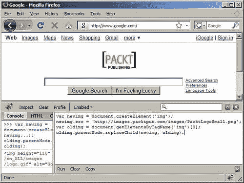

# 第一章。介绍

雅虎做什么！地图，谷歌地图，雅虎！邮件，我的雅虎！，Gmail，Digg，YouTube 和其他大量流行的“Web 2.0”应用有什么共同点？它们都提供了丰富且响应迅速的用户界面，大量使用了用 JavaScript 语言编写的代码。JavaScript 从嵌入在 HTML 中的简单的一行代码开始，但是现在以更复杂的方式使用。开发人员利用这种语言的面向对象特性来构建由可重用部分组成的可扩展代码架构。JavaScript 提供了行为，这是当今范式的第三个支柱，它将网页视为由三个清晰可辨的部分组成:内容(HTML)、呈现(CSS)和行为(JavaScript)。

JavaScript 程序在主机环境中运行。网络浏览器是最常见的环境，但不是唯一的。使用 JavaScript，您可以创建各种小部件、应用扩展和其他软件。学习 JavaScript 是一件非常好的事情:你学习一种语言，然后可以编写各种不同的应用。

这本书是关于 JavaScript 的，侧重于它的面向对象特性。这本书从零开始，没有假设任何先前的编程知识。虽然有一章专门介绍 web 浏览器环境，但本书的其余部分一般都是关于 JavaScript 的，因此适用于所有环境。

让我们从第一章开始，它向您概述了 JavaScript 背后的故事。它还介绍了在讨论面向对象编程时会遇到的基本概念。

# 一点历史

最初，网络被认为是一个静态 HTML 文档的集合，用超链接连接在一起。很快，随着网络越来越受欢迎，规模越来越大，创建静态 HTML 网页的站长们觉得他们需要更多的东西。他们希望有机会进行更丰富的用户交互，这主要是出于节省服务器往返时间以完成表单验证等简单任务的愿望。出现了两个选项:Java 小程序(它们失败了)和 LiveScript，LiveScript 是由网景公司在 1995 年构思的，后来以 JavaScript 的名义包含在网景 2.0 浏览器中。

改变网页静态元素的能力很受欢迎，其他浏览器也纷纷效仿。微软的互联网浏览器(IE) 3.0 附带了 JScript，它是同一种语言加上一些 IE 特定功能的副本。最终，人们努力将这种语言的各种实现标准化，这就是 ECMAScript(欧洲计算机制造商协会)的诞生。今天我们有一个标准，叫做 ECMA-262，JavaScript 只是这个标准的一个实现，尽管是最流行的一个。

不管是好是坏，JavaScript 的迅速流行发生在第一次浏览器战争期间(大约在 1996-2001 年)。那是最初互联网繁荣的时代，当时两大浏览器厂商——网景和微软——正在争夺市场份额。这两家供应商不断地在他们的浏览器和他们的 JavaScript 版本中添加更多的花哨功能。这种情况，加上缺乏一致认可的标准，给 JavaScript 带来了很多不好的意见。通常情况下，开发是一件痛苦的事情:你一边在一个浏览器中工作一边写脚本。一旦你完成了开发，你在另一个浏览器中进行测试，它就不起作用了。与此同时，浏览器供应商忙于添加功能，但在提供适当的开发工具方面却落后了。

浏览器供应商引入的不兼容性让网络开发人员很恼火，但这只是问题的一部分。问题的另一部分是网络开发人员自己，他们给自己的网页添加了太多的功能。开发人员渴望利用浏览器提供的每一种新的可能性，并最终通过状态栏中的动画、闪烁的颜色、闪烁的文本、摇晃的浏览器窗口、雪花、跟踪鼠标光标的对象等等来“增强”他们的网页，通常是以牺牲可用的页面为代价的。这些滥用 JavaScript 的各种方式是这种语言名声不好的另一个原因。这导致“真正的程序员”(拥有 Java 或 C/C++等更成熟语言背景的开发人员)将 JavaScript 视为前端设计人员可以玩弄的玩具。

JavaScript 的反弹导致一些网络项目完全禁止任何客户端编程，只信任它们可预测和可靠的服务器。说真的，为什么你要把交付一个项目的时间增加一倍，把这些额外的时间花在调试不同浏览器的问题上呢？

# 变革之风

浏览器大战一结束后的几年里，一切都发生了变化。许多进程以非常积极的方式重塑了网络开发格局。

*   微软赢得了这场战争，在大约五年的时间里(这在互联网时代或多或少是永远的)，他们停止了向 Internet Explorer 和 JScript 添加功能。这让其他浏览器和开发者有时间赶上甚至超越 IE 的能力。

*   网络标准运动受到了开发者和浏览器供应商的欢迎。自然，开发人员不喜欢为了解释浏览器的差异而必须对所有东西编码两次(或更多次)；因此，他们喜欢有一个大家都将遵循的商定标准的想法。我们还远远不能在完全符合标准的环境中开发，但理想情况下，这将在未来发生。

*   开发人员和技术成熟了，越来越多的人开始关心可用性、渐进式增强技术和可访问性。

在这种更健康的环境中，开发人员开始寻找新的更好的方法来使用现有的仪器。在像 Gmail 和谷歌地图这样在客户端编程上很丰富的应用公开发布后，很明显 JavaScript 是一种成熟的、在某些方面独特的、强大的原型面向对象语言。它被重新发现的最好例子是广泛采用了 XMLHttpRequest 对象提供的功能，这曾经是一个只支持 IE 的创新，但后来被大多数其他浏览器实现了。XMLHttpRequest 允许 JavaScript 发出 HTTP 请求，并从服务器获取新鲜内容，以便更新页面的某些部分，而无需整个页面重新加载。由于 XMLHttpRequest 的广泛使用，一种新的类似桌面的网络应用诞生了，被称为 AJAX 应用。

# 现在

JavaScript 的一个有趣之处在于，它总是在*主机环境*中运行。浏览器是最受欢迎的主机环境，但不是唯一的。JavaScript 可以在服务器、桌面和富媒体上运行。今天，您可以使用 JavaScript 来完成所有这些:

*   创建丰富而强大的网络应用(在网络浏览器中运行的应用，如 Gmail)

*   编写服务器端代码，例如 ASP 脚本，或者使用 Rhino(用 Java 编写的 JavaScript 引擎)运行的代码

*   使用基于 ECMAScript 的 ActionScript 创建富媒体应用(Flash、Flex)

*   使用 Windows 脚本主机编写脚本，在您的 Windows 桌面上自动执行管理任务

*   为过多的桌面应用编写扩展/插件，如火狐、Dreamweaver 和 Fiddler

*   使用 Google Gears 创建网络应用，将信息存储在用户桌面上的离线数据库中

*   创建雅虎！运行在桌面上的小部件、Mac 仪表板小部件或 Adobe Air 应用

这绝不是一份详尽的清单。JavaScript 从网页内部开始，但今天可以肯定地说，它几乎无处不在。

# 未来

我们只能推测未来会是什么样子，但可以肯定的是它会包含 JavaScript。在相当长的一段时间里，JavaScript 可能被低估和利用不足(或者说以错误的方式被过度使用)，但是每天我们都看到 JavaScript 以更有趣和更有创意的方式被新使用。他们曾经编写简单的单行代码，通常内嵌在 HTML 标签属性中(例如`onclick`)，现在的开发人员发布复杂的、设计良好的、架构良好的、可扩展的应用和库。JavaScript 确实受到了重视，开发人员开始越来越多地重新发现和享受它独特的面向对象特性。

一旦被列在招聘启事的“很高兴拥有”部分，如今在招聘网络开发人员时，JavaScript 的知识就是一个是/否的因素。你今天能听到的常见求职面试问题包括:“JavaScript 是面向对象的语言吗？很好。现在如何在 JavaScript 中实现继承？”读完这本书，你将准备好在你的 JavaScript 求职面试中表现出色，甚至用一些面试官可能不知道的细节给他们留下深刻印象。

# 面向对象编程

在深入研究 JavaScript 之前，让我们花点时间回顾一下人们所说的“面向对象”是什么意思，以及这种编程风格的主要特征是什么。以下是在谈论面向对象编程(OOP)时最常使用的概念列表:

*   对象、方法、属性

*   班级

*   包装

*   聚合

*   可重用性/继承性

*   多态性

让我们仔细看看这些概念。

## 物体

正如名称*面向对象*所暗示的，对象相当重要。对象是“事物”(某人或某物)的表示，这种表示借助于编程语言来表达。这个东西可以是任何东西——一个真实的物体，或者一些更复杂的概念。以猫这样常见的物体为例，可以看到它有一定的特征(颜色、名字、体重)，可以进行一些动作(喵喵叫、睡觉、躲藏、逃跑)。对象的特征在 OOP 中称为*属性*，动作称为*方法*。

还有一个与口语的类比:

*   物体最常用名词(书、人)来命名

*   方法是动词(读，运行)

*   属性值是形容词

我们以“黑猫睡在我头上”这句话为例。“The cat”(一个名词)是对象，“black”(形容词)是 `color`属性的值，“sleep”(一个动词)是一个动作，或者说是 OOP 中的一个方法。为了类比，我们可以更进一步，说“在我的头上”指定了关于动作“睡眠”的一些东西，所以它充当传递给 `sleep`方法的参数。

## 类

在现实生活中，相似的对象可以根据一些标准进行分组。蜂鸟和鹰都是鸟，所以它们可以被归类为鸟类。在面向对象程序设计中，类是一个对象的蓝图或配方。“对象”的另一个名称是“实例”，所以我们说鹰是 Birds 类的一个实例。您可以使用同一个类创建不同的对象，因为类只是一个模板，而对象是基于模板的具体实例。

JavaScript 和像 C++和 Java 这样的“经典”OO 语言是有区别的。你应该从一开始就明白，在 JavaScript 中没有类；一切都基于对象。JavaScript 有原型的概念，原型也是对象(我们将在后面详细讨论)。在经典的面向对象语言中，你会说类似“给我创建一个名为 Bob 的新对象，它属于 Person 类”。在原型 OO 语言中，你会说，“我将把我身边的这个对象 Person 作为一个新对象的原型来重用，我称之为 Bob”。

## 封装

*封装*是另一个 OOP 相关的概念，它说明了一个对象包含(封装)两者的事实:

*   数据(存储在属性中)和

*   处理数据的方法(使用方法)

另一个与封装相关的术语是*信息隐藏*。这是一个相当宽泛的术语，可能意味着不同的事情，但是让我们看看人们在 OOP 的上下文中使用它时通常意味着什么。

想象一个物体，比如 MP3 播放器。作为对象的用户，您可以使用一些界面，如按钮、显示器等。你使用接口是为了让对象为你做一些有用的事情，比如播放一首歌。它在内部到底是如何工作的，你不知道，通常也不关心。换句话说，接口的实现对你来说是隐藏的。在 OOP 中也会发生同样的事情，当你的代码通过调用对象的方法来使用对象时。不管是你自己编码的对象，还是来自某个第三方库；您的代码不需要知道这些方法在内部是如何工作的。在编译语言中，你实际上不能阅读使一个对象工作的代码。在 JavaScript 中，因为它是一种解释语言，所以您可以看到源代码，但是概念仍然是一样的——您使用对象的接口，而不用担心它的实现。

信息隐藏的另一个方面是方法和属性的可见性。在某些语言中，对象可以有*公共的、*私有的、*受保护的*方法和属性。这种分类定义了对象用户的访问级别。例如，只有对象的内部实现可以访问私有方法，而任何人都可以访问公共方法。在 JavaScript 中，所有的方法和属性都是公共的，但是我们会看到有一些方法可以保护对象内部的数据并实现隐私。

## 聚合

将几个对象组合成一个新的对象被称为*聚合*或*合成*。聚合概念说明了将几个对象组合成一个新对象的能力。聚合是将问题分成更小、更易管理的部分(分而治之)的强大方法。当一个问题的范围如此复杂，以至于不可能完整地详细考虑它时，您可以将问题分成几个更小的区域，然后可能将每个区域分成更小的块。这允许你在几个抽象层次上思考问题*。个人电脑是一个非常复杂的物体。当你启动电脑时，你不能考虑所有需要发生的事情。但是您可以抽象出这个问题，说您需要初始化它所包含的对象:监视器对象、鼠标对象、键盘对象等等。然后你可以深入到每个子对象中。通过这种方式，您可以通过组装可重用的部件来组合复杂的对象。*

 *再举一个例子，一个 Book 对象可以包含(聚合)一个或多个作者对象、一个发布者对象、几个章节对象、一个目录等等。

## 遗传

继承是重用已经编写的代码的一种非常优雅的方式。例如，您可以有一个通用对象 Person，它具有名称和出生日期等属性，并实现行走、说话、睡觉、吃饭等功能。然后你发现你需要一个对象程序员。你可以重新实现 Person 拥有的所有方法和属性，但是如果说程序员*继承了* Person，那就更聪明了，可以为自己节省一些工作。程序员对象只需要实现更具体的功能，比如方法“写代码”，同时重用 Person 的所有功能。

在经典的 OOP 中，类从其他类继承，但是在 JavaScript 中，因为没有类，对象从其他对象继承。

当一个对象从另一个对象继承时，它通常会向继承的对象添加新的方法，从而*扩展*旧的对象。以下短语通常可以互换使用:“B 继承自 A”和“B 扩展了 A”。此外，继承了许多方法的对象可以选择一个或多个方法并重新定义它们，根据自己的需要定制它们。这样，接口保持不变，方法名称相同，但是在新对象上调用时，方法的行为不同。这种重新定义继承方法如何工作的方式被称为*覆盖*。

## 多态性

在上面的例子中，我们有一个程序员对象，它继承了父 Person 对象的所有方法。这意味着这两个对象都提供了一种“对话”方法。现在想象一下，在我们代码的某个地方，有一个名为 Bob 的变量，碰巧我们不知道 Bob 是一个人，还是一个程序员对象。我们仍然可以在 Bob 对象上调用“talk”方法，代码将会工作。这种在不同的对象上调用相同的方法并让每个对象以自己的方式响应的能力被称为*多态性*。

# 面向对象概要

如果你是 OO 编程术语的新手，并且你不确定你已经完全掌握了上面的概念，不要担心。我们将查看一些代码，您将会看到，尽管当仅仅讨论高级概念时，它们看起来很复杂，但实际上事情要简单得多。

因此，让我们再次重复这些概念。

<colgroup><col width="3.81078621794872" style="text-align: left"> <col width="1.66232291666667" style="text-align: left"></colgroup> 
| 

特征

 | 

图解概念

 |
| --- | --- |
| 鲍勃是一个人(一个物体)。 | 目标 |
| 鲍勃的出生日期是 1980 年 6 月 1 日，性别:男，头发:黑色。 | 性能 |
| 鲍勃可以吃、睡、喝、做梦、说话和计算他的年龄。 | 方法 |
| 鲍勃是类程序员的一个例子。 | 类(在经典的面向对象程序设计中) |
| Bob 基于另一个对象，叫做程序员。 | 原型(原型面向对象) |
| Bob 持有数据(如*出生日期)*和处理数据的方法(如*计算年龄)*。 | 包装 |
| 我们不需要知道计算方法在内部是如何工作的。对象可能有一些私人数据，比如闰年 2 月的天数，我们不知道，也不想知道。 | 信息隐蔽 |
| 鲍勃是网络开发团队对象的一部分，吉尔是设计者对象，杰克是项目经理对象。 | 聚集、组成 |
| 设计师、项目经理和程序员都是基于并扩展 Person 对象的。 | 遗产 |
| 你可以称之为方法*鲍勃:说话，吉尔:说话*和*杰克:说话*它们都会很好地工作，尽管产生不同的结果(鲍勃可能会更多地谈论表现，吉尔谈论美丽，杰克谈论截止日期)。每个对象都继承了 Person 的*说话*的方法，并进行定制。 | 多态性，方法覆盖 |

# 设置您的培训环境

这本书在编写代码时采取了“自己动手”的方法，因为作者坚信真正学习一门编程语言的最好方法是编写代码。所以没有现成的剪切粘贴代码下载，你可以简单地把它放在你的页面上。相反，你需要输入代码，看看它是如何工作的，然后调整它，摆弄它。当尝试代码示例时，我们鼓励您将代码输入 Firebug 的控制台。让我们看看你是怎么做的。

## 获取您需要的工具

作为一名开发人员，您很可能已经安装了火狐，并使用它来享受日常网页浏览的乐趣。如果没有，帮自己一个忙，现在就安装。它是免费的，可以在任何平台上运行——Windows、Linux 或 Mac。从[http://www.mozilla.com/firefox/](http://www.mozilla.com/firefox/)下载。

Firefox 浏览器是可扩展的，并且有很多有用的扩展(都是用 JavaScript 编写的！).一个流行的扩展是 Firebug——一个网络开发不可或缺的工具，有很多有用的特性。从[http://www.getfirebug.com/](http://www.getfirebug.com/)下载 Firebug，安装，通过启动 Firefox，进入任意页面，按 *F12* (在 Windows 上)或者点击 Firefox 屏幕右下角的小 bug 图标进行试用。这将打开我们最感兴趣的 Firebug 特性——控制台。

# 使用萤火虫控制台

您可以直接在 Firebug 控制台中键入代码，当您按下*进入*时，代码将被评估并执行。代码的返回值打印在控制台中。该代码在当前加载页面的上下文中执行，因此，例如，如果您键入 `document.location.href`，它将返回当前页面的网址。

控制台还具有自动完成功能。它的工作方式类似于操作系统中的普通命令行提示符。例如，如果您键入 **docu** 并点击> *选项卡*键， **docu** 将自动完成至**文档**。然后如果你输入**。(点运算符)，您可以多次按下*选项卡*，它将遍历您可以在 `document`对象上调用的所有可用属性和方法。**

 **使用*向上*和*向下*箭头键，您可以浏览已经执行的命令列表，并将其带回控制台。

控制台只给你一行输入，但是你可以通过用分号分隔来执行几个 JavaScript 语句。如果您需要更多空间或更多行，可以通过单击输入行最右侧的向上箭头，以多行模式打开控制台。下一张截图显示了多行模式的示例。

这个例子展示了如何使用控制台输入一些代码，将[google.com](http://google.com)主页上的徽标替换为您选择的图像。如您所见，您可以在任何页面上实时测试您的 JavaScript 代码。

在 Firefox 中，您应该设置的一个配置选项是您将在控制台中看到的 JavaScript 警告的严格性。这将帮助您确保您编写的代码质量更好。虽然警告不是错误，但是您应该致力于编写不会抛出任何警告的代码。例如，使用未声明的变量不是错误，但这不是一个好主意，因此 Firefox 的 JavaScript 引擎将生成一个警告，如果打开严格设置，该警告将显示在控制台中。要设置“严格”设置，请执行以下操作:

1.  1.在火狐地址栏中输入**关于:配置**。

2.  2.通过在**过滤器**字段中输入并按*进入*来搜索**严格**。

3.  3.双击显示**JavaScript . options . strict**的行。这应该将其**值**设置为**真**。

# 总结

在这一章中，您了解了 JavaScript 是如何产生的，以及它现在的位置。您还了解了面向对象的编程概念，并了解了 JavaScript 如何不是一种经典的面向对象语言，而是一种原型语言。最后，您学习了如何设置和使用您的培训环境 Firebug 控制台。现在，您已经准备好深入研究 JavaScript 并学习如何使用它强大的 OO 特性了。有关本章中讨论的主题的其他信息，请查看以下网页。

*   在 YUI 剧场([http://developer.yahoo.com/yui/theater/](http://developer.yahoo.com/yui/theater/))上，有几场道格拉斯·克洛克福特的演讲，极力推荐。“DOM 理论”的第 1 部分讲述了浏览器的历史，“JavaScript 编程语言”的第 1 部分讲述了 JavaScript 的历史(以及其他内容)。

*   OOP 概念参见维基百科文章()和孙的 Java 文档([)http://Java . Sun . com/docs/books/tutorial/Java/concepts/index . html](http://java.sun.com/docs/books/tutorial/java/concepts/index.html)，虽然后者谈论的是使用类的 OOP。

*   关于 JavaScript 的例子，看看雅虎吧！小部件页面([http://widgets.yahoo.com/"](http://widgets.yahoo.com/))、谷歌地图([http://maps.google.com](http://maps.google.com))或处理可视化语言的 JavaScript 版本([http://ejohn.org/blog/processingjs/](http://ejohn.org/blog/processingjs/))。***