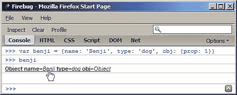
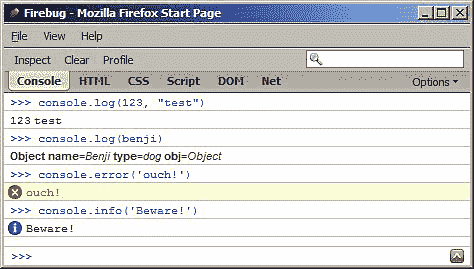
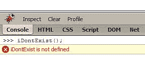

# 第四章。目标

现在，您已经掌握了 JavaScript 的原始数据类型、数组和函数，是时候做最好的部分了——对象。在本章中，您将学习:

*   如何创建和使用对象

*   构造函数有哪些

*   存在哪些类型的内置 JavaScript 对象，它们能为您做什么

# 从数组到对象

从[第二章](02.html "Chapter 2. Primitive Data Types, Arrays, Loops, and Conditions")中已经知道，数组只是一个值的列表。每个值都有一个索引(数字键)，从零开始，每个值递增 1。

```js
>>>> var myarr = ['red', 'blue', 'yellow', 'purple'];
>>> myarr;
["red", "blue", "yellow", "purple"]
>>> myarr[0]
"red"
>>> myarr[3]
"purple"

```

如果您将索引放在一列中，将值放在另一列中，您将得到一个键/值对表，如下所示:

<colgroup><col width="0.567361111111111" style="text-align: left"> <col width="0.567361111111111" style="text-align: left"></colgroup> 
| 钥匙 | 价值 |
| Zero | 红色 |
| one | 蓝色 |
| Two | 黄色 |
| three | 紫色 |

一个对象非常类似于一个数组，不同的是你自己定义键。你不仅限于使用数字索引，还可以使用更友好的键，比如 `first_name, age`等等。

让我们看一下一个简单的对象，并检查它的各个部分:

```js
var hero = {
breed: 'Turtle',
occupation: 'Ninja'
};

```

你可以看到:

*   包含对象的变量名称为 `hero`

*   不是使用 `[`和`]`来定义数组，而是使用 `{`和 `}`来定义对象

*   用逗号分隔对象中包含的元素(称为属性)

*   键/值对用冒号分隔，如 `key: value`

键(属性的名称)可以选择性地放在引号中。例如，这些都是相同的:

```js
var o = {prop: 1};
var o = {"prop": 1};
var o = {'prop': 1};

```

建议不要引用属性的名称(也是少打字！)，但有些情况下你必须使用引号:

*   如果属性名是 JavaScript 中的保留字之一(参见附录 A)

*   如果它包含空格或特殊字符(除字母、数字和下划线字符以外的任何字符)

*   如果它以数字开头

基本上，如果您为属性选择的名称不是 JavaScript 中变量的有效名称，那么您需要在适当的位置加上引号。

看看这个奇怪的物体:

```js
var o = {
something: 1,
'yes or no': 'yes',
'!@#$%^&*': true
};

```

这是一个有效对象。第二个和第三个属性需要引号，否则会出现错误。

在本章后面，除了 `[]`和 `{}`之外，您将看到定义对象和数组的其他方法。但是首先，让我们介绍一下这个术语:用 `[]`定义一个数组叫做*数组文字*符号，用花括号 `{}`定义一个对象叫做*对象文字*符号。

## 元素、属性、方法

当谈到数组时，你说它们包含*元素*。当谈论对象时，你说它们包含*属性*。在 JavaScript 中没有任何显著的区别；这只是人们习惯的术语，可能来自其他编程语言。

对象的属性可以包含函数，因为函数只是数据。在这种情况下，你说这个属性是一个*方法*。

```js
var dog = {
name: 'Benji',
talk: function(){
alert('Woof, woof!');
}
};

```

也可以将函数存储为数组元素并调用它们，但是在实践中您不会看到很多这样的代码:

```js
>>> var a = [];
>>> a[0] = function(what){alert(what);};
>>> a[0]('Boo!');

```

## 散列，关联数组

在某些编程语言中，有以下区别:

*   普通数组，也称为*索引*或*枚举*(键是数字)和

*   关联数组，也称为*散列*(键是字符串)

JavaScript 使用数组表示索引数组，使用对象表示关联数组。如果你想要一个 JavaScript 中的散列，你可以使用一个对象。

## 访问对象的属性

有两种方法可以访问对象的属性:

*   使用方括号符号，例如 `hero['occupation']`

*   使用点符号，例如 `hero.occupation`

点符号更容易阅读和书写，但不能总是使用。引用属性名也适用相同的规则:如果属性名不是有效的变量名，则不能使用点符号。

让我们以这个物体为例:

```js
var hero = {
breed: 'Turtle',
occupation: 'Ninja'
};

```

使用点符号访问属性:

```js
>>> hero.breed;
"Turtle"

```

使用括号符号访问属性:

```js
>>> hero['occupation'];
"Ninja"

```

访问不存在的属性返回 `undefined:`

```js
>>> 'Hair color is ' + hero.hair_color;
"Hair color is undefined"

```

对象可以包含任何数据，包括其他对象。

```js
var book = {
name: 'Catch-22',
published: 1961,
author: {
firstname: 'Joseph',
lastname: 'Heller'
}
};

```

要获取包含在 `book`对象的 `author`属性中的对象的 `firstname`属性，可以使用:

```js
>>> book.author.firstname
"Joseph"

```

或者使用方括号符号:

```js
>>> book['author']['lastname']
"Heller"

```

即使您将两者混合，它也能工作:

```js
>>> book.author['lastname']
"Heller"
>>> book['author'].lastname
"Heller"

```

需要方括号的另一种情况是，您需要访问的属性的名称事先不知道。在运行时，它被动态存储在一个变量中:

```js
>>> var key = 'firstname';
>>> book.author[key];
"Joseph"

```

## 调用对象的方法

因为方法只是一个碰巧是函数的属性，所以您可以像访问属性一样访问方法:使用点符号或使用方括号。调用(调用)一个方法和调用任何其他函数是一样的:只需在方法名后面加括号，有效地说“执行！”。

```js
var hero = {
breed: 'Turtle',
occupation: 'Ninja',
say: function() {
return 'I am ' + hero.occupation;
}
}
>>> hero.say();
"I am Ninja"

```

如果有任何要传递给方法的参数，可以像正常函数一样继续:

```js
>>> hero.say('a', 'b', 'c');

```

因为您可以使用类似数组的方括号来访问属性，这意味着您也可以使用方括号来访问和调用方法，尽管这不是常见的做法:

```js
>>> hero['say']();

```

### 注

**最佳实践提示:无报价**

1.使用点符号来访问方法和属性

2.不要在对象文字中引用属性

## 改变性质/方法

JavaScript 是一种动态语言；它允许您随时更改现有对象的属性和方法。这包括添加或删除新属性。您可以从一个空白对象开始，稍后再添加属性。让我们看看你如何着手做这件事。

空对象:

```js
>>> var hero = {};

```

访问不存在的属性:

```js
>>> typeof hero.breed
"undefined"

```

添加一些属性和方法:

```js
>>> hero.breed = 'turtle';
>>> hero.name = 'Leonardo';
>>> hero.sayName = function() {return hero.name;};

```

调用方法:

```js
>>> hero.sayName();
"Leonardo"

```

删除属性:

```js
>>> delete hero.name;
true

```

再次调用该方法将不再工作:

```js
>>> hero.sayName();
reference to undefined property hero.name

```

## 使用该值

在前面的例子中，方法 `sayName()`使用 `hero.name`来访问 `hero`对象的 `name`属性。当你在一个方法中时，有另一种方法可以访问这个方法所属的对象:通过使用特殊值 `this`。

```js
var hero = {
name: 'Rafaelo',
sayName: function() {
return this.name;
}
}
>>> hero.sayName();
"Rafaelo"

```

所以当你说 `this`的时候，其实是在说“这个物体”或者“当前物体”。

## 构造函数

还有另一种创建对象的方法:使用构造函数。我们来看一个例子:

```js
function Hero() {
this.occupation = 'Ninja';
}

```

为了使用该功能创建一个对象，可以使用 `new`操作符，如下所示:

```js
>>> var hero = new Hero();
>>> hero.occupation;
"Ninja"

```

使用构造函数的好处是它们接受参数，这些参数可以在创建新对象时使用。让我们修改构造函数以接受一个参数，并将其分配给 `name`属性。

```js
function Hero(name) {
this.name = name;
this.occupation = 'Ninja';
this.whoAreYou = function() {
return "I'm " + this.name + " and I'm a " + this.occupation;
}
}

```

现在，您可以使用相同的构造函数创建不同的对象:

```js
>>> var h1 = new Hero('Michelangelo');
>>> var h2 = new Hero('Donatello');
>>> h1.whoAreYou();
"I'm Michelangelo and I'm a Ninja"
>>> h2.whoAreYou();
"I'm Donatello and I'm a Ninja"

```

按照惯例，您应该将构造函数的首字母大写，这样您就可以直观地看出这不是一个正常的函数。如果你调用一个被设计成构造函数的函数，但是你忽略了 `new`操作符，这不是一个错误，但是它可能不会像你预期的那样运行。

```js
>>> var h = Hero('Leonardo');
>>> typeof h
"undefined"

```

这里发生了什么？由于没有 `new`操作符，我们没有创建新的对象。该函数的调用与任何其他函数一样，因此 `h`包含该函数返回的值。该函数不返回任何东西(没有 `return`，所以它实际上返回**未定义的**，它被分配给 `h`。

在这种情况下， `this`指的是什么？它指的是*全局对象*。

## 全局对象

之前我们讨论了全局变量(以及如何避免它们)以及 JavaScript 程序在宿主环境(例如浏览器)中运行的事实。现在您已经了解了对象，是时候了解全部真相了:宿主环境提供了一个全局对象，所有全局变量实际上都是全局对象的属性。

如果您的宿主环境是 web 浏览器，则全局对象称为 `window`。

举例来说，您可以尝试在任何函数之外声明一个全局变量，例如:

```js
>>> var a = 1;

```

然后，您可以通过各种方式访问这个全局变量:

*   作为变量 `a`

*   作为全局对象的属性，例如 `window['a']`或 `window.a`

让我们回到定义构造函数的情况，并在没有 `new`运算符的情况下调用它。在这种情况下 `this`指的是全局对象，所有用 `this`设置的属性都成为 `window`的属性。

声明一个构造函数并在没有 `new`的情况下调用它，返回**“未定义”:**

```js
>>> function Hero(name) {this.name = name;}
>>> var h = Hero('Leonardo');
>>> typeof h
"undefined"
>>> typeof h.name
h has no properties

```

因为 `Hero`中有 `this`，所以创建了一个名为 `name`的全局变量(全局对象的属性)。

```js
>>> name
"Leonardo"
>>> window.name
"Leonardo"

```

如果您调用相同的构造函数，但这次使用 `new`，则返回一个新的对象， `this`引用它。

```js
>>> var h2 = new Hero('Michelangelo');
>>> typeof h2
"object"
>>> h2.name
"Michelangelo"

```

您在[第 3 章](03.html "Chapter 3. Functions")中看到的全局函数也可以作为 `window`对象的方法来调用。所以下面两个代码是等价的:

```js
>>> parseInt('101 dalmatians')
101
>>> window.parseInt('101 dalmatians')
101

```

## 施工方属性

当一个对象被创建时，一个特殊的属性在幕后被分配给它——即 `constructor`属性。它包含对用于创建此对象的构造函数的引用。

继续前面的例子:

```js
>>> h2.constructor
Hero(name)

```

因为 `constructor`属性包含了对函数的引用，所以你不妨调用这个函数来产生一个新的对象。下面的代码就像在说“我不在乎对象 `h2`是怎么创建的，但是我想要另一个和它一样的”。

```js
>>> var h3 = new h2.constructor('Rafaello');
>>> h3.name;
"Rafaello"

```

如果一个对象是使用对象文字符号创建的，那么它的构造函数就是内置的 `Object()`构造函数(本章后面会详细介绍)。

```js
>>> var o = {};
>>> o.constructor;
Object()
>>> typeof o.constructor;
"function"

```

## 运算符的实例

使用 `instanceof`运算符，您可以测试对象是否是使用特定的构造函数创建的:

```js
>>> function Hero(){}
>>> var h = new Hero();
>>> var o = {};
>>> h instanceof Hero;
true
>>> h instanceof Object;
false
>>> o instanceof Object;
true

```

注意不要在函数名后面加括号(不要用 `h instanceof Hero()`)。这是因为您没有调用这个函数，而只是通过名称引用它，就像引用任何其他变量一样。

## 返回对象的函数

除了使用构造函数和 `new`操作符创建对象外，还可以使用普通函数创建对象，而无需`new`。您可以有一个做一些准备工作的函数，并有一个对象作为返回值。

例如，这里有一个产生对象的简单 `factory()`函数:

```js
function factory(name) {
return {
name: name
};
}

```

使用 `factory():`

```js
>>> var o = factory('one');
>>> o.name
"one"
>>> o.constructor
Object()

```

其实也可以使用构造函数和返回对象，不同于 `this`。这意味着您可以修改构造函数的默认行为。让我们看看如何。

以下是正常的构造器场景:

```js
>>> function C() {this.a = 1;}
>>> var c = new C();
>>> c.a
1

```

但是现在看看这个场景:

```js
>>> function C2() {this.a = 1; return {b: 2};}
>>> var c2 = new C2();
>>> typeof c2.a
"undefined"
>>> c2.b
2

```

这里发生了什么？构造函数没有返回包含属性 `a`的对象 `this`，而是返回了另一个包含属性 `b`的对象。只有当返回值是对象时，这才是可能的。否则，如果您试图返回任何不是对象的东西，构造函数将继续其通常的行为并返回 `this.`

## 经过的物体

当您复制对象或将其传递给函数时，您只传递对该对象的引用。因此，如果对引用进行更改，实际上是在修改原始对象。

下面是一个例子，说明如何将一个对象分配给另一个变量，然后对副本进行更改。因此，原始对象也发生了变化:

```js
>>> var original = {howmany: 1};
>>> var copy = original;
>>> copy.howmany
1
>>> copy.howmany = 100;
100
>>> original.howmany
100

```

将对象传递给函数时也是如此:

```js
>>> var original = {howmany: 100};
>>> var nullify = function(o) {o.howmany = 0;}
>>> nullify(original);
>>> original.howmany
0

```

## 比较对象

当你比较对象时，只有当你比较同一对象的两个引用时，你才会得到 `true`。比较两个恰好具有完全相同的方法和属性的不同对象将返回 `false`。

让我们创建两个看起来相同的对象:

```js
>>> var fido = {breed: 'dog'};
>>> var benji = {breed: 'dog'};

```

比较它们将返回 `false:`

```js
>>> benji === fido
false
>>> benji == fido
false

```

你可以创建一个新的变量 `mydog`并给它分配一个对象，这样 `mydog`实际上指向同一个对象。

```js
>>> var mydog = benji;

```

在这种情况下 `benji`是 `mydog`，因为它们是同一个对象(改变 `mydog's`属性会改变 `benji's`)。比较返回**真**。

```js
>>> mydog === benji
true

```

而且因为 `fido`是不同的物体，所以和 `mydog:`没有可比性

```js
>>> mydog === fido

```

**假**

## 萤火虫控制台中的对象

在深入研究 JavaScript 中的内置对象之前，让我们快速地说几句关于在 Firebug 控制台中使用对象的话。

看完本章中的示例后，您可能已经注意到对象在控制台中的显示方式。如果您创建一个对象并键入它的名称，您将获得一个包含属性的对象的字符串表示形式(但是如果有太多属性，则只有前几个属性)。



该对象是可点击的，并带您进入 Firebug 中的 **DOM** 选项卡，该选项卡列出了该对象的所有属性。如果属性也是一个对象，则有一个加号(+)来展开它。这很方便，因为它能让你深入了解这个对象到底包含了什么。


控制台还为您提供了一个名为 `console`的对象和一些方法，例如 `console.log(), console.error()`和 `console.info()`，您可以使用它们在控制台中显示任何您想要的值。



`console.log()`在你想要快速测试某个东西的时候很方便，在你真实的脚本中想要转储一些中间调试信息的时候也很方便。以下是如何试验循环的方法，例如:

```js
>>> for(var i = 0; i < 5; i++) { console.log(i); }

```

**0**

**1**

**2**

**3**

**4**

# 内置对象

在本章的前面，我们遇到了 `Object()`构造函数。当您使用对象文字符号创建对象并访问其 `constructor`属性时，它会返回。 `Object()`是内置建造师之一；还有其他的，在本章的剩余部分你会看到所有的。

内置对象可以分为三组:

*   数据包装对象— `Object, Array, Function, Boolean, Number`和 `String`。这些对象对应于 JavaScript 中不同的数据类型。基本上， `typeof`(在[第 2 章](02.html "Chapter 2. Primitive Data Types, Arrays, Loops, and Conditions")中讨论)返回的每个不同值都有一个数据包装对象，除了“未定义”和“空”。

*   实用对象——这些是 `Math, Date, RegExp`，可以派上用场。

*   错误对象——通用的 `Error`对象以及其他更具体的对象，可以帮助程序在发生意外时恢复其工作状态。

本章只讨论内置对象的几种方法。有关完整的参考资料，请参见附录 c

如果你对什么是内置对象和什么是内置构造函数感到困惑，那么，它们是一回事。稍后，您将看到函数以及构造函数也是对象。

## 物体

`Object`是所有 JavaScript 对象的父对象，也就是说你创建的每个对象都是从它继承的。要创建一个新的空对象，可以使用文字符号或 `Object()`构造函数。以下两行是等价的:

```js
>>> var o = {};
>>> var o = new Object();

```

空对象并不是完全无用的，因为它已经包含了一些方法和属性。我们来看几个:

*   `o.constructor`属性返回构造函数

*   `o.toString()`是返回对象的字符串表示的方法

*   `o.valueOf()`返回对象的单值表示，通常这是对象本身

让我们看看这些方法的实际应用。首先，创建一个对象:

```js
>>> var o = new Object();

```

调用 `toString()`返回对象的字符串表示。

```js
>>> o.toString()
"[object Object]"

```

当在字符串上下文中使用对象时，将由 JavaScript 在内部调用`toString()`。例如 `alert()`只对字符串起作用，所以如果调用传递对象的 `alert()`函数，方法 `toString()`将在幕后调用。这两行将产生相同的结果:

```js
>>> alert(o)
>>> alert(o.toString())

```

另一种类型的字符串上下文是字符串串联。如果你试图用一个字符串连接一个对象，该对象的 `toString()`将首先被调用:

```js
>>> "An object: " + o
"An object: [object Object]"

```

`valueOf()`是所有对象提供的另一种方法。对于简单对象(其构造函数是 `Object())`， `valueOf()`方法将返回对象本身。

```js
>>> o.valueOf() === o
true

```

总结一下:

*   您可以使用 `var o = {}`创建对象；(对象文字标注，首选方法)或者用 `var o = new Object()`；

*   任何对象，无论多么复杂，都会继承自 `Object`对象，因此会提供 `toString()`等方法和 `constructor`等属性。

## 阵列

`Array()`是一个内置函数，可以用作构造函数来创建数组:

```js
>>> var a = new Array();

```

这相当于数组文字符号:

```js
>>> var a = [];

```

无论数组是如何创建的，您都可以像往常一样向其中添加元素:

```js
>>> a[0] = 1; a[1] = 2; a;
[1, 2]

```

使用 `Array()`构造函数时，您还可以传递将分配给新数组元素的值。

```js
>>> var a = new Array(1,2,3,'four');
>>> a;
[1, 2, 3, "four"]

```

一个例外是当您向构造函数传递一个数字时。在这种情况下，传递的数字将被视为数组的长度。

```js
>>> var a2 = new Array(5);
>>> a2;
[undefined, undefined, undefined, undefined, undefined]

```

因为数组是用构造函数创建的，这是否意味着数组实际上是对象？是的，您可以使用 `typeof`运算符验证这一点:

```js
>>> typeof a;
"object"

```

因为数组是对象，这意味着它们继承了父 `Object`的属性和方法。

```js
>>> a.toString();
"1,2,3,four"
>>> a.valueOf()
[1, 2, 3, "four"]
>>> a.constructor
Array()

```

数组是对象，但属于特殊类型，因为:

*   它们的属性名称是使用从 0 开始的数字自动分配的

*   它们有一个包含数组中元素数量的 `length`属性

*   除了从父对象继承的方法之外，它们还有其他内置方法

让我们从创建空对象 `o`和空数组 `a:`开始，检查数组和对象之间的区别

```js
>>> var a = [], o = {};

```

数组对象有一个自动为其定义的 `length`属性，而普通对象没有:

```js
>>> a.length
0
>>> typeof o.length
"undefined"

```

可以向数组和对象添加数字和非数字属性:

```js
>>> a[0] = 1; o[0] = 1;
>>> a.prop = 2; o.prop = 2;

```

`length`属性始终是数字属性数量的最新值，忽略非数字属性。

```js
>>> a.length
1

```

`length`属性也可以由你设置。将其设置为大于数组中当前项目数的值会创建空元素(值为 `undefined`)。

```js
>>> a.length = 5
5

>>> a
[1, undefined, undefined, undefined, undefined]

```

将 `length`设置为较低的值会删除尾部元素:

```js
>>> a.length = 2;
2
>>> a
[1, undefined]

```

### 有趣的数组方法

除了从父对象继承的方法之外，数组对象还有一些更有用的方法，比如 `sort(), join()`、 `slice()`等等(完整列表见附录 C)。

让我们以一个数组为例，对其中的一些方法进行实验:

```js
>>> var a = [3, 5, 1, 7, 'test'];

```

`push()`方法在数组末尾追加一个新元素。 `pop()`方法删除最后一个元素。 `a.push('new')`像 `a[a.length] = 'new'`一样工作， `a.pop()`像 `a.length--`一样。

`push()`返回已更改数组的长度， `pop()`返回它删除的元素。

```js
>>> a.push('new')
6
>>> a
[3, 5, 1, 7, "test", "new"]
>>> a.pop()
"new"
>>> a
[3, 5, 1, 7, "test"]

```

`sort()`方法对数组进行排序，返回修改后的数组。在下一个例子中，排序之后， `a`和 `b`都包含指向同一个数组的指针。

```js
>>> var b = a.sort();
>>> b
[1, 3, 5, 7, "test"]
>>> a
[1, 3, 5, 7, "test"]

```

`join()`返回一个包含数组中所有元素值的字符串，使用传递给 `join()` 的字符串参数连接在一起

```js
>>> a.join(' is not ');
"1 is not 3 is not 5 is not 7 is not test"

```

`slice()`返回数组的一部分，不修改源数组。 `slice()`的第一个参数是开始索引，第二个参数是结束索引(两个索引都是从零开始的)。

```js
>>> b = a.slice(1, 3);
[3, 5]
>>> b = a.slice(0, 1);
[1]
>>> b = a.slice(0, 2);
[1, 3]

```

在所有切片之后，源阵列仍然是相同的:

```js
>>> a
[1, 3, 5, 7, "test"]

```

`splice()`修改源数组。它移除一个切片，返回它，并可选地用新元素填充间隙。前两个参数定义了要移除的切片的开始和结束；其他参数传递新值。

```js
>>> b = a.splice(1, 2, 100, 101, 102);
[3, 5]
>>> a
[1, 100, 101, 102, 7, "test"]

```

用新元素填补空白是可选的，您可以跳过它:

```js
>>> a.splice(1, 3)
[100, 101, 102]

>>> a
[1, 7, "test"]

```

## 功能

您已经知道函数是一种特殊的数据类型。但事实证明，事情远不止如此——函数实际上是对象。有一个内置的构造函数叫做 `Function()`，它允许一种替代的(但不推荐的)方法来创建一个函数。

定义函数的以下三种方式是等效的:

```js
>>> function sum(a, b) {return a + b;};
>>> sum(1, 2)
3
>>> var sum = function(a, b) {return a + b;};
>>> sum(1, 2)
3
>>> var sum = new Function('a', 'b', 'return a + b;');
>>> sum(1, 2)
3

```

使用 `Function()`构造函数时，首先传递参数名(作为字符串)，然后传递函数体的源代码(同样作为字符串)。然后，JavaScript 引擎需要评估您传递的源代码，并为您创建新的函数。这个源代码评估与 `eval()`函数有着相同的缺点，所以尽可能避免使用 `Function()`构造函数定义函数。

如果您使用 `Function`构造函数创建具有许多参数的函数，请记住，参数可以作为单个逗号分隔的列表传递，因此，例如，这些是相同的:

```js
>>> var first = new Function('a, b, c, d', 'return arguments;');
>>> first(1,2,3,4);
[1, 2, 3, 4]
>>> var second = new Function('a, b, c', 'd', 'return arguments;');
>>> second(1,2,3,4);
[1, 2, 3, 4]
>>> var third = new Function('a', 'b', 'c', 'd',
'return arguments;');
>>> third(1,2,3,4);
[1, 2, 3, 4]

```

### 注意

**最佳实践**

不要使用 `Function()`构造函数。就像 `eval()`和 `setTimeout()`(将在本书中进一步讨论)一样，始终尽量远离将 JavaScript 代码作为字符串传递的情况。

### 功能对象的属性

像任何其他对象一样，函数有一个包含对 `Function()`构造函数引用的 `constructor`属性。

```js
>>> function myfunc(a){return a;}
>>> myfunc.constructor
Function()

```

函数还有一个 `length`属性，包含函数接受的参数数量。

```js
>>> function myfunc(a, b, c){return true;}
>>> myfunc.length
3

```

还有另一个有趣的属性，它在 ECMA 标准中并不存在，但是在浏览器中实现了——属性 `caller`。这将返回对调用我们函数的函数的引用。假设有一个函数 `A()`从函数 `B()`被调用。如果在 `A()`里面放 `A.caller`，它会返回功能 `B()`。

```js
>>> function A(){return A.caller;}
>>> function B(){return A();}
>>> B()
B()

```

如果您希望您的函数根据调用它的函数做出不同的响应，这可能会很有用。如果从全局空间(任何函数之外)调用 `A()`， `A.caller`将是 `null`。

```js
>>> A()
null

```

函数最重要的属性是 `prototype`属性。我们将在下一章详细讨论这个属性，但是现在我们只说:

*   函数的 `prototype`属性包含一个对象

*   只有当您将此函数用作构造函数时，它才是有用的

*   使用该函数创建的所有对象都保留对 `prototype`属性的引用，并且可以将其属性用作自己的属性

让我们看一个快速的例子来演示 `prototype`属性。让我们从一个简单的对象开始，它有一个属性 `name`和一个方法 `say()`。

```js
var some_obj = {
name: 'Ninja',
say: function(){
return 'I am a ' + this.name;
}
}

```

如果您创建了一个空心函数，您可以验证它自动具有包含空对象的 `prototype`属性。

```js
>>> function F(){}
>>> typeof F.prototype
"object"

```

当你修改 `prototype`属性时，事情变得有趣起来。您可以用任何其他对象替换默认的空对象。让我们将我们的 `some_obj`分配给原型。

```js
>>> F.prototype = some_obj;

```

现在，使用函数 `F()`作为构造函数，您可以创建一个新的对象 `obj`，它可以访问 `F.prototype`的属性，就好像它是自己的一样。

```js
>>> var obj = new F();
>>> obj.name
"Ninja"
>>> obj.say()
"I am a Ninja"

```

下一章会有更多关于 `prototype`属性的内容。

### 功能对象的方法

作为顶级父级 `Object`的后代，函数对象获得默认方法，如 `toString()`。当在函数上调用时， `toString()`方法返回函数的源代码。

```js
>>> function myfunc(a, b, c) {return a + b + c;}
>>> myfunc.toString()
"function myfunc(a, b, c) {
return a + b + c;
}"

```

如果你试图偷看内置函数的源代码，你会得到几乎没用的 `[native code]`字符串:

```js
>>> eval.toString()
"function eval() {
[native code]
}"

```

函数对象的两种有用的方法是 `call()`和 `apply()`。它们允许您的对象从其他对象借用方法，并将其作为自己的方法调用。这是重用代码的一种简单而强大的方法。

假设你有一个 `some_obj`对象，它包含方法 `say()`

```js
var some_obj = {
name: 'Ninja',
say: function(who){
return 'Haya ' + who + ', I am a ' + this.name;
}
}

```

您可以调用 `say()`方法，该方法在内部使用 `this.name`来访问自己的 `name`属性。

```js
>>> some_obj.say('Dude');
"Haya Dude, I am a Ninja"

```

现在让我们创建一个简单的对象 `my_obj`，它只有一个 `name`属性:

```js
>>> my_obj = {name: 'Scripting guru'};

```

`my_obj`非常喜欢 `some_obj's say()`方法，想调用它作为自己的方法。这可以通过使用 `say()`功能对象的 `call()`方法来实现:

```js
>>> some_obj.say.call(my_obj, 'Dude');
"Haya Dude, I am a Scripting guru"

```

成功了。但是这里发生了什么？我们调用了传递两个参数的 `say()`函数对象的 `call()`方法:对象 `my_obj`和字符串**“Dude”**。结果是当 `say()`被调用时，它包含的对 `this`值的引用指向 `my_obj`。这边 `this.name`没有回**忍者**，而是回**脚本大师**。

如果在调用 `call()`方法时有更多的参数需要传递，只需不断添加即可:

```js
some_obj.someMethod.call(my_obj, 'a', 'b', 'c');

```

如果您没有将对象作为第一个参数传递给 `call()`或传递给 `null`，将假设全局对象。

方法 `apply()`的工作方式与 `call()`相同，不同的是您想要传递给另一个对象的方法的所有参数都作为数组传递。以下两行是等效的:

```js
some_obj.someMethod.apply(my_obj, ['a', 'b', 'c']);
some_obj.someMethod.call(my_obj, 'a', 'b', 'c');

```

继续上面的示例，您可以使用:

```js
>>> some_obj.say.apply(my_obj, ['Dude']);
"Haya Dude, I am a Scripting guru"

```

### 重新审视论证对象

在前一章中，您看到了如何从函数内部访问名为 `arguments`的东西，它包含传递给函数的所有参数的值:

```js
>>> function f() {return arguments;}
>>> f(1,2,3)
[1, 2, 3]

```

`arguments`看起来像一个数组，但实际上是一个类似数组的对象。它类似于数组，因为它包含索引元素和 `length`属性。然而，相似性到此为止，因为 `arguments`不提供任何数组方法，如 `sort()`或 `slice()`。

`arguments`对象还有另一个有趣的属性— `callee`属性。这包含对正在调用的函数的引用。如果你创建了一个返回 `arguments.callee`的函数，并且你调用了这个函数，它将简单地返回一个对自身的引用。

```js
>>> function f(){return arguments.callee;}
>>> f()
f()

```

`arguments.callee`允许匿名函数递归调用自己。这里有一个例子:

```js
(
function(count){
if (count < 5) {
alert(count);
arguments.callee(++count);
}
}
)(1)

```

这里有一个匿名函数，它接收一个 `count`参数，提醒它，然后用递增的 `count`调用自己。整个函数被包装在括号中，后面是另一组括号，它立即调用函数，传递初始值 1。该代码的结果是显示数字 **1、2、3** 和 **4 的四个警报。**

## 布尔

我们通过 JavaScript 内置对象的旅程还在继续，下一个相当容易；它们只是包装原始数据类型布尔、数字和字符串。

从[第二章](02.html "Chapter 2. Primitive Data Types, Arrays, Loops, and Conditions")你已经知道很多关于布尔人的事情了。现在，让我们来认识一下 `Boolean()`构造函数:

```js
>>> var b = new Boolean();

```

需要注意的是，这将创建一个新的对象 `b`，而不是一个原始布尔值。要获取原始值，可以调用 `valueOf()`方法(从 `Object`继承)。

```js
>>> var b = new Boolean();
>>> typeof b
"object"
>>> typeof b.valueOf()
"boolean"
>>> b.valueOf()
false

```

总的来说，用 `Boolean()`构造函数创建的对象并不太有用，因为除了继承的对象之外，它们不提供任何方法或属性。

`Boolean()`函数作为普通函数调用时很有用，没有 `new`。这将非布尔转换为布尔(这与使用双重否定 `!!value`相同)。

```js
>>> Boolean("test")
true
>>> Boolean("")
false
>>> Boolean({})
true

```

除了六个错误的值之外，JavaScript 中的其他一切都是真实的，包括空对象。这也意味着所有用 `new Boolean()`创建的布尔对象都评估为**真**，因为它们是对象。

让我们创建两个布尔对象，一个真，一个假:

```js
>>> var b1 = new Boolean(true)
>>> b1.valueOf()
true
>>> var b2 = new Boolean(false)
>>> b2.valueOf()
false

```

现在让我们将它们转换为原始布尔值。它们都转换成 `true`，因为所有的物体都是真实的。

```js
>>> Boolean(b1)
true
>>> Boolean(b2)
true

```

## 数字

类似于 `Boolean()`，可以使用 `Number()`功能:

*   作为一个正常的函数，以便尝试将任何值转换为数字。这类似于使用 `parseInt()`或 `parseFloat()`。

*   作为构造函数(用 `new`)创建对象

```js
>>> var n = Number('12.12');
>>> n
12.12
>>> typeof n
"number"
>>> var n = new Number('12.12');
>>> typeof n
"object"

```

因为函数是对象，所以它们可以有属性。 `Number()`函数包含一些有趣的内置属性(无法修改):

```js
>>> Number.MAX_VALUE
1.7976931348623157e+308
>>> Number.MIN_VALUE
5e-324
>>> Number.POSITIVE_INFINITY
Infinity
>>> Number.NEGATIVE_INFINITY
-Infinity
>>> Number.NaN
NaN

```

数字对象提供三种方式——`toFixed()`、 `toPrecision()`、 `toExponential()`(详见附件三)。

```js
>>> var n = new Number(123.456)
>>> n.toFixed(1)
"123.5"

```

请注意，您可以在不显式创建 number 对象的情况下使用这些方法。在这种情况下，将在幕后为您创建(并销毁)数字对象:

```js
>>> (12345).toExponential()
"1.2345e+4"

```

和所有对象一样，数字对象也提供 `toString()`方法。有趣的是，这个方法接受一个可选的基数参数(默认为 10)。

```js
>>> var n = new Number(255);
>>> n.toString();
"255"
>>> n.toString(10);
"255"
>>> n.toString(16);
"ff"
>>> (3).toString(2);
"11"
>>> (3).toString(10);
"3"

```

## 弦

使用 `String()`构造函数可以创建字符串对象。当涉及到文本操作时，以这种方式产生的对象提供了一些有用的方法，但是如果您不打算使用这些方法，那么您最好只使用原始字符串。

这里有一个例子，显示了字符串对象和原始字符串数据类型之间的区别。

```js
>>> var primitive = 'Hello';
>>> typeof primitive;
"string"
>>> var obj = new String('world');
>>> typeof obj;
"object"

```

字符串对象非常类似于字符数组。字符串对象对于每个字符都有一个索引属性，它们也有一个 `length`属性。

```js
>>> obj[0]
"w"
>>> obj[4]
"d"
>>> obj.length
5

```

要从字符串对象中提取原始值，可以使用从 `Object`继承的 `valueOf()`或 `toString()`方法。您可能永远不需要这样做，因为如果您在字符串上下文中使用对象， `toString()`会在幕后被调用。

```js
>>> obj.valueOf()
"world"
>>> obj.toString()
"world"
>>> obj + ""
"world"

```

原始字符串不是对象，因此它们没有任何方法或属性。但是 JavaScript 仍然为您提供了将原始字符串视为对象的语法。

在下面的示例中，每次访问原始字符串时，字符串对象都会在幕后创建(然后销毁)，就好像它是一个对象一样:

```js
>>> "potato".length
6
>>> "tomato"[0]
"t"
>>> "potato"["potato".length - 1]
"o"

```

最后一个例子来说明字符串原语和字符串对象之间的区别:让我们将它们转换为布尔值。空字符串是一个错误的值，但是任何字符串对象都是真实的。

```js
>>> Boolean("")
false
>>> Boolean(new String(""))
true

```

与 `Number()`和 `Boolean()`类似，如果使用不带 `new`的 `String()`函数，它会将参数转换为一个原始字符串。这意味着如果输入是一个对象，就调用 `toString()`方法。

```js
>>> String(1)
"1"
>>> String({p: 1})
"[object Object]"
>>> String([1,2,3])
"1,2,3"

```

### 字符串对象的有趣方法

让我们试验一些可以为字符串对象调用的方法(完整列表见附录 C)。

首先创建一个字符串对象:

```js
>>> var s = new String("Couch potato");

```

`toUpperCase()`和 `toLowerCase()`是转换字符串大小写的便捷方式:

```js
>>> s.toUpperCase()
"COUCH POTATO"
>>> s.toLowerCase()
"couch potato"

```

`charAt()`告诉您在指定位置找到的字符，这与使用方括号相同(字符串是字符数组)。

```js
>>> s.charAt(0);
"C"
>>> s[0]
"C"

```

如果将一个不存在的位置传递给 `charAt()`，会得到一个空字符串:

```js
>>> s.charAt(101)
""

```

`indexOf()`允许您在字符串内搜索。如果有匹配项，该方法返回找到第一个匹配项的位置。位置计数从 0 开始，因此“沙发”中的第二个字符在位置 1 是“o”。

```js
>>> s.indexOf('o')
1

```

您可以选择指定开始搜索的位置。下面找到第二个“o”，因为 `indexOf()`被指示在位置 2 开始搜索:

```js
>>> s.indexOf('o', 2)
7

```

`lastIndexOf()`从字符串的末尾开始搜索(但匹配的位置仍从开始算起):

```js
>>> s.lastIndexOf('o')
11

```

您可以搜索字符串，而不仅仅是字符，并且搜索区分大小写:

```js
>>> s.indexOf('Couch')
0

```

如果不匹配，函数返回位置-1:

```js
>>> s.indexOf('couch')
-1

```

要执行不区分大小写的搜索，可以先将字符串转换为小写，然后进行搜索:

```js
>>> s.toLowerCase().indexOf('couch')
0

```

当得到 0 时，这意味着字符串的匹配部分从位置 0 开始。当您使用 `if`检查时，这可能会导致混乱，因为 `if`会将位置 0 转换为布尔型 `false`。因此，虽然这在语法上是正确的，但在逻辑上是错误的:

```js
if (s.indexOf('Couch')) {...}

```

检查一个字符串是否包含另一个字符串的正确方法是将 `indexOf()`的结果与数字-1 进行比较。

```js
if (s.indexOf('Couch') !== -1) {...}

```

当指定开始和结束位置时，`slice()`和 `substring()`返回一段字符串:

```js
>>> s.slice(1, 5)
"ouch"
>>> s.substring(1, 5)
"ouch"

```

请注意，您传递的第二个参数是结束位置，而不是片段的长度。这两种方法的区别在于它们如何对待否定论点。 `substring()`将它们视为 0，而 `slice()`将它们添加到字符串的长度中。所以如果你传递参数(1，-1)，它和 `substring(1, 0)`和 `slice(1, s.length - 1):`是一样的

```js
>>> s.slice(1, -1)
"ouch potat"
>>> s.substring(1, -1)
"C"

```

`split()`方法从字符串创建一个数组，使用一个字符串作为分隔符:

```js
>>> s.split(" ")
["Couch", "potato"]

```

`split()`与从数组中创建字符串的 `join()`相反:

```js
>>> s.split(' ').join(' ');
"Couch potato"

```

`concat()`将字符串粘合在一起，就像+运算符对原始字符串所做的那样:

```js
>>> s.concat("es")
"Couch potatoes"

```

请注意，虽然上面讨论的一些方法返回新的基元字符串，但是没有一个方法修改源字符串。在调用了所有方法之后，我们的初始字符串仍然是相同的:

```js
>>> s.valueOf()
"Couch potato"

```

我们看了 `indexOf()`和 `lastIndexOf()`在字符串内搜索，但是有更强大的方法(search()、 `match()`、 `replace()`)以正则表达式为参数。当我们到达 `RegExp()`构造函数时，您将会看到这些。

此时，我们已经完成了所有的数据包装对象，因此我们转到实用程序对象 `Math, Date`和 `RegExp`。

## 数学

`Math`和你上面看到的其他内置全局对象有点不一样。这不是一个正常的功能，因此不能与 `new`一起使用来创建对象。 `Math`是一个内置的全局对象，它提供了许多对数学运算有用的方法和属性。

`Math's`属性是常量，所以不能更改它们的值。它们的名字都是大写的，以强调它们和普通变量属性之间的区别。让我们来看看这些常量属性:

数字π:

```js
>>> Math.PI
3.141592653589793

```

2 的平方根:

```js
>>> Math.SQRT2
1.4142135623730951

```

欧拉常数 e:

```js
>>> Math.E
2.718281828459045

```

2 的自然对数:

```js
>>> Math.LN2
0.6931471805599453

```

10 的自然对数:

```js
>>> Math.LN10
2.302585092994046

```

现在你知道如何在下次你的朋友(不管出于什么尴尬的原因)开始疑惑时给他们留下深刻印象，“什么是 *e 的价值？*我不记得了。”只需在控制台中键入 `Math.E`，就有了答案。

让我们来看看 `Math`对象提供的一些方法(完整列表在附录 C 中)。

生成随机数:

```js
>>> Math.random()
0.3649461670235814

```

`random()`返回一个 0 到 1 之间的数字，所以如果你想要一个 0 到 100 之间的数字，你可以做:

```js
>>> 100 * Math.random()

```

对于任意两个数值 `min`和 `max`之间的数字，使用公式 `((max - min) * Math.random()) + min`。例如，2 到 10 之间的随机数是:

```js
>>> 8 * Math.random() + 2
9.175650496668485

```

如果只需要一个整数，可以使用其中一种取整方式——`floor()`向下取整， `ceil()`向上取整，或者 `round()`取整到最近。例如得到 0 或 1:

```js
>>> Math.round(Math.random())

```

如果你需要一组数字中最低或最高的，你有方法 `min()`和 `max()`。因此，如果页面上有一个要求有效月份的表单，您可以确保始终使用正常的数据:

```js
>>> Math.min(Math.max(1, input), 12)

```

`Math`对象还为您提供了执行数学运算的能力，而您没有指定的运算符。这意味着你可以使用 `pow()`升到一次幂，使用 `sqrt()`求平方根，执行所有三角运算— `sin(),cos(), atan()`等等。

2 的 8 次方:

```js
>>> Math.pow(2, 8)
256

```

9 的平方根:

```js
>>> Math.sqrt(9)
3

```

## 日期

`Date()`是创建日期对象的构造函数。您可以通过传递:来创建一个新对象

*   无(默认为今天的日期)

*   类似日期的字符串

*   分离日、月、时间等的值

*   时间戳

用今天的日期/时间实例化的对象:

```js
>>> new Date()
Tue Jan 08 2008 01:10:42 GMT-0800 (Pacific Standard Time)

```

(和所有对象一样，火狐控制台显示 `toString()`方法的结果，所以这个长字符串“2008 年 1 月 8 日星期二……”是你在约会对象上称呼 `toString()`时得到的。)

下面是一些使用字符串初始化日期对象的例子。有趣的是，您可以使用多少种不同的格式来指定日期。

```js
>>> new Date('2009 11 12')
Thu Nov 12 2009 00:00:00 GMT-0800 (Pacific Standard Time)
>>> new Date('1 1 2012')
Sun Jan 01 2012 00:00:00 GMT-0800 (Pacific Standard Time)
>>> new Date('1 mar 2012 5:30')
Thu Mar 01 2012 05:30:00 GMT-0800 (Pacific Standard Time)

```

JavaScript 可以从不同的字符串中计算出日期，这很好，但这并不是定义精确日期的可靠方法。更好的方法是将数值传递给 `Date()`构造函数，表示:

*   年

*   月份:0(1 月)至 11(12 月)

*   第一天:1 点到 31 点

*   小时:0 到 23

*   分钟:0 到 59

*   秒:0 到 59

*   毫秒:0 到 999

让我们看一些例子。

传递所有参数:

```js
>>> new Date(2008, 0, 1, 17, 05, 03, 120)
Tue Jan 01 2008 17:05:03 GMT-0800 (Pacific Standard Time)

```

通过日期和时间:

```js
>>> new Date(2008, 0, 1, 17)
Tue Jan 01 2008 17:00:00 GMT-0800 (Pacific Standard Time)

```

注意月份从 0 开始，所以 1 是 2 月:

```js
>>> new Date(2008, 1, 28)
Thu Feb 28 2008 00:00:00 GMT-0800 (Pacific Standard Time)

```

如果你传递了一个大于允许值的值，你的日期就会向前“溢出”。因为 2008 年没有 2 月 30 日，这意味着必须是 3 月 1 日(记住 2008 年是闰年)。

```js
>>> new Date(2008, 1, 29)
Fri Feb 29 2008 00:00:00 GMT-0800 (Pacific Standard Time)
>>> new Date(2008, 1, 30)
Sat Mar 01 2008 00:00:00 GMT-0800 (Pacific Standard Time)

```

同样，12 月 32 日成为下一年的 1 月 01 日:

```js
>>> new Date(2008, 11, 31)
Wed Dec 31 2008 00:00:00 GMT-0800 (Pacific Standard Time)
>>> new Date(2008, 11, 32)
Thu Jan 01 2009 00:00:00 GMT-0800 (Pacific Standard Time)

```

最后，日期对象可以用时间戳初始化(自 UNIX 纪元以来的毫秒数，其中 0 毫秒是 1970 年 1 月 1 日)。

```js
>>> new Date(1199865795109)
Wed Jan 09 2008 00:03:15 GMT-0800 (Pacific Standard Time)

```

如果调用 `Date()`而不调用 `new`，无论是否传递任何参数，都会得到一个代表当前日期的字符串。这给出了当前时间(运行该示例时的当前时间):

```js
>>> Date()
"Thu Jan 17 2008 23:11:32 GMT-0800 (Pacific Standard Time)"
>>> Date(1, 2, 3, "it doesn't matter");
"Thu Jan 17 2008 23:11:35 GMT-0800 (Pacific Standard Time)"

```

### 处理日期对象的方法

一旦创建了日期对象，就可以对该对象调用许多方法。大部分方法可以分为 `set*()`和 `get*()`方法。比如 `getMonth(), setMonth(), getHours(), setHours()`等等。让我们看一些例子。

创建日期对象:

```js
>>> var d = new Date();
>>> d.toString();
"Wed Jan 09 2008 00:26:39 GMT-0800 (Pacific Standard Time)"

```

将月份设置为 3 月(月份从 0 开始):

```js
>>> d.setMonth(2);
1205051199562
>>> d.toString();
"Sun Mar 09 2008 00:26:39 GMT-0800 (Pacific Standard Time)"

```

获取月份:

```js
>>> d.getMonth();
2

```

除了日期实例的所有方法之外，还有两种方法是 `Date()`函数/对象的属性。这些不需要日期实例；它们就像 `Math's`方法一样工作。在基于类的语言中，这样的方法被称为“静态的”，因为它们不需要实例。

`Date.parse()`取一个字符串并返回一个时间戳:

```js
>>> Date.parse('Jan 1, 2008')
1199174400000

```

`Date.UTC()`取年、月、日等所有参数，产生一个世界时的时间戳。

```js
>>> Date.UTC(2008, 0, 1)
1199145600000

```

因为 `new Date()`构造函数可以接受时间戳，所以可以将 `Date.UTC()`的结果传递给它。通过下面的例子，你可以看到 `UTC()`是如何与世界时一起工作的，而 `new Date()`是如何与当地时间一起工作的:

```js
>>> new Date(Date.UTC(2008, 0, 1));
Mon Dec 31 2007 16:00:00 GMT-0800 (Pacific Standard Time)
>>> new Date(2008, 0, 1);
Tue Jan 01 2008 00:00:00 GMT-0800 (Pacific Standard Time)

```

让我们看最后一个使用 `Date`对象的例子。我很好奇我的生日是 2012 年的哪一天:

```js
>>> var d = new Date(2012, 5, 20);
>>> d.getDay();
3

```

从 0(星期日)开始计数，3 表示星期三。是这样吗？

```js
>>> d.toDateString();
"Wed Jun 20 2012"

```

好的，星期三很好，但不一定是聚会最好的一天。那么，一个循环，告诉从 2012 年到 3012 年，6 月 20 日是星期五多少次，怎么样？实际上，让我们看看一周中所有日子的分布。(毕竟，随着医学的进步，我们都将在 3012 年充满活力。)

首先，让我们初始化一个有七个元素的数组，一周的每一天一个。这些将用作计数器。当我们循环到 3012 时，我们将增加计数器。

```js
var stats = [0,0,0,0,0,0,0];

```

循环:

```js
for (var i = 2012; i < 3012; i++) {
stats[new Date(i, 5, 20).getDay()]++;
}

```

结果是:

```js
>>> stats;
[139, 145, 139, 146, 143, 143, 145]

```

143 个星期五和 145 个星期六。呜-呼！

## 正则表达式

正则表达式为搜索和操作文本提供了一种强大的方法。如果您熟悉 SQL，您可以认为正则表达式有点类似于 SQL:您使用 SQL 来查找和更新数据库中的数据，您使用正则表达式来查找和更新文本中的数据。

不同的语言对正则表达式语法有不同的实现(想想“方言”)。JavaScript 使用 Perl 5 语法。

人们经常把它简称为“regex”或“regexp”，而不是说“正则表达式”。

正则表达式包括:

*   用于匹配文本的*模式*

*   零个或多个*修改器*(也称为*标记*)，提供更多关于如何应用模式的说明

模式可以像文字一样简单，一字不差地匹配，但这种情况很少，在这种情况下，你最好使用 `indexOf()`。大多数时候，这种模式更加复杂，可能难以理解。掌握正则表达式模式是一个很大的话题，这里就不详细讨论了；相反，您将看到 JavaScript 在语法、对象和方法方面提供了什么，以便支持正则表达式的使用。写模式的时候也可以参考附录 D。

JavaScript 提供了 `RegExp()`构造函数，允许你创建正则表达式对象。

```js
>>> var re = new RegExp("j.*t");

```

还有更方便的正则表达式:

```js
>>> var re = /j.*t/;

```

在上例中， `j.*t`是正则表达式模式。意思是“匹配任何以 `j`开头，以 `t`结尾，中间有零个或多个字符的字符串”。星号*表示“前面的零个或多个”；点(。)表示“任何字符”。在 `RegExp()`构造函数中使用时，模式需要放在引号中。

### 正则表达式对象的属性

正则表达式对象具有以下属性:

*   `global:`如果该属性为 `false`，这是默认值，当找到第一个匹配时，搜索停止。如果你想要所有的火柴，把这个设置为 `true`。

*   `ignoreCase:`区分大小写匹配与否，默认为 `false`。

*   `multiline:`搜索可能跨越多行的匹配，默认为 `false`。

*   `lastIndex:`开始搜索的位置，默认为 0。

*   `source:`包含正则表达式模式。

一旦创建了对象，除了 `lastIndex`之外，这些属性都不能更改。

前三个参数代表正则表达式*修改器*。如果使用构造函数创建 regex 对象，则可以传递以下字符的任意组合作为第二个参数:

*   “g”代表 `global`

*   “我”代表 `ignoreCase`

*   “m”代表 `multiline`

这些字母可以是任何顺序。如果一个字母通过，对应的修饰符被设置为 `true`。在以下示例中，所有修改器都设置为 `true:`

```js
>>> var re = new RegExp('j.*t', 'gmi');

```

让我们验证一下:

```js
>>> re.global;
true

```

一旦设置，修改量就不能更改:

```js
>>> re.global = false;
>>> re.global
true

```

要使用正则表达式文字设置任何修饰符，可以在结束斜杠后添加它们。

```js
>>> var re = /j.*t/ig;
>>> re.global
true

```

### 正则表达式对象的方法

regex 对象提供了两种查找匹配的方法: `test()`和 `exec()`。它们都接受一个字符串参数。 `test()`返回布尔值(匹配时为真， `false`否则为假)，而 `exec()`返回匹配字符串的数组。很明显 `exec()`在做更多的工作，所以使用 `test()`除非你真的需要用火柴做点什么。人们经常使用正则表达式进行验证，在这种情况下 `test()`可能就足够了。

不匹配，因为大写 `J:`

```js
>>> /j.*t/.test("Javascript")
false

```

不区分大小写的测试给出了肯定的结果:

```js
>>> /j.*t/i.test("Javascript")
true

```

使用 `exec()`的相同测试返回一个数组，您可以访问第一个元素，如下所示:

```js
>>> /j.*t/i.exec("Javascript")[0]
"Javascript"

```

### 接受正则表达式作为参数的字符串方法

在本章前面，我们讨论了 `String`对象，以及如何使用 `indexOf()`和 `lastIndexOf()`方法在文本中搜索。使用这些方法，您只能指定要搜索的文字字符串模式。更强大的解决方案是使用正则表达式来查找文本。字符串对象为您提供了这种能力。

字符串对象提供了以下接受正则表达式对象作为参数的方法:

*   `match()`返回匹配的数组

*   `search()`返回第一个匹配的位置

*   `replace()`允许您用另一个字符串替换匹配的文本

*   `split()`在将字符串拆分为数组元素时也接受正则表达式

### 搜索()和匹配()

让我们看一些使用 `search()`和 `match()`方法的例子。首先，创建一个字符串对象。

```js
>>> var s = new String('HelloJavaScriptWorld');

```

使用 `match()`可以得到一个只包含第一个匹配项的数组:

```js
>>> s.match(/a/);
["a"]

```

使用 `g`修改器，执行全局搜索，因此结果数组包含两个元素:

```js
>>> s.match(/a/g);
["a", "a"]

```

不区分大小写的匹配:

```js
>>> s.match(/j.*a/i);
["Java"]

```

`search()`方法给出匹配字符串的位置:

```js
>>> s.search(/j.*a/i);
5

```

### 替换()

`replace()`允许您用其他字符串替换匹配的文本。以下示例删除所有大写字母(用空白字符串替换):

```js
>>> s.replace(/[A-Z]/g, '');
"elloavacriptorld"

```

如果省略 `g`修改器，您将只替换第一个匹配项:

```js
>>> s.replace(/[A-Z]/, '');
"elloJavaScriptWorld"

```

当找到匹配时，如果您想在替换字符串中包含匹配的文本，您可以使用 `$&`访问它。以下是如何在匹配前添加下划线，同时保持匹配:

```js
>>> s.replace(/[A-Z]/g, "_$&");
"_Hello_Java_Script_World"

```

当正则表达式包含组(用括号表示)时，每个组的匹配都是可用的，如 `$1`是第一组， `$2`是第二组，以此类推。

```js
>>> s.replace(/([A-Z])/g, "_$1");
"_Hello_Java_Script_World"

```

想象一下，你的网页上有一个注册表单，要求输入电子邮件地址、用户名和密码。用户输入他们的电子邮件，然后您的 JavaScript 启动并建议用户名，从电子邮件地址中获取:

```js
>>> var email = "stoyan@phpied.com";
>>> var username = email.replace(/(.*)@.*/, "$1");
>>> username;
"stoyan"

```

### 替换回调

指定替换时，还可以传递一个返回字符串的函数。这使您能够在指定替换之前实现可能需要的任何特殊逻辑。

```js
>>> function replaceCallback(match){return "_" + match.toLowerCase();}
>>> s.replace(/[A-Z]/g, replaceCallback);
"_hello_java_script_world"

```

回调函数将接收许多参数(除了上面例子中的第一个之外，我们忽略了所有参数):

*   第一个参数是匹配

*   最后一个是正在搜索的字符串

*   倒数第一个是比赛的位置

*   其余参数包含正则表达式模式中任何组匹配的任何字符串

让我们测试一下。首先，让我们创建一个变量来存储传递给回调函数的整个参数数组:

```js
>>> var glob;

```

接下来，我们将定义一个正则表达式，它有三个组，并匹配格式为[某物@某物.某物:](http://something@something.something)的电子邮件地址

```js
>>> var re = /(.*)@(.*)\.(.*)/;

```

最后，我们将定义一个回调函数，将参数存储在 `glob`中，然后返回替换:

```js
var callback = function(){
glob = arguments;
return arguments[1] + ' at ' + arguments[2] + ' dot ' + arguments[3];
}

```

我们可以这样称呼它:

```js
>>> "stoyan@phpied.com".replace(re, callback);
"stoyan at phpied dot com"

```

以下是回调函数收到的参数:

```js
>>> glob
["stoyan@phpied.com", "stoyan", "phpied", "com", 0, "stoyan@phpied.com"]

```

### 分裂()

您已经知道方法 `split()`，它从输入字符串和分隔符字符串创建一个数组。让我们取一串逗号分隔的值并将其拆分:

```js
>>> var csv = 'one, two,three ,four';
>>> csv.split(',');
["one", " two", "three ", "four"]

```

因为输入字符串在逗号前后有一些不一致的空格，所以数组结果也有空格。通过正则表达式，我们可以修复这个问题，使用 `\s*`，这意味着“零个或多个空格”:

```js
>>> csv.split(/\s*,\s*/)
["one", "two", "three", "four"]

```

### 当需要正则表达式时传递字符串

最后要注意的是，您刚才看到的四种方法(`split(), match(), search()`、 `replace()`)也可以接受字符串，这与正则表达式不同。在这种情况下，字符串参数被用来产生一个新的正则表达式，就好像它被传递给了 `new RegExp()`。

传递要替换的字符串的示例:

```js
>>> "test".replace('t', 'r')
"rest"

```

以上同:

```js
>>> "test".replace(new RegExp('t'), 'r')
"rest"

```

传递字符串时，不能像使用普通构造函数或正则表达式文字那样设置修饰符。

#### 错误对象

错误时有发生，最好有适当的机制，这样您的代码就可以意识到出现了错误情况，并以优雅的方式从中恢复。JavaScript 提供了语句 `try, catch`和 `finally`来帮助您处理错误。如果发生错误，将引发错误对象。使用以下内置构造函数之一创建错误对象: `EvalError, RangeError, ReferenceError, SyntaxError, TypeError`和 `URIError`。所有这些构造函数都继承自 `Error`对象。

让我们引起一个错误，看看会发生什么。一个错误的例子是试图调用一个不存在的函数。将此输入 Firebug 控制台:

```js
>>> iDontExist();

```

你会得到这样的东西:



在右下角，不是 Firebug 通常的图标，你会看到:


如果你打开火狐的错误控制台(**工具|错误控制台**，你会看到:


浏览器和其他主机环境之间的错误显示差异很大。在 Internet Explorer 中，您可能会在窗口的左下角看到类似这样的内容:


如果双击该消息，您可以获得更多信息:


根据浏览器的配置，您甚至可能不会注意到发生了错误。但是，您不能假设您的所有用户都禁用了错误显示，您有责任确保他们获得无错误的体验。上面的错误传播给了用户，因为代码没有试图捕获这个错误，它没有预料到这个错误，并且没有准备好处理它。幸运的是，捕捉错误真的很容易。你只需要 `try`语句，后面跟着 `catch`。

此代码不会导致上面截图中显示的任何错误

```js
try {
iDontExist();
} catch (e){
// do nothing
}

```

这里有:

*   `try`语句，后跟一段代码

*   `catch`语句，后面是括号中的变量名和另一段代码

还有一个可选的 `finally`语句，在本例中没有用到，不管是否有错误都会执行。

在上面的例子中，跟随 `catch`的代码块没有做任何事情，但是这是您放置将从错误中恢复的代码的地方，或者至少给用户一些反馈，您的应用知道有一个特殊情况。

`catch`语句后括号中的变量 `e`包含一个错误对象。像任何其他对象一样，它包含一些有用的属性和方法。不幸的是，不同的浏览器实现这些方法和属性的方式不同，但是有两个属性是一致实现的——`e.name`和 `e.message`。

现在让我们试试这段代码:

```js
try {
iDontExist();
} catch (e){
alert(e.name + ': ' + e.message);
} finally {
alert('Finally!');
}

```

这会出现一个 `alert()`显示 `e.name`和 `e.message`，然后又一个 `alert()`显示**最后！**。

在火狐中，第一个警告会说 **ReferenceError:没有定义 iDontExist**。在互联网浏览器中，它将是**类型错误:对象应为**。这告诉我们两件事:

*   `e.name`包含用于创建错误对象的构造函数的名称。

*   因为错误对象在不同的主机环境(浏览器)中是不一致的，所以让您的代码根据错误的类型(值 `e.name`)做出不同的行为会有些棘手。

您也可以使用 `new Error()`或任何其他错误构造函数自己创建错误对象，然后使用 `throw`语句让 JavaScript 引擎知道有错误情况。

例如，想象一个场景，你调用 `maybeExists()`函数，然后进行一些计算。你想以一致的方式捕捉所有错误，不管错误是 `maybeExists()`不存在还是你的计算发现了问题。请考虑以下代码:

```js
try {
var total = maybeExists();
if (total === 0) {
throw new Error('Division by zero!');
} else {
alert(50 / total);
}
} catch (e){
alert(e.name + ': ' + e.message);
} finally {
alert('Finally!');
}

```

该代码将根据是否定义了 `maybeExists()`及其返回的值，显示不同的信息:

*   如果 `maybeExists()`不存在，你会得到**引用错误:火狐中的**和 IE 中的**类型错误:对象应为**

*   如果 `maybeExists()`返回 0，会得到**错误:被零除！**

*   如果 `maybeExists()`返回 2，你会得到一个提示，显示 **25**

在所有情况下，都会有第二次提醒，最后说**！**

不要抛出一般性的错误 `throw new Error('Division by zero!')`，如果你选择的话，你可以更具体一些，比如抛出 `throw new RangeError('Division by zero!')`。或者，您不需要任何构造函数；你可以简单地扔一个普通的物体:

```js
throw {
name: "MyError",
message: "OMG! Something terrible has happened"
}

```

# 总结

在[第二章](02.html "Chapter 2. Primitive Data Types, Arrays, Loops, and Conditions")中，您看到有五种原始数据类型(数字、字符串、布尔、空值和未定义)，我们还说，所有不是原始数据的东西都是对象。现在你也知道了:

*   对象就像数组，但是您指定了键。

*   对象包含属性。

*   有些属性可以是函数(函数是数据， `var f = function(){};`)。作为函数的属性也称为方法。

*   数组实际上是具有预定义数字属性和 `length`属性的对象。

*   数组对象有许多有用的方法(如 `sort()`或 `slice()`)。

*   函数也是对象，它们有属性(如 `length` `prototype`)和方法(如 `call()` `apply()`)。

关于五种原始数据类型，除了 `undefined`(本质上什么都没有)和 `null`(也是对象)之外，其他三种都有对应的构造函数: `Number(), String()`、 `Boolean()`。使用这些，您可以创建称为包装对象的对象，这些对象包含一些用于处理原始数据元素的有用方法。

`Number(), String()`，可以调用`Boolean()`:

*   使用 `new`操作符-创建新对象

*   不带`new` —将任何值转换为相应的原始数据类型

您现在熟悉的其他内置构造函数包括:`Object(), Array(), Function(), Date(), RegExp()`和 `Error()`。 `Math`你也熟悉，不是建造师。

现在，您可以看到对象在 JavaScript 编程中是如何发挥核心作用的，因为几乎所有东西都是一个对象，或者可以包装成一个对象。

最后，让我们总结一下您现在熟悉的文字符号。

<colgroup><col width="1" style="text-align: left"> <col width="1.3" style="text-align: left"> <col width="1.7" style="text-align: left"> <col width="1.25" style="text-align: left"></colgroup> 
| 

名字

 | 

逐字的

 | 

构造器

 | 

例子

 |
| --- | --- | --- | --- |
| 目标 | {} | `new Object()` | `{prop: 1}` |
| 排列 | [] | `new Array()` | `[1,2,3,'test']` |
| 正规表达式 | /模式/修饰符 | `new RegExp('pattern', 'modifiers')` | `/java.*/img` |

# 练习

1.  1.看看这段代码:

```js
function F() {
function C() {
return this;
}
return C();
}
var o = new F();

```

`this`的值是指全局对象或对象 `o?`

1.  2.执行这段代码的结果是什么？

```js
function C(){
this.a = 1;
return false;
}
console.log(typeof new C());

```

1.  3.执行下面这段代码的结果是什么？

```js
>>> c = [1, 2, [1, 2]];
>>> c.sort();
>>> c.join('--');
>>> console.log(c);

```

1.  4.想象一下 `String()`构造函数不存在。创建一个尽可能类似于 `String()`的构造函数 `MyString()`。不允许使用任何内置的字符串方法或属性，切记 `String()`不存在。您可以使用此代码来测试您的构造函数:

```js
>>> var s = new MyString('hello');
>>> s.length;
5
>>> s[0];
"h"
>>> s.toString();
"hello"
>>> s.valueOf();
"hello"
>>> s.charAt(1);
"e"
>>> s.charAt('2');
"l"
>>> s.charAt('e');
"h"
>>> s.concat(' world!');
"hello world!"
>>> s.slice(1,3);
"el"
>>> s.slice(0,-1);
"hell"
>>> s.split('e');
["h", "llo"]
>>> s.split('l');
["he", "", "o"]

```

### 注

您可以使用 `for-in`循环输入字符串，将其视为一个数组。

1.  5.更新您的 `MyString()`构造函数以包含一个 `reverse()`方法。

### 注

尝试利用数组有 `reverse()`方法的事实。

1.  6.想象一下 `Array()`不存在，数组文字符号也不存在。创建一个名为 `MyArray()`的构造函数，其行为尽可能接近 `Array()`。使用以下代码进行测试:

    ```js
    >>> var a = new MyArray(1,2,3,"test");
    >>> a.toString();
    "1,2,3,test"
    >>> a.length;
    4
    >>> a[a.length - 1]
    "test"
    >>> a.push('boo');
    5
    >>> a.toString();
    "1,2,3,test,boo"
    >>> a.pop();
    [1, 2, 3, "test"]
    >>> a.toString();
    "1,2,3,test"
    >>> a.join(',')
    "1,2,3,test"
    >>> a.join(' isn\'t ')
    "1 isn't 2 isn't 3 isn't test"

    ```

    如果你觉得这个练习很有趣，不要停留在`join()`上；继续使用尽可能多的方法。

2.  7.想象`Math`不存在。创建一个`MyMath`对象，它也提供了一些额外的方法:

    *   `MyMath.rand(min, max, inclusive)` —生成一个介于 `min`和 `max`之间的随机数，如果 `inclusive`为 `true`(默认)

    *   `MyMath.min(array)` —返回给定数组中最小的数字

    *   `MyMath.max(array)` —返回给定数组中最大的数字