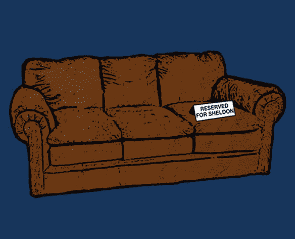
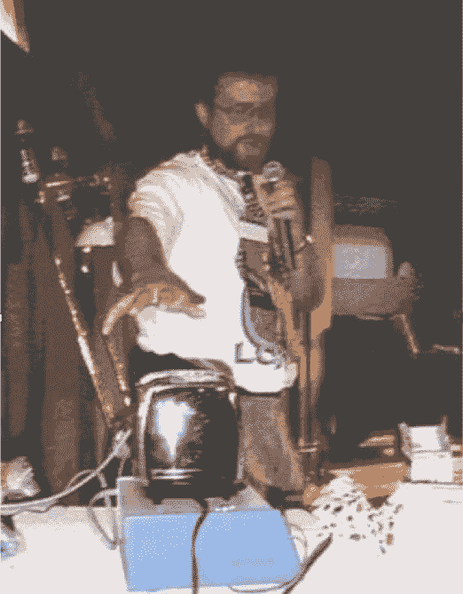
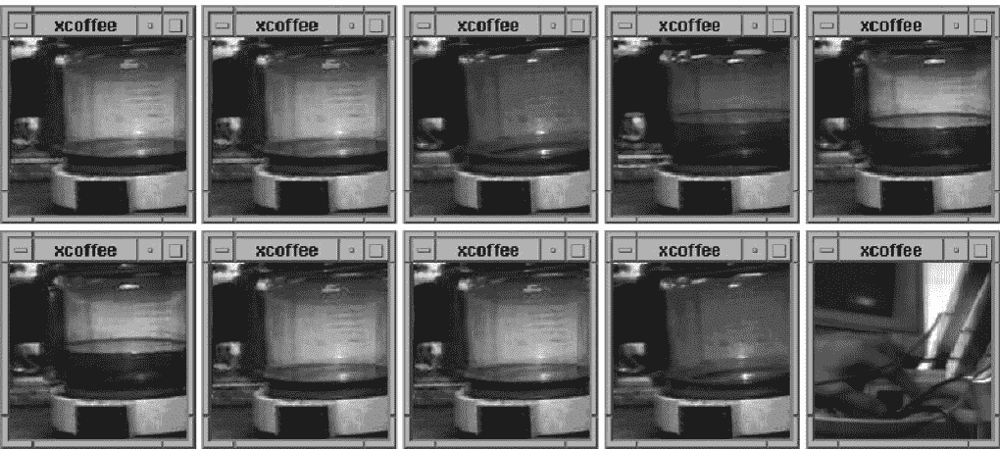

# 物联网世界

欢迎使用 JavaScript 访问高级物联网。在这本书里，我们将着眼于使用 JavaScript 作为我们的编程语言来构建物联网解决方案。在我们开始技术深度探讨之前，我想谈谈物联网的世界，它提供的解决方案，以及制造这些产品的开发人员肩负的责任。在本章中，我们将研究以下主题:

*   物联网世界
*   物联网的历史
*   物联网使用案例
*   技术概述
*   产品设计

# 物联网世界

想象一个场景，你的牛奶用完了；你已经注意到它，并把它放在你的购物清单上。但是由于不可预见的原因，你忘记买牛奶了；嗯，你第二天没有牛奶了。

现在想象另一个场景:你有一个智能冰箱，它注意到你的牛奶快用完了，把牛奶放在你的购物清单上，然后更新你的 GPS 路线，通过超市回家，但你仍然忘记了。

你现在必须面对冰箱的愤怒。

现在事情越来越真实，想象一下另一种情况，你的冰箱跳过了中间商，你，现在直接在亚马逊下单，亚马逊在你第二天需要早餐的时候送货上门。

场景三就是我们要找的东西。让一台机器与另一台机器对话，并据此做出决定；牛奶的类型、数量和有效期等信息会在购买前自动验证。

我们人类现在正在利用互联设备和智能设备的世界来改善我们的生活。

# 什么是物联网？

如果你已经呼吸了至少十年，你一定听说过诸如智能生活、智能空间和智能设备等术语。所有这些都是指被称为**物联网** ( **物联网**)的父概念。

简而言之，物联网是指我们的电子、电气或机电设备连接到互联网并相互交谈。

智能设备主要围绕两件事:

*   传感器
*   执行器

物联网领域的任何解决方案要么是感知什么，要么是驱动什么。

有了这项技术，我们找到了谢尔顿·库珀(来自哥伦比亚广播公司电视剧《生活大爆炸》中)的解决方案，他想知道谁一坐上他的位置，就有人坐在上面:

Source: http://bigbangtheory.wikia.com/wiki/Sheldon%27s_Spot

我们所做的就是在垫子下面放置一个重量传感器，如果重量增加，传感器就会触发指向沙发的摄像头拍照，并随照片向他发送推送通知。怎么样？

我知道我把例子推了一点，但你明白了，对吗？

# 一点历史

物联网已经以各种形式存在了超过 35 年。我发现的最早的例子是 1982 年卡内基梅隆大学的可乐机。由四名研究生迈克·卡扎尔、大卫·尼科尔斯、约翰·扎纳伊和艾弗·达勒姆开发，他们将可乐机连接到互联网上，这样他们就可以从桌子上检查机器上是否装有冷可乐。来源([https://www.cs.cmu.edu/~coke/](https://www.cs.cmu.edu/~coke/))。

蒂姆·伯纳斯·李爵士在 1991 年发明了第一个网页。

另一个例子是约翰·龙基的互联网烤面包机。他用 TCP/IP 协议将烤面包机连接到互联网上。他创造了一个控制打开烤面包机和一个控制关闭它。当然，必须有人把面包放进烤面包机:

Source: http://ieeexplore.ieee.org/document/7786805/

另一个有趣的物联网例子是特洛伊木马室咖啡壶。这是由昆汀·斯塔福德-弗雷泽和保罗·贾德兹基在 1993 年创作的。在剑桥大学计算机实验室的木马室里发现了一个摄像头。它监控咖啡壶的水位，图像大约每分钟更新三次，并被发送到大楼的服务器:

Source: https://en.wikipedia.org/wiki/Trojan_Room_coffee_pot

如前所述，我们可以看到，甚至在我们想象可能性之前，人们就已经在研究与互联网相关的解决方案。

在过去的两年里，有一件事我一直在看，并开始坚信:

"Laziness is the mother of Invention."

不是必要，不是无聊，而是懒惰。在这个时代，没有人想做一些平凡的事情，比如去杂货店购物，走到开关前，打开灯或交流电。因此，我们正在寻找新的和创新的方法来解决这些问题。

# 物联网用例

现在你已经对物联网有了感觉，你可以想象使用这项技术可以构建出无限的可能性。

根据我的观察，物联网用例可以粗略地分为三个部分:

*   问题解决
*   便利
*   炫耀

问题解决部分来自物联网用于解决现实问题的地方，例如，一个农民的农场离他们家只有半公里，他们必须一路走到农场才能打开水泵/马达。另一种情况是，术后患者的生命统计数据可以在出院后定期发送到医院，以监控患者的任何异常情况。这正是物联网非常适合的地方。

方便是你可以在到家前 30 分钟打开空调，这样如果你认识的人敲门，而你不在附近，你就可以在进门或下班后开门时感到寒冷。

炫耀是你去另一个国家只是为了打开或关闭你家门廊的灯，只是为了展示 IoT 的工作原理。

所有这些都是这种技术的消费形式。

在这本书里，我们将讨论一些属于以前用例的解决方案。

# 技术概述

既然我们知道了物联网是什么，我们就可以开始定义技术堆栈了。在本书中，我们将使用 JavaScript 构建一个通用框架来开发物联网应用。

我们将遵循云计算的方法，在这种方法中，我们有一堆连接到云的设备，而在雾计算方法中，有一个网关可以做云可以做的几乎所有事情，但在内部本地可用。

我们的智能设备将由树莓 Pi 3 供电，该设备能够通过 Wi-Fi 与云通话，并使用其 GPIO 引脚与传感器和执行器通话。使用这个简单的硬件，我们将连接传感器和执行器，并在本书中构建一些真实世界的解决方案。

覆盆子 Pi 3 的另一个替代方案是覆盆子 Pi Zero W，这是覆盆子 Pi 3 的微型版本，以防你想构建一个紧凑的解决方案。

我们将在[第 2 章](2.html#UGI00-ce91715363d04669bca1c1545beb57ee)、 *IoTFW.js - I* 和[第 3 章](3.html#24L8G0-ce91715363d04669bca1c1545beb57ee)、 *IoTFW.js - II、*中介绍每一项技术，并从那里开始使用这些技术构建各个领域的物联网解决方案。

# 产品设计

与软件开发不同，硬件开发非常困难。花费的时间、复杂性和执行成本都很高。想象一下 JavaScript 控制台中的语法错误；我们只需要转到特定的行号，进行更改，然后刷新浏览器。

现在将此与硬件产品开发进行比较。从一件硬件被识别到作为收缩包装产品被放在超市货架上，至少需要 8 个月的时间，至少要对产品进行四次迭代，才能在现实世界中验证和测试。

举另一个例子，组件在产品上的定位决定了产品的成败。想象一下，如果充电器插头上没有脊或把手；将充电器从插座中拔出时，您的手总是会打滑。这就是价值工程。

组装一个**概念证明** ( **概念验证**)非常简单，你会在本书的其余部分看到。把这个概念验证变成收缩包装的产品完全是另一回事。区别就像在浴室里唱歌和在有数百万人看着你的舞台上唱歌一样。

请记住，我们将在本书中构建的示例都是概念验证，没有一个与产品生产中使用的概念验证有丝毫接近。您可以随时使用我们将在本书中讨论的解决方案来更好地理解实施，然后围绕它们设计您自己的解决方案。

# 摘要

在这一章中，我们了解了物联网是什么，以及它的一些历史。接下来，我们看到了几个用例，一个高级技术概述，以及一些关于产品工程的内容。

在[第 2 章](2.html#UGI00-ce91715363d04669bca1c1545beb57ee)*iotfw . js-I*中，我们将开始构建物联网框架，并在此基础上构建我们的解决方案。