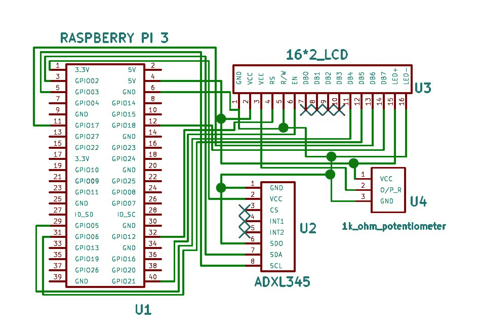
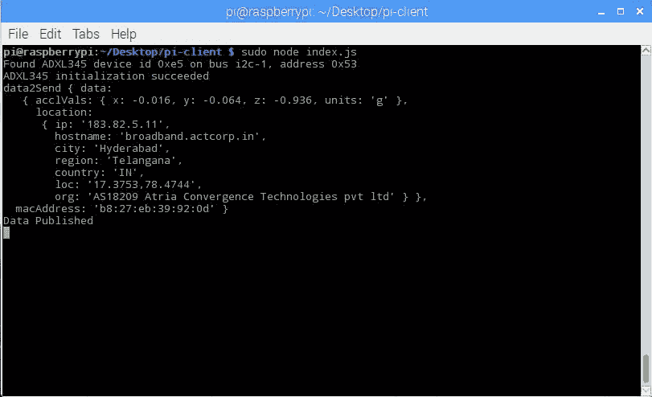
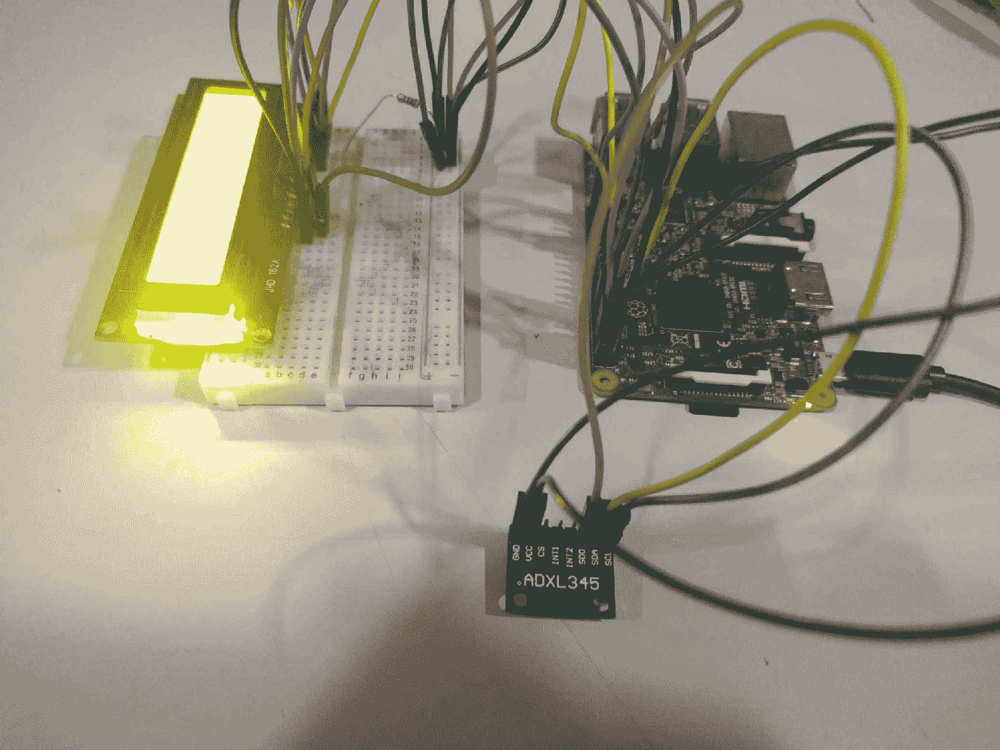
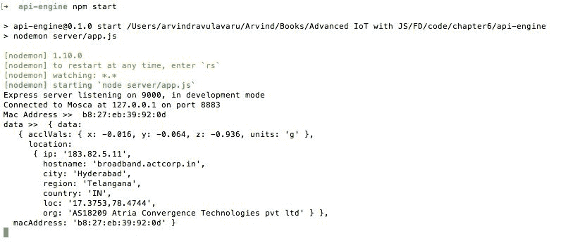
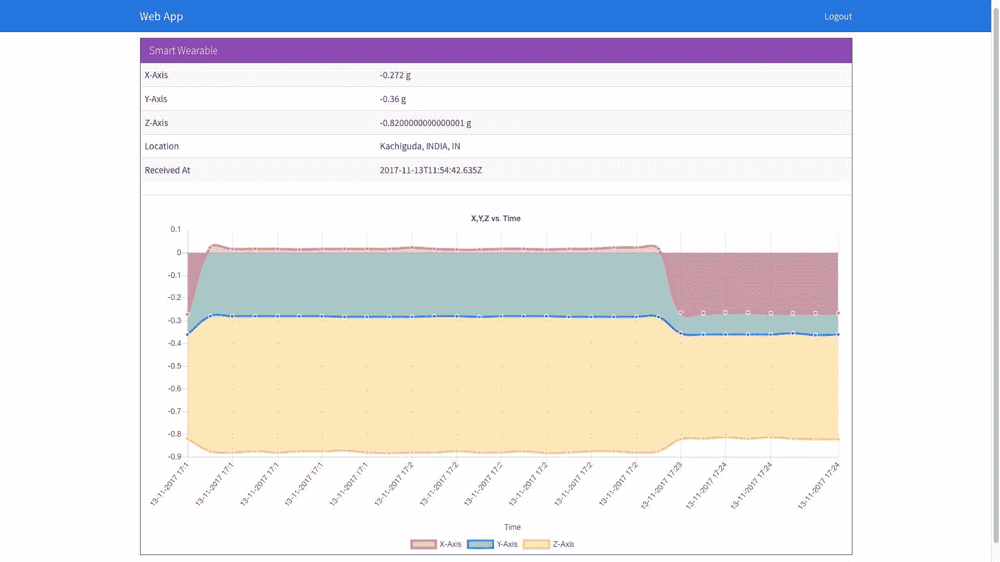
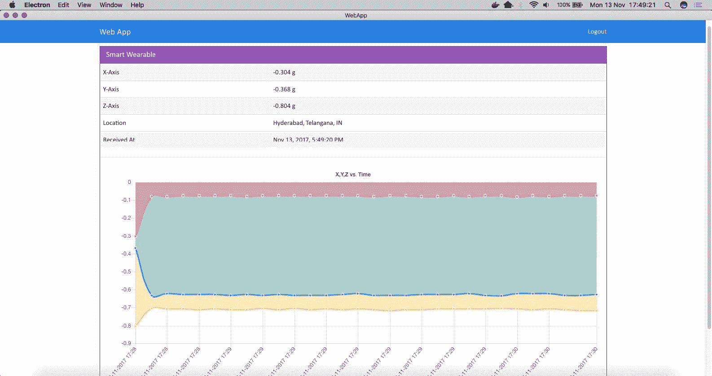
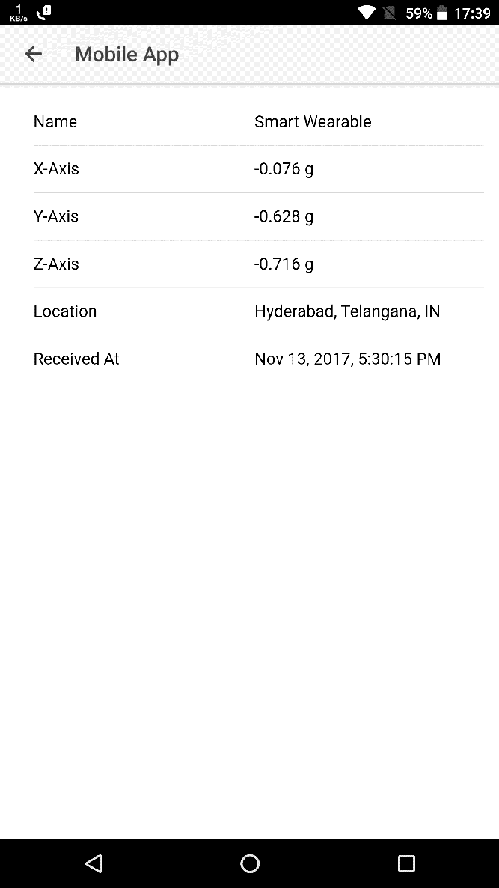

# 智能可穿戴

在本章中，我们将看一个简单的医疗保健应用程序，可以使用树莓 Pi 3 创建。我们将打造一款智能可穿戴设备，配备 16x2 液晶显示屏，可以显示用户的位置，还可以在网络/桌面/移动界面上显示加速度计的数值。该产品的目标受众主要是老年人，主要使用案例是跌倒检测，我们将在[第 7 章](7.html#3IE3G0-ce91715363d04669bca1c1545beb57ee)、*智能可穿戴设备和 IFTTT】中与他们合作。*

我们将在本章中了解以下内容:

*   物联网和医疗保健
*   设置所需的硬件
*   集成加速度计并查看实时数据

# 物联网和医疗保健

想象一下，一名患者成功接受了心脏移植手术，并在医院接受术后护理后被送回家。对这位病人的关注将会大大减少，因为与医院相比，家中的设施将是最少的。这就是物联网具有实时能力的地方。

物联网和医疗保健是天作之合。风险和回报同样高。能够实时监测患者的健康状况，并获得关于其脉搏率、体温和其他生命统计数据的信息，对其进行诊断并采取行动是非常宝贵的。与此同时，如果连接中断两分钟，生命将岌岌可危。

在我看来，要实现物联网在医疗保健领域的全部潜力，我们可能还需要等待 5 - 10 年，在这 5-10 年里，连接绝对是无缝的，丢包是一个古老的历史词汇。

# 智能可穿戴

如前所述，我们将使用物联网在医疗保健领域做一件至关重要的事情。我们要打造的智能可穿戴设备的主要目的是识别跌倒检测。一旦发现坠落，我们会通知云。当我们身边有老人或病人因为意想不到的原因而崩溃时，这是一个非常珍贵的特征。立即识别跌倒并采取行动有时可以挽救生命。

为了检测跌倒，我们将使用加速度计。引用维基百科:

"An **accelerometer** is a device that measures proper acceleration. Proper acceleration, being the acceleration (or rate of change of velocity) of a body in its own instantaneous rest frame, is not the same as coordinate acceleration, being the acceleration in a fixed coordinate system. For example, an accelerometer at rest on the surface of the Earth will measure an acceleration due to Earth's gravity, straight upwards (by definition) of g ≈ 9.81 m/s2\. By contrast, accelerometers in free fall (falling toward the centre of the Earth at a rate of about 9.81 m/s2) will measure zero."

要了解更多关于加速度计及其工作原理的信息，请参考*加速度计如何工作*位于:[https://www.youtube.com/watch?v=i2U49usFo10](https://www.youtube.com/watch?v=i2U49usFo10)。

在本章中，我们将实现收集 X、Y 和 Z 轴加速度原始值并在网络、桌面和移动应用程序上显示的基本系统。在[第 7 章](7.html#3IE3G0-ce91715363d04669bca1c1545beb57ee)、*智能穿戴和 IFTTT】中，我们将使用这些值实现跌倒检测。*

除了实时采集加速度计值，我们还将使用 16x2 液晶显示屏显示用户的当前时间和地理位置。如果需要，我们还可以向这个显示中添加其他文本。16x2 是显示内容的简单界面。这可以通过诺基亚 5110 液晶屏([http://www . Amazon . in/inch-诺基亚-5110-KG075-KitsGuru/DP/B01CXNSJOA](http://www.amazon.in/inch-Nokia-5110-KG075-KitsGuru/dp/B01CXNSJOA))进行扩展，实现更高级的带图形的显示。

在下一节中，我们将组装所需的硬件，然后更新树莓 Pi 代码。之后，我们将开始研究应用编程接口引擎和用户界面模板。

# 设置智能可穿戴

关于硬件设置，首先要注意的是它又大又笨重。这只是一个概念验证，甚至不是一个远程关闭的生产设置。硬件设置将包括一个连接到树莓 Pi 3 的加速度计和一个 16X2 液晶显示器。

加速度计 ADXL345 通过 I2C 协议给出 X、Y 和 Z 轴的加速度。

按照以下步骤连接硬件:



正如您在前面的示意图中看到的，我们建立了以下连接:

*   覆盆子皮和液晶显示器:

| **树莓皮号-销名** | 【T10】16 x2 LCD pi 名称 |
| 6 - GND -试验板轨道 1 | 1 - GND |
| 2 - 5V -试验板导轨 2 | 2 - VCC |
| 1 k 欧姆电位计 | 3 - VEE |
| 32 - GPIO 12 | 4 - RS |
| 6 - GND -试验板轨道 1 | 5-拆装 |
| 40 - GPIO 21 | 6 月 |
| 网络计算机 | 7 - DB0 |
| 网络计算机 | 8 - DB1 |
| 网络计算机 | 9 - DB2 |
| 网络计算机 | 10 - DB3 |
| 29 - GPIO 5 | 11 - DB4 |
| 31 - GPIO 6 | 12 - DB5 |
| 11 - GPIO 17 | 13 - DB6 |
| 12 - GPIO 18 | 14 - DB7 |
| 2 - 5V -试验板导轨 2 | 15 - LED+ |
| 6 - GND -试验板轨道 1 | 16 -发光二极管- |

*   树莓皮和 ADXL345:

| **树莓皮号-销名** | **ADXL345 引脚编号-引脚名称** |
| 1 - 3.3V | VCC |
| 6 - GND -试验板轨道 1 | GND |
| 5 - GPIO3/SCL1 | SCL |
| 3 - GPIO2/SDA1 | 国家药品监督管理局 |
| 6 - GND -试验板轨道 1 | 合成干性油（synthetic drying oil 的缩写） |

我们将添加所需的代码:

1.  首先创建一个名为`chapter6`的文件夹，然后将`chapter4`的内容复制到其中。我们将继续更新这段代码
2.  现在，我们从`pi-client`开始。在树莓皮上，打开`pi-client/index.js`并更新如下:

```js
var config = require('./config.js'); 
var mqtt = require('mqtt'); 
var GetMac = require('getmac'); 
var request = require('request'); 
var ADXL345 = require('adxl345-sensor'); 
require('events').EventEmitter.prototype._maxListeners = 100; 

var adxl345 = new ADXL345(); // defaults to i2cBusNo 1, i2cAddress 0x53 

var Lcd = require('lcd'), 
    lcd = new Lcd({ 
        rs: 12, 
        e: 21, 
        data: [5, 6, 17, 18], 
        cols: 8, 
        rows: 2 
    }); 

var aclCtr = 0, 
    locCtr = 0; 

var x, prevX, y, prevY, z, prevZ; 
var locationG; // global location variable 

var client = mqtt.connect({ 
    port: config.mqtt.port, 
    protocol: 'mqtts', 
    host: config.mqtt.host, 
    clientId: config.mqtt.clientId, 
    reconnectPeriod: 1000, 
    username: config.mqtt.clientId, 
    password: config.mqtt.clientId, 
    keepalive: 300, 
    rejectUnauthorized: false 
}); 

client.on('connect', function() { 
    client.subscribe('rpi'); 
    client.subscribe('socket'); 
    GetMac.getMac(function(err, mac) { 
        if (err) throw err; 
        macAddress = mac; 
        displayLocation(); 
        initADXL345(); 
        client.publish('api-engine', mac); 
    }); 
}); 

client.on('message', function(topic, message) { 
    message = message.toString(); 
    if (topic === 'rpi') { 
        console.log('API Engine Response >> ', message); 
    } else { 
        console.log('Unknown topic', topic); 
    } 
}); 

function initADXL345() { 
    adxl345.init().then(function() { 
            console.log('ADXL345 initialization succeeded'); 
            // init loop after ADXL345 has been setup 
            loop(); 
        }) 
        .catch(function(err) { 
            console.error('ADXL345 initialization failed: ', err); 
        }); 
} 

function loop() { 
    // infinite loop, with 1 seconds delay 
    setInterval(function() { 
        // wait till we get the location 
        // then start processing 
        if (!locationG) return; 

        if (aclCtr === 3) { // every 3 seconds 
            aclCtr = 0; 
            readSensorValues(function(acclVals) { 
                var x = acclVals.x; 
                var y = acclVals.y; 
                var z = acclVals.z; 

                var data2Send = { 
                    data: { 
                        acclVals: acclVals, 
                        location: locationG 
                    }, 
                    macAddress: macAddress 
                }; 

                // no duplicate data 
                if (x !== prevX || y !== prevY || z !== prevZ) { 
                    console.log('data2Send', data2Send); 
                    client.publish('accelerometer', JSON.stringify(data2Send)); 
                    console.log('Data Published'); 
                    prevX = x; 
                    prevY = y; 
                    prevZ = z; 
                } 
            }); 
        } 

        if (locCtr === 300) { // every 300 seconds 
            locCtr = 0; 
            displayLocation(); 
        } 

        aclCtr++; 
        locCtr++; 
    }, 1000); // every one second 
} 

function readSensorValues(CB) { 
    adxl345.getAcceleration(true) // true for g-force units, else false for m/s² 
        .then(function(acceleration) { 
            if (CB) CB(acceleration); 
        }) 
        .catch((err) => { 
            console.log('ADXL345 read error: ', err); 
        }); 
} 

function displayLocation() { 
    request('http://ipinfo.io', function(error, res, body) { 
        var info = JSON.parse(body); 
        // console.log(info); 
        locationG = info; 
        var text2Print = ''; 
        text2Print += 'City: ' + info.city; 
        text2Print += ' Region: ' + info.region; 
        text2Print += ' Country: ' + info.country + ' '; 
        lcd.setCursor(16, 0); // 1st row     
        lcd.autoscroll(); 
        printScroll(text2Print); 
    }); 
} 

// a function to print scroll 
function printScroll(str, pos) { 
    pos = pos || 0; 

    if (pos === str.length) { 
        pos = 0; 
    } 

    lcd.print(str[pos]); 
    //console.log('printing', str[pos]); 

    setTimeout(function() { 
        return printScroll(str, pos + 1); 
    }, 300); 
} 

// If ctrl+c is hit, free resources and exit. 
process.on('SIGINT', function() { 
    lcd.clear(); 
    lcd.close(); 
    process.exit(); 
}); 
```

从前面的代码中可以看出，我们每隔一小时使用`displayLocation()`显示位置，因为我们假设位置不会频繁变化。我们正在使用[http://ipinfo.io/](http://ipinfo.io/)服务来获取用户的位置。

3.  最后，使用`readSensorValues()`我们每隔`3`秒获取`accelerometer`的值，并将该数据发布到名为`accelerometer`的主题中
4.  现在，我们将安装所需的依赖项。从`pi-client`文件夹中，运行以下命令:

```js
npm install async getmac adxl345-sensor mqtt request --save
```

5.  保存所有文件，并通过运行以下命令在服务器或我们的桌面计算机上启动 mosca 代理:

```js
mosca -c index.js -v | pino  
```

6.  接下来，在树莓皮上运行代码:

```js
npm start  
```

这将启动`pi-client`并开始采集加速度计，并在液晶显示器上显示位置，如下所示:



我的设置如下所示:



接下来，我们将使用 API 引擎。

# 更新应用编程接口引擎

现在，我们已经让智能可穿戴设备运行并发送三轴数据，我们现在将实现所需的逻辑，以便在 API 引擎中接受该数据并将数据发送到网络/桌面/移动应用程序:

打开`api-engine/server/mqtt/index.js`，更新如下:

```js
var Data = require('../api/data/data.model'); 
var mqtt = require('mqtt'); 
var config = require('../config/environment'); 

var client = mqtt.connect({ 
    port: config.mqtt.port, 
    protocol: 'mqtts', 
    host: config.mqtt.host, 
    clientId: config.mqtt.clientId, 
    reconnectPeriod: 1000, 
    username: config.mqtt.clientId, 
    password: config.mqtt.clientId, 
    keepalive: 300, 
    rejectUnauthorized: false 
}); 

client.on('connect', function() { 
    console.log('Connected to Mosca at ' + config.mqtt.host + ' on port ' + config.mqtt.port); 
    client.subscribe('api-engine'); 
    client.subscribe('accelerometer'); 
}); 

client.on('message', function(topic, message) { 
    // message is Buffer 
    // console.log('Topic >> ', topic); 
    // console.log('Message >> ', message.toString()); 
    if (topic === 'api-engine') { 
        var macAddress = message.toString(); 
        console.log('Mac Address >> ', macAddress); 
        client.publish('rpi', 'Got Mac Address: ' + macAddress); 
    } else if (topic === 'accelerometer') { 
        var data = JSON.parse(message.toString()); 
        // create a new data record for the device   
        Data.create(data, function(err, data) { 
            if (err) return console.error(err); 
            // if the record has been saved successfully,  
            // websockets will trigger a message to the web-app 
            console.log('Data Saved :', data.data); 
        }); 
    } else { 
        console.log('Unknown topic', topic); 
    } 
}); 
```

在这里，我们订阅了一个名为`accelerometer`的话题，并倾听它的变化。接下来，我们更新`api-engine/server/api/data/data.controller.js`如下:

```js
'use strict'; 

var Data = require('./data.model'); 

/** 
 * Get Data for a device 
 */ 
exports.index = function(req, res) { 
    var macAddress = req.params.deviceId; 
    var limit = parseInt(req.params.limit) || 30; 

    Data 
        .find({ 
            macAddress: macAddress 
        }) 
        .sort({ 'createdAt': -1 }) 
        .limit(limit) 
        .exec(function(err, data) { 
            if (err) return res.status(500).send(err); 
            res.status(200).json(data); 
        }); 
}; 

/** 
 * Create a new data record 
 */ 
exports.create = function(req, res, next) { 
    var data = req.body || {}; 
    data.createdBy = req.user._id; 

    Data.create(data, function(err, _data) { 
        if (err) return res.status(500).send(err); 
        return res.json(_data); 
    }); 
}; 
```

前面的代码用于将数据保存到数据库中，并在网络、桌面和移动应用程序请求时从数据库中获取数据。

保存所有文件并运行应用编程接口引擎:

```js
npm start
```

这将启动应用编程接口引擎，如果需要，我们可以重新启动智能可穿戴设备，我们应该会看到以下内容:



在下一部分中，我们将使用 web 应用程序来显示数据。

# 更新网络应用程序

现在我们已经完成了应用编程接口引擎，我们将更新网络应用程序中的模板，以显示三轴数据。打开`web-app/src/app/device/device.component.html`，更新如下:

```js
<div class="container">
  <br>
  <div *ngIf="!device">
    <h3 class="text-center">Loading!</h3>
  </div>
  <div class="row" *ngIf="lastRecord">
    <div class="col-md-12">
      <div class="panel panel-info">
        <div class="panel-heading">
          <h3 class="panel-title">
                        {{device.name}}
                    </h3>
          <span class="pull-right btn-click">
                        <i class="fa fa-chevron-circle-up"></i>
                    </span>
        </div>
        <div class="clearfix"></div>
        <div class="table-responsive">
          <table class="table table-striped">
            <tr *ngIf="lastRecord">
              <td>X-Axis</td>
              <td>{{lastRecord.data.acclVals.x}} {{lastRecord.data.acclVals.units}}</td>
            </tr>
            <tr *ngIf="lastRecord">
              <td>Y-Axis</td>
              <td>{{lastRecord.data.acclVals.y}} {{lastRecord.data.acclVals.units}}</td>
            </tr>
            <tr *ngIf="lastRecord">
              <td>Z-Axis</td>
              <td>{{lastRecord.data.acclVals.z}} {{lastRecord.data.acclVals.units}}</td>
            </tr>
            <tr *ngIf="lastRecord">
              <td>Location</td>
              <td>{{lastRecord.data.location.city}}, {{lastRecord.data.location.region}}, {{lastRecord.data.location.country}}</td>
            </tr>
            <tr *ngIf="lastRecord">
              <td>Received At</td>
              <td>{{lastRecord.createdAt | date : 'medium'}}</td>
            </tr>
          </table>
          <hr>
          <div class="col-md-12" *ngIf="acclVals.length > 0">
            <canvas baseChart [datasets]="acclVals" [labels]="lineChartLabels" [options]="lineChartOptions" [legend]="lineChartLegend" [chartType]="lineChartType"></canvas>
          </div>
        </div>
      </div>
    </div>
  </div>
</div>
```

所需的逻辑将在`device.component.ts`内。打开`web-app/src/app/device/device.component.ts`，更新如下:

```js
import { Component, OnInit, OnDestroy } from '@angular/core';
import { DevicesService } from '../services/devices.service';
import { Params, ActivatedRoute } from '@angular/router';
import { SocketService } from '../services/socket.service';
import { DataService } from '../services/data.service';
import { NotificationsService } from 'angular2-notifications';

@Component({
  selector: 'app-device',
  templateUrl: './device.component.html',
  styleUrls: ['./device.component.css']
})
export class DeviceComponent implements OnInit, OnDestroy {
  device: any;
  data: Array<any>;
  toggleState: boolean = false;
  private subDevice: any;
  private subData: any;
  lastRecord: any;

  // line chart config
  public lineChartOptions: any = {
    responsive: true,
    legend: {
      position: 'bottom',
    }, hover: {
      mode: 'label'
    }, scales: {
      xAxes: [{
        display: true,
        scaleLabel: {
          display: true,
          labelString: 'Time'
        }
      }],
      yAxes: [{
        display: true,
        ticks: {
          beginAtZero: true,
          // steps: 10,
          // stepValue: 5,
          // max: 70
        }
      }],
      zAxes: [{
        display: true,
        ticks: {
          beginAtZero: true,
          // steps: 10,
          // stepValue: 5,
          // max: 70
        }
      }]
    },
    title: {
      display: true,
      text: 'X,Y,Z vs. Time'
    }
  };

  public lineChartLegend: boolean = true;
  public lineChartType: string = 'line';
  public acclVals: Array<any> = [];
  public lineChartLabels: Array<any> = [];

  constructor(private deviceService: DevicesService,
    private socketService: SocketService,
    private dataService: DataService,
    private route: ActivatedRoute,
    private notificationsService: NotificationsService) { }

  ngOnInit() {
    this.subDevice = this.route.params.subscribe((params) => {
      this.deviceService.getOne(params['id']).subscribe((response) => {
        this.device = response.json();
        this.getData();
      });
    });
  }

  getData() {
    this.dataService.get(this.device.macAddress).subscribe((response) => {
      this.data = response.json();
      this.lastRecord = this.data[0]; // descending order data
      this.toggleState = this.lastRecord.data.s;
      this.genChart();
      this.socketInit();
    });
  }

  socketInit() {
    this.subData = this.socketService.getData(this.device.macAddress).subscribe((data) => {
      if (this.data.length <= 0) return;
      this.data.splice(this.data.length - 1, 1); // remove the last record
      this.data.push(data); // add the new one
      this.lastRecord = data;
      this.toggleState = this.lastRecord.data.s;
      this.genChart();
    });
  }

  ngOnDestroy() {
    this.subDevice.unsubscribe();
    this.subData ? this.subData.unsubscribe() : '';
  }

  genChart() {
    let data = this.data;
    let _acclVals: Array<any> = [];
    let _lblArr: Array<any> = [];

    let xArr: Array<any> = [];
    let yArr: Array<any> = [];
    let zArr: Array<any> = [];

    for (var i = 0; i < data.length; i++) {
      let _d = data[i];
      xArr.push(_d.data.acclVals.x);
      yArr.push(_d.data.acclVals.y);
      zArr.push(_d.data.acclVals.z);
      _lblArr.push(this.formatDate(_d.createdAt));
    }

    // reverse data to show the latest on the right side
    xArr.reverse();
    yArr.reverse();
    zArr.reverse();
    _lblArr.reverse();

    _acclVals = [
      {
        data: xArr,
        label: 'X-Axis'
      },
      {
        data: yArr,
        label: 'Y-Axis'
      },
      {
        data: zArr,
        label: 'Z-Axis'
      }
    ]

    this.acclVals = _acclVals;

    this.lineChartLabels = _lblArr;
  }

  private formatDate(originalTime) {
    var d = new Date(originalTime);
    var datestring = d.getDate() + "-" + (d.getMonth() + 1) + "-" + d.getFullYear() + " " +
      d.getHours() + ":" + d.getMinutes();
    return datestring;
  }

}
```

保存所有文件并运行以下命令:

```js
npm start  
```

导航到`http://localhost:4200`并查看设备，我们应该会看到以下内容:



这样，我们就完成了网络应用。

# 更新桌面应用程序

现在 web 应用程序已经完成，我们将构建相同的应用程序，并将其部署到桌面应用程序中。

要开始，返回`web-app`文件夹的终端/提示符并运行:

```js
ng build --env=prod
```

这将在名为`dist`的`web-app`文件夹中创建一个新文件夹。`dist`文件夹的内容应类似如下:

```js
.

├── favicon.ico

├── index.html

├── inline.bundle.js

├── inline.bundle.js.map

├── main.bundle.js

├── main.bundle.js.map

├── polyfills.bundle.js

├── polyfills.bundle.js.map

├── scripts.bundle.js

├── scripts.bundle.js.map

├── styles.bundle.js

├── styles.bundle.js.map

├── vendor.bundle.js

└── vendor.bundle.js.map
```

我们编写的所有代码最终都被打包到前面的文件中。我们将抓取`dist`文件夹中的所有文件(不是`dist`文件夹)，然后将其粘贴到`desktop-app/app`文件夹中。经过上述更改后，桌面应用程序的最终结构如下:

```js
.

├── app

│ ├── favicon.ico

│ ├── index.html

│ ├── inline.bundle.js

│ ├── inline.bundle.js.map

│ ├── main.bundle.js

│ ├── main.bundle.js.map

│ ├── polyfills.bundle.js

│ ├── polyfills.bundle.js.map

│ ├── scripts.bundle.js

│ ├── scripts.bundle.js.map

│ ├── styles.bundle.js

│ ├── styles.bundle.js.map

│ ├── vendor.bundle.js

│ └── vendor.bundle.js.map

├── freeport.js

├── index.css

├── index.html

├── index.js

├── license

├── package.json

├── readme.md

└── server.js
```

要试驾，请运行以下命令:

```js
npm start
```

然后，当我们导航到查看设备页面时，我们应该会看到以下屏幕:



这样，我们就完成了桌面应用程序的开发。在下一部分，我们将更新手机应用。

# 更新手机应用模板

在最后一部分，我们已经更新了桌面应用程序。在本节中，我们将更新移动应用程序模板，以显示三轴数据。

首先，我们将更新视图设备模板。更新`mobile-app/src/pages/view-device/view-device.html`如下:

```js
<ion-header>
    <ion-navbar>
        <ion-title>Mobile App</ion-title>
    </ion-navbar>
</ion-header>
<ion-content padding>
    <div *ngIf="!lastRecord">
        <h3 class="text-center">Loading!</h3>
    </div>
    <div *ngIf="lastRecord">
        <ion-list>
            <ion-item>
                <ion-label>Name</ion-label>
                <ion-label>{{device.name}}</ion-label>
            </ion-item>
            <ion-item>
                <ion-label>X-Axis</ion-label>
                <ion-label>{{lastRecord.data.acclVals.x}} {{lastRecord.data.acclVals.units}}</ion-label>
            </ion-item>
            <ion-item>
                <ion-label>Y-Axis</ion-label>
                <ion-label>{{lastRecord.data.acclVals.y}} {{lastRecord.data.acclVals.units}}</ion-label>
            </ion-item>
            <ion-item>
                <ion-label>Z-Axis</ion-label>
                <ion-label>{{lastRecord.data.acclVals.z}} {{lastRecord.data.acclVals.units}}</ion-label>
            </ion-item>
            <ion-item>
                <ion-label>Location</ion-label>
                <ion-label>{{lastRecord.data.location.city}}, {{lastRecord.data.location.region}}, {{lastRecord.data.location.country}}</ion-label>
            </ion-item>
            <ion-item>
                <ion-label>Received At</ion-label>
                <ion-label>{{lastRecord.createdAt | date: 'medium'}}</ion-label>
            </ion-item>
        </ion-list>
    </div>
</ion-content>
```

接下来，我们更新`mobile-app/src/pages/view-device/view-device.ts`如下:

```js
import { Component } from '@angular/core'; 
import { IonicPage, NavController, NavParams } from 'ionic-angular'; 

import { DevicesService } from '../../services/device.service'; 
import { DataService } from '../../services/data.service'; 
import { ToastService } from '../../services/toast.service'; 
import { SocketService } from '../../services/socket.service'; 

@IonicPage() 
@Component({ 
   selector: 'page-view-device', 
   templateUrl: 'view-device.html', 
}) 
export class ViewDevicePage { 
   device: any; 
   data: Array<any>; 
   toggleState: boolean = false; 
   private subData: any; 
   lastRecord: any; 

   constructor(private navCtrl: NavController, 
         private navParams: NavParams, 
         private socketService: SocketService, 
         private deviceService: DevicesService, 
         private dataService: DataService, 
         private toastService: ToastService) { 
         this.device = navParams.get("device"); 
         console.log(this.device); 
   } 

   ionViewDidLoad() { 
         this.deviceService.getOne(this.device._id).subscribe((response) => { 
               this.device = response.json(); 
               this.getData(); 
               this.socketInit(); 
         }); 
   } 

   getData() { 
         this.dataService.get(this.device.macAddress).subscribe((response) => { 
               this.data = response.json(); 
               this.lastRecord = this.data[0]; // descending order data 
         }); 
   } 

   socketInit() { 
         this.subData = this.socketService.getData(this.device.macAddress).subscribe((data) => { 
               if (this.data.length <= 0) return; 
               this.data.splice(this.data.length - 1, 1); // remove the last record 
               this.data.push(data); // add the new one 
               this.lastRecord = data; 
         }); 
   } 

   ionViewDidUnload() { 
         this.subData && this.subData.unsubscribe && this.subData.unsubscribe(); //unsubscribe if subData is defined 
   } 
} 
```

保存所有文件，使用`ionic serve`或`ionic cordova run android`运行手机应用。

我们应该看到以下内容:



这样，我们就可以在移动应用程序上显示智能穿戴设备的数据了。

# 摘要

在本章中，我们已经看到了如何使用树莓 Pi 3 构建一个简单的智能可穿戴设备。我们设置了液晶显示器和三轴加速度计，并在显示器上显示位置信息。我们已经将加速度计数据实时发布到云上，并在网络、桌面和移动应用程序上显示出来。

在[第 7 章](7.html#3IE3G0-ce91715363d04669bca1c1545beb57ee)、*智能可穿戴和 iftt*中，我们将通过在智能可穿戴之上实施 iftt 规则，将智能可穿戴更上一层楼。我们将采取行动，如打电话或向耐心紧急联系人发送短信，以便立即给予护理。