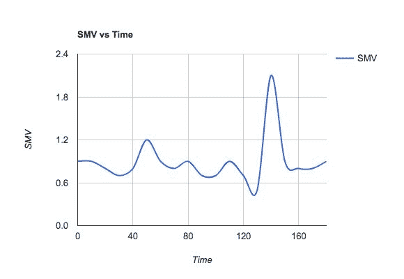
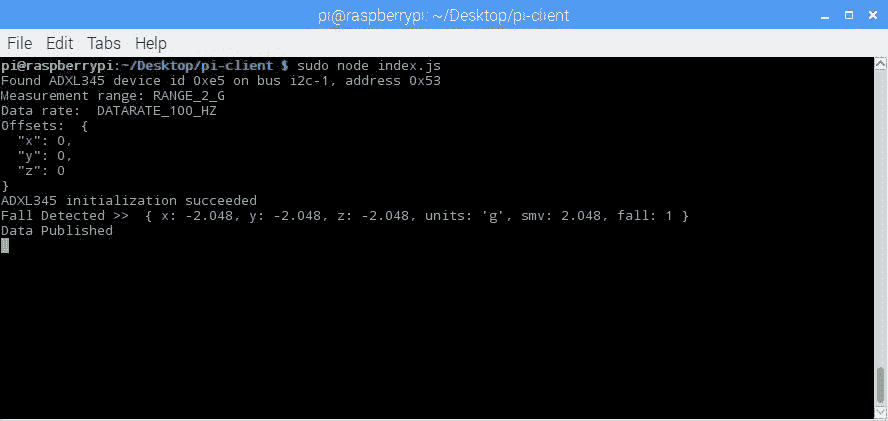
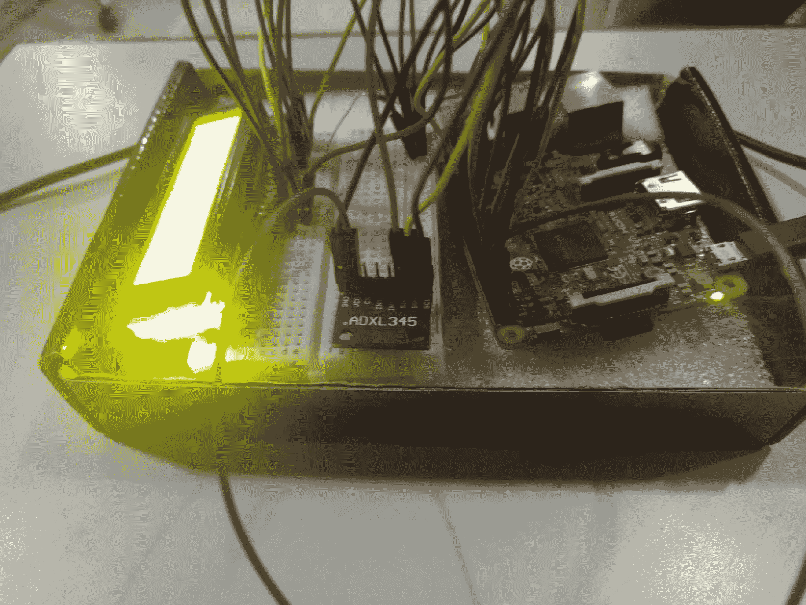
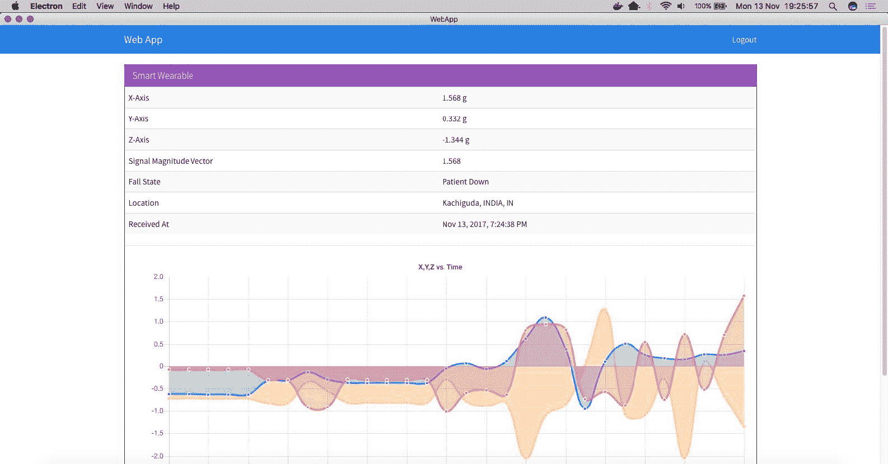
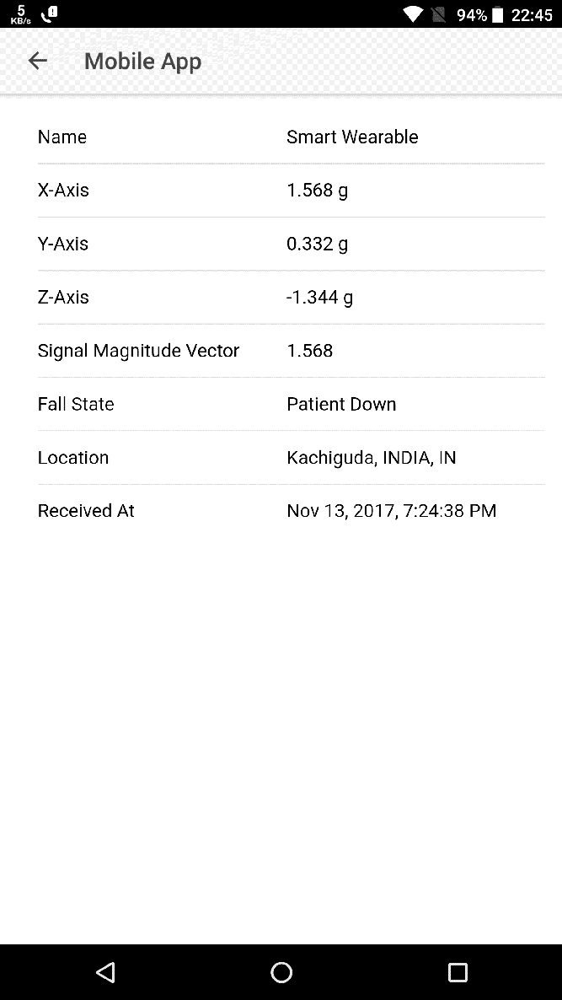

# 智能可穿戴和 IFTTT

在[第 6 章](6.html#39REE0-ce91715363d04669bca1c1545beb57ee)、*智能可穿戴*中，我们研究了如何构建一个简单的可穿戴设备，它可以显示用户的位置并读取加速度计值。在本章中，我们将通过在设备上实现跌倒检测逻辑，然后在数据之上添加**If This Then That**(**iftt**)规则，以便在特定事件发生时执行操作，从而将该应用提升到下一个层次。我们将研究以下主题:

*   什么是 IFTTT
*   IFTTT 和物联网
*   理解跌倒检测
*   基于加速度计的跌倒检测
*   构建 IFTTT 规则引擎

# IFTTT 和物联网

这种反应模式可以很容易地应用于某些情况。例如，如果一个病人摔倒了，然后叫救护车，或者如果温度低于 15 度，然后关闭空调，等等。这些是我们定义的简单规则，可以帮助我们自动化许多过程。

在物联网中，规则引擎是自动化大多数单调任务的关键。在本章中，我们将构建一个简单的硬编码规则引擎，它将持续监控传入的数据。如果传入的数据符合我们的任何规则，它将执行一个响应。

What we are building is a similar concept to [ifttt.com](https://ifttt.com/) ([https://ifttt.com/discover](https://ifttt.com/discover)), but is very specific to IoT devices that are present inside our framework. IFTTT ([https://ifttt.com/discover](https://ifttt.com/discover)) has no relation to what we are building in our book.

# 跌倒检测

在[第 6 章](6.html#39REE0-ce91715363d04669bca1c1545beb57ee)、*智能穿戴*中，我们从加速度计中采集了三个轴值。现在，我们将利用这些数据来检测跌倒。

我推荐观看视频【自由落体中的 T0 加速计】([https://www.youtube.com/watch?v=-om0eTXsgnY](https://www.youtube.com/watch?v=-om0eTXsgnY))，该视频解释了加速计在静止和运动时的行为。

现在我们已经了解了跌倒检测的基本概念，接下来我们来谈谈我们的具体使用案例。

跌倒检测最大的挑战是区分跌倒和其他活动，如跑步和跳跃。在这一章中，我们将保持事情简单，并在非常基本的条件下工作，在这些条件下，处于休息或持续运动中的用户会突然摔倒。

为了识别用户是否摔倒，我们使用信号幅度向量或 *SMV* 。 *SMV* 是三个轴数值的均方根。那就是:


如果我们开始绘制处于闲置状态然后倒下的用户在**时间**上的 **SMV** ，我们将得到一个图表，如下所示:



注意图表末尾的峰值。这是用户实际跌倒的点。

现在，当我们从 ADXL345 收集加速度计值时，我们将计算 SMV。基于使用我们构建的智能可穿戴设备的多次迭代，我始终能够在 1 克的 SMV 值下检测到跌倒。对于小于 1 克 SMV 的任何东西，用户几乎总是被认为是静止的，大于 1 克 SMV 的任何东西都被认为是跌倒。

请注意，我放置加速度计的方式是 y 轴垂直于地面。

一旦我们将设置组合在一起，您就可以亲眼看到 SMV 值如何随着加速度计位置的变化而变化。

请注意，如果您正在进行其他活动，如跳跃或蹲下，跌倒检测可能会被触发。你可以用 1 g SMV 的阈值来玩，以获得一致的跌倒检测。

You can also refer to *Detecting Human Falls with a 3-Axis Digital Accelerometer*: ([http://www.analog.com/en/analog-dialogue/articles/detecting-falls-3-axis-digital-accelerometer.html](http://www.analog.com/en/analog-dialogue/articles/detecting-falls-3-axis-digital-accelerometer.html)), or *Accelerometer-based on-body sensor localization for health and medical monitoring applications* ([https://www.ncbi.nlm.nih.gov/pmc/articles/PMC3279922/](https://www.ncbi.nlm.nih.gov/pmc/articles/PMC3279922/)), and *Development of the Algorithm for Detecting Falls during Daily Activity using 2 Tri-Axial Accelerometers* ([http://waset.org/publications/2993/development-of-the-algorithm-for-detecting-falls-during-daily-activity-using-2-tri-axial-accelerometers](http://waset.org/publications/2993/development-of-the-algorithm-for-detecting-falls-during-daily-activity-using-2-tri-axial-accelerometers)) to get a greater understanding of this topic and improve the efficiency of the system.

# 更新树莓皮

现在我们知道了需要做什么，我们将开始编写代码。

在我们继续之前，创建一个名为`chapter7`的文件夹，并在`chapter7`文件夹中复制`chapter6`代码。

接下来，打开`pi/index.js`文件。我们将更新 ADXL345 初始化设置，然后开始使用这些值。更新`pi/index.js`，如下:

```js
var config = require('./config.js'); 
var mqtt = require('mqtt'); 
var GetMac = require('getmac'); 
var request = require('request'); 
var ADXL345 = require('adxl345-sensor'); 
require('events').EventEmitter.prototype._maxListeners = 100; 

var adxl345 = new ADXL345(); // defaults to i2cBusNo 1, i2cAddress 0x53 

var Lcd = require('lcd'), 
    lcd = new Lcd({ 
        rs: 12, 
        e: 21, 
        data: [5, 6, 17, 18], 
        cols: 8, 
        rows: 2 
    }); 

var aclCtr = 0, 
    locCtr = 0; 

var prevX, prevY, prevZ, prevSMV, prevFALL; 
var locationG; // global location variable 

var client = mqtt.connect({ 
    port: config.mqtt.port, 
    protocol: 'mqtts', 
    host: config.mqtt.host, 
    clientId: config.mqtt.clientId, 
    reconnectPeriod: 1000, 
    username: config.mqtt.clientId, 
    password: config.mqtt.clientId, 
    keepalive: 300, 
    rejectUnauthorized: false 
}); 

client.on('connect', function() { 
    client.subscribe('rpi'); 
    client.subscribe('socket'); 
    GetMac.getMac(function(err, mac) { 
        if (err) throw err; 
        macAddress = mac; 
        displayLocation(); 
        initADXL345(); 
        client.publish('api-engine', mac); 
    }); 
}); 

client.on('message', function(topic, message) { 
    message = message.toString(); 
    if (topic === 'rpi') { 
        console.log('API Engine Response >> ', message); 
    } else { 
        console.log('Unknown topic', topic); 
    } 
}); 

function initADXL345() { 
    adxl345.init() 
        .then(() => adxl345.setMeasurementRange(ADXL345.RANGE_2_G())) 
        .then(() => adxl345.setDataRate(ADXL345.DATARATE_100_HZ())) 
        .then(() => adxl345.setOffsetX(0)) // measure for your particular device 
        .then(() => adxl345.setOffsetY(0)) // measure for your particular device 
        .then(() => adxl345.setOffsetZ(0)) // measure for your particular device 
        .then(() => adxl345.getMeasurementRange()) 
        .then((range) => { 
            console.log('Measurement range:', ADXL345.stringifyMeasurementRange(range)); 
            return adxl345.getDataRate(); 
        }) 
        .then((rate) => { 
            console.log('Data rate: ', ADXL345.stringifyDataRate(rate)); 
            return adxl345.getOffsets(); 
        }) 
        .then((offsets) => { 
            console.log('Offsets: ', JSON.stringify(offsets, null, 2)); 
            console.log('ADXL345 initialization succeeded'); 
            loop(); 
        }) 
        .catch((err) => console.error('ADXL345 initialization failed:', err)); 
} 

function loop() { 
    // infinite loop, with 3 seconds delay 
    setInterval(function() { 
        // wait till we get the location 
        // then start processing 
        if (!locationG) return; 

        readSensorValues(function(acclVals) { 
            var x = acclVals.x; 
            var y = acclVals.y; 
            var z = acclVals.z; 
            var fall = 0; 
            var smv = Math.sqrt(x * x, y * y, z * z); 

            if (smv > 1) { 
                fall = 1; 
            } 

            acclVals.smv = smv; 
            acclVals.fall = fall; 

            var data2Send = { 
                data: { 
                    acclVals: acclVals, 
                    location: locationG 
                }, 
                macAddress: macAddress 
            }; 

            // no duplicate data 
            if (fall === 1 && (x !== prevX || y !== prevY || z !== prevZ || smv !== prevSMV || fall !== prevFALL)) { 
                console.log('Fall Detected >> ', acclVals); 
                client.publish('accelerometer', JSON.stringify(data2Send)); 
                console.log('Data Published'); 
                prevX = x; 
                prevY = y; 
                prevZ = z; 
            } 
        }); 

        if (locCtr === 600) { // every 5 mins 
            locCtr = 0; 
            displayLocation(); 
        } 

        aclCtr++; 
        locCtr++; 
    }, 500); // every one second 
} 

function readSensorValues(CB) { 
    adxl345.getAcceleration(true) // true for g-force units, else false for m/s² 
        .then(function(acceleration) { 
            if (CB) CB(acceleration); 
        }) 
        .catch((err) => { 
            console.log('ADXL345 read error: ', err); 
        }); 
} 

function displayLocation() { 
    request('http://ipinfo.io', function(error, res, body) { 
        var info = JSON.parse(body); 
        // console.log(info); 
        locationG = info; 
        var text2Print = ''; 
        text2Print += 'City: ' + info.city; 
        text2Print += ' Region: ' + info.region; 
        text2Print += ' Country: ' + info.country + ' '; 
        lcd.setCursor(16, 0); // 1st row     
        lcd.autoscroll(); 
        printScroll(text2Print); 
    }); 
} 

// a function to print scroll 
function printScroll(str, pos) { 
    pos = pos || 0; 

    if (pos === str.length) { 
        pos = 0; 
    } 

    lcd.print(str[pos]); 
    //console.log('printing', str[pos]); 

    setTimeout(function() { 
        return printScroll(str, pos + 1); 
    }, 300); 
} 

// If ctrl+c is hit, free resources and exit. 
process.on('SIGINT', function() { 
    lcd.clear(); 
    lcd.close(); 
    process.exit(); 
});  
```

注`initADXL345()`。我们将测量范围定义为`2_G`，清除偏移，然后调用无限循环函数。在这个场景中，我们每隔`500`毫秒运行一次`setInterval()`，而不是每隔`1`秒运行一次。每隔`500`毫秒调用`readSensorValues()`，而不是每隔`3`秒调用一次。这是为了确保我们毫不拖延地捕捉瀑布。

在`readSensorValues()`中，一旦`x`、`y`和`z`值可用，我们就计算 SMV。然后，我们检查 SMV 值是否大于`1`:如果是，那么我们检测到了跌落。

连同`x`、`y`和`z`值一起，我们将 SMV 值和下降值发送给 API 引擎。此外，请注意，在此示例中，我们收集值时并未发送所有值。只有在检测到坠落时，我们才会发送数据。

保存所有文件。通过从`chapter7/broker`文件夹运行以下命令来启动代理:

```js
mosca -c index.js -v | pino  
```

接下来，通过从`chapter7/api-engine`文件夹运行以下命令来启动 API 引擎:

```js
npm start  
```

我们还没有将 IFTTT 逻辑添加到 API 引擎中，这将在下一节中进行。现在，为了验证我们的设置，让我们通过执行以下命令在树莓 Pi 上运行`index.js`文件:

```js
npm start  
```

如果一切顺利，加速度计应该可以成功初始化，数据应该可以开始输入。

如果我们模拟自由落体，我们应该看到我们的第一条数据进入 API 引擎，它应该看起来像下面的截图:



如你所见，模拟自由落体给出了`2.048` g 的 SMV。

我的硬件设置如下所示:



我已经把整个装置粘在了一张**聚苯乙烯泡沫塑料**纸上，所以我可以很舒服地测试坠落检测逻辑。

I removed the 16 x 2 LCD from the setup while I was identifying the SMV for free fall.

在下一节中，我们将读取从设备接收到的数据，然后根据这些数据执行规则。

# 构建 IFTTT 规则引擎

现在，我们正在向 API 引擎发送所需的数据，我们将做两件事:

1.  显示我们从网络、桌面和移动应用上的智能穿戴设备获得的数据
2.  在数据之上执行规则

我们将首先从第二个目标开始。我们将建立一个规则引擎，根据我们收到的数据执行规则。

让我们从在`api-engine/server`文件夹的根目录下创建一个名为`ifttt`的文件夹开始。在`ifttt`文件夹中，创建一个名为`rules.json`的文件。更新`api-engine/server/ifttt/rules.json`，如下:

```js
[{ 
    "device": "b8:27:eb:39:92:0d", 
    "rules": [ 
    { 
        "if": 
        { 
            "prop": "fall", 
            "cond": "eq", 
            "valu": 1 
        }, 
        "then": 
        { 
            "action": "EMAIL", 
            "to": "arvind.ravulavaru@gmail.com" 
        } 
    }] 
}] 
```

从前面的代码中可以看出，我们正在维护一个包含所有规则的 JSON 文件。在我们的场景中，一个设备只有一个规则，这个规则有两个部分:`if`部分和`then`部分。`if`是指需要对照输入数据进行检查的属性、检查条件以及需要对照其进行检查的值。`then`部分是指如果`if`匹配需要采取的行动。在前一种情况下，此操作涉及发送电子邮件。

接下来，我们将构建规则引擎本身。在`api-engine/server/ifttt`文件夹中创建一个名为`ifttt.js`的文件，并更新`api-engine/server/ifttt/ifttt.js`，如下所示:

```js
var Rules = require('./rules.json'); 

exports.processData = function(data) { 

    for (var i = 0; i < Rules.length; i++) { 
        if (Rules[i].device === data.macAddress) { 
            // the rule belows to the incoming device's data 
            for (var j = 0; j < Rules[i].rules.length; j++) { 
                // process one rule at a time 
                var rule = Rules[i].rules[j]; 
                var data = data.data.acclVals; 
                if (checkRuleAndData(rule, data)) { 
                    console.log('Rule Matched', 'Processing Then.'); 
                    if (rule.then.action === 'EMAIL') { 
                        console.log('Sending email to', rule.then.to); 
                        EMAIL(rule.then.to); 
                    } else { 
                        console.log('Unknown Then! Please re-check the rules'); 
                    } 
                } else { 
                    console.log('Rule Did Not Matched', rule, data); 
                } 
            } 
        } 
    } 
} 

/*   Rule process Helper  */ 
function checkRuleAndData(rule, data) { 
    var rule = rule.if; 
    if (rule.cond === 'lt') { 
        return rule.valu < data[rule['prop']]; 
    } else if (rule.cond === 'lte') { 
        return rule.valu <= data[rule['prop']]; 
    } else if (rule.cond === 'eq') { 
        return rule.valu === data[rule['prop']]; 
    } else if (rule.cond === 'gte') { 
        return rule.valu >= data[rule['prop']]; 
    } else if (rule.cond === 'gt') { 
        return rule.valu > data[rule['prop']]; 
    } else if (rule.cond === 'ne') { 
        return rule.valu !== data[rule['prop']]; 
    } else { 
        return false; 
    } 
} 

/*Then Helpers*/ 
function SMS() { 
    /// AN EXAMPLE TO SHOW OTHER THENs 
} 

function CALL() { 
    /// AN EXAMPLE TO SHOW OTHER THENs 
} 

function PUSHNOTIFICATION() { 
    /// AN EXAMPLE TO SHOW OTHER THENs 
} 

function EMAIL(to) { 
    /// AN EXAMPLE TO SHOW OTHER THENs 
    var email = require('emailjs'); 
    var server = email.server.connect({ 
        user: 'arvind.ravulavaru@gmail.com', 
        password: 'XXXXXXXXXX', 
        host: 'smtp.gmail.com', 
        ssl: true 
    }); 

    server.send({ 
        text: 'Fall has been detected. Please attend to the patient', 
        from: 'Patient Bot <arvind.ravulavaru@gmail.com>', 
        to: to, 
        subject: 'Fall Alert!!' 
    }, function(err, message) { 
        if (err) { 
            console.log('Message sending failed!', err); 
        } 
    }); 
} 
```

逻辑很简单。当新的数据记录到达应用编程接口引擎时，调用`processData()`。然后，我们从`rules.json`文件中加载所有规则，并对它们进行迭代，以检查当前规则是否适用于传入设备。

如果是，则通过传递规则和传入数据来调用`checkRuleAndData()`，以检查当前数据集是否匹配任何预定义的规则。如果是这样，我们会检查操作，在我们的例子中是发送电子邮件。您可以在代码中更新适当的电子邮件凭据。

一旦完成，我们需要从`api-engine/server/mqtt/index.js client.on('message')`调用`processData()`，使`topic`等于`accelerometer`。

更新`client.on('message')`，如下:

```js
client.on('message', function(topic, message) { 
    // message is Buffer 
    // console.log('Topic >> ', topic); 
    // console.log('Message >> ', message.toString()); 
    if (topic === 'api-engine') { 
        var macAddress = message.toString(); 
        console.log('Mac Address >> ', macAddress); 
        client.publish('rpi', 'Got Mac Address: ' + macAddress); 
    } else if (topic === 'accelerometer') { 
        var data = JSON.parse(message.toString()); 
        console.log('data >> ', data); 
        // create a new data record for the device 
        Data.create(data, function(err, data) { 
            if (err) return console.error(err); 
            // if the record has been saved successfully,  
            // websockets will trigger a message to the web-app 
            // console.log('Data Saved :', data.data); 
            // Invoke IFTTT Rules Engine 
            RulesEngine.processData(data); 
        }); 
    } else { 
        console.log('Unknown topic', topic); 
    } 
}); 
```

就是这样。我们有运行 IFTTT 发动机所需的所有零件。

保存所有文件并重新启动应用编程接口引擎。现在，模拟一次跌倒，我们会看到一封电子邮件向我们走来，看起来应该是这样的:


现在我们已经完成了 IFTTT 引擎，我们将更新接口以反映我们收集的新数据。

# 更新网络应用程序

要更新网络应用，打开`web-app/src/app/device/device.component.html`并更新，如下所示:

```js
<div class="container"> 
  <br> 
  <div *ngIf="!device"> 
    <h3 class="text-center">Loading!</h3> 
  </div> 
  <div class="row" *ngIf="lastRecord"> 
    <div class="col-md-12"> 
      <div class="panel panel-info"> 
        <div class="panel-heading"> 
          <h3 class="panel-title"> 
                        {{device.name}} 
                    </h3> 
          <span class="pull-right btn-click"> 
                        <i class="fa fa-chevron-circle-up"></i> 
                    </span> 
        </div> 
        <div class="clearfix"></div> 
        <div class="table-responsive"> 
          <table class="table table-striped"> 
            <tr *ngIf="lastRecord"> 
              <td>X-Axis</td> 
              <td>{{lastRecord.data.acclVals.x}} {{lastRecord.data.acclVals.units}}</td> 
            </tr> 
            <tr *ngIf="lastRecord"> 
              <td>Y-Axis</td> 
              <td>{{lastRecord.data.acclVals.y}} {{lastRecord.data.acclVals.units}}</td> 
            </tr> 
            <tr *ngIf="lastRecord"> 
              <td>Z-Axis</td> 
              <td>{{lastRecord.data.acclVals.z}} {{lastRecord.data.acclVals.units}}</td> 
            </tr> 
            <tr *ngIf="lastRecord"> 
              <td>Signal Magnitude Vector</td> 
              <td>{{lastRecord.data.acclVals.smv}}</td> 
            </tr> 
            <tr *ngIf="lastRecord"> 
              <td>Fall State</td> 
              <td>{{lastRecord.data.acclVals.fall ? 'Patient Down' : 'All is well!'}}</td> 
            </tr> 
            <tr *ngIf="lastRecord"> 
              <td>Location</td> 
              <td>{{lastRecord.data.location.city}}, {{lastRecord.data.location.region}}, {{lastRecord.data.location.country}}</td> 
            </tr> 
            <tr *ngIf="lastRecord"> 
              <td>Received At</td> 
              <td>{{lastRecord.createdAt | date : 'medium'}}</td> 
            </tr> 
          </table> 
          <hr> 
          <div class="col-md-12" *ngIf="acclVals.length > 0"> 
            <canvas baseChart [datasets]="acclVals" [labels]="lineChartLabels" [options]="lineChartOptions" [legend]="lineChartLegend" [chartType]="lineChartType"></canvas> 
          </div> 
        </div> 
      </div> 
    </div> 
  </div> 
</div> 
```

保存文件并运行:

```js
npm start
```

导航到设备页面后，我们应该会看到以下内容:


在下一部分，我们将更新桌面应用程序。

# 更新桌面应用程序

现在 web 应用程序已经完成，我们将构建相同的应用程序，并将其部署到桌面应用程序中。

要开始，返回`web-app`文件夹的终端/提示符并运行:

```js
ng build --env=prod
```

这将在名为`dist`的`web-app`文件夹内创建一个新文件夹。`dist`文件夹的内容应大致如下:

```js
.

├── favicon.ico

├── index.html

├── inline.bundle.js

├── inline.bundle.js.map

├── main.bundle.js

├── main.bundle.js.map

├── polyfills.bundle.js

├── polyfills.bundle.js.map

├── scripts.bundle.js

├── scripts.bundle.js.map

├── styles.bundle.js

├── styles.bundle.js.map

├── vendor.bundle.js

└── vendor.bundle.js.map
```

我们编写的所有代码最终都被打包到前面的文件中。我们将抓取`dist`文件夹中的所有文件(不是`dist`文件夹)，然后将它们粘贴到`desktop-app/app`文件夹中。进行这些更改后，桌面应用程序的最终结构如下:

```js
.

├── app

│ ├── favicon.ico

│ ├── index.html

│ ├── inline.bundle.js

│ ├── inline.bundle.js.map

│ ├── main.bundle.js

│ ├── main.bundle.js.map

│ ├── polyfills.bundle.js

│ ├── polyfills.bundle.js.map

│ ├── scripts.bundle.js

│ ├── scripts.bundle.js.map

│ ├── styles.bundle.js

│ ├── styles.bundle.js.map

│ ├── vendor.bundle.js

│ └── vendor.bundle.js.map

├── freeport.js

├── index.css

├── index.html

├── index.js

├── license

├── package.json

├── readme.md

└── server.js
```

要试驾，请运行:

```js
npm start  
```

然后，当我们导航到查看设备页面时，我们应该会看到以下内容:



现在我们已经完成了桌面应用程序，我们将在移动应用程序上工作。

# 更新手机应用程序

为了在手机 app 中体现新模板，我们将更新`mobile-app/src/pages/view-device/view-device.html`，如下:

```js
<ion-header> 
  <ion-navbar> 
    <ion-title>Mobile App</ion-title> 
  </ion-navbar> 
</ion-header> 
<ion-content padding> 
  <div *ngIf="!lastRecord"> 
    <h3 class="text-center">Loading!</h3> 
  </div> 
  <div *ngIf="lastRecord"> 
    <ion-list> 
      <ion-item> 
        <ion-label>Name</ion-label> 
        <ion-label>{{device.name}}</ion-label> 
      </ion-item> 
      <ion-item> 
        <ion-label>X-Axis</ion-label> 
        <ion-label>{{lastRecord.data.acclVals.x}} {{lastRecord.data.acclVals.units}}</ion-label> 
      </ion-item> 
      <ion-item> 
        <ion-label>Y-Axis</ion-label> 
        <ion-label>{{lastRecord.data.acclVals.y}} {{lastRecord.data.acclVals.units}}</ion-label> 
      </ion-item> 
      <ion-item> 
        <ion-label>Z-Axis</ion-label> 
        <ion-label>{{lastRecord.data.acclVals.z}} {{lastRecord.data.acclVals.units}}</ion-label> 
      </ion-item> 
      <ion-item> 
        <ion-label>Signal Magnitude Vector</ion-label> 
        <ion-label>{{lastRecord.data.acclVals.smv}}</ion-label> 
      </ion-item> 
      <ion-item> 
        <ion-label>Fall State</ion-label> 
        <ion-label>{{lastRecord.data.acclVals.fall ? 'Patient Down' : 'All is well!'}}</ion-label> 
      </ion-item> 
      <ion-item> 
        <ion-label>Location</ion-label> 
        <ion-label>{{lastRecord.data.location.city}}, {{lastRecord.data.location.region}}, {{lastRecord.data.location.country}}</ion-label> 
      </ion-item> 
      <ion-item> 
        <ion-label>Received At</ion-label> 
        <ion-label>{{lastRecord.createdAt | date: 'medium'}}</ion-label> 
      </ion-item> 
    </ion-list> 
  </div> 
</ion-content> 
```

使用以下命令保存所有文件并运行移动应用程序:

```js
ionic serve  
```

您还可以使用:

```js
ionic cordova run android 
```

我们应该看到以下内容:



# 摘要

在本章中，我们使用了跌倒检测和 IFTTT 的概念。使用我们在[第 6 章](6.html#39REE0-ce91715363d04669bca1c1545beb57ee)、*智能穿戴*中内置的智能穿戴，我们增加了跌倒检测逻辑。然后，我们将相同的数据发布到 API 引擎，在 API 引擎中，我们构建了自己的 IFTTT 规则引擎。我们定义了一个在检测到跌倒时发送电子邮件的规则。

除此之外，我们还更新了网络、桌面和移动应用程序，以反映我们收集的新数据。

在[第 8 章](8.html#3R0OI0-ce91715363d04669bca1c1545beb57ee)*树莓 Pi 图像流*中，我们将使用树莓 Pi 进行视频监控。