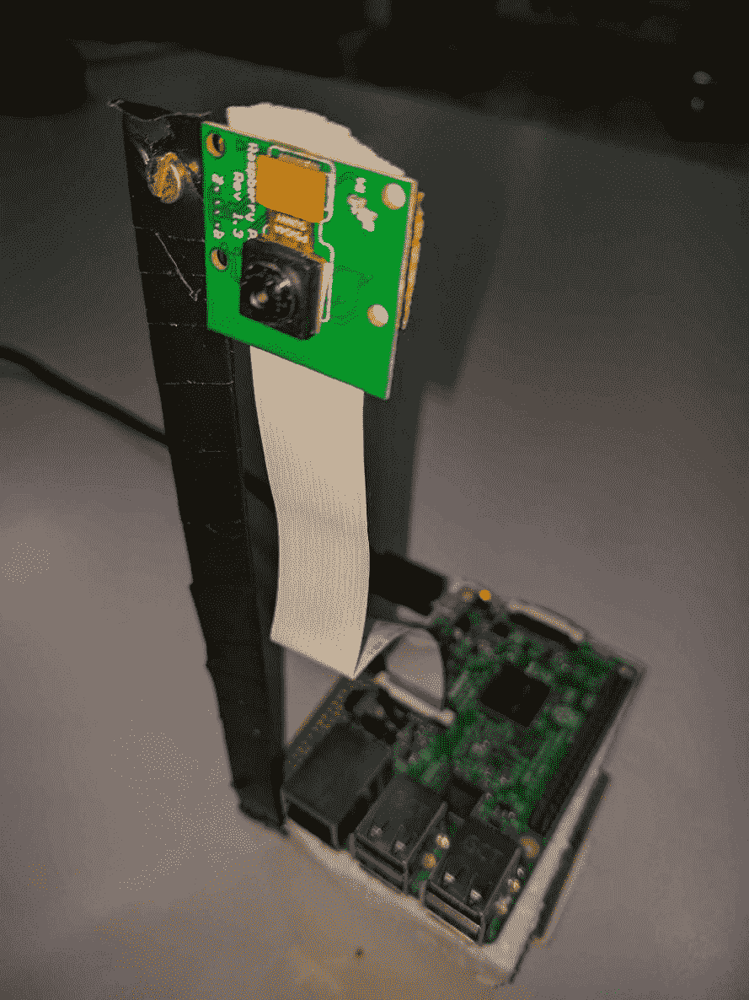
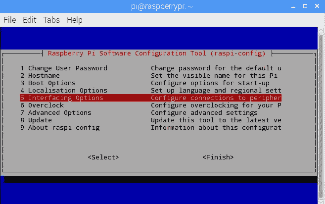
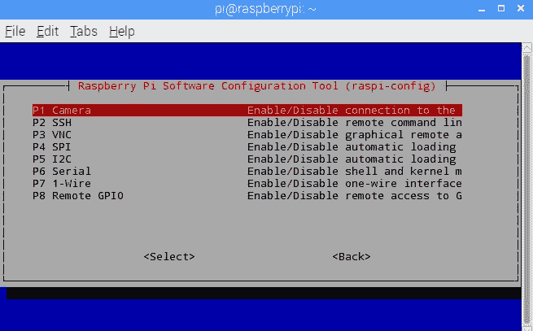
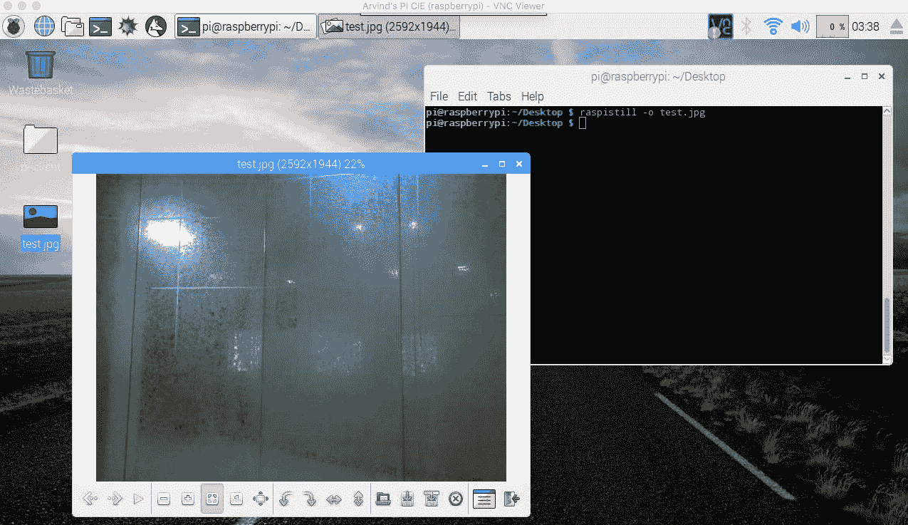
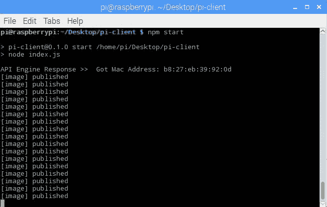
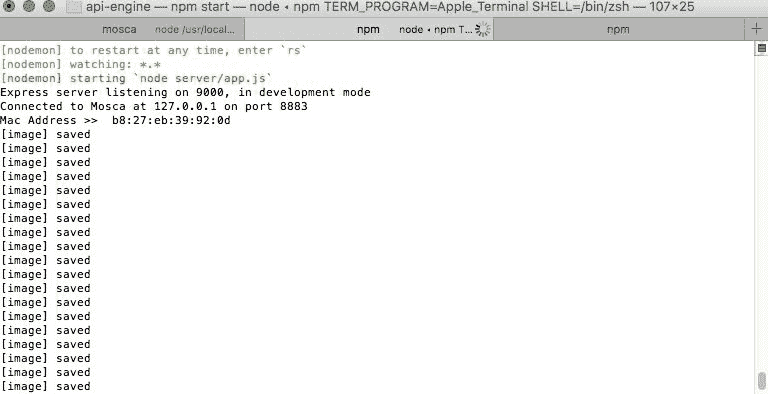
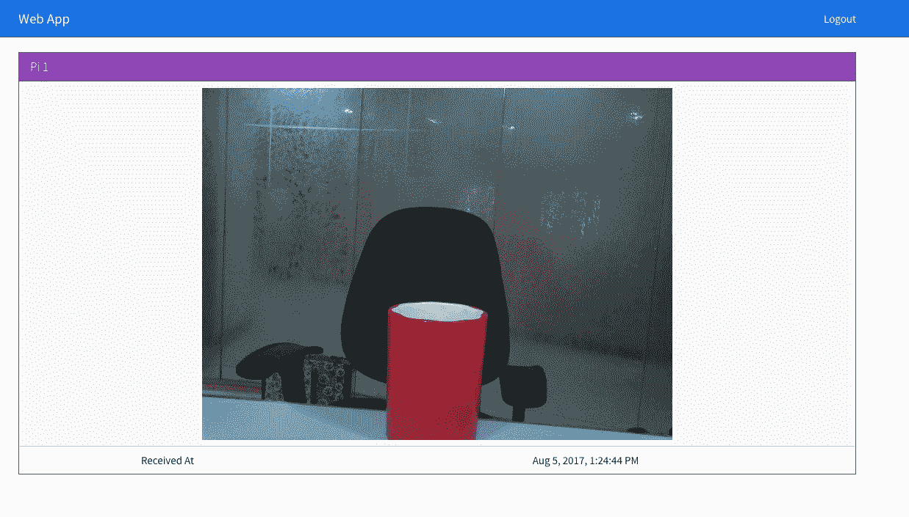
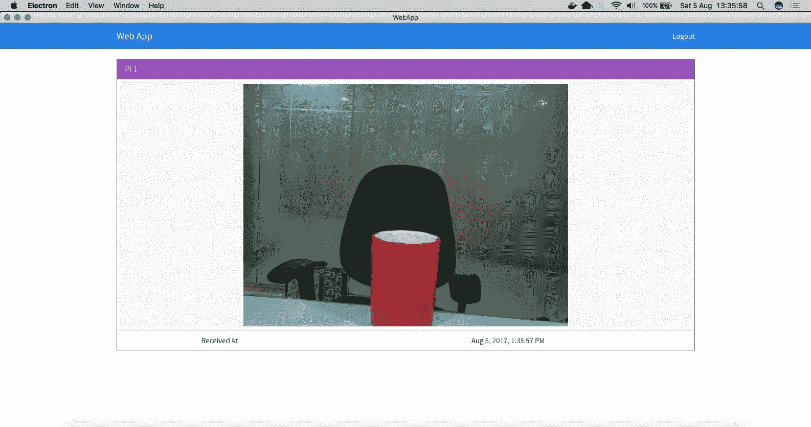
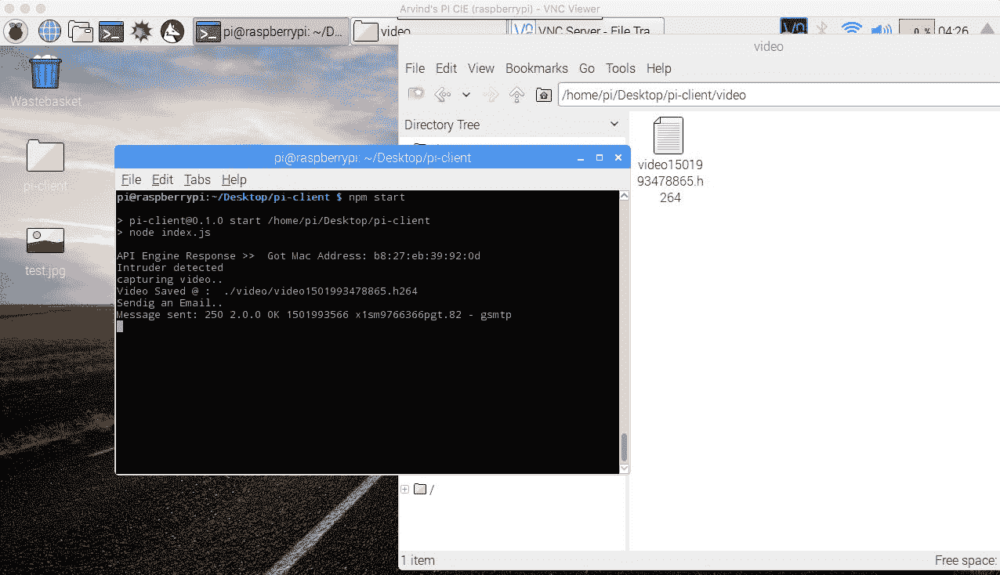

# 树莓皮图像流

在这一章中，我们将看看使用树莓 Pi 3 和树莓 Pi 摄像机的视频直播。我们将从树莓 Pi 3 向我们的网络浏览器流式传输实时视频，并从世界任何地方访问该提要。下一步，我们将在当前设置中添加一个运动检测器，如果检测到运动，我们将开始流式传输视频。在本章中，我们将讨论以下主题:

*   理解喷气推进发动机
*   用树莓皮相机设置树莓皮
*   将图像从摄像机实时传输到仪表板
*   捕捉动态视频

# MJPEG 你好吗

引用维基百科的话，https://en.wikipedia.org/wiki/Motion_JPEG。

In multimedia, Motion JPEG (M-JPEG or MJPEG) is a video compression format in which each video frame or interlaced field of a digital video sequence is compressed separately as a JPEG image. Originally developed for multimedia PC applications, M-JPEG is now used by video-capture devices such as digital cameras, IP cameras, and webcams, as well as by non-linear video editing systems. It is natively supported by the QuickTime Player, the PlayStation console, and web browsers such as Safari, Google Chrome, Mozilla Firefox and Microsoft Edge.

如前所述，我们将每隔`100ms`捕获一系列图像，并将某个主题的图像二进制数据流式传输到应用编程接口引擎，在那里我们用最新的图像覆盖现有的图像。

这个流媒体系统非常简单，也很过时。流式传输时没有倒带或暂停。我们总能看到最后一帧。

既然我们对将要实现的目标有了高度的了解，那么就让我们开始吧。

# 树莓皮的制作

树莓 Pi 3 设置与树莓 Pi 相机相当简单。你可以从任何一家受欢迎的网上供应商那里购买树莓 Pi 3 相机([https://www.raspberrypi.org/products/camera-module-v2/](https://www.raspberrypi.org/products/camera-module-v2/))。然后可以按照这个视频进行设置:摄像板设置:[https://www.youtube.com/watch?v=GImeVqHQzsE](https://www.youtube.com/watch?v=GImeVqHQzsE)。

我的相机设置如下:



我用了一个架子，把我的相机举在上面。

# 设置摄像头

现在我们已经连接了摄像头，并由树莓 Pi 3 供电，我们将设置摄像头，如以下步骤所示:

1.  从树莓码头内部，启动一个新的终端并运行:

```js
    sudo raspi-config
```

2.  这将启动树莓皮配置屏幕。选择接口选项:



3.  在下一个屏幕上，选择 P1 摄像机并启用它:



4.  这将触发重启，完成重启并重新登录 Pi。

一旦你的相机设置好了，我们将测试它。

# 测试相机

现在摄像机已经安装好并通电，让我们测试一下。打开一个新的终端并在桌面上`cd`。然后运行以下命令:

```js
raspistill -o test.jpg
```

这将在当前的工作目录`Desktop`中截图。屏幕将如下所示:



如你所见，`test.jpg`是在`Desktop`上创建的，当我双击它时，它显示了我办公室玻璃墙的图片。

# 发展逻辑

既然我们已经能够测试摄像头，我们将把这一设置与我们的物联网平台相集成。我们将把这些图像连续地传输到我们的应用编程接口引擎，然后通过网络套接字更新网络上的用户界面。

首先，我们将复制`chapter4`并将其转储到名为`chapter8`的文件夹中。在`chapter8`文件夹中，打开`pi/index.js`并更新如下:

```js
var config = require('./config.js'); 
var mqtt = require('mqtt'); 
var GetMac = require('getmac'); 
var Raspistill = require('node-raspistill').Raspistill; 
var raspistill = new Raspistill({ 
    noFileSave: true, 
    encoding: 'jpg', 
    width: 640, 
    height: 480 
}); 

var crypto = require("crypto"); 
var fs = require('fs'); 

var client = mqtt.connect({ 
    port: config.mqtt.port, 
    protocol: 'mqtts', 
    host: config.mqtt.host, 
    clientId: config.mqtt.clientId, 
    reconnectPeriod: 1000, 
    username: config.mqtt.clientId, 
    password: config.mqtt.clientId, 
    keepalive: 300, 
    rejectUnauthorized: false 
}); 

client.on('connect', function() { 
    client.subscribe('rpi'); 
    GetMac.getMac(function(err, mac) { 
        if (err) throw err; 
        macAddress = mac; 
        client.publish('api-engine', mac); 
        startStreaming(); 
    }); 

}); 

client.on('message', function(topic, message) { 
    message = message.toString(); 
    if (topic === 'rpi') { 
        console.log('API Engine Response >> ', message); 
    } else { 
        console.log('Unknown topic', topic); 
    } 
}); 

function startStreaming() { 
    raspistill 
        .timelapse(100, 0, function(image) { // every 100ms ~~FOREVER~~ 
            var data2Send = { 
                data: { 
                    image: image, 
                    id: crypto.randomBytes(8).toString("hex") 
                }, 
                macAddress: macAddress 
            }; 

            client.publish('image', JSON.stringify(data2Send)); 
            console.log('[image]', 'published'); 
        }) 
        .then(function() { 
            console.log('Timelapse Ended') 
        }) 
        .catch(function(err) { 
            console.log('Error', err); 
        }); 
} 
```

从前面的代码中我们可以看到，我们正在等待 MQTT 连接完成，一旦连接完成，我们就调用`startStreaming()`开始流式传输。在`startStreaming()`内部，我们称`raspistill.timelapse()`为`100ms`，因为每次点击和`0`之间的时间差表示捕捉应该会持续下去。

一旦图像被捕获，我们用一个随机的 ID、图像缓冲区和设备`macAddress`构建`data2Send`对象。在发布到图像主题之前，我们先来看一下`data2Send`对象。

现在，把这个文件移到桌面上树莓皮的`pi-client`文件夹。从树莓皮的`pi-client`文件夹中，运行:

```js
npm install && npm install node-raspistill --save  
```

这两个命令将安装`node-raspistill`和存在于`package.json`文件中的其他节点模块。

这样，我们就完成了树莓皮和相机的设置。在下一节中，我们将更新应用编程接口引擎，以接受图像的实时流。

# 更新应用编程接口引擎

现在我们已经完成了树莓 Pi 的设置，我们将更新 API 引擎来接受传入的数据。

我们要做的第一件事就是更新`api-engine/server/mqtt/index.js`如下:

```js
var Data = require('../api/data/data.model'); 
var mqtt = require('mqtt'); 
var config = require('../config/environment'); 
var fs = require('fs'); 
var client = mqtt.connect({ 
    port: config.mqtt.port, 
    protocol: 'mqtts', 
    host: config.mqtt.host, 
    clientId: config.mqtt.clientId, 
    reconnectPeriod: 1000, 
    username: config.mqtt.clientId, 
    password: config.mqtt.clientId, 
    keepalive: 300, 
    rejectUnauthorized: false 
}); 

client.on('connect', function() { 
    console.log('Connected to Mosca at ' + config.mqtt.host + ' on port ' + config.mqtt.port); 
    client.subscribe('api-engine'); 
    client.subscribe('image'); 
}); 

client.on('message', function(topic, message) { 
    // message is Buffer 
    // console.log('Topic >> ', topic); 
    // console.log('Message >> ', message.toString()); 
    if (topic === 'api-engine') { 
        var macAddress = message.toString(); 
        console.log('Mac Address >> ', macAddress); 
        client.publish('rpi', 'Got Mac Address: ' + macAddress); 
    } else if (topic === 'image') { 
        message = JSON.parse(message.toString()); 
        // convert string to buffer 
        var image = Buffer.from(message.data.image, 'utf8'); 
        var fname = 'stream_' + ((message.macAddress).replace(/:/g, '_')) + '.jpg'; 
        fs.writeFile(__dirname + '/stream/' + fname, image, { encoding: 'binary' }, function(err) { 
            if (err) { 
                console.log('[image]', 'save failed', err); 
            } else { 
                console.log('[image]', 'saved'); 
            } 
        }); 

        // as of now we are not going to 
        // store the image buffer in DB.  
        // Gridfs would be a good way 
        // instead of storing a stringified text 
        delete message.data.image; 
        message.data.fname = fname; 

        // create a new data record for the device 
        Data.create(message, function(err, data) { 
            if (err) return console.error(err); 
            // if the record has been saved successfully,  
            // websockets will trigger a message to the web-app 
            // console.log('Data Saved :', data); 
        }); 
    } else { 
        console.log('Unknown topic', topic); 
    } 
}); 
```

从前面的代码中我们可以看到，在 MQTT 的消息事件内部，我们增加了一个名为`image`的新主题。在本主题中，我们提取图像缓冲区的字符串格式，并将其转换回图像二进制数据。然后使用`fs`模块，我们一次又一次地覆盖相同的图像。

我们还将数据同时保存到 MongoDB，这将触发套接字发出。

下一步，我们需要在`mqtt`文件夹内创建一个名为`stream`的文件夹。在这个文件夹中，放一张图片在这里:`http://www.iconarchive.com/show/small-n-flat-icons-by-paomedia/sign-ban-icon.html.`如果没有摄像头的输入，就会显示这张图片。

所有图像将保存在`stream`文件夹中，相同的图像将为相同的设备更新，如前所述，不会有任何倒带或回放。

现在，图像被保存在`stream`文件夹中，我们需要公开一个端点来将这个图像发送给请求客户端。为此，打开`api-engine/server/routes.js`并在`module.exports`功能中添加以下内容:

```js
app.get('/stream/:fname', function(req, res, next) { 
        var fname = req.params.fname; 
        var streamDir = __dirname + '/mqtt/stream/'; 
        var img = streamDir + fname; 
        console.log(img); 
        fs.exists(img, function(exists) { 
         if (exists) { 
                return res.sendFile(img); 
            } else { 
                // http://www.iconarchive.com/show/small-n-flat-icons-by-paomedia/sign-ban-icon.html 
                return res.sendFile(streamDir + '/no-image.png'); 
            } 
        }); 
    });  
```

这将负责将图像发送到客户端(网络、桌面和移动)。

至此，我们完成了 API 引擎的设置。

保存所有文件，启动代理、API 引擎和`pi-client`。如果一切设置成功，我们应该会看到树莓皮上传的数据:



和出现在 API 引擎中的相同数据:



此时，图像被捕获并通过 MQTTs 发送到应用编程接口引擎。下一步是实时查看这些图像。

# 更新网络应用程序

现在数据正在流向应用编程接口引擎，我们将在网络应用程序上显示它。打开`web-app/src/app/device/device.component.html`，更新如下:

```js
<div class="container"> 
    <br> 
    <div *ngIf="!device"> 
        <h3 class="text-center">Loading!</h3> 
    </div> 
    <div class="row" *ngIf="!lastRecord"> 
        <h3 class="text-center">No Data!</h3> 
    </div> 
    <div class="row" *ngIf="lastRecord"> 
        <div class="col-md-12"> 
            <div class="panel panel-info"> 
                <div class="panel-heading"> 
                    <h3 class="panel-title"> 
                        {{device.name}} 
                    </h3> 
                    <span class="pull-right btn-click"> 
                        <i class="fa fa-chevron-circle-up"></i> 
                    </span> 
                </div> 
                <div class="clearfix"></div> 
                <div class="table-responsive" *ngIf="lastRecord"> 
                    <table class="table table-striped"> 
                        <tr> 
                            <td colspan="2" class="text-center"></td> 
                        </tr> 
                        <tr class="text-center" > 
                            <td>Received At</td> 
                            <td>{{lastRecord.createdAt | date: 'medium'}}</td> 
                        </tr> 
                    </table> 
                </div> 
            </div> 
        </div> 
    </div> 
</div> 
```

这里，我们正在实时显示我们创建的图像。接下来，更新`web-app/src/app/device/device.component.ts`如下:

```js
import { Component, OnInit, OnDestroy } from '@angular/core'; 
import { DevicesService } from '../services/devices.service'; 
import { Params, ActivatedRoute } from '@angular/router'; 
import { SocketService } from '../services/socket.service'; 
import { DataService } from '../services/data.service'; 
import { NotificationsService } from 'angular2-notifications'; 
import { Globals } from '../app.global'; 

@Component({ 
   selector: 'app-device', 
   templateUrl: './device.component.html', 
   styleUrls: ['./device.component.css'] 
}) 
export class DeviceComponent implements OnInit, OnDestroy { 
   device: any; 
   data: Array<any>; 
   toggleState: boolean = false; 
   private subDevice: any; 
   private subData: any; 
   lastRecord: any; 

   // line chart config 

   constructor(private deviceService: DevicesService, 
         private socketService: SocketService, 
         private dataService: DataService, 
         private route: ActivatedRoute, 
         private notificationsService: NotificationsService) { } 

   ngOnInit() { 
         this.subDevice = this.route.params.subscribe((params) => { 
               this.deviceService.getOne(params['id']).subscribe((response) => { 
                     this.device = response.json(); 
                     this.getData(); 
               }); 
         }); 
   } 

   getData() { 
         this.dataService.get(this.device.macAddress).subscribe((response) => { 
               this.data = response.json(); 
               let d = this.data[0]; 
               d.data.fname = Globals.BASE_API_URL + 'stream/' + d.data.fname; 
               this.lastRecord = d; // descending order data 
               this.socketInit(); 
         }); 
   } 

   socketInit() { 
         this.subData = this.socketService.getData(this.device.macAddress).subscribe((data: any) => { 
               if (this.data.length <= 0) return; 
               this.data.splice(this.data.length - 1, 1); // remove the last record 
               data.data.fname = Globals.BASE_API_URL + 'stream/' + data.data.fname + '?t=' + (Math.random() * 100000); // cache busting 
               this.data.push(data); // add the new one 
               this.lastRecord = data; 
         }); 
   }
```

```js
   ngOnDestroy() { 
         this.subDevice.unsubscribe(); 
         this.subData ? this.subData.unsubscribe() : ''; 
   } 
} 
```

这里，我们正在构建图像网址，并将其指向应用编程接口引擎。通过在`web-app`文件夹中运行以下命令，保存所有文件并启动网络应用程序:

```js
npm start  
```

如果一切按预期运行，导航到“查看设备”页面后，我们会看到视频流非常缓慢。我正在监控放在椅子前的杯子，如下所示:



# 更新桌面应用程序

现在 web 应用程序已经完成，我们将构建相同的应用程序，并将其部署到桌面应用程序中。

要开始，返回`web-app`文件夹的终端/提示符，运行以下命令:

```js
ng build --env=prod  
```

这将在名为`dist`的`web-app`文件夹内创建一个新文件夹。`dist`文件夹的内容应大致如下:

```js
.

├── favicon.ico

├── index.html

├── inline.bundle.js

├── inline.bundle.js.map

├── main.bundle.js

├── main.bundle.js.map

├── polyfills.bundle.js

├── polyfills.bundle.js.map

├── scripts.bundle.js

├── scripts.bundle.js.map

├── styles.bundle.js

├── styles.bundle.js.map

├── vendor.bundle.js

└── vendor.bundle.js.map
```

我们编写的所有代码最终都被打包到前面的文件中。我们将抓取`dist`文件夹中的所有文件(不是`dist`文件夹)，然后将其粘贴到`desktop-app/app`文件夹中。经过上述变更后`desktop-app`的最终结构如下:

```js
.

├── app

│ ├── favicon.ico

│ ├── index.html

│ ├── inline.bundle.js

│ ├── inline.bundle.js.map

│ ├── main.bundle.js

│ ├── main.bundle.js.map

│ ├── polyfills.bundle.js

│ ├── polyfills.bundle.js.map

│ ├── scripts.bundle.js

│ ├── scripts.bundle.js.map

│ ├── styles.bundle.js

│ ├── styles.bundle.js.map

│ ├── vendor.bundle.js

│ └── vendor.bundle.js.map

├── freeport.js

├── index.css

├── index.html

├── index.js

├── license

├── package.json

├── readme.md

└── server.js
```

要试驾，请运行以下命令:

```js
npm start 
```

然后当我们导航到查看设备页面时，我们应该会看到:



这样，我们就完成了桌面应用程序的开发。在下一部分，我们将更新手机应用。

# 更新手机应用程序

在最后一部分，我们已经更新了桌面应用程序。在本节中，我们将更新移动应用程序模板以流式传输图像。

首先，我们将更新视图设备模板。更新`mobile-app/src/pages/view-device/view-device.html`如下:

```js
<ion-header> 
    <ion-navbar> 
        <ion-title>Mobile App</ion-title> 
    </ion-navbar> 
</ion-header> 
<ion-content padding> 
    <div *ngIf="!lastRecord"> 
        <h3 class="text-center">Loading!</h3> 
    </div> 
    <div *ngIf="lastRecord"> 
        <ion-list> 
            <ion-item> 
                 
            </ion-item> 
            <ion-item> 
                <ion-label>Received At</ion-label> 
                <ion-label>{{lastRecord.createdAt | date: 'medium'}}</ion-label> 
            </ion-item> 
        </ion-list> 
    </div> 
</ion-content> 
```

在手机上显示图像流的逻辑与网络/桌面相同。接下来，更新`mobile-app/src/pages/view-device/view-device.ts`如下:

```js
import { Component } from '@angular/core'; 
import { IonicPage, NavController, NavParams } from 'ionic-angular'; 
import { Globals } from '../../app/app.globals'; 
import { DevicesService } from '../../services/device.service'; 
import { DataService } from '../../services/data.service'; 
import { ToastService } from '../../services/toast.service'; 
import { SocketService } from '../../services/socket.service'; 

@IonicPage() 
@Component({ 
   selector: 'page-view-device', 
   templateUrl: 'view-device.html', 
}) 
export class ViewDevicePage { 
   device: any; 
   data: Array<any>; 
   toggleState: boolean = false; 
   private subData: any; 
   lastRecord: any; 

   constructor(private navCtrl: NavController, 
         private navParams: NavParams, 
         private socketService: SocketService, 
         private deviceService: DevicesService, 
         private dataService: DataService, 
         private toastService: ToastService) { 
         this.device = navParams.get("device"); 
         console.log(this.device); 
   } 

   ionViewDidLoad() { 
         this.deviceService.getOne(this.device._id).subscribe((response) => { 
               this.device = response.json(); 
               this.getData(); 
         }); 
   } 

   getData() { 
         this.dataService.get(this.device.macAddress).subscribe((response) => { 
               this.data = response.json(); 
               let d = this.data[0]; 
               d.data.fname = Globals.BASE_API_URL + 'stream/' + d.data.fname; 
               this.lastRecord = d; // descending order data 
               this.socketInit(); 
         }); 
   } 

   socketInit() { 
         this.subData = this.socketService.getData(this.device.macAddress).subscribe((data: any) => { 
               if(this.data.length <= 0) return; 
               this.data.splice(this.data.length - 1, 1); // remove the last record 
               data.data.fname = Globals.BASE_API_URL + 'stream/' + data.data.fname + '?t=' + (Math.random() * 100000); 
               this.data.push(data); // add the new one 
               this.lastRecord = data; 
         }); 
   } 

   ionViewDidUnload() { 
         this.subData && this.subData.unsubscribe && this.subData.unsubscribe(); //unsubscribe if subData is defined 
   } 
} 
```

使用以下方法保存所有文件并运行移动应用:

```js
ionic serve  
```

或者使用以下代码:

```js
ionic cordova run android  
```

我们应该看到以下内容:


这样，我们就可以在移动应用程序上显示来自摄像头的数据了。

# 基于运动的视频捕捉

正如我们可以看到的那样，这条河有点波涛汹涌，缓慢，不是实时的，另一个可能的解决方案是在我们的树莓皮和相机旁边放一个运动检测器。然后当一个动作被识别时，我们开始拍摄 10 秒钟的视频。然后我们将此视频作为附件通过电子邮件发送给用户。

现在，我们将开始更新我们现有的代码。

# 树莓皮的更新

首先，我们将更新树莓皮设置，以适应 HC-SR501 PIR 传感器。你可以在这里找到一个 PIR 传感器:[https://www . Amazon . com/Motion-HC-Sr 501-红外-Arduino-树莓/DP/b00m 1h 7 kbw/ref = Sr _ 1 _ 4 _ a _ it](https://www.amazon.com/Motion-HC-SR501-Infrared-Arduino-Raspberry/dp/B00M1H7KBW/ref=sr_1_4_a_it)。

我们将把 PIR 传感器连接到引脚 17 上的树莓 Pi，把摄像机连接到摄像机插槽，就像我们之前看到的那样。

如前所述进行连接后，更新`pi/index.js`如下:

```js
var config = require('./config.js'); 
var mqtt = require('mqtt'); 
var GetMac = require('getmac'); 
var Raspistill = require('node-raspistill').Raspistill; 
var crypto = require("crypto"); 
var fs = require('fs'); 
var Gpio = require('onoff').Gpio; 
var exec = require('child_process').exec; 

var pir = new Gpio(17, 'in', 'both'); 
var raspistill = new Raspistill({ 
    noFileSave: true, 
    encoding: 'jpg', 
    width: 640, 
    height: 480 
}); 

var client = mqtt.connect({ 
    port: config.mqtt.port, 
    protocol: 'mqtts', 
    host: config.mqtt.host, 
    clientId: config.mqtt.clientId, 
    reconnectPeriod: 1000, 
    username: config.mqtt.clientId, 
    password: config.mqtt.clientId, 
    keepalive: 300, 
    rejectUnauthorized: false 
}); 

client.on('connect', function() { 
    client.subscribe('rpi'); 
    GetMac.getMac(function(err, mac) { 
        if (err) throw err; 
        macAddress = mac; 
        client.publish('api-engine', mac); 
        // startStreaming(); 
    }); 

}); 

client.on('message', function(topic, message) { 
    message = message.toString(); 
    if (topic === 'rpi') { 
        console.log('API Engine Response >> ', message); 
    } else { 
        console.log('Unknown topic', topic); 
    } 
}); 

function startStreaming() { 
    raspistill 
        .timelapse(100, 0, function(image) { // every 100ms ~~FOREVER~~ 
            var data2Send = { 
                data: { 
                    image: image, 
                    id: crypto.randomBytes(8).toString("hex") 
                }, 
                macAddress: macAddress 
            }; 

            client.publish('image', JSON.stringify(data2Send)); 
            console.log('[image]', 'published'); 
        }) 
        .then(function() { 
            console.log('Timelapse Ended') 
        }) 
        .catch(function(err) { 
            console.log('Error', err); 
        }); 
} 

var isRec = false; 

// keep watching for motion 
pir.watch(function(err, value) { 
    if (err) exit(); 
    if (value == 1 && !isRec) { 
        console.log('Intruder detected'); 
        console.log('capturing video.. '); 
        isRec = true; 
        var videoPath = __dirname + '/video.h264'; 
        var file = fs.createWriteStream(videoPath); 
        var video_path = './video/video' + Date.now() + '.h264'; 
        var cmd = 'raspivid -o ' + video_path + ' -t 5000'; 

        exec(cmd, function(error, stdout, stderr) { 
            // output is in stdout 
            console.log('Video Saved @ : ', video_path); 
            require('./mailer').sendEmail(video_path, true, function(err, info) { 
                setTimeout(function() { 
                    // isRec = false; 
                }, 3000); // don't allow recording for 3 sec after 
            }); 
        }); 
    } 
}); 

function exit() { 
    pir.unexport(); 
    process.exit(); 
} 
```

从前面的代码中我们可以看到，我们已经将 GPIO 17 标记为输入引脚，并将其分配给名为`pir`的变量。接下来，使用`pir.watch()`，我们继续在运动检测器上寻找值的变化。如果运动检测器检测到一些变化，我们将检查该值是否为`1`，这表明运动被触发。然后使用`raspivid`我们录制一个 5 秒钟的视频并通过电子邮件发送。

对于从树莓 Pi 3 发送电子邮件所需的逻辑，在`pi-client`文件夹的根目录下创建一个名为`mailer.js`的新文件，并按如下方式进行更新:

```js
var fs = require('fs'); 
var nodemailer = require('nodemailer'); 

var transporter = nodemailer.createTransport({ 
    service: 'Gmail', 
    auth: { 
        user: 'arvind.ravulavaru@gmail.com', 
        pass: '**********' 
    } 
}); 

var timerId; 

module.exports.sendEmail = function(file, deleteAfterUpload, cb) { 
    if (timerId) return; 

    timerId = setTimeout(function() { 
        clearTimeout(timerId); 
        timerId = null; 
    }, 10000); 

    console.log('Sendig an Email..'); 

    var mailOptions = { 
        from: 'Pi Bot <pi.intruder.alert@gmail.com>', 
        to: 'user@email.com', 
        subject: '[Pi Bot] Intruder Detected', 
        html: 'Intruder Detected. Please check the video attached. <br/><br/> Intruder Detected At : ' + Date(), 
        attachments: [{ 
            path: file 
        }] 
    }; 

    transporter.sendMail(mailOptions, function(err, info) { 
        if (err) { 
            console.log(err); 
        } else { 
            console.log('Message sent: ' + info.response); 
            if (deleteAfterUpload) { 
                fs.unlink(path); 
            } 
        } 

        if (cb) { 
            cb(err, info); 
        } 
    }); 
} 
```

我们正在使用节点邮件发送电子邮件。根据需要更新凭据。

接下来，运行以下命令:

```js
npm install onoff -save  
```

在下一节中，我们将测试这个设置。

# 测试代码

现在我们已经完成了设置，让我们测试它。启动树莓 Pi，上传代码(如果尚未完成)，并运行以下命令:

```js
npm start
```

代码运行后，触发一个动作。这将启动摄像机录制，并将视频保存五秒钟。然后，该视频将通过电子邮件发送给用户。以下是输出列表:



收到的电子邮件如下:


这是使用树莓 Pi 3 进行监控的替代方案。

# 摘要

在这一章中，我们看到了两种使用树莓皮的监控方法。第一种方法是我们将图像流式传输到应用编程接口引擎，然后使用 MJPEG 在移动网络和桌面应用程序上可视化图像。第二种方法是检测运动，然后开始录制视频。然后通过电子邮件将此视频作为附件发送。这两种方法也可以结合在一起，并且如果在方法一中检测到运动，则可以开始 MJPEG 流。

在[第 9 章](9.html#48C0E0-ce91715363d04669bca1c1545beb57ee)、*智能监控*中，我们将把这一点更上一层楼，我们将在抓拍的基础上增加人脸识别，并使用 AWS Rekognition 平台进行人脸识别(不是人脸检测)。