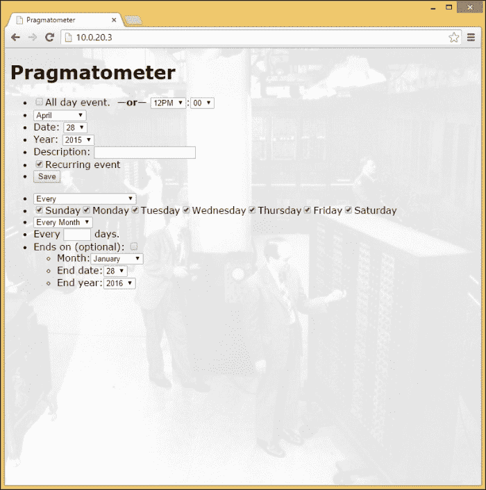
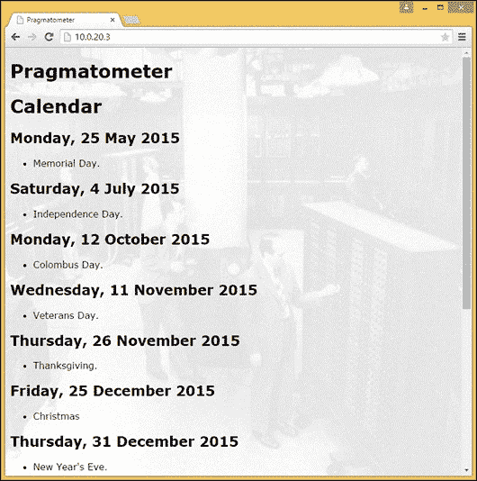

# 第十章。用 JavaScript 演示功能反应式编程:一个真实的例子第三部分——日历

这一章将是书中涉及最多的部分。在整本书中，章节之间有细微到不那么细微的差别。这些都是为了，如果你遇到一个岔路口，这本书提供了两种选择的覆盖面。这些章节旨在相互补充，而不是始终如一。在这里，我们不会透露更多关于核心 reatjs 的信息，而是展示如何用现实世界中最棘手的业务问题来解决问题，以及一个让 reatjs 参与但不关注它的解决方案。我们将在一个更严肃的应用程序上使用 ReactJS，一个支持重复事件的日历，它比谷歌日历提供了更多的复杂性和功能，正如即将到来的数字所示。*如果每个月的第二个和第四个星期四晚上 7 点有演讲会的话，支持！*核心功能不仅仅是一个玩具。

在本章中，我们将讨论以下几点:

*   了解带有重复日历条目的日历
*   一个班级的螺母和螺栓及其固定形式
*   基本数据类型—普通的旧 JavaScript 对象
*   呈现函数—外部包装
*   呈现页面—一次性日历条目用户界面
*   循环日历条目的扩展用户界面
*   呈现日历条目—匿名帮助器功能
*   显示日历条目的主循环
*   对每天要显示的日历条目进行排序
*   支持日历条目描述中的降价
*   一次处理一个主要组件

# 萨姆，再玩一次——一个有趣的挑战

以下是一个示例截图，展示了如何在谷歌日历中输入重复条目:


这个日历系统的灵感来自一个私人日历系统，它使用与日期字符串匹配的正则表达式，比如:`Wed Apr 29 18:13:24 CDT`。此外，借助正则表达式的力量，真的可以做很多事情。*检查汽车发动机油液*的一个条目是`periodic_Sat.(Feb|Apr|Jun|Aug|Oct|Dec).( 1| 2| 3| 4| 5| 6| 7)..................,Check fluid levels in car`，例如，偶数月的第一个星期六*。然而，与真正复杂的正则表达式的多毛野兽相比，这算不了什么。但是它确实给出了为什么正则表达式被认为是只写代码的提示。可能有人会猜测，即使你是正则表达式编写器，你也会把检查推迟到以后(如果有必要的话)。换句话说，您不想检查本段前面引用的正则表达式是否与偶数月的第一个星期六的日期匹配。这就是正则表达式对程序员的影响，与 URL 正则表达式相比，这个正则表达式是优雅的，它是这样开始的:*

```js
~(?:\b[a-z\d.-]+://[^<>\s]+|\b(?:(?:(?:[^\s!@#$%^&*()_=+[\]{}\|;:'
```

本章中的代码旨在易读，有时缓慢而费力，但非常清晰，没有任何正则表达式的痕迹。有人说程序员对字符串有问题，说:“我知道！我就用正则表达式！”现在程序员有两个问题。

以我自己的经验来看，我使用正则表达式已经很多年了，到目前为止，它们是一个字节对一个字节，我最有效的缺陷注入方法，我经常第一次就把简单的正则表达式弄错。这就是为什么我跟随其他人将正则表达式贬低为“不是好的部分”。

默认情况下，该程序为输入一次性日历条目提供了一个相对简单的用户界面。

这是我们程序的用户界面截图，它最初是这样呈现的，没有深入到重复日历条目选项的大杂烩中:


渐进式公开为重复日历条目保留了更详细的支持项目组合，如果用户选择查看它们，则增加了显示重复日历条目的控件。

以下是循环日历条目的更高级界面的屏幕截图。因为有几种不同的方式来组织重复出现的日历条目，所以有几种控件可用。



# 古典 Hijaxing 效果不错

当我们开始上课时，有一个成员因缺席而引人注目。这个成员在我们上一章中做了大量的介绍，在这一章中，我们在表单字段之间进行了双向数据绑定，为此我们指定了 HTML 字段/JSX 组件的值，以及这一补充实现，其中表单不受控制(未指定值)。在这里，表单元素根据需要以传统的方式进行查询。虽然 ReactJS 坚信单向数据绑定应该是常态，但双向数据绑定可能是合法的，最好是在一个小的隔离区域。本章和前几章旨在提供两种略有不同的方法的工作示例，以便为您更喜欢的方法提供参考:

```js
var Calendar = React.createClass({
```

`getInitialState()`功能初始化两个项目。一个是日历条目列表。另一个是病人，他在手术台上，直到手术完成，并且可以被添加到活条目列表中。

有两种类型的条目:一种是较小的基本条目，仅给出一次性日历条目的日期；另一种是较大的、更复杂的条目，给出重复系列日历条目所需的更全面的信息。另一个实现可能会将它们保存在单独的列表中；在这里，我们使用一个列表并检查单个条目，看看它们是否有`repeats`字段，哪些重复序列有，哪些一次性日历条目没有:

```js
  getInitialState: function() {
    return {entries: [], entry_being_added: this.new_entry()};
  },
```

`handle_submit()`功能 Hijaxes 表单提交，获取操作表上的条目并填写其字段，无论是一次性日历条目还是系列。然后，它将条目添加到条目列表中，并重置表单(简单地`reset()`表单会更简单，但这提供了稍微精细的控制，将默认日期更新为今天的日期，以便表单的`reset()`不会总是将最初加载的页面重置为该日期)。

这些条目在字符上是公式化的——都是普通的旧 JavaScript 对象，很容易 JSON 序列化——本质上是包含字符串、整数和布尔值的字典(在两种情况下，这些条目还包含其他包含字符串和整数的字典)。这里没有使用闭包或其他更复杂的技术；该设计旨在足够简单，以便有人能够用心阅读`handle_submit()`并准确知道一次性和重复出现的日历条目是如何表示的。

`handle_submit()`功能从表单中提取关于它是代表一次性还是重复日历条目的信息:

```js
  handle_submit: function(event) {
    event.preventDefault();
    (this.state.entry_being_added.month =
      parseInt(document.getElementById('month').value));
    (this.state.entry_being_added.date =
      parseInt(document.getElementById('date').value));
    (this.state.entry_being_added.year =
      parseInt(document.getElementById('year').value));
    if (document.getElementById('all_day').checked) {
      this.state.entry_being_added.all_day = true;
    }
    (this.state.entry_being_added.description =
      document.getElementById('description').value);
    if (this.state.entry_being_added.hasOwnProperty('repeats') 
    && this.state.entry_being_added.repeats) {
      (this.state.entry_being_added.start.time =
        this.state.entry_being_added.time);
```

最后，它将从表单中读取的条目添加到活动条目列表中，并为进一步的数据输入放置一个新条目:

```js
      var old_entry = this.state.entry_being_added;
      this.state.entries.push(this.state.entry_being_added);
      this.state.entry_being_added = this.new_entry();
      var entry = this.new_entry();
      (document.getElementById('month').value =
        entry.month.toString());
      (document.getElementById('date').value =
        entry.date.toString());
      (document.getElementById('year').value =
        entry.year.toString());
      document.getElementById('all_day').checked = false;
      document.getElementById('description').value = '';
      document.getElementById('advanced').checked = false;
      if (old_entry.hasOwnProperty('repeats') &&
        old_entry.repeats) {
        (document.getElementById('month_based_frequency').value =
          'Every');
        document.getElementById('month_occurrence').value = '-1';
        document.getElementById('series_ends').checked = false;
        (document.getElementById('end_month').value = 
          '' + new Date().getMonth());
        (document.getElementById('end_date').value = 
          '' + new Date().getDate());
        (document.getElementById('end_year').value =
          '' + new Date().getFullYear() + 1);
      }
    },
```

在这里，我们创建一个新条目。这将是一个一次性的日历条目，如果需要的话，可以在以后进行扩充以表示一个系列。

下面是日历截图，其中显示了一个一次性事件:


# 构建时考虑了可用性，但仍有发展空间

这里有一个注释，可能解决了代码中的一个混乱点:条目中表示的时间单位并不代表 JavaScript Date 对象所代表的一切，而是与 JavaScript Date 对象最大程度地兼容。这尤其意味着，日期对象的一些让程序员困惑的设计被包含在我们的代码中，因为 JavaScript Date 对象将一个月的日期编号为 1 到 31，就像一般的日历使用一样，但是月份是从 0(1 月)到 11(12 月)表示的。同样，在 Date 对象中，小时的范围从 0 到 23。

就其功能而言，这个函数是一个构造函数，但它不是为新的关键字设计的，因为整个构造函数和`this`是克罗克福德在尝试——在创建 AdSafe 之后，出于安全原因禁止使用`this`关键字——服用他为其他人开的药后，不再包含在*更好的部分*中的东西。他发现他的代码变得越来越小，越来越好。在 ReactJS 中，使用为使用`this`而构建的代码对于严肃的工作来说是不可讨论的，但是可能有人会建议我们在不需要的时候选择退出。

还有一个更具体的迂回，一些更敏锐的读者可能会注意到:最初的小时数被设置为 12，而不是，例如，0。学校说不允许用户首先输入无效数据，这本身会导致可用性方面的一些“反模式”。考虑一下值得羞耻的大厅界面来输入美国社会安全号码，这应该很少需要，也不是因为你需要一个机构范围的标识符。

下一张截图显示了确保(可能是)美国社会保障号码以适当格式输入的最糟糕方式——从可用性和用户界面考虑:


这个用户界面不合适；一个更好的方法是允许文本输入，使用 JavaScript 强制执行正好九个数字，并简单地忽略连字符(最好是任何其他非数字字符)。

这个界面，在实现时，代表了谨慎的想法，但在可用性方面有真正的妥协，一个好的实验室可能会很好地改进它(这里的圣杯是有一个文本字段，用户在其中键入时间，系统自动使用试探法来识别真正的含义， 但是该系统可能难以识别安排在 8 点的日历条目是在上午 8 点还是晚上 8 点)将上午或下午紧接在该小时之后，并且在相同的输入中，如在稍微向下的位置所做的，这违反了最少惊讶的原则，即无论软件做什么，它都应该最少让用户惊讶。 预期的方法，通常是正确的方法，是有一个字段为小时，一个字段为分钟，一个字段为上午或下午。但根据默认值，这允许下午三点左右有承诺的人输入 3 为小时，15 为分钟，并点击**保存**，只得到一个安排在凌晨 3:15 的约会。错误仍然是可能的，一如既往，但所采用的设计旨在帮助人们在一天中开始，并有更多的机会进入他们真正想要的时间。

下面的截图显示了我们程序的默认用户界面，没有为用户界面添加控件。它显示了一天中某个小时的下拉菜单，旨在作为一个合理的默认值，并减少用户在输入上午或下午时的错误:


该界面的一个可用性改进是使用一个带有 JavaScript 验证的文本字段，强制使用一个从 0 到 59 的整数值，可能是在一个位数前带有前导零的。

但是，让我们从中午的默认开始时间转移到其他时间。

下面是一个带有一次性事件和重复事件的日历的例子:


# 简单的老 JavaScript 对象就是你所需要的

让我们看看下面的代码:

```js
    new_entry: function() {
      var result = {};
      result.hours = 12;
      result.minutes = 0;
      result.month = new Date().getMonth();
      result.date = new Date().getDate();
      result.year = new Date().getFullYear();
      result.weekday = new Date().getDay();
      result.description = '';
      return result;
    },
```

对于一次性日历条目，这些字段的使用正如您所料。对于一系列日历条目，日期不是日历条目出现的时间，而是日历条目开始的时间。用户界面提供了几种方法，当出现日历条目时，您可以缩小范围。这可以说是每个月的第一天，只有周二，以及特定的一个月。所做的每一个选择都进一步缩小了范围，因此期望的用法是足够具体地请求您想要的行为。

这里的大多数变量名都是不言自明的。两个可能需要解释的是`frequency`和`month_occurrences`。`frequency`变量的值为`Every`、`Every First`、`Every Second`、`Every Third`、`Every Fourth`、`Every Last`、`Every First and Third`和`Every Second and Fourth`(这是网络应用程序的一部分，用于容纳每隔一周和第四周的下午 7:00 的演讲会)。`month_occurrences`变量指定某件事发生在哪个月(根据 JavaScript Date 对象，0 到 11 表示 1 月到 12 月，或者-1 表示每个月):

```js
    new_series_entry: function() {
      var result = this.new_entry();
      result.repeats = true;
      result.start = {};
      result.start.hours = null;
      result.start.minutes = null;
      result.start.month = new Date().getMonth();
      result.start.date = new Date().getDate();
      result.start.year = new Date().getFullYear();
      result.frequency = null;
      result.sunday = false;
      result.monday = false;
      result.tuesday = false;
      result.wednesday = false;
      result.thursday = false;
      result.friday = false;
      result.saturday = false;
      result.month_occurrence = -1;
      result.end = {};
      result.end.time = null;
      result.end.month = null;
      result.end.date = null;
      result.end.year = null;
      return result;
    },
```

这里有一个截图，显示了每隔一周重复一次的活动:


# 简单开始的渐进披露

勾选重复日历条目复选框时会调用`on_change()`功能，它允许渐进显示，如果用户选择重复日历条目，会显示整个用户界面。它切换`render()`功能所尊重的`this.state.entry_being_added.repeats`。如果当前在操作台上的条目有一个`repeats`字段，并且该字段为真，则该功能显示附加表单区域。如果该条目没有`repeats`字段，则创建一个新的序列，已经输入到一次性日历条目中的任何时间数据被复制，并且新的(部分)空白条目被放置在操作台上:

```js
    on_change: function() {
      if (this.state.entry_being_added.hasOwnProperty('repeats') {
        (this.state.entry_being_added.repeats =
          !this.state.entry_being_added.repeats);
      } else {
        var new_entry = this.new_series_entry();
        new_entry.time = this.state.entry_being_added.time;
        new_entry.month = this.state.entry_being_added.month;
        new_entry.date = this.state.entry_being_added.date;
        new_entry.year = this.state.entry_being_added.year;
        this.state.entry_being_added = new_entry;
      }
    },
```

下面的截图显示了界面中每隔一周发生的一个事件:


# render()方法可以很容易地委托

(外部)`render`功能更像是一个包装器，而不是一个工作狂。它显示属于一次性日历条目和系列的一次性日历条目的字段。此外，如果在操作表上的日历条目是一个循环日历条目(只有当指示循环日历条目的复选框被选中时才会为真)，该功能包括添加的表格元素，这些元素适用于循环日历条目:

### 类型

JSX 语法出人意料地宽容。但是，它确实有一些规则，并且它们是用描述性错误消息强制执行的，包括如果有多个元素，它们需要被包装在一个封闭元素中。所以，你不要写`<em>Hello</em>, <strong>world</strong>!`。相反，你写`<span><em>Hello</em>, <strong>world</strong>!</span>`。但是考虑到一些其他的基本规则，JSX 将会在非常广泛的使用和滥用上做正确的事情。

这里有一个`render()`方法，它是你定义的任何组件的中心方法。在某些情况下，`render()`方法不是单一的，而是将其部分或全部工作委托给其他方法。让我们探索一下:

```js
    render: function() {
      var result = [this.render_basic_entry(
        this.state.entry_being_added)];
      if (this.state.entry_being_added &&
        this.state.entry_being_added.hasOwnProperty('repeats')
        this.state.entry_being_added.repeats) {
        result.push(this.render_entry_additionals(
          this.state.entry_being_added));
      }
      return (<div id="Calendar">
        <h1>Calendar</h1>
        {this.render_upcoming()}<form onSubmit={
        this.handle_submit}>{result}
        <input type="submit" value="Save" /></form></div>);
    },
```

# 无聊的代码胜过有趣的代码！

熟悉特里·普拉切特的读者可能已经听说过《有趣的时代》了，它以一个城市传说中被错误地归因于中国的东西开始:有一个诅咒。*他们说:愿你生活在有趣的时代！*其中一个角色，林切温(这不是一种奶酪)，常年在寻找无聊的东西，而无聊恰恰是他永远得不到的东西。这本书的部分情节让林塞文从一个偏远、无聊的热带岛屿上生活到一个人口众多的帝国，在那里各种与他有关的有趣事情不断发生。对林切温来说，无聊是一种圣杯，一直从他的手指间溜走。

这个代码应该是*无聊的*，林克风式的。可以编写更简洁的代码来填充`hour_options`的散列(或数组)，而不是直接指定数组。但是，要判断它是对还是错，就不会那么容易了。并且以这种方式开发并不意味着额外的类型化，这(专家意见已经认识到这一点)并不是编程中任何真正的瓶颈。

下面的代码的工作方式本质上定义了数组，然后这些数组被用来创建/形成元素(这些元素大部分是通过数组以直接的方式填充的`SELECT`)。它完成的任务是显示一次性日历条目的用户界面(加上指示重复日历条目的复选框)。

这一章中有一个有意识的决定，用无聊的方式做事情，除了一个例外——在菜单中填入一个月中计划的天数。这可能是 28、29、30 或 31 天。我们显示代码来生成几个小时的下拉菜单；分钟(和月)是相同模式的更简单的例子。

### 注

在这一章的制作中，没有一个程序员的手腕受到伤害(它真的没有花那么多打字或开发时间)。

# 一个简单的用户界面，用于简单的非重复性条目...

对于更基本的日历条目类型，即只发生一次的类型，我们收集日期、月份和年份，默认为当前日期的值。有些事情是当天的“全天”事件，比如某人的生日；其他人在特定的时间开始。界面可以扩展到包括可选的结束时间。这个功能将是这里展示的相同原理的扩展。

我们开始看到呈现基本条目的用户界面:

```js
    render_basic_entry: function(entry) {
      var result = [];
      var all_day = false;
      var hour_options = [[0, '12AM'],
        [1, '1AM'],
        [2, '2AM'],
        [3, '3AM'],
        [4, '4AM'],
        [5, '5AM'],
        [6, '6AM'],
        [7, '7AM'],
        [8, '8AM'],
        [9, '9AM'],
        [10, '10AM'],
        [11, '11AM'],
        [12, '12PM'],
        [13, '1PM'],
        [14, '2PM'],
        [15, '3PM'],
        [16, '4PM'],
        [17, '5PM'],
        [18, '6PM'],
        [19, '7PM'],
        [20, '8PM'],
        [21, '9PM'],
        [22, '10PM'],
        [23, '11PM']];
      var hours = [];
      for(var index = 0; index < hour_options.length; ++index) {
        hours.push(<option
          value={hour_options[index][0]}
          >{hour_options[index][1]}</option>);
    }
```

这里的 JSX和我们以前见过的其他类似；提供它是为了增强这种情况下的效果:

```js
    result.push(<li><input type="checkbox" name="all_day"
    id="all_day" />All day event.
    &nbsp;<strong>—or—</strong>&nbsp;
    <select id="hours" id="hours"
    defaultValue="12">{hours}</select>:
    <select id="minutes" id="minutes"
    defaultValue="0">{minutes}</select></li>);
```

我们使用一个下拉列表来显示用户选择的一个月中的某一天，并试图提供一个稍微好一点的选择来代替第一个月到第 31 个月(不应该要求用户知道哪个月有 30 天)。我们在表单的月份下拉列表中查询当前选择的月份。提醒一下，我们的目标是与 JavaScript 的 Date 对象兼容，虽然 JavaScript Date 对象可以具有从 1 到最多 31 的基于 1 的日期值，但月值是从 0 开始的，从 0(1 月)到 11(12 月)，我们遵循以下线索:

```js
      var days_in_month = null;
      if (entry && entry.hasOwnProperty('month')) {
        var month = entry.month;
        if (document.getElementById('month')) {
          month = parseInt(
            document.getElementById('month').value);
        }
        if (month === 0 || month === 2 || month === 4 || month
          === 6 || month === 7 || month === 9 || month === 11) {
          days_in_month = 31;
        } else if (month === 1) {
          if (entry && entry.hasOwnProperty('year') && entry.year
            % 4 === 0) {
            days_in_month = 29;
          } else {
            days_in_month = 28;
          }
        } else {
          days_in_month = 30;
        }
      }
      var date_options = [];
      for(var index = 1; index <= days_in_month; index += 1) {
        date_options.push([index, index.toString()]);
      }
      var dates = [];
      for(var index = 0; index < date_options.length; ++index) {
        dates.push(<option value={date_options[index][0]}
          >{date_options[index][1]}</option>);
      }
      result.push(<li>Date: <select id="date" name="date"
        defaultValue={entry.date}>{dates}</select></li>);
      var year_options = [];
      for(var index = new Date().getFullYear(); index < new
        Date().getFullYear() + 100; ++index) {
        year_options.push([index, index.toString()]);
      }
      var years = [];
      for(var index = 0; index < year_options.length; ++index) {
        years.push(<option value={year_options[index][0]}
          >{year_options[index][1]}</option>);
      }
      result.push(<li>Year: <select id="year" name="year"
        defaultValue={entry.years}>{years}</select></li>);
      result.push(<li>Description: <input type="text"
        name="description" id="description" /></li>);
      result.push(<li><input type="checkbox" name="advanced"
        id="advanced" onChange={this.on_change} />
        Recurring event</li>);
      result.push(<li><input type="submit" value="Save" /></li>);
      return <ul>{result}</ul>;
    },
```

# 用户仍然可以选择加入更多

这个方法和上一个类似，但是显示的是重复日历条目的整个界面。它显示了主题的进一步变化。

事实上，当前的实现符合所有限制循环日历条目的标准的交集，这对于第一遍来说已经足够好了。

`frequency_options`功能的填充与其他字段略有不同；虽然这也可以通过日期选项来完成，但是`SELECT`是以`<option>description</option>`格式填充的，而不是(通常是次要的)`<option value="code">description</option>`格式:

```js
    render_entry_additionals: function(entry) {
      var result = [];
      result.push(<li><input type="checkbox" 
        name="yearly" id="yearly"> This day,
        every year.</li>);
      var frequency = [];
      var frequency_options = ['Every',
        'Every First',
        'Every Second',
        'Every Third',
        'Every Fourth',
        'Every Last',
        'Every First and Third',
        'Every Second and Fourth'];
      for(var index = 0; index < frequency_options.length;
        ++index) {
        frequency.push(<option>{frequency_options[index]}
          </option>);
      }
```

工作日很简单，即使它们打破了填充`SELECT`的模式，在这种情况下，复选框是更明显的输入类型。用于选择一天的单选按钮也是可以想象的，但是我们正在尝试适应更多的用例，并且具有重复出现的星期二和星期四或者重复出现的星期一、星期三和星期五的日历条目是常见的。此外，这些并不是每周发生一次以上的唯一模式(如果使用我们程序的大学生不必为每周开会一次以上的课程输入一个以上的条目就好了):

```js
result.push(<li><select name="month_based_frequency"
        id="month_based_frequency" defaultValue="0"
        >{frequency}</select></li>);
      var weekdays = [];
      var weekday_options = ['Sunday', 'Monday', 'Tuesday',
        'Wednesday', 'Thursday', 'Friday', 'Saturday'];
      for(var index = 0; index < weekday_options.length; ++index) {
        var checked = false;
        if (entry && entry.hasOwnProperty(
          weekday_options[index].toLowerCase()) &&
          entry[weekday_options[index].toLowerCase()]) {
          checked = true;
        }
        weekdays.push(<span><input type="checkbox"
          name={weekday_options[index].toLowerCase()}
          id={weekday_options[index].toLowerCase()}
          defaultChecked={checked} />
          {weekday_options[index]}</span>);
        }
      }
      result.push(<li>{weekdays}</li>);
```

# 避免聪明

让我们来看看一个微妙之处(在滚动代码时，这比查看用户界面要不明显):有两个独立的下拉菜单，它们自己的填充数组代表月份。这样做的原因是，在一种情况下，应该有一个选择，不是仅在特定月份之间，而是仅指定一个月和所有月份之间。该菜单包括一个`[-1, "Every Month"]`选项。

另一个示例是一系列日历条目的(可选指定的)结束日期。这是一个用例，在这个用例中，指定每个月都有事情结束是没有实际意义的。预期用途是给出某事物停止显示的日期、月份和年份。这两个用例的结合形成了选择月份的两种独立的、非千篇一律的方式。使用`array.slice(1)`函数可以从更具包容性的代码中获得更大的排他性，但是我们再次使用 Rincewind 风格的无聊代码:

```js
      var month_occurrences = [[0, 'January'],
        [1, 'February'],
        [2, 'March'],
        [3, 'April'],
        [4, 'May'],
        [5, 'June'],
        [6, 'July'],
        [7, 'August'],
        [8, 'September'],
        [9, 'October'],
        [10, 'November'],
        [11, 'December']];
      var month_occurrences_with_all = [[-1, 'Every Month'],
        [0, 'January'],
        [1, 'February'],
        [2, 'March'],
        [3, 'April'],
        [4, 'May'],
        [5, 'June'],
        [6, 'July'],
        [7, 'August'],
        [8, 'September'],
        [9, 'October'],
        [10, 'November'],
        [11, 'December']];
```

它们在用户界面中被烘焙成两个独立的数组，慢慢地被构建成日历“条目”,包括最后一个选项，一个标记重复日历条目在某个日期结束的复选框，以及指定结束日期、月份和年份的字段，利用前面两个数组中的第一个:

```js
      result.push(<li>Ends on (optional): <input type="checkbox"
        name="series_ends" id="series_ends" /><ul><li>Month:
        <select id="end_month" name="end_month"
        defaultValue={month}>{months}</select></li>
        <li>End date:<select id="end_date"
        name="end_date" defaultValue={entry.date}
        >{dates}</select></li>
        <li>End year:<select id="end_year"
        name="end_year" defaultValue={entry.end_year + 1}
        >{years}</select></li></ul></li>);
      return <ul>{result}</ul>;
    },
```

前面两种主要方法是为用户输入数据构建表单。下一种方法稍微转换一下档位；它被设置为显示从当前日期到上次计划的一次性日历条目之后一年的即将到来的日历条目。

# 匿名助手功能可能缺少仙尘

在内部，日历条目分为一次性和周期性日历条目。过早的优化可能是万恶之源，但是当涉及到在其他系统上的日历上工作时，查看每一天的每一个日历条目都会有更差的性能特征，大致是 *O(n * m)* 而不是这里显示的轻微正念，更接近于 *O(n + m)* 。日历条目显示为一个 H2 和一个 UL，每个条目都有一个 CSS 类以便于样式化(目前，项目将这一部分显示为未样式化的空白画布):

```js
    render_upcoming: function() {
      var that = this;
      var result = [];
```

### 注

这段代码使用了`var that = this;`黑客，这在我们目前看到的例子中是不寻常的。一般来说，ReactJS 保证这在任何时候都是可用的，而不仅仅是在函数第一次运行的时候。但是，ReactJS 并不能确保内部函数将具有与顶级方法相同的好处，一般来说，只有在至少没有一些 ReactJS 的 pixie 粉尘的情况下，才建议您在顶级方法内部使用内部函数。例如，内部函数在这里用作分离的比较器。它们不与反应堆直接交互，并且在与反应堆直接交互方面受到限制。

这里，我们有一个比较器。它被写得很无聊，这种方法的其他部分也是如此；更简洁的替代品很容易获得，但会失去单调乏味的“枯燥乏味”的清晰度:

```js
      var compare = function(first, second) {
        if (first.year > second.year) {
          return 1;
        } else if (first.year === second.year && first.month >
          second.month) {
          return 1;
        } else if (first.year === second.year && first.month ===
          second.month && first.date > second.date) {
          return 1;
        } else if (first.year === second.year && first.month ===
          second.month && first.date === second.date) {
          return 0;
        } else {
          return -1;
        }
      }
```

`successor()`函数使用修改后的一次性条目作为天数的表示。它们保存日期、月份、年份，以及一天所代表的未来天数。用作日的原始条目具有作为成员添加到其中的天数(`0`)。

设计的另一个方面是避免匿名创建函数，这样它们就不会被分配给变量。`successor()`函数是为一个类似于`for(var index = 0; index < limit; ++index)`循环的`for`循环编写的，它可以被内联，但是它会比被拉入它自己的函数要不那么清晰(也不那么无聊)。这对于一个两行匿名函数来说可能不是必需的，但是这里的代码看起来更清晰更无聊，因为`successor()`存储在自己的变量中，变量的名称是描述性的:

```js
      var successor = function(entry) {
        var result = that.new_entry();
        var days_in_month = null;
        if (entry.month === 0 || entry.month === 2 ||
          entry.month === 4 || entry.month === 6 ||
          entry.month === 7 || entry.month === 9 ||
          entry.month === 11) {
          days_in_month = 31;
        } else if (entry.month === 1) {
          if (entry && entry.hasOwnProperty('year') &&
            entry.year % 4 === 0) {
            days_in_month = 29;
          } else {
            days_in_month = 28;
          }
        } else {
          days_in_month = 30;
        }
        if (entry.date === days_in_month) {
          if (entry.month === 11) {
            result.year = entry.year + 1;
            result.month = 0;
          } else {
            result.year = entry.year;
            result.month = entry.month + 1;
          }
          result.date = 1;
        } else {
          result.year = entry.year;
          result.month = entry.month;
          result.date = entry.date + 1;
        }
        result.days_ahead = entry.days_ahead + 1;
        result.weekday = (entry.weekday + 1) % 7;
        return result;
      }
```

# 未来我们应该走多远？

`greatest`功能会立即存储列表中存在的最大一次性日历条目的日期，然后进行修改以表示将被表示的最后一天，即找到的最大一次性日历条目之后的一年(如果有重复出现的日历条目，则可能会在最后一个一次性日历条目之后呈现多个实例):

```js
      var greatest = this.new_entry();
      for(var index = 0; index < this.state.entries.length;
        ++index) {
        var entry = this.state.entries[index];
        if (!entry.hasOwnProperty('repeats') && entry.repeats) {
          if (compare(entry, greatest) === 1) {
            greatest = this.new_entry();
            greatest.year = entry.year;
            greatest.month = entry.month;
            greatest.date = entry.date;
          }
        }
      }
```

# 不同入口类型的条纹不同

日历条目被分为一次性和重复条目，因此每天只检查少数重复的日历条目。一次性日历条目被放入一个散列中，密钥直接取自它们的日期:

```js
      var once = {};
      var repeating = [];
      for(var index = 0; index < this.state.entries.length;
        ++index) {
        var entry = this.state.entries[index];
        if (entry.hasOwnProperty('repeats') && entry.repeats) {
          repeating.push(entry);
        } else {
          var key = (entry.date + '/' + entry.month + '/' +
            entry.year);
          if (once.hasOwnProperty(key)) {
            once[key].push(entry);
          } else {
            once[key] = [entry];
          }
        }
      }
      greatest.year += 1;
      var first_day = this.new_entry();
      first_day.days_ahead = 0;
```

# 现在我们准备展示！

这里是前面提到的`for`循环；通过使用描述性名称而不是内联方式将`compare()`和`successor()`拉入它们自己的变量中，它的可读性要高得多。对于每一天，循环从当天的一次性活动开始编译一个(可能是空的)列表，并根据它检查所有重复的日历条目。对于重复的日历条目，它以`accepts_this_date`作为`true`开始，表示该日历条目确实发生在该天，然后重复日期的每个标准都有累积的机会说他们正在检查的标准不符合，并否决该日历条目在该天发生。如果重复出现的日历条目通过挑战而没有任何否决，它将被添加到当天显示的日历条目中:

```js
         for(var day = first_day; compare(day, greatest)
        === -1; day = successor(day)) {
        var activities_today = [];
        if (once.hasOwnProperty(day.date + '/' + day.month + '/' +
          day.year)) {
          activities_today = activities_today.concat(
            once[day.date + '/' + day.month + '/' + day.year]);
        }
        for(var index = 0; index < repeating.length;
          ++index) {
          var entry = repeating[index];
          var accepts_this_date = true;
          if (entry.yearly) {
            if (!(day.date === entry.start.date &&
              day.month === entry.start.month)) {
              accepts_this_date = false;
            }
          }
          if (entry.date === day.date && entry.month ===
            day.month && entry.year === day.year) {
            entry.days_ahead = day.days_ahead;
          }
          if (entry.frequency === 'Every First') {
            if (!day.date < 8) {
              accepts_this_date = false;
            }
```

# 让我们友好一点，把每一天都按顺序排序

现在，所有的日历条目，包括一次性的和重复的，都已经为当天组装好了，它们被排序。我们从全天活动开始，按字母顺序排序，然后从特定时间发生的日历条目开始，按时间升序排序:

```js
          if (activities_today.length) {
            activities_logged_today = true;
            var comparator = function(first, second) {
              if (first.all_day && second.all_day) {
                if (first.description < second.description) {
                  return -1;
                } else if (first.description ===
                  second.description) {
                  return 0;
                } else {
                  return 1;
                }
              } else if (first.all_day && !second.all_day) {
                return -1;
              } else if (!first.all_day && second.all_day) {
                return 1;
              } else {
                if (first.hour < second.hour) {
                  return -1;
                } else if (first.hour > second.hour) {
                  return 1;
                } else if (first.hour === second.hour) {
                  if (first.minute < second.minute) {
                    return -1;
                  } else if (first.minute > second.minute) {
                    return -1;
                  } else {
                    if (first.hour < second.hour) {
                  return -1;
                } else if (first.hour > second.hour) {
                  return 1;
                } else if (first.hour === second.hour) {
                  if (first.minute < second.minute) {
                    return -1;
                  } else if (first.minute > second.minute) {
                    return -1;
                  }
                }
              }
            }
            activities_today.sort(comparator);
```

这一天是以人性化的方式展示的；是`Monday`，不是`Mon`:

```js
            if (activities_today.length)
              {
              var weekday = null;
              if (day.weekday === 0)
                {
                weekday = 'Sunday';
                }
```

# 让他们用 Markdown！

活动描述支持降价。请注意——正如脸书自己关于故意命名的`dangerouslySetInnerHTML`的文件中指出的那样——我们含蓄地相信“对决”(提供了我们的`converter`)是安全的。还存在一些工具，旨在以一种适合 XSS 安全显示 HTML 的方式来标记、清理和净化 HTML。

我们剥离开和关`P`标签，这样描述将会出现在同一个行上，就像当天的订单列表给出的任何时间或其他信息一样:

```js
                if (activity.all_day) {
                  rendered_activities.push(<li
                    dangerouslySetInnerHTML={{__html:
                    converter.makeHtml(activity.description)
                    .replace('<p>', '').replace('</p>', '')}}
                    />);
                } else if (activity.minutes) {
                  rendered_activities.push(<li
                    dangerouslySetInnerHTML={{__html:
                    hour_options[activity.hours][1] + ':' +
                    minute_options[activity.minutes][1] + ' ' +
                    converter.makeHtml(activity.description)
                    .replace('<p>', '').replace('</p>', '')}}
                    />);
                } else {
                  rendered_activities.push(<li
                    dangerouslySetInnerHTML={{__html:
                    hour_options[activity.hours][1] + ' ' +
                    converter.makeHtml(activity.description)
                    .replace('<p>', '').replace('</p>', '')}}
                    />);
                }
              }
              result.push(<ul className="activities">
                {rendered_activities}</ul>);
            }
          }
        }
        if (entry_displayed) {
          result.push(<hr />);
        }
        return result;
      }
    });
```

# 一次做一件事！

最后，在顶级`Pragmatometer`类中，我们注释掉`Todo`的显示，这样只有这个才会在我们工作的时候显示出来。接下来，我们注释掉在草稿栏上工作的`Calendar`组件，当完成后，最终的集成将把这些元素放在屏幕的四个角落:

```js
  var Pragmatometer = React.createClass({
    render: function() {
      return (
        <div className="Pragmatometer">
          <Calendar />
          {/* <Todo />
          <Scratch />
          <YouPick /> */}
        </div>
      );
    }
  });
```

# 启发了这个日历的节日

在这里，您可以看到日历设置并优雅地容纳了美国假日列表中的所有假日:



每个国家都有自己的节日，没有不尊重其他国家和他们的节日的意思，但我比其他国家更了解美国的节日，本章的方法部分是通过适应几乎所有主要节日而形成的。唯一的例外是复活节/逾越节(耶稣受难日在两天前)，它是根据一个非常具体的算法计算的，但是有一个比我们在这个项目中涉及的任何其他东西都复杂得多，它实际上有两种不同的算法，一方面适用于大多数天主教徒和新教徒，另一方面适用于大多数东正教徒。它也许可以作为一个特例被包括在内，但是还不完全清楚如何创建一个通用的解决方案来适应同样复杂的计算而不损害安全性(最有希望的方法可能是允许在基于道格拉斯·克洛克福特的 AdSafe 项目的沙箱中进行计算，这将允许在不损害整体页面安全性的情况下相当自由地进行计算)。

除了耶稣受难节和复活节，美国的主要法定假日如下:

*   元旦(1 月 1 日，固定)
*   马丁·路德·金日(一月的第三个星期一)
*   总统日(二月的第三个星期一)
*   阵亡将士纪念日(五月的最后一个星期一)
*   独立日(7 月 4 日，固定)
*   劳动节(九月的第一个星期一)
*   哥伦布日(十月的第二个星期一)
*   退伍军人节(11 月 11 日，固定)
*   感恩节(11 月第四个星期四)
*   圣诞节(西方，12 月 25 日，固定)
*   除夕(12 月 31 日，固定)

该系统类似于作为其灵感来源的私人日历，旨在(除其他外)足够强大，允许计算浮动和固定假日(复活节/逾越节是一个令人遗憾且复杂的例外)，此外，它还提供了一个非常简单的界面来输入项目符号列表中的每个假日，等等。有了现代日历系统，美国人不会在维基百科上研究假期，而是在日历上手工输入感恩节在 11 月的第四个星期一。它们包括一个列出假期的日历。然而，这个系统足够灵活，任何国家的人都可以通过一个非常直接的界面进入这些假期，或者按照预期的模式进入其他假期。

# 总结

本章旨在提供一个在 ReactJS 上构建的具有非玩具功能的用户界面的稍微复杂一点的例子。我们看到了渲染代码和后端类型的功能，这些功能不仅增加了用户界面的深度。该方法旨在对前一章进行补充，例如，在指定其值的受控输入方面，与查询表单的近乎经典的 Hijaxing 相反。

### 注

从可用性的角度来看，处理重复日历条目的用户输入的最佳方式可能不是像我们在这里所做的那样，直接调整和增强一个复杂且有些异构的表单。我们在这里使用的高级重复事件是向导或访谈方法的一个用例。

我们看了一个日历系统，它使用 ReactJS 来解决我们在现实世界中遇到的那种混乱的问题。我们有一种复杂的渲染方法。关于可用性，ReactJS 开发人员可能应该最敏感的(因为他们是对涉及可用性的开发最负责的人)，已经有了对可用性的关注和持续的关注，以及对用户界面可以持续改进的意识。

在这一过程中，我们看到了无聊的代码和无聊的普通旧 JavaScript 对象，当我们需要记录时，这些对象工作得非常好。最后，我们研究了一个特定国家的节日，我们的日历旨在用它的重复事件设施来描绘这个国家。

在下一章中，我们将结合第三方(非 ReactJS)工具，将各种应用程序的代码集成到一个页面中。